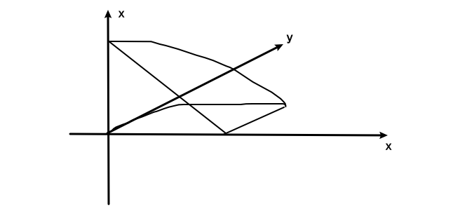
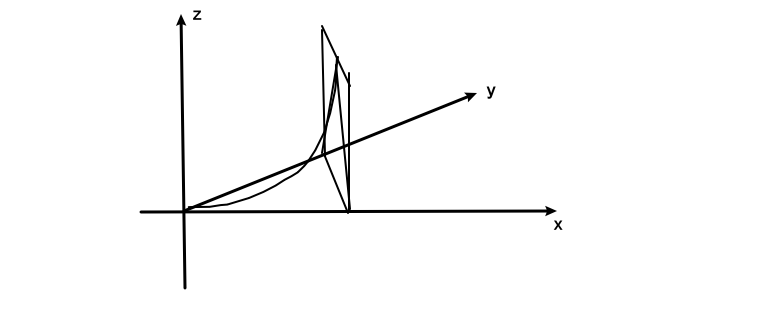

# 数学分析第七次作业

习题6.3(A): 2, 4(2, 6, 10, 15), 5, 6(2, 7), (B): 1(3), 5, 习题6.4: (A)1(3), 2(2, 3), 4, 5(3), 习题6.6: (A)1(2, 5, 6), 10(2, 6, 8)

## 6.3 (A)

### 2.

#### (1)

正确. 

对于上半球体的任意一个点 $(x,y,z), z\geqslant 0$,
可以找到与其关于原点对称的点 $(-x,-y,-z)$, 

并且有 $(x+y+z)^{2}=(-x,-y,-z)^{2}$

而上半球体和下半球体关于原点对称

$\therefore\displaystyle  \iiint_{(V)}(x+y+z)^{2}\mathrm{d}V=2\iiint_{(V_{1})}(x+y+z)^{2}\mathrm{d}V$

#### (2)

正确. 

对于上半球体的任意一个点 $(x,y,z), z\geqslant 0$,
可以找到与其关于原点对称的点 $(-x,-y,-z)$, 

并且有 $xyz+(-x)(-y)(-z)=0$

而上半球体和下半球体关于原点对称

$\therefore\displaystyle  \iiint_{(V)}xyz\mathrm{d}V=0$

#### (3)

正确. 

由三重积分的运算性质 $\displaystyle \iiint k\mathrm{d}V=k\iiint \mathrm{d}V$, 和三重积分的几何意义 $\displaystyle \iiint \mathrm{d}V=V$ 可知正确.

#### (4)

错误.

只有球面上的点才有 $x^{2}+y^{2}+z^{2}=4$, 球内的点无法这样代换.

### 4.

#### (2)

先二后一:

对于每一个 $z$, 均有一个由 $x=y^2, y=0, x=\frac{\pi}{2}-z$ 围成的面积.

$
\begin{aligned}
\iiint_{V}y\cos(x+z)\mathrm{d}V
&=\int_{0}^{\frac{\pi}{2}} \mathrm{d}z\iint_{D_{xy}}y\cos(x+z)\mathrm{d}x\mathrm{d}y \\
&=\int_{0}^{\frac{\pi}{2}} \mathrm{d}z\int_{0}^{\sqrt{\frac{\pi}{2}-z}}\mathrm{d}y\int_{y^2}^{\frac{\pi}{2}-z} y\cos(x+z)\mathrm{d}x \\
&=\int_{0}^{\frac{\pi}{2}} \mathrm{d}z\int_{0}^{\sqrt{\frac{\pi}{2}-z}}y \left(1 - \sin{\left(y^{2} + z \right)}\right)\mathrm{d}y \\
&=\int_{0}^{\frac{\pi}{2}} \left(- \frac{z}{2} - \frac{\cos{\left(z \right)}}{2} + \frac{\pi}{4}\right)\mathrm{d}z \\
&=- \frac{1}{2} + \frac{\pi^{2}}{16} \\
\end{aligned}
$

#### (6)

$
\begin{aligned}
\iiint_{V}xy\mathrm{d}V
&=\iiint_{V}z\mathrm{d}V \\
&=\iint_{D_{xy}}\mathrm{d}x\mathrm{d}y\int_{0}^{xy}xy\mathrm{d}z \\
&=\iint_{D_{xy}}xy\mathrm{d}x\mathrm{d}y\int_{0}^{xy}\mathrm{d}z \\
&=\int_{0}^{1}\mathrm{d}x \int_{0}^{1-x}x^{2} y^{2}\mathrm{d}y \\
&=\int_{0}^{1}- \frac{x^{2} \left(x - 1\right)^{3}}{3}\mathrm{d}x  \\
&=\frac{1}{180}  \\
\end{aligned}
$

#### (10)

对于上半部分的 $V_1$ 对于高度 $z$ 有 $S=\pi r^{2}=\pi(R^{2}-z^{2})$

对于下半部分的 $V_2$ 对于高度 $z$ 有 $S=\pi r^{2}=\pi(R^{2}-(R-z)^{2})=\pi z \left(2 R - z\right)$

$
\begin{aligned}
\iiint_V z^{2}\mathrm{d}V
&=\iiint_{V_1} z^{2}\mathrm{d}V+\iiint_{V_1} z^{2}\mathrm{d}V \\
&=\int_{0}^{\frac{R}{2}}z^{2}\mathrm{d}z\iint_{D_{xy_1}} \mathrm{d}S+\int_{\frac{R}{2}}^{R}z^{2}\mathrm{d}z\iint_{D_{xy_1}} \mathrm{d}S \\
&=\pi\int_{0}^{\frac{R}{2}}z^{3}(2R-z)\mathrm{d}z+\pi\int_{\frac{R}{2}}^{R}z^{2}\left(R^{2} - z^{2}\right)\mathrm{d}z \\
&=\frac{59 \pi R^{5}}{480} \\
\end{aligned}
$

#### (15)

进行柱面坐标变换 $
\begin{cases}
x=r\cos\theta \\
y=r\sin\theta \\
z=z \\
\end{cases}
$, 则有 $J=\begin{vmatrix}\cos\theta&-r\sin\theta&0\\\sin\theta&r\cos\theta&0\\0&0&1\end{vmatrix}=r$

$
\begin{aligned}
&\quad\ \iiint_{V}z(x^{2}+y^{2})\mathrm{d}V \\
&=\iint_{D_{xy}}(x^{2}+y^{2})\mathrm{d}x\mathrm{d}y\int z\mathrm{d}z \\
&=\iint_{D_{r\theta}}r^{3}\mathrm{d}\theta\mathrm{d}r\int z\mathrm{d}z \\
&=\int_{0}^{2\pi}\mathrm{d}\theta \int_{0}^{\frac{\sqrt{2}}{2}} r^{3}\mathrm{d}r\int_{\sqrt{1-r^{2}}}^{\sqrt{4-r^{2}}}z\mathrm{d}z+\int_{0}^{2\pi}\mathrm{d}\theta \int_{\frac{\sqrt{2}}{2}}^{\sqrt{2}} r^{3}\mathrm{d}r\int_{r}^{\sqrt{4-r^{2}}} z\mathrm{d}z \\
&=2\pi\int_{0}^{\frac{\sqrt{2}}{2}} r^{3}\mathrm{d}r\int_{\sqrt{1-r^{2}}}^{\sqrt{4-r^{2}}}z\mathrm{d}z+2\pi\int_{\frac{\sqrt{2}}{2}}^{\sqrt{2}} r^{3}\mathrm{d}r\int_{r}^{\sqrt{4-r^{2}}} z\mathrm{d}z \\
&=2\pi\int_{0}^{\frac{\sqrt{2}}{2}} \frac{3}{2}x^{3}\mathrm{d}x+2\pi\int_{\frac{\sqrt{2}}{2}}^{\sqrt{2}} x^{3}(2 - x^{2})\mathrm{d}x \\
&=\frac{21 \pi}{16} \\
\end{aligned}
$

### 5.

#### (1)

进行柱面坐标变换 $
\begin{cases}
x=r\cos\theta \\
y=r\sin\theta \\
z=z \\
\end{cases}
$, 则有 $J=\begin{vmatrix}\cos\theta&-r\sin\theta&0\\\sin\theta&r\cos\theta&0\\0&0&1\end{vmatrix}=r$

$
\begin{aligned}
\int_{-1}^{1}\mathrm{d}x\int_{0}^{\sqrt{1-x^{2}}}\mathrm{d}y\int_{\sqrt{x^{2}+y^{2}}}^{1}z^{3}\mathrm{d}z
&=\int_{0}^{1} z^{3}\mathrm{d}z\iint_{D_{xy}}\mathrm{d}x\mathrm{d}y \\
&=\int_{0}^{1} z^{3}\mathrm{d}z\iint_{D_{r\theta}}r\mathrm{d}\theta\mathrm{d}r \\
&=\int_{0}^{1} z^{3}\mathrm{d}z\int_{0}^{\pi}\mathrm{d}\theta\int_{0}^{1} r\mathrm{d}r \\
&=\int_{0}^{1} \frac{1}{2}\pi z^{5}\mathrm{d}z  \\
&=\frac{\pi}{12}  \\
\end{aligned}
$

#### (2)

进行球面坐标变换 $
\begin{cases}
x=\rho\sin\varphi\cos\theta \\
y=\rho\sin\varphi\sin\theta \\
z=\rho\cos\varphi \\
\end{cases}
$, 则有 $J=\rho^2\sin\varphi$

$0\leqslant \rho\cos\varphi \leqslant 3, \rho\sin \varphi+\rho\cos \varphi=3$

$
\begin{aligned}
&\quad\ \int_{-3}^{3}\mathrm{d}x\int_{-\sqrt{9-x^{2}}}^{\sqrt{9-x^{2}}}\mathrm{d}y\int_{0}^{\sqrt{9-x^{2}-y^{2}}}z\sqrt{x^{2}+y^{2}+z^{2}}\mathrm{d}z \\
&= \iiint_{V_{\rho\varphi\theta}}\rho^{2}\cos\varphi\cdot \rho^{2}\sin \varphi\mathrm{d}V \\
&= \int_{0}^{\frac{\pi}{2}}\mathrm{d}\varphi \int_{0}^{2\pi}\mathrm{d}\theta\int_{0}^{3}\rho^{2}\cos\varphi\cdot \rho^{2}\sin \varphi\mathrm{d}\rho \\
&= \int_{0}^{2\pi}\mathrm{d}\theta\int_{0}^{\frac{\pi}{2}}\frac{243}{5}\sin \varphi\cos\varphi\mathrm{d}\varphi  \\
&= \frac{243 \pi}{5}  \\
\end{aligned}
$

### 6.

#### (2)

进行柱面坐标变换 $
\begin{cases}
x=\rho\cos\theta \\
y=\rho\sin\theta \\
z=z \\
\end{cases}
$, 则有 $J=\begin{vmatrix}\cos\theta&-\rho\sin\theta&0\\\sin\theta&\rho\cos\theta&0\\0&0&1\end{vmatrix}=\rho$

则转化为 $z=6-\rho^{2}, z=\rho$ 围成的立体.

令 $6-\rho^{2}=\rho$ 得 $\rho^{2}+\rho-6=(\rho+3)(\rho-2)=0$ 即 $\rho=2, \rho=-3$ (舍去)

$
\begin{aligned}
V &=\iiint_{V}\mathrm{d}V \\
&=\iint_{D_{\rho\theta}}\rho\mathrm{d}\theta\mathrm{d}\rho \int_{\rho}^{6-\rho^{2}}\mathrm{d}z \\
&=\int_{0}^{2\pi}\mathrm{d}\theta\int_{0}^{2}\rho(- \rho^{2} - \rho + 6)\mathrm{d}\theta\mathrm{d}\rho  \\
&=\frac{32 \pi}{3}  \\
\end{aligned}
$

#### (7)

进行类似柱面坐标变换的变换 $
\begin{cases}
x=a\rho\cos\theta \\
y=b\rho\sin\theta \\
z=ct \\
\end{cases}
$,
则有 $J=\begin{vmatrix}a\cos\theta&-a\rho\sin\theta&0\\b\sin\theta&b\rho\cos\theta&0\\0&0&c\end{vmatrix}=abc\rho$

则原式转化为 $t=\sqrt{\rho^{2}+1}, \rho=1$

$
\begin{aligned}
V &=\iiint_{V}\mathrm{d}V \\
&=2\iint_{D_{\rho\theta}}abc\rho\mathrm{d}\theta\mathrm{d}\rho \int_{0}^{\sqrt{\rho^{2}+1}}\mathrm{d}t \\
&=2\int_{0}^{2\pi}\mathrm{d}\theta\int_{0}^{1}abc\rho\mathrm{d}\rho \int_{0}^{\sqrt{\rho^{2}+1}}\mathrm{d}t \\
&=2\int_{0}^{2\pi}\mathrm{d}\theta\int_{0}^{1}abc\rho\sqrt{\rho^{2} + 1}\mathrm{d}\rho  \\
&=4\pi abc \int_{0}^{1}\rho\sqrt{\rho^{2} + 1}\mathrm{d}\rho  \\
&=\frac{4}{3}\pi abc (2\sqrt{2}-1)  \\
\end{aligned}
$

## 6.3 (B)

### 1. (3)

进行球面坐标变换 $
\begin{cases}
x=a\rho\sin\varphi\cos\theta \\
y=b\rho\sin\varphi\sin\theta \\
z=c\rho\cos\varphi \\
\end{cases}
$, 则有 $J=abc\rho^2\sin\varphi$

$
\begin{aligned}
&\quad\iiint_{V}\sqrt{1-\frac{x^{2}}{a^{2}}-\frac{y^{2}}{b^{2}}-\frac{z^{2}}{c^{2}}}\mathrm{d}V \\
&=\iiint_{V}\sqrt{1-\rho^{2}}\cdot abc\rho^{2}\sin \varphi\mathrm{d}\rho \\
&=abc\int_{0}^{2\pi}\mathrm{d}\theta\int_{0}^{\pi}\sin \varphi\mathrm{d}\varphi\int_{0}^{1}\rho^{2}\sqrt{1-\rho^{2}}\mathrm{d}\rho \\
&=4abc\pi\int_{0}^{1}\rho^{2}\sqrt{1-\rho^{2}}\mathrm{d}\rho \\
&=2abc\pi\int_{0}^{1}\sqrt{\rho^{2}(1-\rho^{2})}\mathrm{d}\rho^{2} \\
&=2abc\pi\int_{0}^{1}\sqrt{t(1-t)}\mathrm{d}t \\
&=2abc\pi\int_{0}^{1}\frac{\sqrt{1-(2t-1)^{2}}}{2}\mathrm{d}t \\
&=\frac{\pi^{2}abc}{4} \\
\end{aligned}
$

### 5.

进行柱面坐标变换 $
\begin{cases}
x=\rho\cos\theta \\
y=\rho\sin\theta \\
z=z \\
\end{cases}
$, 则有 $J=\begin{vmatrix}\cos\theta&-\rho\sin\theta&0\\\sin\theta&\rho\cos\theta&0\\0&0&1\end{vmatrix}=\rho$

即 $0\leqslant z\leqslant h, \rho \leqslant t$ 围成的区域

$
\begin{aligned}
F(t)
&=\iiint_{V_{xyz}}\left[ z^{2}+f(x^{2}+y^{2}) \right] \mathrm{d}V \\
&=\iiint_{V_{\rho\theta z}}\rho\left[z^{2}+f(\rho^{2}) \right] \mathrm{d}V \\
&=\int_{0}^{2\pi}\mathrm{d}\theta\int_{0}^{t}\rho \mathrm{d}\rho \int_{0}^{h}\left[z^{2}+f(\rho^{2}) \right]\mathrm{d}z \\
&=2\pi\int_{0}^{t}\rho \mathrm{d}\rho \left[\int_{0}^{h}z^{2}\mathrm{d}z+\int_{0}^{h}f(\rho^{2})\mathrm{d}z \right] \\
&=2\pi\int_{0}^{t}\rho \left[\frac{h^{3}}{3}+f(\rho^{2})\right]\mathrm{d}\rho  \\
\end{aligned}
$

$\therefore \displaystyle \frac{\mathrm{d}F}{\mathrm{d}t}=2\pi t \left[\frac{h^{3}}{3}+f( t^{2})\right]$

$
\begin{aligned}
\therefore 
\lim_{t \to 0^{+}}\frac{F(t)}{t^{2}}
&= \lim_{t \to 0^{+}} \frac{2\pi}{t^{2}}\int_{0}^{t}\rho \left[\frac{h^{3}}{3}+f(\rho^{2})\right]\mathrm{d}\rho \\
&= \lim_{t \to 0^{+}} \frac{1}{t}\cdot \frac{\displaystyle 2\pi\int_{0}^{t}\rho \left[\frac{h^{3}}{3}+f(\rho^{2})\right]\mathrm{d}\rho-0}{t-0} \\
&= \lim_{t \to 0^{+}} \frac{1}{t}\cdot \frac{\mathrm{d}F}{\mathrm{d}t}|_0 \\
&=2\pi\left[\frac{h^{3}}{3}+f( t^{2})\right] \\
\end{aligned}
$

## 6.4 (A)

### 1. (3)

$
\begin{aligned}
\lim_{\alpha \to 0}\int_{0}^{1}\sqrt{1+\alpha^{2}-x^{2}}\mathrm{d}x
&=\int_{0}^{1}\lim_{\alpha \to 0}\sqrt{1+\alpha^{2}-x^{2}}\mathrm{d}x \\
&=\int_{0}^{1}\sqrt{1-x^{2}}\mathrm{d}x \\
&=\frac{\pi}{4} \\
\end{aligned}
$

### 2.

#### (2)

$
\begin{aligned}
\frac{\mathrm{d}F(y)}{\mathrm{d}y}
&= \int_{a+y}^{b+y}\frac{\partial \displaystyle \frac{\sin (xy)}{x}}{\partial y}\mathrm{d}x+\frac{\sin(by+y^{2})}{b+y}-\frac{\sin (ay+y^{2})}{a+y} \\
&= \int_{a+y}^{b+y}-\cos(xy)\mathrm{d}x+\frac{\sin(by+y^{2})}{b+y}-\frac{\sin (ay+y^{2})}{a+y} \\
&= \frac{\sin{\left(ay+ y^{2} \right)}}{y}-\frac{\sin{\left(by + y^{2} \right)}}{y}+\frac{\sin(by+y^{2})}{b+y}-\frac{\sin (ay+y^{2})}{a+y} \\
\end{aligned}
$

#### (3)

$
\begin{aligned}
\frac{\mathrm{d}F(y)}{\mathrm{d}x}
&= \int_{0}^{x}\frac{\partial [(x+y)f(y)]}{\partial x}\mathrm{d}y+2xf(x) \\
&= \int_{0}^{x}f(y)\mathrm{d}y+2xf(x) \\
\end{aligned}
$

$
\begin{aligned}
\frac{\mathrm{d}^{2}F(y)}{\mathrm{d}x^{2}}
&= \int_{0}^{x}\frac{\partial f(y)}{\partial x}\mathrm{d}y+f(x)+2f(x)+2xf'(x) \\
&= 3f(x)+2xf'(x) \\
\end{aligned}
$

### 4.

$\because\displaystyle a>0, b>0, \frac{e^{-ax}-e^{-bx}}{x}=\int_{a}^{b}e^{- x y}\mathrm{d}y$

$
\begin{aligned}
\therefore 
\int_{0}^{+\infty}\frac{e^{-ax}-e^{-bx}}{x}\mathrm{d}x
&=\int_{0}^{+\infty}\left(\int_{a}^{b}e^{- x y}\mathrm{d}y\right)\mathrm{d}x \\
&=\int_{a}^{b}\left(\int_{0}^{+\infty}e^{- x y}\mathrm{d}x\right)\mathrm{d}y \\
&=\int_{a}^{b}\frac{1}{y}\mathrm{d}y \\
&=\ln \frac{b}{a} \\
\end{aligned}
$

### 5. (3)

令 $x=\rho\cos\theta, y=\rho\sin\theta$

$x^{2}+y^{2}\leqslant x \Rightarrow\rho \leqslant \cos\theta$

挖掉 $(0,0)$ 点.

$
\begin{aligned}
\iint_{D}\frac{\mathrm{d}\sigma}{\sqrt{x^{2}+y^{2}}}
&=\int_{-\frac{\pi}{2}}^{\frac{\pi}{2}}\mathrm{d}\theta\int_{0}^{\cos\theta}\frac{1}{\rho}\cdot \rho\mathrm{d}\rho  \\
&=\int_{-\frac{\pi}{2}}^{\frac{\pi}{2}}\cos\theta\mathrm{d}\theta \\
&=2 \\
\end{aligned}
$

## 6.6 (A)

### 1.

#### (2)

$\displaystyle \int_{C}(x^{2}+y^{2})^{n}\mathrm{d}s=\int_{C}(a^{2})^{n}\mathrm{d}s=a^{2n}\int_{C}\mathrm{d}s=2\pi a^{2n+1}$

#### (5)

$\because x^{2}+y^{2}+z^{2}=4, z=\sqrt{3}$

$\therefore x^{2}+y^{2}=1$

令 $x=\cos t, y=\sin t, 0 \leqslant t \leqslant 2\pi$

$\displaystyle \oint_{C}x^{2}\mathrm{d}s=\int_{0}^{2\pi}\cos^{2}t\sqrt{\sin^{2}t+\cos^{2}t}\mathrm{d}t=\pi$

#### (6)

$\displaystyle x^{2}+y^{2}+z^{2}=2, x=y \Rightarrow x^{2}+\frac{z^{2}}{2}=1$

令 $x=y=\cos t, z=\sqrt{2}\sin t$

$\displaystyle \oint|y|\mathrm{d}s=2\int_{-\frac{\pi}{2}}^{\frac{\pi}{2}}\cos t\sqrt{\sin^{2}t+\sin^{2}t+2\cos^{2}t}\mathrm{d}t=2\sqrt{2}\int_{-\frac{\pi}{2}}^{\frac{\pi}{2}}\cos t\mathrm{d}t=4\sqrt{2}$

### 10.

#### (2)

进行柱坐标系变换, 即 $
\begin{cases}
x=\rho\cos\theta \\
y=\rho\sin\theta \\
z=z
\end{cases}
$, 原曲面则转为 $\rho\leqslant z\leqslant 1$

对于上曲面 $z=1$, 有 $||\vec{r}_{\rho}\times \vec{r}_{\theta}||=\rho$

对于上曲面 $z=\rho$, 有 $||\vec{r}_{\rho}\times \vec{r}_{\theta}||=\sqrt{(\rho\cos\theta)^{2}+(\rho\sin \theta)^{2}+\rho^{2}}=\sqrt{2}\rho$

$\displaystyle \iint_{S}(x^{2}+y^{2})\mathrm{d}S=\int_{0}^{2\pi}\mathrm{d}\theta\int_{0}^{1}(1+\sqrt{2})\rho^{3}\mathrm{d}\rho=\frac{\pi \left(1 + \sqrt{2}\right)}{2}$

#### (6)

对于 $xOy$ 面:

$\displaystyle \iint_{S_1}\frac{1}{(1+x+y)^{2}}\mathrm{d}S=\int_{0}^{1}\mathrm{d}x\int_{0}^{1-x}\frac{\mathrm{d}y}{(1+x+y)^{2}}=- \frac{1}{2} + \ln 2$

对于 $xOz$ 面:

$\displaystyle \iint_{S_{2}}\frac{1}{(1+x+y)^{2}}\mathrm{d}S=\int_{0}^{1}\mathrm{d}x\int_{0}^{1-x}\frac{1}{(1+x)^{2}}\mathrm{d}z=1 - \ln 2$

对于 $yOz$ 面, 同 $xOz$ 可得:

$\displaystyle \iint_{S_{3}}\frac{1}{(1+x+y)^{2}}\mathrm{d}S=1 - \ln 2$

对于斜面:

该面为 $x+y+z=1$, 那么有 $z=1-x-y$

$\displaystyle \iint_{S_{4}}\frac{1}{(1+x+y)^{2}}\mathrm{d}S=\iint_{S_{4}}\frac{\sqrt{1+(-1)^{2}+(-1)^{2}}}{(1+x+y)^{2}}\mathrm{d}x\mathrm{d}y=\sqrt{3}(-\frac{1}{2}+\ln 2)$

那么最终的结果即为四个面加起来

$\displaystyle \iint_{S}\frac{1}{(1+x+y)^{2}}\mathrm{d}S=(-\frac{1}{2}+\ln 2)+2(1-\ln 2)+\sqrt{3}(-\frac{1}{2}+\ln 2)=\frac{3}{2}-\frac{\sqrt{3}}{2}+\sqrt{3}\ln 2-\ln 2$

#### (8)

进行柱坐标系变换, 即 $
\begin{cases}
x=\rho\cos\theta \\
y=\rho\sin\theta \\
z=z
\end{cases}
$, 原曲面则转为 $z=\rho$ 被 $\rho=2a\cos\theta$ 截取的部分.

对于 $z=\rho$, 有 $||\vec{r}_{\rho}\times \vec{r}_{\theta}||=\sqrt{(\rho\cos\theta)^{2}+(\rho\sin \theta)^{2}+\rho^{2}}=\sqrt{2}\rho$

$
\begin{aligned}
&\quad\ \iint_{S_{xyz}}(xy+yz+zx)\mathrm{d}S \\
&=\iint_{S_{\rho\theta}}(\rho^{2}\sin\theta\cos\theta+\rho^{2}(\sin\theta+\cos\theta))\sqrt{2}\rho\mathrm{d}S \\
&=\sqrt{2}\int_{-\frac{\pi}{2}}^{\frac{\pi}{2}}(\sin\theta\cos\theta+\sin\theta+\cos\theta)\mathrm{d}\theta\int_{0}^{2a\cos\theta}\rho^{3}\mathrm{d}\rho \\
&=\sqrt{2}\int_{-\frac{\pi}{2}}^{\frac{\pi}{2}}4 a^{4} \cos^{4}\theta(\sin\theta\cos\theta+\sin\theta+\cos\theta)\mathrm{d}\theta \\
&=4\sqrt{2}a^{4}\left[ \int_{-\frac{\pi}{2}}^{\frac{\pi}{2}} \sin\theta\cos^{5}\theta\mathrm{d}\theta+\int_{-\frac{\pi}{2}}^{\frac{\pi}{2}} \sin\theta\cos^{4}\theta\mathrm{d}\theta+\int_{-\frac{\pi}{2}}^{\frac{\pi}{2}} \cos^{5}\theta\mathrm{d}\theta \right] \\
&=4\sqrt{2}a^{4}\left[0+0+\frac{16}{15} \right] \\
&=\frac{64 \sqrt{2} a^{4}}{15} \\
\end{aligned}
$

