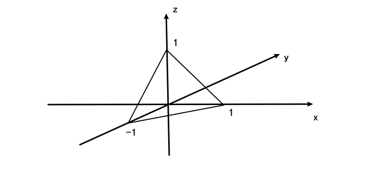
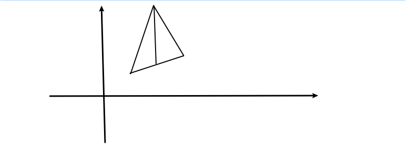

# 数学分析第八次作业

## 方盛俊 201300035

习题 6.7: (A) 2(2, 6), 4(3), 8, 10(2), 12(2, 4, 6, 7), 15, (B)2, 5. 6
习题 6.8: (A) 1, 2(3, 5), 3, 8(2), 10, 16(1, 3, 6)

## 6.7 (A)

### 2.

#### (2)

对于直线 $y=x$:

$\displaystyle \int_{(C)}xy\mathrm{d}x+(y-x)\mathrm{d}y=\int_{0}^{1}x^{2}\mathrm{d}x+\int_{0}^{1}(x-x)\mathrm{d}x=\frac{1}{3}$

对于抛物线 $y^{2}=x$:

$\displaystyle \int_{(C)}xy\mathrm{d}x+(y-x)\mathrm{d}y=\int_{0}^{1}y^{3}\mathrm{d}y^{2}+\int_{0}^{1}(y-y^{2})\mathrm{d}y=\frac{2}{5}+\frac{1}{6}=\frac{17}{30}$

对于立方抛物线 $y=x^{3}$:

$\displaystyle \int_{(C)}xy\mathrm{d}x+(y-x)\mathrm{d}y=\int_{0}^{1}x^{4}\mathrm{d}x+\int_{0}^{1}(x^{3}-x)\mathrm{d}x^{3}=\frac{1}{5}- \frac{1}{4}=- \frac{1}{20}$

#### (6)

设 $\begin{cases} x=\cos\theta \\ y=\sin\theta \\ z=2-\cos\theta+\sin\theta \end{cases}$

则有

$
\begin{aligned}
&\quad\ \oint_{(C)}(z-y)\mathrm{d}x+(x-z)\mathrm{d}y+(x-y)\mathrm{d}z \\
&= \int_{0}^{-2\pi}(2-\cos\theta)\mathrm{d}\cos\theta+(2\cos\theta-\sin\theta-2)\mathrm{d}\sin\theta+(\cos\theta-\sin\theta)\mathrm{d}(2-\cos\theta+\sin\theta) \\
&= \int_{0}^{-2\pi}(2-\cos\theta)(-\sin\theta)\mathrm{d}\theta+(2\cos\theta-\sin\theta-2)\cos\theta\mathrm{d}\theta+(\cos\theta-\sin\theta)(\sin\theta+\cos\theta)\mathrm{d}\theta \\
&= \int_{0}^{-2\pi}\left(- 4 \sin^{2}{\left(\theta \right)} - 2 \sqrt{2} \sin{\left(\theta + \frac{\pi}{4} \right)} + 3\right)\mathrm{d}\theta \\
&= -2 \pi \\
\end{aligned}
$

### 4. (3)

对于 $(1,0)$ 到 (0,1) 的下半圆周 $(x-1)^{2}+(y-1)^{2}=1$

使用参数方程 $
\begin{cases}
x = 1 + \cos\theta \\
y = 1 + \sin\theta
\end{cases}
$, 则 $\displaystyle \vec{\tau}=\frac{\{x'(\theta), y'(\theta)\}}{\sqrt{x'(\theta)^{2}+y'(\theta)^{2}}}=\{-\sin\theta, \cos\theta\}$, 其中 $\theta$ 由 $\displaystyle \theta=\frac{3}{2}\pi$ 到 $\theta=\pi$, 即 $\pi$ 到 $\displaystyle \frac{3}{2}\pi$ 时取反.

$\displaystyle \int_{(C)}P(x,y)\mathrm{d}x+Q(x,y)\mathrm{d}y=-\int_{(C)}\{P,Q\}\cdot \vec{\tau}\mathrm{d}s=-\int_{(C)}\left[Q(1+\cos\theta,1+\sin\theta)\cos\theta-P(1+\cos\theta,1+\sin\theta)\sin\theta\right]\mathrm{d}s$

而又有 $\sin\theta=-\sqrt{1-\cos^{2}\theta}=-\sqrt{1-(x-1)^{2}}=-\sqrt{2x-x^{2}}$

所以原式转化为 $\displaystyle \int_{(C)}\left[-\sqrt{2x-x^{2}}P(x,y)+(1-x)Q(x,y)\right]\mathrm{d}s$

### 8.

#### (1)

进行参数变换 $\begin{cases} x=\rho\cos\theta \\ y=\rho\sin\theta \\ z=\rho \end{cases}$, 则有

$\displaystyle \frac{\partial (x,y)}{\partial (\rho, \theta)}=\begin{vmatrix}\cos\theta & -\rho\sin\theta \\ \sin\theta &\rho\cos\theta\end{vmatrix}=\rho\sin^{2}\theta+\rho\cos^{2}\theta=\rho$

$\displaystyle \iint_{(S)}\frac{e^{z}}{\sqrt{x^{2}+y^{2}}}\mathrm{d}x\land \mathrm{d}y=-\iint_{D_{\theta\rho}}\frac{e^{\rho}}{\rho}\cdot \rho\mathrm{d}\theta\mathrm{d}\rho=-\int_{0}^{2\pi}\mathrm{d}\theta \int_{1}^{2} e^{\rho}\mathrm{d}\rho$

#### (2)

对于 $\displaystyle I=\oiint_{\Sigma}(x+y+z){\rm d}x\land{\rm d}y+(y-z){\rm d}y\land{\rm d}z$

其中 $\Sigma$ 是正方体的表面, 即六个面, 边长为 $a$.

$
\begin{aligned}
I&=\iint_{\Sigma_{\text{top}}}+\iint_{\Sigma_{\text{bottom}}}+\iint_{\Sigma_{\text{front}}}+\iint_{\Sigma_{\text{back}}}+\iint_{\Sigma_{\text{left}}}+\iint_{\Sigma_{\text{right}}} \\
&=\iint_{D_{xy}}-(x+y+0)\mathrm{d}x\mathrm{d}y+\iint_{D_{xy}}(x+y+1)\mathrm{d}x\mathrm{d}y+0+0+0+0 \\
&=\int_{0}^{1}\mathrm{d}x \int_{0}^{1}(x+y+1)\mathrm{d}y-\int_{0}^{1}\mathrm{d}x \int_{0}^{1}(x+y)\mathrm{d}y \\
\end{aligned}
$

### 10. (2)

坐标变换 $\begin{cases} x=\cos\theta \\ y=\sin\theta \\ z=0 \end{cases}$

则有

$
\begin{aligned}
&\quad\ \oint_{(C)}(3x^{2}-3yz+2xz)\mathrm{d}x+(3y^{2}-3xz+z^{2})\mathrm{d}y+(3z^{2}-3xy+x^{2}+2yz)\mathrm{d}z \\
&=\int_{0}^{2\pi}(3\cos^{2}\theta)\mathrm{d}\cos\theta+(3\sin^{2}\theta)\mathrm{d}\sin\theta\\
&=\int_{0}^{2\pi}(-3\sin\theta\cos^{2}\theta+3\sin^{2}\theta\cos\theta)\mathrm{d}\theta \\
&=0 \\
\end{aligned}
$

### 12.

#### (2)

对于 $S_{1}: x=0, S_{2}: y=0, S_{3}: z=0, S_{4}: x+y+z=1$

$
\begin{aligned}
&\quad\ \oiint_{(S)}xy\mathrm{d}y\land \mathrm{d}z+yz\mathrm{d}z
\land \mathrm{d}x+zx\mathrm{d}x\land \mathrm{d}y \\
&=\iint_{S_1}+\iint_{S_2}+\iint_{S_3}+\iint_{S_4} \\
&=0+0+0+\iint_{S_4}(1-y-z)y\mathrm{d}y\mathrm{d}z+\iint_{S_4}(1-x-z)z\mathrm{d}z\mathrm{d}x+\iint_{S_4}(1-x-y)x\mathrm{d}x\mathrm{d}y \\
&=\int_{0}^{1}\mathrm{d}y \int_{0}^{1-y}(1-y-z)y\mathrm{d}z+\int_{0}^{1}\mathrm{d}z\int_{0}^{1-z}(1-x-z)z\mathrm{d}x+\int_{0}^{1}\mathrm{d}x\int_{0}^{1-x}(1-x-y)x\mathrm{d}y \\
&=\int_{0}^{1}\frac{y \left(y - 1\right)^{2}}{2}\mathrm{d}y +\int_{0}^{1}\frac{z \left(z - 1\right)^{2}}{2}\mathrm{d}z+\int_{0}^{1}\frac{x \left(x - 1\right)^{2}}{2}\mathrm{d}x \\
&=3\int_{0}^{1}\frac{y \left(y - 1\right)^{2}}{2}\mathrm{d}y \\
&=\frac{1}{8} \\
\end{aligned}
$

#### (4)

$
\begin{aligned}
&\quad\ \iint_{(S)}-y\mathrm{d}z\land \mathrm{d}x+(z+1)\mathrm{d}x\land \mathrm{d}y \\
&=\iint_{S_1}(-\sqrt{4-x^{2}})\mathrm{d}z\mathrm{d}x-\iint_{S_1}(-\sqrt{4-x^{2}})\mathrm{d}z\mathrm{d}x+0 \\
&=-2\int_{-2}^{2}\mathrm{d}x \int_{0}^{2-x}\sqrt{4-x^{2}}\mathrm{d}z \\
&=-2\int_{-2}^{2}(2 - x)\sqrt{4-x^{2}}\mathrm{d}x  \\
&=-2\int_{-2}^{2}(2 - x)\sqrt{4-x^{2}}\mathrm{d}x  \\
&=-2\int_{-2}^{2}2\sqrt{4-x^{2}}\mathrm{d}x+2\int_{-2}^{2}x\sqrt{4-x^{2}}\mathrm{d}x  \\
&=-8\pi \\
\end{aligned}
$

#### (6)

令 $\begin{cases} x=\sin\varphi\cos\theta \\ y=\sin\varphi\sin\theta \\ z=1+\cos\varphi \end{cases}$

则 $\displaystyle \frac{\partial (x,y)}{\partial (\varphi,\theta)}=\begin{vmatrix} \cos\varphi\cos\theta &-\sin \varphi\sin\theta \\ \cos\varphi\sin\theta &\sin \varphi\cos\theta \\\end{vmatrix}=\frac{1}{2}\sin{\left(2 \varphi \right)}$

$
\begin{aligned}
&\quad\ \iint_{(S)}z^{2}\mathrm{d}x\land \mathrm{d}y \\
&=\iint_{D_{\varphi, \theta}}(1+\cos\varphi)^{2}\cdot \frac{1}{2}\sin(2\varphi)\mathrm{d}\varphi\mathrm{d}\theta \\
&=\int_{0}^{2\pi}\mathrm{d}\theta\int_{0}^{\pi}(1+\cos\varphi)^{2}\cdot \frac{1}{2}\sin(2\varphi)\mathrm{d}\varphi \\
&=\int_{0}^{2\pi}\mathrm{d}\theta\int_{0}^{\pi}(\sin \varphi\cos\varphi+2\sin \varphi\cos^{2}\varphi+\sin \varphi\cos^{3}\varphi)\mathrm{d}\varphi \\
&=\int_{0}^{2\pi}\mathrm{d}\theta\int_{0}^{\pi}(\sin \varphi\cos\varphi+2\sin \varphi\cos^{2}\varphi+\sin \varphi\cos^{3}\varphi)\mathrm{d}\varphi \\
&=\frac{8 \pi}{3} \\
\end{aligned}
$

#### (7)

$S: x-y+z=1$ 的法向量 $\vec{n}=\{1,-1,1\}$

$\because \{f(x,y,z), 2f(x,y,z), f(x,y,z)\}\cdot \{1, -1, 1\}=0$

$
\begin{aligned}
\therefore I
&=\iint_{(S)}x\mathrm{d}y\land \mathrm{d}z+y\mathrm{d}z\land \mathrm{d}x+z\mathrm{d}x\land \mathrm{d}y \\
&=\iint_{D_{yz}}(y-z+1)\mathrm{d}y\mathrm{d}z-\iint_{D_{zx}}(x+z-1)\mathrm{d}z\mathrm{d}x+\iint_{D_{xy}}(y-x+1)\mathrm{d}x\mathrm{d}y \\
&=\int_{-1}^{0}\mathrm{d}y\int_{0}^{y+1}(y-z+1)\mathrm{d}z-\int_{0}^{1}\mathrm{d}x\int_{0}^{1-x}(x+z-1)\mathrm{d}z+\int_{-1}^{0}\mathrm{d}y\int_{0}^{y+1}(y-x+1)\mathrm{d}x \\
&=2\int_{-1}^{0}\frac{\left(y + 1\right)^{2}}{2}\mathrm{d}y+\int_{0}^{1} \frac{\left(x - 1\right)^{2}}{2}\mathrm{d}x \\
&=\frac{1}{2} \\
\end{aligned}
$

### 15.

#### (1)

$\therefore\displaystyle y=3-\frac{3}{2}x-\sqrt{3}z$

$\therefore\displaystyle \frac{\partial (y,z)}{\partial (z,x)}=\begin{vmatrix} -\sqrt{3} &-\frac{3}{2} \\ 1 &0 \\\end{vmatrix}=\frac{3}{2}, \frac{\partial (z,x)}{\partial (z,x)}=1, \frac{\partial (x,y)}{\partial (z,x)}=\begin{vmatrix} 0 &1 \\ -\sqrt{3} &-\frac{3}{2} \\\end{vmatrix}=\sqrt{3}$

且 $\displaystyle \sqrt{1+y_{z}^{2}+y_{x}^{2}}=\frac{5}{2}$

$
\begin{aligned}
&\quad\ \iint_{(S)}P\mathrm{d}y\land \mathrm{d}z+Q\mathrm{d}z\land \mathrm{d}x+R\mathrm{d}x\land \mathrm{d}y \\
&=\iint_{D_{zx}}\left(\frac{3}{2}P+Q+\sqrt{3}R\right)\mathrm{d}z\mathrm{d}x \\
&=\iint_{D_{zx}}\left(\frac{3}{5}P+\frac{2}{5}Q+\frac{2\sqrt{3}}{5}R\right)\sqrt{1+y_{z}^{2}+y_{x}^{2}} \mathrm{d}z\mathrm{d}x \\
&=\iint_{(S)}\left(\frac{3}{5}P+\frac{2}{5}Q+\frac{2\sqrt{3}}{5}R\right)\mathrm{d}S \\
\end{aligned}
$

#### (2)

令 $\begin{cases} x=\rho\cos\theta \\ y=\rho\sin\theta \\ z=8-\rho ^{2}\end{cases}$

$\therefore\displaystyle \frac{\partial (y,z)}{\partial (\rho,\theta)}=\begin{vmatrix} \sin\theta &\rho\cos\theta \\ -2\rho &0 \\\end{vmatrix}=2\rho^{2}\cos\theta, \frac{\partial (z,x)}{\partial (\rho,\theta)}=\begin{vmatrix} -2\rho &0 \\ \cos\theta &-\rho\sin\theta \\\end{vmatrix}=2\rho^{2}\sin\theta, \frac{\partial (x,y)}{\partial (\rho,\theta)}=\begin{vmatrix}\cos\theta &-\rho\sin\theta \\ \sin\theta &\rho\cos\theta \\\end{vmatrix}=\rho$

且 $\displaystyle |\vec{r}_{\rho}\times \vec{r}_{\theta}|=\sqrt{(2\rho^{2}\cos\theta)^{2}+(2\rho^{2}\sin\theta)^{2}+\rho^{2}}=\sqrt{4\rho^{2}+1}\rho$

$
\begin{aligned}
&\quad\ \iint_{(S)}P\mathrm{d}y\land \mathrm{d}z+Q\mathrm{d}z\land \mathrm{d}x+R\mathrm{d}x\land \mathrm{d}y \\
&=-\iint_{D_{\rho\theta}}\left(P\cdot 2\rho^{2}\cos\theta+Q\cdot 2\rho^{2}\sin\theta+R\rho\right)\mathrm{d}\rho\mathrm{d}\theta \\
&=-\iint_{D_{\rho\theta}}\frac{1}{\sqrt{4\rho^{2}+1}}\left(2P\rho\cos\theta+2Q\rho\sin\theta+R\right)|\vec{r}_{\rho}\times \vec{r}_{\theta}|\mathrm{d}\rho\mathrm{d}\theta \\
&=-\iint_{D_{\rho\theta}}\frac{2xP+2yQ+R}{\sqrt{4x^{2}+4y^{2}+1}}\mathrm{d}S \\
\end{aligned}
$

## 6.7 (B)

### 2.

令 $\begin{cases} x=R\sin\varphi\cos\theta \\ y=R\sin\varphi\sin\theta \\ z=R\cos\varphi\end{cases}$, 则柱面转化为 $R^{2}\sin^{2}\varphi=R^{2}\sin\varphi\cos\theta, 0\leqslant \varphi\leqslant \frac{\pi}{2}$

即 $\sin\varphi=\cos\theta$, 原式化为 $\begin{cases} x=R\cos^{2}\theta \\ y=R\sin\theta\cos\theta \\ z=R|\sin\theta|\end{cases}$

$
\begin{aligned}
&\quad\ \oint_{(C)}y^{2}\mathrm{d}x+z^{2}\mathrm{d}y+x^{2}\mathrm{d}z \\
&=\int_{-\frac{\pi}{2}}^{\frac{\pi}{2}}R^{2}\sin^{2}\theta\cos^{2}\theta\mathrm{d}R\cos^{2}\theta+R^{2}\sin^{2}\theta\mathrm{d}R\sin\theta\cos\theta+R^{2}\cos^{4}\theta\mathrm{d}R|\sin\theta| \\
&=\int_{-\frac{\pi}{2}}^{\frac{\pi}{2}}(-2R^{3}\sin^{3}\theta\cos^{3}\theta+R^{3}\sin^{2}\theta\cos 2\theta)\mathrm{d}\theta+0 \\
&=-\frac{\pi}{4}R^{3} \\
\end{aligned}
$

### 5.

令 $\begin{cases} x=\rho\sin\varphi\cos\theta \\ y=\rho\sin\varphi\sin\theta \\ z=\rho\cos\varphi\end{cases}$, 则柱面转化为 $\rho^{2}\sin^{2}\varphi=R^{2}$, 即 $\displaystyle \rho=\frac{R}{\sin\varphi}$

则 $\displaystyle \begin{cases} x=R\cos\theta \\ y=R\sin\theta \\ \displaystyle z=\frac{R}{\tan \varphi}\end{cases}, \frac{\partial (y,z)}{\partial (\varphi, \theta)}=\begin{vmatrix} 0 &R\cos\theta \\ - \frac{R}{\sin^{2}\varphi} & 0 \\\end{vmatrix}=\frac{R^{2}\cos\theta}{\sin^{2}\varphi}$

其中 $\displaystyle -R\leqslant z=\frac{R}{\tan\varphi}\leqslant R$, 即 $-\frac{\pi}{2}\leqslant \varphi\leqslant -\frac{\pi}{4}$ 或 $\frac{\pi}{4}\leqslant \varphi\leqslant \frac{\pi}{2}$

$
\begin{aligned}
&\quad\ \iint_{(S)}\frac{x\mathrm{d}y\land \mathrm{d}z+z^{2}\mathrm{d}x\land  \mathrm{d}y}{x^{2}+y^{2}+z^{2}} \\
&=\iint_{S_{\text{bottom}}}+\iint_{S_{\text{top}}}+\iint_{S_{\text{side}}} \\
&=0+0+\iint_{S}\frac{x\mathrm{d}y\land \mathrm{d}z}{x^{2}+y^{2}+z^{2}} \\
&=0+0+\iint_{S_{\varphi\theta}}\frac{R\cos\theta}{\frac{R^{2}}{\sin^{2}\varphi}}\cdot \frac{R^{2}\cos\theta}{\sin^{2}\varphi}\mathrm{d}\theta\mathrm{d}\varphi \\
&=\left(\int_{-\frac{\pi}{2}}^{-\frac{\pi}{4}}\mathrm{d}\varphi+\int_{\frac{\pi}{4}}^{\frac{\pi}{2}}\mathrm{d}\varphi\right)\int_{0}^{2\pi}R\cos^{2}\theta\mathrm{d}\theta \\
&=\frac{1}{2}\pi^{2} R \\
\end{aligned}
$

### 6.

令 $\begin{cases} x=R\sin\varphi\cos\theta \\ y=R\sin\varphi\sin\theta \\ z=R\cos\varphi\end{cases}$, 其中 $0\leqslant \varphi\leqslant \frac{\pi}{2}$

则有 $\displaystyle \frac{\partial (y,z)}{\partial (\varphi,\theta)}=\begin{vmatrix} R\cos\varphi\sin\theta &R\sin \varphi\cos\theta \\  -R\sin\varphi & 0 \\\end{vmatrix}=R^{2} \sin^{2}\varphi\cos\theta$

$\displaystyle \frac{\partial (z,x)}{\partial (\varphi,\theta)}=\begin{vmatrix} -R\sin\varphi & 0 \\R\cos\varphi\cos\theta &-R\sin \varphi\sin\theta \end{vmatrix}=R^{2}\sin^{2}\varphi \sin\theta$

$\displaystyle \frac{\partial (x,y)}{\partial (\varphi,\theta)}=\begin{vmatrix} R\cos\varphi\cos\theta &-R\sin \varphi\sin\theta \\ R\cos\varphi\sin\theta &R\sin \varphi\cos\theta \\\end{vmatrix}=R^{2}\sin \varphi\cos\varphi$

$
\begin{aligned}
&\quad\ \iint_{(S)}\vec{F}\cdot \mathrm{d}\vec{S} \\
&=-\iint_{S_{\varphi\theta}}\frac{1}{R^{2}}\left( R^{3}\sin^{3}\varphi\cos^{2}\theta +R^{3}\sin^{3}\varphi\sin^{2}\theta+R^{3}\sin\varphi\cos^{2}\varphi\right)\mathrm{d}\varphi\mathrm{d}\theta  \\
&=-R\int_{0}^{2\pi}\mathrm{d}\theta\int_{0}^{\frac{\pi}{2}}\left(\sin^{3}\varphi+\sin\varphi\cos^{2}\varphi\right)\mathrm{d}\varphi  \\
&=-2\pi R \\
\end{aligned}
$

## 6.8 (A)

### 1.

#### (1)

错误. 封闭曲线并非正向.

正确解法:

$\displaystyle \int_{\overgroup{OB}\cup\overline{BA}\cup\overline{AO}}y\mathrm{d}x=-\iint_{(\sigma)}-1\mathrm{d}\sigma=\frac{\pi}{4}$

由于 $\displaystyle \int_{\overline{BA}}y\mathrm{d}x=0, \int_{\overline{AO}}y\mathrm{d}x=0$

所以 $\displaystyle \int_{(C)}y\mathrm{d}x=\frac{\pi}{4}$

#### (2)

**解法一错误, 解法二正确.**

函数在点 $(0,0)$ 处并不可导, 不能使用 Green 公式, 解法一错误.

而解法二没有包括 $(0,0)$ 点, 所以正确.

**对于解法一:**

设 $\displaystyle \Gamma: x^{2}+y^{2}=\delta^{2}$

则 $\displaystyle \oint_{(C)\cup\overgroup{DB' A}}\frac{-y\mathrm{d}x+x\mathrm{d}y}{x^{2}+y^{2}}=\oint_{(C)\cup\overgroup{DB' A}-\Gamma}\frac{-y\mathrm{d}x+x\mathrm{d}y}{x^{2}+y^{2}}+\oint_{\Gamma}\frac{-y\mathrm{d}x+x\mathrm{d}y}{x^{2}+y^{2}}=\oint_{\Gamma}\frac{-y\mathrm{d}x+x\mathrm{d}y}{x^{2}+y^{2}}=\oint_{\Gamma}\frac{-y\mathrm{d}x+x\mathrm{d}y}{\delta^{2}}=-2\pi$

则 $\displaystyle I=\oint_{\overgroup{AB' D}}\frac{-y\mathrm{d}x+x\mathrm{d}y}{x^{2}+y^{2}}+\oint_{(C)\cup\overgroup{DB' A}}\frac{-y\mathrm{d}x+x\mathrm{d}y}{x^{2}+y^{2}}=-\pi$

### 2.

#### (3)

由 Green 公式可知

$
\begin{aligned}
&\quad\ \oint_{(+C)}(x+y)^{2}\mathrm{d}x-(x^{2}+y^{2})\mathrm{d}y \\
&=\iint_{D_{xy}}\left( -2x-2(x+y) \right)\mathrm{d}x\mathrm{d}y \\
&=\int_{1}^{2}\mathrm{d}x\int_{\frac{1}{2}x+\frac{1}{2}}^{4x-3}\left(-4x-2y \right)\mathrm{d}y+\int_{2}^{3}\mathrm{d}x\int_{\frac{1}{2}x+\frac{1}{2}}^{-3x+11}\left(-4x-2y \right)\mathrm{d}y \\
&=\int_{1}^{2}(- \frac{119 x^{2}}{4} + \frac{77 x}{2} - \frac{35}{4})\mathrm{d}x+\int_{2}^{3}(\frac{21 x^{2}}{4} + \frac{49 x}{2} - \frac{483}{4})\mathrm{d}x \\
&=- \frac{245}{12}- \frac{105}{4} \\
&=- \frac{140}{3} \\
\end{aligned}
$

#### (5)

令 $L: y=0$, 从点 $O(0,0)$ 到 $A(a,0)$

则 $\displaystyle \int_{L}(e^{x}\sin y-my)\mathrm{d}x+(e^{x}\cos y-m)\mathrm{d}y=0$

那么

$
\begin{aligned}
&\quad\ \int_{(C)}(e^{x}\sin y-my)\mathrm{d}x+(e^{x}\cos y-m)\mathrm{d}y \\
&=\oint_{C\cup L}(e^{x}\sin y-my)\mathrm{d}x+(e^{x}\cos y-m)\mathrm{d}y-\int_{L} \\
&=\iint_{C\cup L}\left( e^{x}\cos y- e^{x}\cos y + m \right)\mathrm{d}x\mathrm{d}y \\
&=m\iint_{C\cup L}\mathrm{d}x\mathrm{d}y \\
&=m\cdot \frac{1}{2}\pi\left( \frac{a}{2} \right)^{2} \\ 
&=\frac{m\pi a^{2}}{8} \\ 
\end{aligned}
$

### 3.

取 $P=-y, Q=x$

则 $\displaystyle S=\iint_{D_{xy}}\mathrm{d}x\mathrm{d}y=\frac{1}{2}\oint_{\Gamma}-y\mathrm{d}x+x\mathrm{d}y$

其中 $\Gamma: x^{\frac{2}{3}}+y^{\frac{2}{3}}=a^{\frac{2}{3}}$

进行参数方程变换 $\begin{cases} x=a\cos^{3}\theta \\ y=a\sin^{3}\theta \end{cases}, 0\leqslant \theta\leqslant 2\pi$

$
\begin{aligned}
S&=\frac{1}{2}\oint_{\Gamma}-y\mathrm{d}x+x\mathrm{d}y \\
&=\frac{1}{2}\int_{0}^{2\pi}\left( -a\sin^{3}\theta\mathrm{d}a\cos^{3}\theta+a\cos^{3}\theta\mathrm{d}a\sin^{3}\theta \right) \\
&=\frac{1}{2}\int_{0}^{2\pi}\left( 3a^{2}\sin^{4}\theta\cos^{2}\theta+3a^{2}\sin^{2}\theta\cos^{4}\theta \right)\mathrm{d}\theta \\
&=\frac{3}{2}a^{2}\int_{0}^{2\pi}\sin^{2}\theta\cos^{2}\theta\mathrm{d}\theta \\
&=\frac{3 \pi }{8}a^{2} \\
\end{aligned}
$

### 8. (2)

由 Green 公式可知

$
\begin{aligned}
&\quad\ \oint\frac{x\mathrm{d}x+y\mathrm{d}y}{\sqrt{x^{2}+y^{2}}} \\
&=\iint_{D_{xy}}\left( - \frac{x y}{\left(x^{2} + y^{2}\right)^{\frac{3}{2}}}+ \frac{x y}{\left(x^{2} + y^{2}\right)^{\frac{3}{2}}} \right)\mathrm{d}x\mathrm{d}y \\
&=0
\end{aligned}
$

所以与路径无关

从点 $(1,0)$ 到点 $(6,0)$, 再到点 $(6,8)$

$
\begin{aligned}
&\quad\ \int_{(1,0)}^{(6,8)}\frac{x\mathrm{d}x+y\mathrm{d}y}{\sqrt{x^{2}+y^{2}}} \\
&=\int_{1}^{6}\frac{x}{\sqrt{x^{2}+0}}\mathrm{d}x+\int_{0}^{8}\frac{y}{\sqrt{36+y^{2}}}\mathrm{d}y \\
&=5+4 \\
&=9 \\
\end{aligned}
$

### 10.

由 Stokes 公式可知:

$
\begin{aligned}
&\quad\ \oint_{(C)}y\mathrm{d}x+\mathrm{d}y+x\mathrm{d}z \\
&=\iint_{\Sigma}(0-1)\mathrm{d}y\land \mathrm{d}z+(0-1)\mathrm{d}z\land \mathrm{d}x+(0-1)\mathrm{d}x\land \mathrm{d}y \\
&=-\sqrt{3}\iint_{\Sigma}\frac{\sqrt{3}}{3}\mathrm{d}y\land \mathrm{d}z+\frac{\sqrt{3}}{3}\mathrm{d}z\land \mathrm{d}x+\frac{\sqrt{3}}{3}\mathrm{d}x\land \mathrm{d}y \\
&=-\sqrt{3}\pi a^{2}
\end{aligned}
$

### 16.

#### (1)

由 Gauss 公式可知

$
\begin{aligned}
&\quad\ \oiint_{(S)}x^{2}\mathrm{d}y\land \mathrm{d}z+y^{2}\mathrm{d}z\land \mathrm{d}x+z^{2}\mathrm{d}x\land \mathrm{d}y \\
&=\iiint_{\Omega}(2x+2y+2z)\mathrm{d}V \\
&=2\int_{0}^{a}\mathrm{d}x\int_{0}^{a}\mathrm{d}y\int_{0}^{a}(x+y+z)\mathrm{d}z \\
&=3 a^{4} \\
\end{aligned}
$

#### (3)

进行球面坐标代换 $\begin{cases} x=\rho\sin\varphi\cos\theta \\ y=\rho\sin\varphi\cos\theta \\ z=\rho\cos\varphi \end{cases}$, 其中 $0\leqslant \varphi\leqslant \frac{\pi}{2}$

则 $J=\rho^{2}\sin\varphi$

由 Gauss 公式可知

$
\begin{aligned}
&\quad\ \oiint_{(S)}(x^{2}-2xy)\mathrm{d}y\land \mathrm{d}z+(y^{2}-2yz)\mathrm{d}z\land \mathrm{d}x+(1-2xz)\mathrm{d}x\land \mathrm{d}y \\
&=\iiint_{\Omega}(2x-2y+2y-2z-2x)\mathrm{d}V \\
&=-2\iiint_{\Omega}z\mathrm{d}V \\
&=-2\int_{0}^{2\pi}\mathrm{d}\theta\int_{0}^{\frac{\pi}{2}}\mathrm{d}\varphi \int_{0}^{a}\rho\cos\varphi\cdot \rho^{2}\sin\varphi\mathrm{d}\rho \\
&=- \pi a^{4}\int_{0}^{\frac{\pi}{2}}\sin\varphi\cos\varphi\mathrm{d}\varphi  \\
&=- \frac{\pi }{2}a^{4}  \\
\end{aligned}
$

$\because \displaystyle \iint_{S_{\text{bottom}}}(1-2x\cdot 0)\mathrm{d}x\land \mathrm{d}y=\pi a^{2}$

$
\begin{aligned}
&\quad\ \iint_{(S)}(x^{2}-2xy)\mathrm{d}y\land \mathrm{d}z+(y^{2}-2yz)\mathrm{d}z\land \mathrm{d}x+(1-2xz)\mathrm{d}x\land \mathrm{d}y \\
&=\oiint_{(S)}(x^{2}-2xy)\mathrm{d}y\land \mathrm{d}z+(y^{2}-2yz)\mathrm{d}z\land \mathrm{d}x+(1-2xz)\mathrm{d}x\land \mathrm{d}y-\iint_{S_{bottom}} \\
&= \frac{\pi a^{2} \left(2 - a^{2}\right)}{2} \\
\end{aligned}
$

#### (6)

由 Gauss 公式可知

令 $\Gamma: z=e^{a}$

$
\begin{aligned}
&\quad\ \oiint_{S\cup \Gamma}4xz\mathrm{d}y\land \mathrm{d}z-2yz\mathrm{d}z\land \mathrm{d}x+(1-z^{2})\mathrm{d}x\land \mathrm{d}y \\
&=\iiint_{\Omega}(4z-2z-2z)\mathrm{d}V \\
&=0 \\
\end{aligned}
$

$
\begin{aligned}
&\quad\ \iint_{S}4xz\mathrm{d}y\land \mathrm{d}z-2yz\mathrm{d}z\land \mathrm{d}x+(1-z^{2})\mathrm{d}x\land \mathrm{d}y \\
&=\oiint_{S\cup \Gamma}-\iint_{\Gamma} \\
&=-\iint_{\Gamma}4xz\mathrm{d}y\land \mathrm{d}z-2yz\mathrm{d}z\land \mathrm{d}x+(1-z^{2})\mathrm{d}x\land \mathrm{d}y \\
&=-\iint_{D_{xy}}(1-(e^{a})^{2})\mathrm{d}x\land \mathrm{d}y \\
&=(e^{2a}-1)\iint_{D_{xy}}\mathrm{d}x\land \mathrm{d}y \\
&=(e^{2a}-1)\pi a^{2} \\
\end{aligned}
$