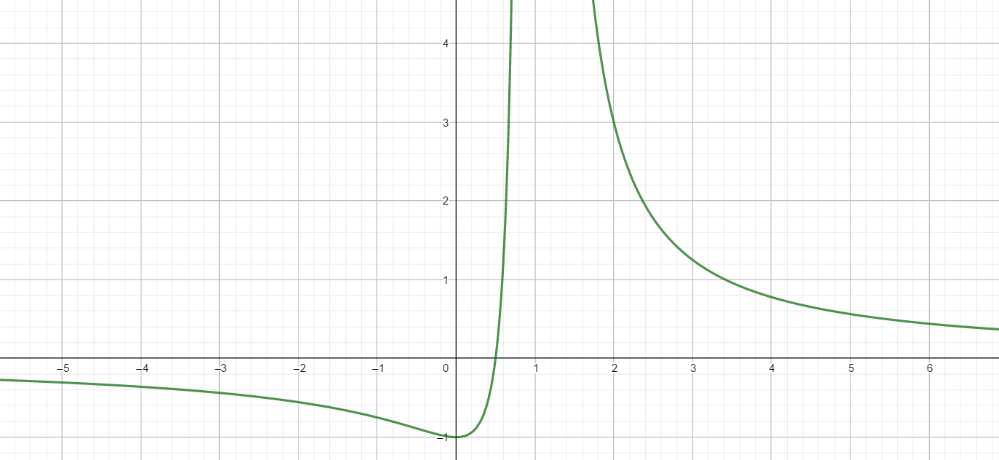

习题2.4：（A）16（5、10），18，19，（B）1，3，5，习题2.5：（A）3（2、4），7（2、3），8，（B）1，4，
习题2.6：（A）9（3），12（2），22（3），24（2），26（2）（B）2（3），5

# 2.4 (A)

# 16.

## (5)

$$
\begin{aligned}
\lim_{x\to 0}\cot x\ln\frac{1+x}{1-x}&=\lim_{x\to 0}\frac{\ln(1+\frac{2x}{1-x})}{\tan x} \\
&=\lim_{x\to 0}\frac{2x}{(1-x)\tan x} \\
&=\lim_{x\to 0}\frac{2x}{x} \\
&=2 \\
\end{aligned}
$$

## (10)

$$
\begin{aligned}
\lim_{x\to 0}\frac{e-(1+x)^\frac{1}{x}}{x}&=\lim_{x\to 0}\frac{(e-(1+x)^\frac{1}{x})'}{x'} \\
&=\lim_{x\to 0}-((1+x)^\frac{1}{x})' \\
&=\lim_{x\to 0}-(\exp(\frac{1}{x}\ln(1+x)))' \\
&=\lim_{x\to 0}-\exp[\frac{1}{x}\ln(1+x)] (\frac{1}{x}\ln(1+x))' \\
&=\lim_{x\to 0}-e^{\frac{1}{x}\ln(1+x)} (\frac{1}{x(1+x)}-\frac{1}{x^2}\ln(1+x)) \\
&=\lim_{x\to 0}-e^{\frac{1}{x}\ln(1+x)} \frac{x-\ln(1+x)}{x^2} \\
&=\lim_{x\to 0}-e^{\frac{1}{x}\ln(1+x)} \frac{x-x+\frac{1}{2}x^2}{x^2} \\
&=\lim_{x\to 0}-\frac{1}{2}e^{\frac{1}{x}\ln(1+x)} \\
&=-\frac{e}{2} \\
\end{aligned}
$$

# 18.

$$
\begin{aligned}
&\lim_{x\to 0}\frac{1+a\cos2x+b\cos4x}{x^4} \\
=&\lim_{x\to 0}\frac{\displaystyle 1+a(1-\frac{(2x)^2}{2}+\frac{(2x)^4}{24}+o(x^5))+b(1-\frac{(4x)^2}{2}+\frac{(4x)^4}{24}+o(x^5))}{x^4} \\
=&\lim_{x\to 0}\frac{\displaystyle (1+a+b)-2(a+4b)x^2+\frac{a(2x)^4}{24}+\frac{b(4x)^4}{24}+o(x^5)}{x^4} \\
\end{aligned}
$$

$\because 极限存在$

$
\therefore
\begin{cases}
a+b+1=0 \\
a+4b=0
\end{cases}
\Rightarrow
\begin{cases}
a=-\displaystyle\frac{4}{3} \\
b=\displaystyle\frac{1}{3}
\end{cases}
$

$\therefore\displaystyle\lim_{x\to 0}\frac{\displaystyle\frac{a(2x)^4}{24}+\frac{b(4x)^4}{24}+o(x^5)}{x^4}=\frac{2a}{3}+\frac{32b}{3}=\frac{24}{9}$

# 19.

## (1)

$要使g(x)处处连续$

$\displaystyle\therefore\lim_{x\to 0}g(x)=\lim_{x\to 0}\frac{f(x)}{x}=\lim_{x\to 0}f'(x)=f'(0)=0=g(0)=a$

$\therefore a=0$

## (2)

$当x\neq 0时,$

$\therefore\displaystyle g'(x)=(\frac{f(x)}{x})'=\frac{xf'(x)-f(x)}{x^2}$

$\therefore g(x)在x\neq 0处连续$

$当x=0时,$

$\displaystyle\therefore g'(0)=\lim_{x\to 0}\frac{g(x)-g(0)}{x}=\lim_{x\to 0}\frac{f(x)}{x^2}=\lim_{x\to 0}\frac{f'(x)}{2x}=\frac{1}{2}f''(0)$

$\therefore \displaystyle\lim_{x\to 0}g'(x)=\frac{xf'(x)-f(x)}{x^2}=\frac{f'(x)+xf''(x)-f'(x)}{2x}=\frac{1}{2}f''(0)$

$\therefore g'(0)在x=0处也连续$

# 2.4 (B)

# 1.

$令F(x)=x^nf(x), 则F(0)=0^nf(0)=0, F(1)=f'(1)=0$

$\therefore F'(x)=nx^{n-1}f(x)+x^nf'(x)$

$\because f(x)在[0,1]连续, 在(0,1)可导$

$\therefore F(x)在[0,1]连续, 在(0,1)可导$

$\therefore \exist x_0\in (0,1), 使得F'(x_0)=nx_0^{n-1}f(x_0)+x_0^nf'(x_0)=0$

$\therefore \exist x_0\in (0,1), nf(x_0)+x_0f'(x_0)=0$

# 3.

$令F(x)=e^{-\lambda x}f(x), 则F'(x)=e^{-\lambda x}f'(x)-\lambda e^{-\lambda x}f(x)$

$\because F(a)=F(b)=0, F(x)在[a,b]上连续, 在(a,b)内可微$

$\therefore \exist c\in(a,b), e^{-\lambda c}f'(c)-\lambda e^{-\lambda c}f(c)=0$

$\therefore \exist c\in(a,b), f'(c)=\lambda f(c)$

# 5.

$即证\exist\xi\in (a,b),$
$使得f(a)g(b)-f(b)g(a)=(b-a)[f(a)g'(\xi)-f'(\xi)g(a)]$

$令F(x)=(b-a)[f(a)g(x)-g(a)f(x)]+[f(b)g(a)-f(a)g(b)]x$

$\therefore F(a)=af(b)g(a)-af(a)g(b)$
$\quad F(b)=af(b)g(a)-af(a)g(b)$

$\therefore F(a)=F(b), F(x)在[a,b]连续, 在(a,b)可导$

$\therefore \exist\xi\in (a,b),F'(\xi)=0$

$\therefore f(a)g(b)-f(b)g(a)=(b-a)[f(a)g'(\xi)-f'(\xi)g(a)]$

# 2.5 (A)

# 3.

## (2)

$$
f(x)=\sum_{k=1}^n(-1)^{k-1}(x-1)^k+o((x-1)^n)
$$

## (4)

$$
f(x)=\sum_{k=0}^n\frac{\sin^{(k)}(\frac{\pi}{4})}{k!}(x-\frac{\pi}{4})^k+o((x-x_0)^n)
$$

$当n为偶数时,$

$$
f(x)=\sum_{k=0}^\frac{n}{2}(-1)^k\frac{\sqrt{2}}{2}\left[\frac{(x-\frac{\pi}{4})^{2k}}{(2k)!}+\frac{(x-\frac{\pi}{4})^{2k+1}}{(2k+1)!}\right]+o((x-x_0)^{n+1})
$$

$当n为奇数时,$

$$
f(x)=\sum_{k=0}^\frac{n-1}{2}(-1)^k\frac{\sqrt{2}}{2}\left[\frac{(x-\frac{\pi}{4})^{2k}}{(2k)!}+\frac{(x-\frac{\pi}{4})^{2k+1}}{(2k+1)!}\right]+o((x-x_0)^{n})
$$

# 7.

## (2)

$$
\begin{aligned}
&\lim_{x\to \infty}[(x^3-x^2+\frac{x}{2})e^\frac{1}{x}-\sqrt{x^6+1}] \\
=&\lim_{x\to \infty}[(x^3-x^2+\frac{x}{2})(1+\frac{1}{x}+\frac{1}{2x^2}+\frac{1}{6x^3})-\sqrt{x^6+1}] \\
=&\lim_{x\to \infty}[x^3+\frac{1}{6}-\sqrt{x^6+1}] \\
=&\frac{1}{6} \\
\end{aligned}
$$

## (3)

$$
\begin{aligned}
&\lim_{x\to \infty}[x-x^2\ln(1+\frac{1}{x})] \\
=&\lim_{x\to \infty}[x-x^2(\frac{1}{x}-\frac{1}{2x^2})] \\
=&\frac{1}{2} \\
\end{aligned}
$$

# 8.

$$
\begin{aligned}
\lim_{x\to 0}\frac{f(x)-x}{x^2}=\lim_{x\to 0}\frac{f'(x)-1}{2x}=\lim_{x\to 0}\frac{1}{2}\frac{f'(x)-f'(0)}{x-0}=\frac{f''(0)}{2}=1
\end{aligned}
$$

# 2.5 (B)

# 1.

$\because f(x)=f(x_0)+f'(x_0)(x-x_0)+\frac{1}{2}f''(\xi)(x-x_0)^2$

$\therefore f(2)=f(x_0)+f'(x_0)(2-x_0)+\frac{1}{2}f''(\xi_1)(2-x_0)^2$
$\quad f(0)=f(x_0)-x_0f'(x_0)-x_0^2\frac{1}{2}f''(\xi_2)$

$\therefore f(2)-f(0)=2f'(x_0)+\frac{1}{2}(2-x_0)^2f''(\xi_1)+\frac{1}{2}x_0^2f''(\xi_2)$

$
\begin{aligned}
\therefore 2f'(x_0)&=f(2)-f(0)-\frac{1}{2}(2-x_0)^2f''(\xi_1)-\frac{1}{2}x_0^2f''(\xi_2) \\
&\leq |f(2)|+|f(0)|+\frac{1}{2}(2-x_0)^2|f''(\xi_1)|+\frac{1}{2}x_0^2|f''(\xi_2)| \\
&\leq 2+\frac{1}{2}(2-x_0)^2+\frac{1}{2}x_0^2 \\
&\leq 4 \\
\end{aligned}
$

$\therefore f'(x)\leq 2$

# 4.

$\because 极限存在$

$\therefore 应为1^\infty的不定型, f(0)=0$

$
\begin{aligned}
\because&\lim_{x\to 0}(1+x+\frac{f(x)}{x})^{\frac{1}{x}} \\
=&\lim_{x\to 0}\exp(\frac{1}{x}\ln(1+x+\frac{f(x)}{x})) \\
=&\lim_{x\to 0}\exp(1+\frac{f(x)}{x^2}) \\
=&e^3
\end{aligned}
$

$\therefore\displaystyle \lim_{x\to 0}\frac{f(x)}{x^2}=\lim_{x\to 0}\frac{f'(x)}{2x}=\frac{f''(0)}{2}=3-1=2$

$\therefore f'(0)=0,f''(0)=4$

# 2.6 (A)

# 9.(3)

$\displaystyle f(x)=\frac{(x+1)^\frac{2}{3}}{x-1}$

$\therefore f(x)定义域为(-\infty,1)\cup (1,+\infty)$

$\displaystyle\therefore f'(x)=\frac{\frac{2}{3}(x+1)^{-\frac{1}{3}}(x-1)+(x+1)^\frac{2}{3}}{(x-1)^2}=\frac{(5x+1)(x+1)^\frac{2}{3}}{3(x-1)^2}$

$\displaystyle 令f'(x)=0, 得x=-\frac{1}{5}或x=-1$

$\displaystyle\therefore f'(x)在(-\infty,-\frac{1}{5})小于或等于0, 在f(-\frac{1}{5},1)\cup (1,+\infty)大于0$

$\displaystyle\therefore f(x)在(-\infty,-\frac{1}{5})递减, 在f(-\frac{1}{5},1)\cup (1,+\infty)递增,$
$\displaystyle\quad 在x=-\frac{1}{5}处有极小值$

# 12. (2)

$\because f(x)=\sin^3x+\cos^3x, x\in [\frac{\pi}{6},\frac{3\pi}{4}]$

$
\begin{aligned}
\therefore f'(x)&=3\sin^2x\cos x-3\cos^2x\sin x \\
&=3(\sin x-\cos x)\sin x\cos x \\
&=\frac{3\sqrt{2}}{4}\sin (x-\frac{\pi}{4})\sin 2x \\
\end{aligned}
$

$\displaystyle\because \sin(x-\frac{\pi}{4})在[\frac{\pi}{6},\frac{\pi}{4}]上\leq 0, 在[\frac{\pi}{4},\frac{3\pi}{4}]上\geq 0,$
$\displaystyle\quad \sin2x在[\frac{\pi}{6},\frac{\pi}{2}]上\geq 0, 在[\frac{\pi}{2},\frac{3\pi}{4}]上\leq 0$

$\displaystyle\therefore f(x)在[\frac{\pi}{6},\frac{\pi}{4}]和[\frac{\pi}{2},\frac{3\pi}{4}]递减, 在[\frac{\pi}{4},\frac{\pi}{2}]递增$

$\displaystyle\quad f(x)在x=\frac{\pi}{4}有极小值, 在x=\frac{\pi}{2}有极大值$

# 22. (3)

$\displaystyle\because f(x)=\frac{x}{1+x^2}$

$\displaystyle\therefore f'(x)=\frac{1-x^2}{1+x^2}=\frac{2}{1+x^2}-1,$
$\displaystyle\quad f''(x)=-\frac{4x}{(1+x^2)^2}$

$\therefore f''(x)在(-\infty,0)上>0, 在(0,+\infty)上<0, f''(0)=0$

$\therefore f(x)在(-\infty,0)上是凸函数, 在(0,+\infty)上是凹函数, 拐点为x=0$

# 24. (2)

$\displaystyle \because y=\frac{4(x+1)}{x^2}-2$

$\displaystyle \therefore f(x)的定义域为(-\infty,0)\cup(0,+\infty)$

$\because\displaystyle \lim_{x\to 0}\frac{4(x+1)}{x^2}-2=+\infty$

$\therefore x=0是其中的一条垂直渐近线$

$\displaystyle\because \lim_{x\to \infty}\frac{4(x+1)}{x^2}-2=-2$

$\therefore y=-2是其中的一条水平渐近线, 无斜渐近线$

# 26. (2)

$\displaystyle\because f(x)=\frac{2x-1}{(x-1)^2}$

$\displaystyle\therefore f(x)的定义域为(-\infty,1)\cup(1,+\infty)$

$\displaystyle\therefore f'(x)=\frac{2(x-1)^2-2(x-1)(2x-1)}{(x-1)^4}=\frac{-2x}{(x-1)^3}$

$\displaystyle\therefore f''(x)=\frac{4x+2}{(x-1)^4}$

$\therefore f(x)在(-\infty,0)和(1,+\infty)递减, 在(0,1)递增,$
$\quad在x=0有极小值f(0)=-1$

$\therefore f(x)在(-\frac{1}{2},1)\cup(1,+\infty)为凸函数, 在(-\infty,-\frac{1}{2})为凹函数$

$\displaystyle\because\lim_{x\to 1} f(x)=\lim_{x\to 1}\frac{2x-1}{(x-1)^2}=+\infty$

$\therefore 有一条垂直渐近线x=0$

$\displaystyle\because \lim_{x\to \infty}\frac{2x-1}{(x-1)^2}=0$

$\therefore 有一条水平渐近线y=0, 无斜渐近线$

# 2.6 (B)

# 2. (3)

$要证 \sin x+\tan x>2x, (0<x<\frac{\pi}{2})$

$即证 \displaystyle\frac{\sin x+\tan x}{x}>2$

$令f(x)=\displaystyle\frac{\sin x+\tan x}{x}$

$\displaystyle\therefore \lim_{x\to 0}\frac{\sin x+\tan x}{x}=2$

$\because f(x)=\displaystyle\frac{\cos x+\sec^2 x+x\sin x+x\tan x}{x^2}>0$

$\therefore f(x)>2$

$\therefore \sin x+\tan x>2x, (0<x<\frac{\pi}{2})$

# 5.

$当n=1时,$

$\therefore f(x)=(x-x_0)g(x), f'(x)=g(x)+(x-x_0)g'(x)$

$\therefore f'(x_0)=g(x_0)\neq 0$

$\therefore 此时f(x)在x_0处无极值$

$当n=2时,$

$\displaystyle\therefore f'(x)=2(x-x_0)g(x)+(x-x_0)^2g'(x)$

$\displaystyle\therefore f'(x_0)=0$

$\displaystyle\therefore f''(x)=2g(x)+2(x-x_0)g'(x)+[(x-x_0)^2g'(x)]'$

$\therefore f''(x_0)=2g(x_0)\neq 0$

$\therefore f(x)在x_0处有极值$

$同理可知, f^{(n-1)}= 0, f^{(n)}\neq 0$

$\displaystyle\therefore 当n为奇数时, 在x_0处无极值, 当n为偶数时, 在x_0处有极值$
