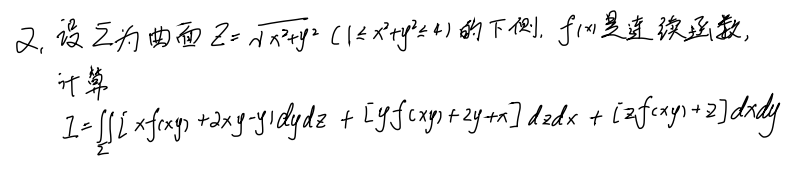
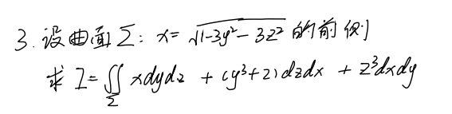
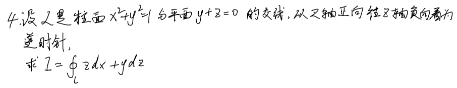
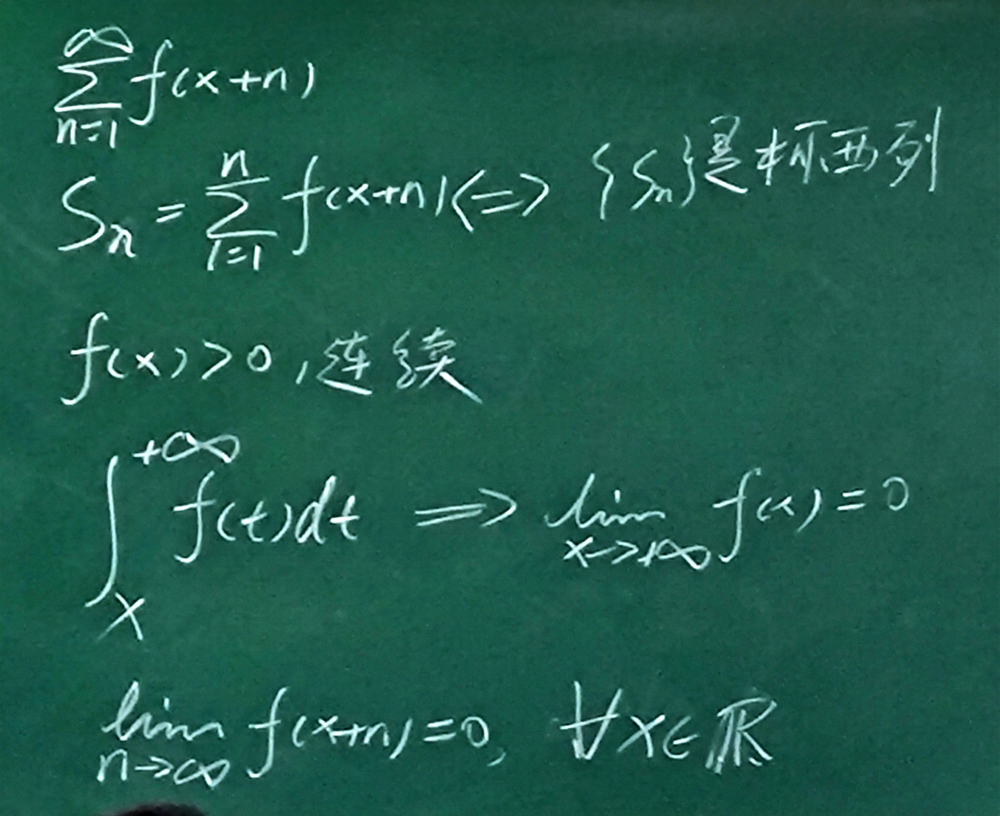

# 习题课

## 曲线积分

曲线积分主要是用于解决**变力做功**的问题.

例如, 一个电子在一个电场中运动, 我们想知道电场力对它做了多少功.

### 旋度

旋度: 转一圈, 场是否对物体做功.

奇点: 场强无穷大.

记作 $\displaystyle \text{rot} A=\begin{vmatrix} \vec{i} &\vec{j} &\vec{k} \\ \frac{\partial}{\partial x} & \frac{\partial}{\partial y} & \frac{\partial}{\partial z} \\ P & Q & R \\\end{vmatrix}$

无旋度的场是保守场, 即第二型曲线积分与路径无关.

如果与路径无关, 那么我们只需要记录"位置信息", 这个"位置信息"其实就是场的势.

如: 重力场的重力势, 电场的电势.

### 例题

$L: x^{2}+y^{2}=2$ 逆时针.

**解:**

设 $l: 4x^{2}+y^{2}=\varepsilon^{2}$

$\displaystyle \text{rot} A=\begin{vmatrix} \vec{i} &\vec{j} &\vec{k} \\ \frac{\partial}{\partial x} & \frac{\partial}{\partial y} & \frac{\partial}{\partial z} \\ P & Q & R \\\end{vmatrix}=\{0, 0, 0\}$

旋度为零, 是保守场 (其实在这里就是一个格林公式)

$
\begin{aligned}
I&=\oint \frac{4x-y}{4x^{2}+y^{2}}\mathrm{d}x+\frac{x+y}{4x^{2}+y^{2}}\mathrm{d}y \\
&=\oint_{L-l}+\oint_{l} \\
&=\oint_{l}P\mathrm{d}x+Q\mathrm{d}y \\
&=\frac{1}{\varepsilon^{2}}\oint_{l}(4x-y)\mathrm{d}x+(x+y)\mathrm{d}y \\
&=\frac{1}{\varepsilon^{2}}\iint_{D}2\mathrm{d}x\mathrm{d}y \\
&=\pi 
\end{aligned}
$

## 曲面积分

曲面积分其实是想解决**求通量**问题.

### 散度

散度就是通量密度, 即在点 $M$ 处通量对体积的变化率.

由它可以推出物理学中的高斯定理.

记作 $\displaystyle \text{div}A=\frac{\partial P}{\partial x}+\frac{\partial Q}{\partial y}+\frac{\partial R}{\partial z}$

散度为正时, 这个点在往外面喷东西, 我们称其为"源", 而散度为负时, 这个点在不断吸东西, 称为"汇".

散度为 $0$ 的话, 称为无源场.

点电荷产生的场:

- 电场: 有源无旋场
- 磁场: 无源有旋场

## 2.

$\displaystyle I=\iint_{D_{xy}}(Pz_{x}+Qz_{y}-R)\mathrm{d}x\mathrm{d}y=\iint_{D_{xy}}(P \frac{x}{z}+Q \frac{y}{z}-R)\mathrm{d}x\mathrm{d}y$

---

有一方向 $\vec{N}=(x,y,z), \vec{n}$ 是法向量.

$
\begin{aligned}
\mathrm{d}\vec{S}
&=\vec{n}\cdot \mathrm{d}S \\
&=\frac{\vec{n}}{||\vec{N}||}\cdot \mathrm{d}S \\
&=\frac{\vec{n}}{||\vec{N}||}\cdot \frac{1}{\cos\gamma}\mathrm{d}x\mathrm{d}y \\
&=\frac{\vec{n}}{||\vec{N}||}\cdot \frac{||\vec{N}||}{\vec{N}\cdot \vec{k}}\mathrm{d}x\mathrm{d}y \\
&=\frac{\vec{n}}{\vec{N}\cdot \vec{k}}\mathrm{d}x\mathrm{d}y \\
\end{aligned}
$

---

$z^{2}=x^{2}+y^{2}, \vec{N}=(x,y,z), \vec{N}\cdot \vec{k}=-z$

$
\begin{aligned}
I&=-\iint_{D}(P,Q,R)\cdot \frac{(x,y,z)}{-z}\mathrm{d}x\mathrm{d}y \\
&=\frac{1}{z}\iint \left( Px+Qy-Rz \right)\mathrm{d}x\mathrm{d}y \\
&=\frac{1}{z}\iint \left( 2x^{2}y+y^{2}-x^{2} \right) \mathrm{d}x\mathrm{d}y \\
&=\iint_{D}\frac{1}{\sqrt{x^{2}+y^{2}}}\left( 2x^{2}y+(y^{2}-x^{2}) \right)\mathrm{d}x\mathrm{d}y \\
\end{aligned}
$

$\because \displaystyle \iint_{D}\frac{1}{\sqrt{x^{2}+y^{2}}}x^{2}y=0$

$\quad\displaystyle \iint_{D} \left( \frac{x^{2}}{\sqrt{x^{2}+y^{2}}}-\frac{y^{2}}{\sqrt{x^{2}+y^{2}}} \right)=0$

$\therefore I=0$

参考 [correct.md](../Exam/correct.md)

## 3.

**解:**

$\Sigma_0: 3y^{2}+3z^{2}=1$ 向上.

$
\begin{aligned}
I&=\iint_{\Sigma-\Sigma_0}+\iint_{\Sigma_0} \\
&=\iiint_{\Omega}(1+3(y^{2}+z^{2}))\mathrm{d}V+0 \\
&=\iiint_{\Omega}\mathrm{d}V+3\iiint_{\Omega}(y^{2}+z^{2})\mathrm{d}V \\
&=\pi \int_{0}^{1}\frac{1}{3}(1-x)\mathrm{d}x+3\int_{0}^{1}\mathrm{d}x\int_{0}^{2\pi}\mathrm{d}\theta\int_{0}^{-\sqrt{\frac{1-x}{3}}}r^{3}\mathrm{d}r
\end{aligned}
$

## 4.

$\displaystyle \vec{N}=(0,1,1)$

$
\begin{aligned}
I&=\oint_{L}z\mathrm{d}x+y\mathrm{d}z \\
&=\iint_{\Sigma}\begin{vmatrix} \vec{i} &\vec{j} &\vec{k} \\ \frac{\partial}{\partial x} & \frac{\partial}{\partial y} & \frac{\partial}{\partial z} \\ z & 0 & y \\\end{vmatrix}\mathrm{d}\vec{S} \\
&=\iint_{\Sigma}(-1,1,0)\mathrm{d}\vec{S} \\
&=\iint (-1,1,0)\cdot \frac{(0,1,1)}{(0,1,1)\cdot (0,0,1)}\mathrm{d}x\mathrm{d}y \\
&=\iint_{D}\mathrm{d}x\mathrm{d}y \\
&=\pi
\end{aligned}
$

## 6.

