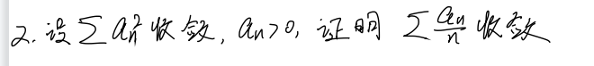
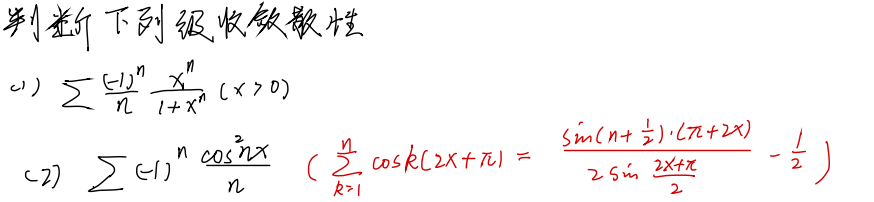
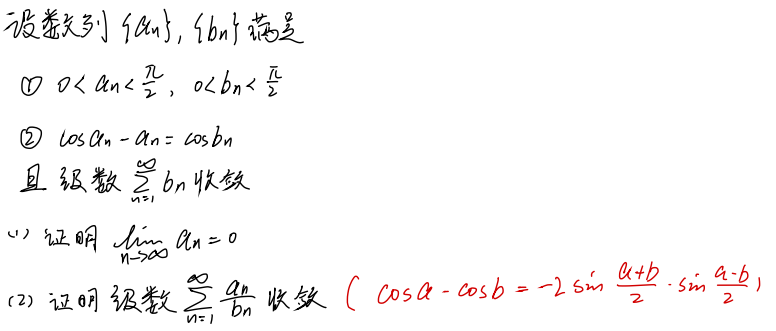
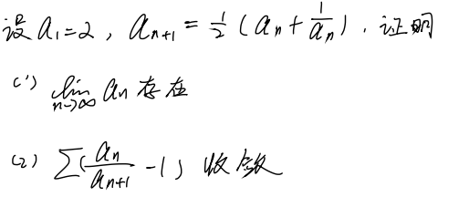
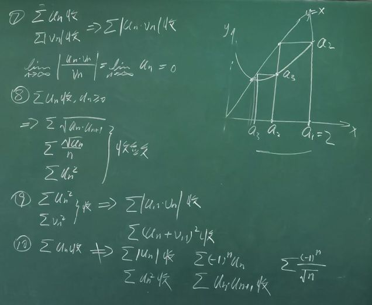

# 习题课

## 1.

**题目:** 设 $a_{n}\geqslant 0, n=1,2,\cdots$ 且 $\{na_{n}\}$ 有界, 证明 $\displaystyle \sum_{n=1}^{\infty} a_n^{2}$ 收敛.

$\because a_{n}>0$ 且 $\{na_{n}\}$ 有界

$\therefore \exists M\in \mathbb{R}, s.t. |na_{n}|\leqslant M$

$\therefore 0\leqslant na_{n}\leqslant M$

$\therefore \displaystyle 0\leqslant a_{n}\leqslant \frac{M}{n}$

$\therefore \displaystyle 0\leqslant a_{n}^{2}\leqslant \frac{M^{2}}{n^{2}}$

则 $\displaystyle \sum_{n=1}^{\infty} a_n^{2}$ 收敛.

## 2.

$\because a\cdot b\leqslant \frac{1}{2}(a^{2}+b^{2})$

$\therefore \displaystyle \frac{a_{n}}{n}\leqslant \frac{1}{2}(a_{n}^{2}+\frac{1}{n^{2}})$

$\therefore \displaystyle \sum_{n=1}^{\infty} \frac{a_{n}}{n}$ 是收敛的

## 3.

**题目:** $\displaystyle \sum_{n=1}^{\infty} a_n$ 收敛, $a_{n}>0$, 证明 $\displaystyle \sum_{n=1}^{\infty} \sqrt{a_{n}a_{n+1}}$ 收敛.

$\because \sqrt{a_{n}a_{n+1}}\leqslant \frac{1}{2}(a_{n}+a_{n+1})$, 后者是收敛的

$\therefore \displaystyle \sum_{n=1}^{\infty}\sqrt{a_{n}a_{n+1}}$ 是收敛的.

## 4.

**题目:** $\displaystyle \sum_{n=1}^{\infty} a_n$ 发散, $a_{n}>0$, $S_{n}=a_{1}+a_{2}+\cdots +a_{n}$, 证明 $\displaystyle \sum_{n=1}^{\infty} \frac{(-1)^{n}}{S_{n}}$ 收敛.

$\because \displaystyle a_{n}>0, \sum_{n=1}^{\infty} a_n$ 发散

$\therefore \displaystyle S_{n}$ 递增且趋于 $+\infty$

$\therefore \displaystyle \frac{1}{S_{n}}$ 递减且趋于 $0$

由莱布尼茨判别法即可知

$\therefore \displaystyle \sum_{n=1}^{\infty} \frac{(-1)^{n}}{S_{n}}$ 收敛.

## 5.

### (1)

$\because \displaystyle f'(n)=\frac{\mathrm{d}}{\mathrm{d}n}(\frac{1}{n}(1-\frac{1}{1+x^{n}}))=\frac{x^{n} \left(n \ln x - x^{n} - 1\right)}{n^{2} \left(x^{n} + 1\right)^{2}}\leqslant 0$

$\therefore \displaystyle \frac{1}{n}(1-\frac{1}{1+x^{n}})$ 单调递减且趋于 $0$

由莱布尼茨判别法可知

$\displaystyle \sum_{n=1}^{\infty} \frac{1}{n}(1-\frac{1}{1+x^{n}})$ 收敛.

或者我们也可以用 Abel 判别法.

我们可以讨论出 $\displaystyle \frac{x^{n}}{1+x^{n}}$ 是单调有界的, 且我们有 $\displaystyle \frac{(-1)^{n}}{n}$ 收敛.

$\displaystyle \sum_{n=1}^{\infty} \frac{1}{n}(1-\frac{1}{1+x^{n}})$ 收敛.

### (2)

设 $\displaystyle a_{n}=\frac{1}{n}, b_{n}=(-1)^{n}\cos^{2}nx$

$
\begin{aligned}
0&\leqslant |S_{n}|=|\sum_{i=1}^{n} b_{i}|=|\sum_{k=1}^{n}(-1)^{k}\cos^{2}kx| \\
&=|\sum_{k=1}^{n} \frac{(-1)^{k}(1+\cos 2kx)}{2}| \\
&=|\sum_{k=1}^{n} \frac{(-1)^{k}}{2}+\sum_{k=1}^{n} \frac{(-1)^{k}\cdot \cos 2kx}{2}| \\
&\leqslant |\sum_{k=1}^{n} \frac{(-1)^{k}}{2}|+|\sum_{k=1}^{n} \frac{(-1)^{k}\cdot \cos 2kx}{2}| \\
&\leqslant \frac{1}{2}+\frac{1}{2}|\sum_{k=1}^{n} \cos k(2n+\pi)| \\
&=\frac{1}{2}+\frac{1}{2}|\frac{\sin(n+\frac{1}{2})\cdot (2x+\pi)}{2\sin\frac{2x+\pi}{2}}-\frac{1}{2}| \\
&\leqslant \frac{3}{4}+\frac{1}{2}|\frac{\sin(n+\frac{1}{2})\cdot (2x+\pi)}{2\sin\frac{2x+\pi}{2}}| \\
\end{aligned}
$

当 $\displaystyle \sin \frac{2x+\pi}{2}\neq 0$ 时, $\displaystyle 2x\neq k\pi, x\neq k\pi-\frac{\pi}{2}$

$\therefore S_{n}$ 有界

因为 $a_{n}$ 递减与 $S_{n}$ 有界, 由 Dirichlet 判别法可知

$\therefore \displaystyle \sum_{n=1}^{\infty} (-1)^{n}\frac{\cos^{2}nx}{n}$ 收敛.

## 6.

### (1)

$\because \displaystyle \sum_{n=1}^{\infty} b_{n}$ 收敛

$\therefore \displaystyle \lim_{n \to \infty} b_{n}=0$

$\therefore \displaystyle 0\leqslant a_{n}=\cos a_{n}-\cos b_{n}$

$\because \displaystyle 0< a_{n}<\frac{\pi}{2}, 0< b_{n}<\frac{\pi}{2}$

$\therefore \cos a_{n}\geqslant \cos b_{n}$

$\therefore 0\leqslant a_{n}\leqslant b_{n}$

由夹逼定理可知

$\therefore \displaystyle \lim_{n \to \infty} a_{n}=0$

### (2)

$
\begin{aligned}
\lim_{n \to \infty}\frac{a_{n}}{b_{n}}
&=\frac{\cos a_{n}-\cos b_{n}}{b_{n}} \\
&=-\frac{\displaystyle 2\sin\frac{a_{n}+b_{n}}{2}\sin \frac{a_{n}-b_{n}}{2}}{b_{n}} \\
&=\frac{\displaystyle 2\sin\frac{a_{n}+b_{n}}{2}\sin \frac{a_{n}-b_{n}}{2}}{\frac{1}{2}(a_{n}+b_{n})\cdot \frac{1}{2}(a_{n}-b_{n})}\cdot \frac{\frac{1}{2}(a_{n}+b_{n})\cdot \frac{1}{2}(a_{n}-b_{n})}{b_{n}} \\
&\leqslant \frac{b_{n}^{2}-a_{n}^{2}}{2b_{n}} \\
&\leqslant \frac{b_{n}^{2}}{2b_{n}} \\
&=\frac{b_{n}}{2} \\
\end{aligned}
$

其中 $\displaystyle \sum_{n=1}^{\infty}\frac{b_{n}}{2}$ 收敛, 由比较判别法可知 $\displaystyle \sum_{n=1}^{\infty} \frac{a_{n}}{b_{n}}$ 收敛.

 
## 7.

### (1)

令 $\displaystyle x=\frac{1}{2}(x+\frac{1}{x})$ 解得 $x=1$ 或 $x=-1$

令 $\displaystyle f(x)=\frac{1}{2}(x+\frac{1}{x})$, 易知 $f(x)$ 在 $[1, +\infty)$, $f(1)=1$. 

$\therefore \displaystyle f'(x)=\frac{1}{2}-\frac{1}{2x^{2}}\geqslant 0$ 对于 $[1, +\infty)$ 成立, 即 $f(x)$ 是单调递增的.

$\because \displaystyle x\geqslant \frac{1}{2}(x+\frac{1}{x})\Leftrightarrow 2x\geqslant x+\frac{1}{x}\Leftrightarrow x\geqslant \frac{1}{x}$ 对于 $[-1,+\infty)$ 均成立,

即有 $a_{n-1}\geqslant a_{n}$, $a_{n}$ 是单调递减的.

**数学归纳法:**

当 $x=1$ 时, 有 $1\leqslant a_1=2\leqslant 2$

假设当 $n-1$ 时, 有 $1\leqslant a_{n-1}\leqslant a_{n-2}\leqslant \cdots \leqslant a_1=2$

则当 $n$ 时, 有 $f(1)\leqslant f(a_{n-1})\leqslant a_{n-1}\leqslant \cdots \leqslant a_1=2$

即有 $1\leqslant a_{n}\leqslant 2$

所以 $a_{n}$ 是单调有界的.

$\therefore \displaystyle \lim_{n \to \infty} a_{n}$ 存在, 设为 $\displaystyle \lim_{n \to \infty} a_{n}A$.

$\because \displaystyle a_{n+1}=\frac{1}{2}(a_{n}+\frac{1}{a_{n}})$

$\because \displaystyle A=\frac{1}{2}(A+\frac{1}{A}), 1\leqslant A\leqslant 2$

$\therefore \displaystyle \lim_{n \to \infty} a_{n}=A=1$

### (2)

$\because \displaystyle \frac{a_{n}}{a_{n+1}}-1=\frac{a_{n}-a_{n+1}}{a_{n+1}}\leqslant a_{n}-a_{n+1}$

$\therefore \displaystyle \sum_{n=1}^{\infty} (a_n-a_{n+1})=a_1-a_2+a_2-a_3+\cdots -a_{n+1}=a_1-a_{n+1}$

$\therefore \displaystyle \lim_{n \to \infty} \sum_{n=1}^{\infty} (a_n-a_{n+1})=1$ 是收敛的, 由比较判别法可知

$\therefore \displaystyle \sum_{n=1}^{\infty} \frac{a_{n}}{a_{n+1}}-1$ 是收敛的

## 拉贝判别法

$\displaystyle u_{n}\geqslant 0, \lim_{n \to \infty}n\left( 1-\frac{u_{n+1}}{u_{n}} \right)=\gamma$

1. $\displaystyle \gamma>1\Rightarrow \sum_{n=1}^{\infty} u_{n}$ 收敛
2. $\displaystyle \gamma<1\Rightarrow \sum_{n=1}^{\infty} u_{n}$ 发散
3. $\displaystyle \exists N\in \mathbb{N}, \forall n\geqslant N, n\cdot (1-\frac{u_{n+1}}{u_{n}})\geqslant \gamma, \gamma>1\Rightarrow \sum_{n=1}^{\infty} u_n$ 收敛. 
4. $\displaystyle \forall n, n\cdot \left( 1-\frac{u_{n+1}}{u_{n}} \right)\leqslant \gamma, \gamma<1\Rightarrow \sum_{n=1}^{\infty} u_n$ 发散.

