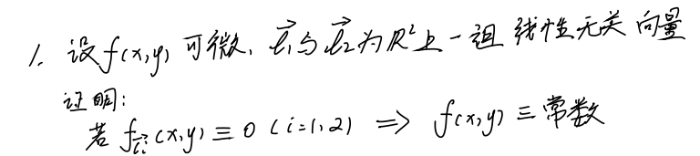
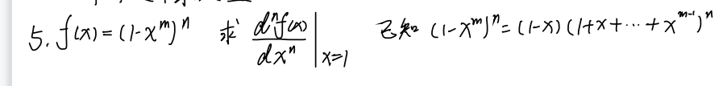

# 第二次习题课

## 1.

$\because$ 线性无关

$\therefore k_1\boldsymbol{l}_1+k_2\boldsymbol{l}_2=0$

$
\because
\begin{cases}
k_1\cos\alpha_1+k_2\cos\alpha_2=0 \\
k_1\cos\beta_1+k_2\cos\beta_2=0 \\
\end{cases}
$ 只有零解

$
\therefore
\begin{cases}
f_x\cos\alpha_1+f_y\cos\beta_1=0 \\
f_x\cos\alpha_2+f_y\cos\beta_2=0 \\
\end{cases}
$ 也只有零解

$\therefore f_x=f_y=0$

利用中值定理

$f(x_0+\Delta x)=f(x_0)+\nabla f^T_{(x_0)}\theta\Delta x, \theta\in[0,1]$

可知 $f(x,y)$ 为常数.

## 2.

## 3.

$xyz=\lambda$ : $(yz, xz, xy)$

$\displaystyle \frac{x^2}{a^2}+\frac{y^2}{b^2}+\frac{z^2}{c^2}=1$ : $\displaystyle (\frac{x}{a^2},\frac{y}{b^2},\frac{z}{c^2})$

$\displaystyle \frac{yz}{\frac{x}{a^2}}=\frac{xz}{\frac{y}{b^2}}=\frac{xy}{\frac{z}{c^2}} \Rightarrow (\frac{x}{a})^2=(\frac{y}{b})^2=(\frac{z}{c})^2$

$
\because
\begin{cases}
x=a\cos\varphi\cos\theta \\
y=b\cos\varphi\sin\theta \\
z=c\sin\varphi
\end{cases}
$

$
\therefore
\begin{cases}
\cos\theta=\pm\frac{1}{\sqrt{2}} \\
\sin\theta=\pm\frac{1}{\sqrt{2}} \\
\sin\varphi=\pm\frac{1}{\sqrt{3}} \\
\end{cases}
$

<!-- $\therefore\displaystyle a=b=c=\frac{\sqrt{3}}{3}$ -->

## 4.

## 5.

## 6.

$\therefore\displaystyle f'(x)=\frac{\frac{-(1+x)-(1-x)}{(1+x)^2}}{1+(\frac{1-x}{1+x})^2}=-\frac{1}{1+x^2}$

