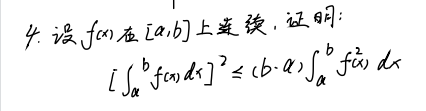
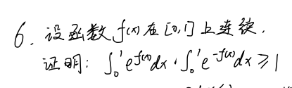
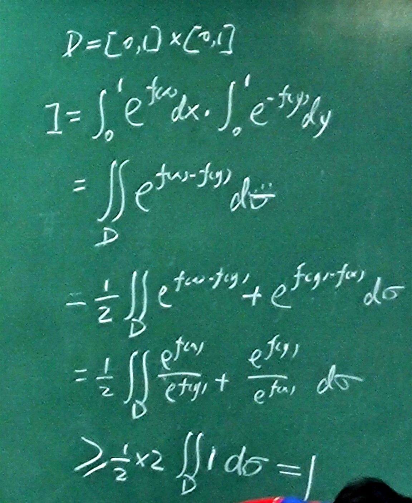
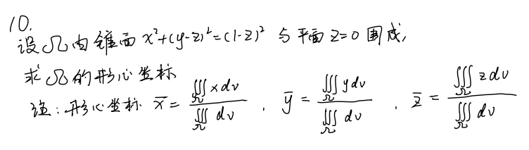
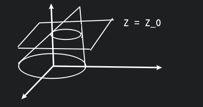

# 第三次习题课

## 1.

**二重积分中值定理:**

若 $f(x,y)$ 在有界闭区域 $D$ 上连续, 则存在 $(\xi, \eta)\in D$, 

使得 $\displaystyle\iint_D f(x,y){\rm d}\sigma=f(\xi,\eta)\cdot S_D$, 其中 $S_D$ 为区域 $D$ 的面积.

## 2.

若 $f(x,y)$ 在有界闭区域 $D$ 上连续, $g(x,y)$ 在 $D$ 上可积且不变号, 则存在一点 $(\xi, \eta)\in D$,

使得 $\displaystyle \iint_Df(x,y)\cdot g(x,y){\rm d}\sigma=f(\xi,\eta)\cdot \iint_Dg(x,y){\rm d}\sigma$

## 3.

假设 $\exist u_0=(x_0,y_0)\in D, f(x_0,y_0)>0$

$f(x,y)$ 在 $D$ 连续 

$\Leftrightarrow$

$\forall \varepsilon, \exist\delta, \forall ||u_n-u_0||<\delta, u_n=(x_n,y_n) \ s.t. \ |f(x_0,y_0)-f(x_n,y_n)|<\varepsilon$

取 $\varepsilon=\frac{1}{2}f(x_0,y_0)$

$f(x_n,y_n)-f(x_0,y_0)>-\varepsilon$

$\Rightarrow$

$f(x_n,y_n)>\frac{1}{2}f(x_0,y_0), (x_n,y_n)\in U(u_0, \delta)=\pi \delta^2$

$\displaystyle\iint_{U(u_0, \delta)}f(x,y){\rm d}\sigma>\frac{1}{2}f(x_0,y_0)\cdot m(U(u_0, \delta))>0$

## 4.

$\because\displaystyle \iint_D f(x)g(x){\rm d}\sigma=\int{\rm d}y\int f(x)g(x){\rm d}x=\int g(y){\rm d}y\int f(x){\rm d}x$

使用基本不等式

$
\begin{aligned}
\therefore (\int_a^b f(x){\rm d}x)^2
&=\iint_Df(x)\cdot f(y){\rm d}x{\rm d}y \\
&\leq \frac{1}{2}\iint_D[f^2(x)+f^2(y)]{\rm d}x{\rm d}y \\
&=\iint_D f^2(x){\rm d}\sigma
\end{aligned}
$

$\because\displaystyle (b-a)\int_a^bf^2(x){\rm d}x=\int_a^b{\rm d}y\int_a^bf^2(x){\rm d}x=\iint_Df^2(x){\rm d}\sigma$

## 6.

**对称性:**

当 $D$ 关于 $y=x$ 对称

$\displaystyle \iint_Df(x,y){\rm d}\sigma=\iint_Df(y,x){\rm d}\sigma=\frac{1}{2}\iint_D[f(x,y)+f(y,x)]{\rm d}\sigma$

那么我们有

**泰勒公式:**

$\displaystyle e^x=\sum_{n=0}^\infty\frac{x^n}{n!}\geq 1+x, x\in\mathbb{R}$

$\displaystyle e^{f(x)-f(y)}\geq 1+f(x)-f(y)$

$\displaystyle \iint_De^{f(x)-f(y)}{\rm d}\sigma\geq \iint_D1{\rm d}\sigma+\iint_Df(x){\rm d}\sigma-\iint_Df(y){\rm d}\sigma=\iint_D1{\rm d}\sigma=1$

**柯西斯瓦茨不等式:**

$\because |\vec{x}\cdot \vec{y}|\leq ||\vec{x}||\cdot ||\vec{y}||$

$\therefore (\sum x_iy_i)^2\leq \sum x_i^2\cdot \sum y_i^2$

$\therefore\displaystyle 1=(\int_0^1e^{\frac{f(x)}{2}}e^{-\frac{f(x)}{2}}{\rm d}x)^2\leq \int e^{f(x)}{\rm d}x\cdot \int e^{-f(x)}{\rm d}x$

积分可以看作另一种形式的 "内积".

## 10.

$x^2+(y-z_0)^2=(1-z_0)^2$

$\displaystyle\iiint_\Omega{\rm d}V=\int_0^1\pi(1-z)^2{\rm d}z=\frac{1}{3}\pi$

$\displaystyle\iiint_\Omega z{\rm d}V=\int_0^1z{\rm d}z\iint \boxed{\quad} \ {\rm d}x{\rm d}y=\int_0^1zx(1-z)^2{\rm d}z=\frac{1}{12}\pi$

$\displaystyle\iiint_\Omega x{\rm d}V=0$

$\displaystyle\iiint_\Omega y{\rm d}V=\iiint_\Omega[(y-z)+z]{\rm d}V=\iiint_\Omega z{\rm d}V=\frac{1}{12}\pi$

做坐标变换

$
\begin{cases}
u=x \\
v=y-z \\
w=1-z \\
\end{cases}
\Rightarrow
\begin{cases}
x=u \\
y=v-w+1 \\
z=1-w \\
\end{cases}
$

$\left| \begin{vmatrix}1&0&0\\0&1&1\\0&0&-1\end{vmatrix} \right|=1$

## 11.

$\displaystyle \int_0^\infty e^{x^2}{\rm d}x=\sqrt{(\int_0^\infty e^{x^2}{\rm d}x)^2}=\sqrt{\iint_D e^{x^2+y^2}{\rm d}\sigma}=\sqrt{\int_0^{\frac{\pi}{2}}{\rm d}\theta\int_0^\infty r\cdot e^{r^2}{\rm d}r}$

