# 算法基础

## 正确性证明

1. 有限步内运算完成.
2. 任何时候都能得出正确结果 (数学归纳法).

## RAM 模型

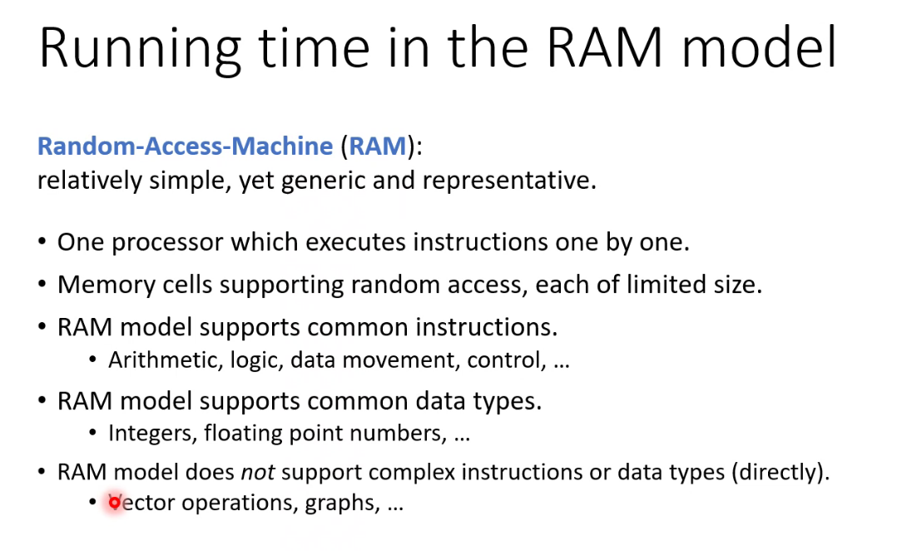

## 时间复杂度

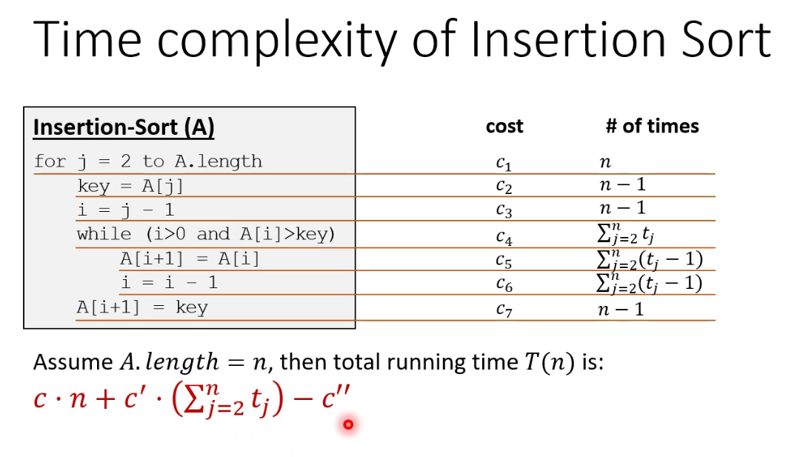

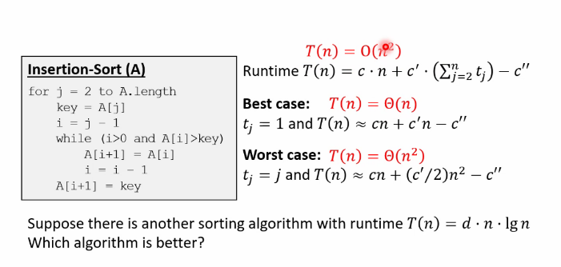

## 渐进记号 (Asymptotic Notation)

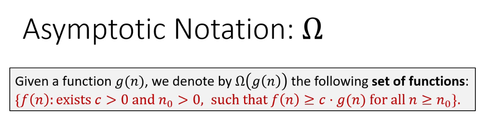

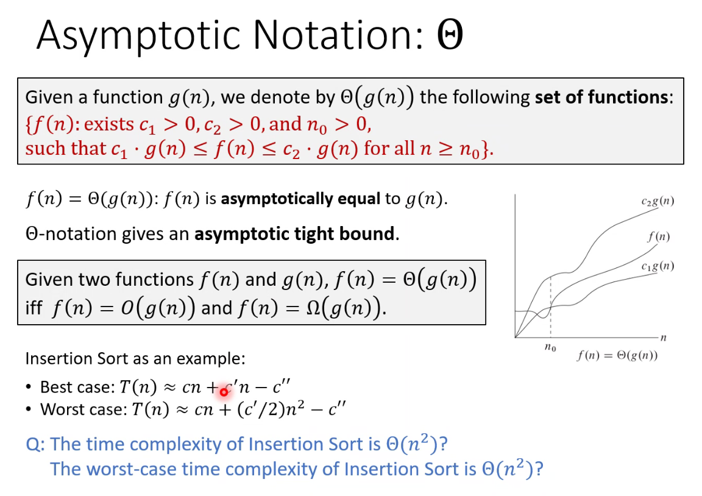

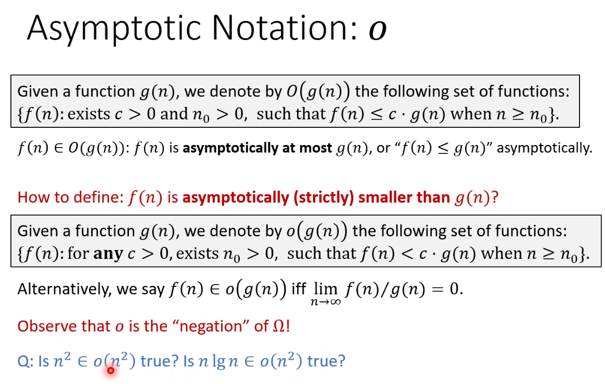

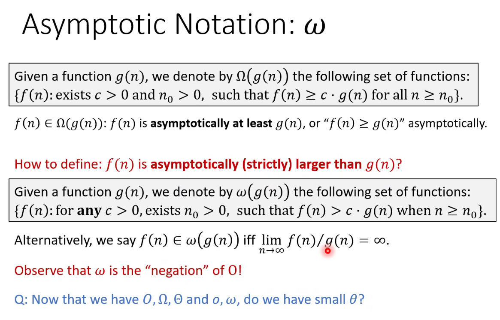

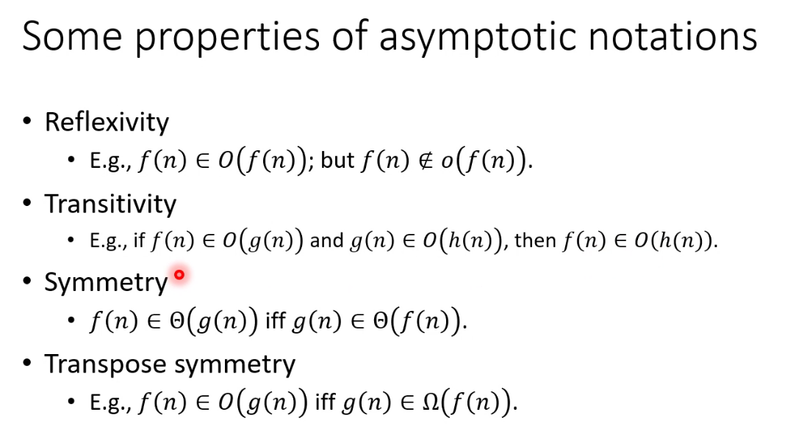

其中, 我们有 $\displaystyle \lim_{n \to \infty}\frac{f(n)}{g(n)}=c_0>0 \Rightarrow f(n)\in \Theta(g(n))$, 反之则不一定成立.

例如 $f(n)=n(1+\sin n), g(n)=n$

## 常见函数 (Common Functions)

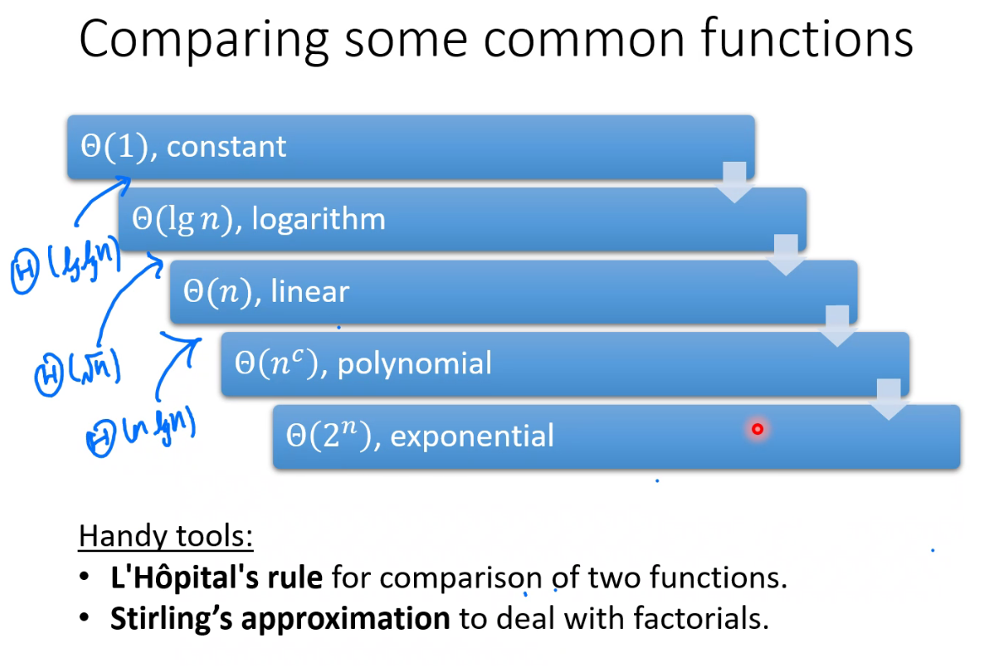

## 斯特林近似 (Stirling's Approximation)

$f(n)=n\lg n, g(n)=\lg(n!)$, 则 $f(n)=\Theta(g(n))$

$\displaystyle  n!\approx \sqrt{2\pi n}\left( \frac{n}{e} \right)^{n}$

$\displaystyle \sqrt{c_0 n}\left( \frac{n}{e} \right)^{n}\leqslant n!\leqslant \sqrt{c_1 n}\left( \frac{n}{e} \right)^{n}$

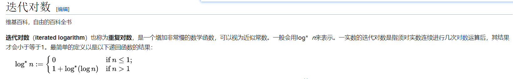

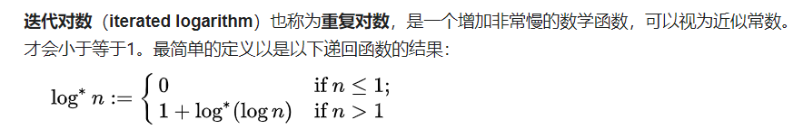
