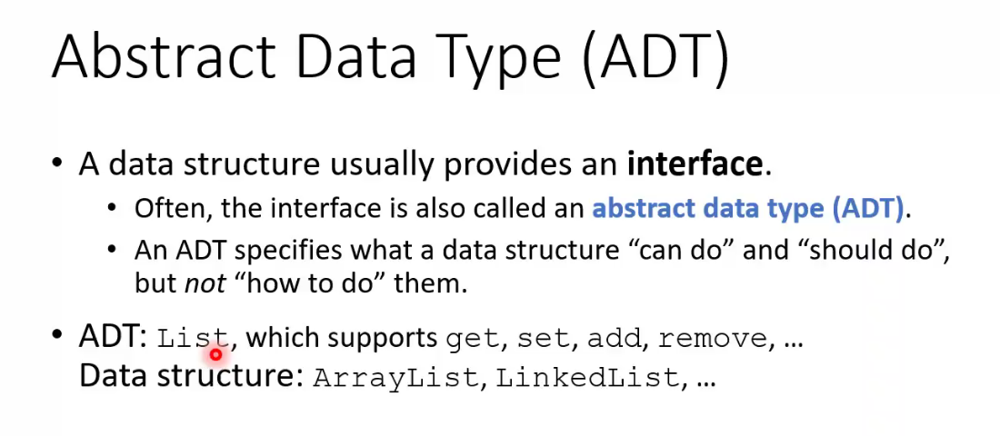
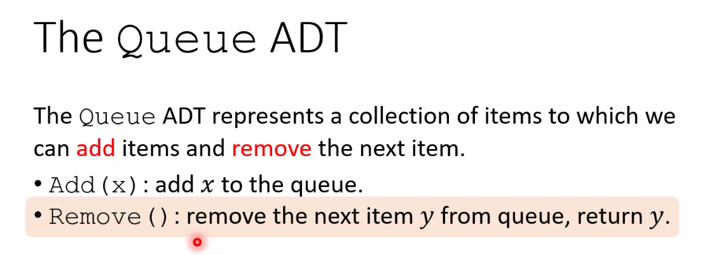
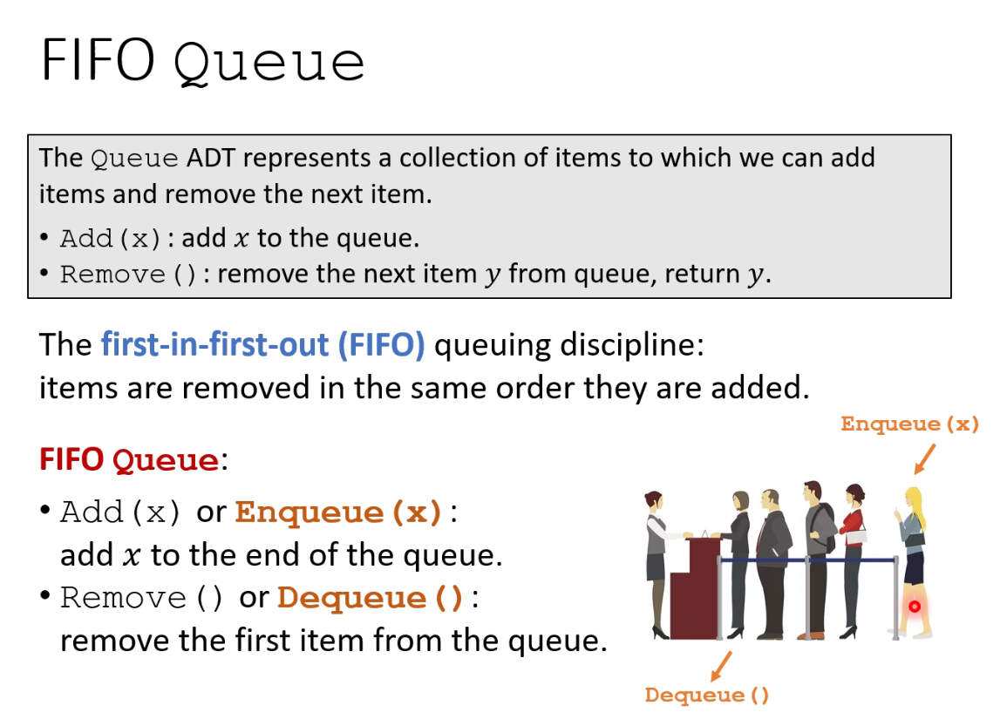
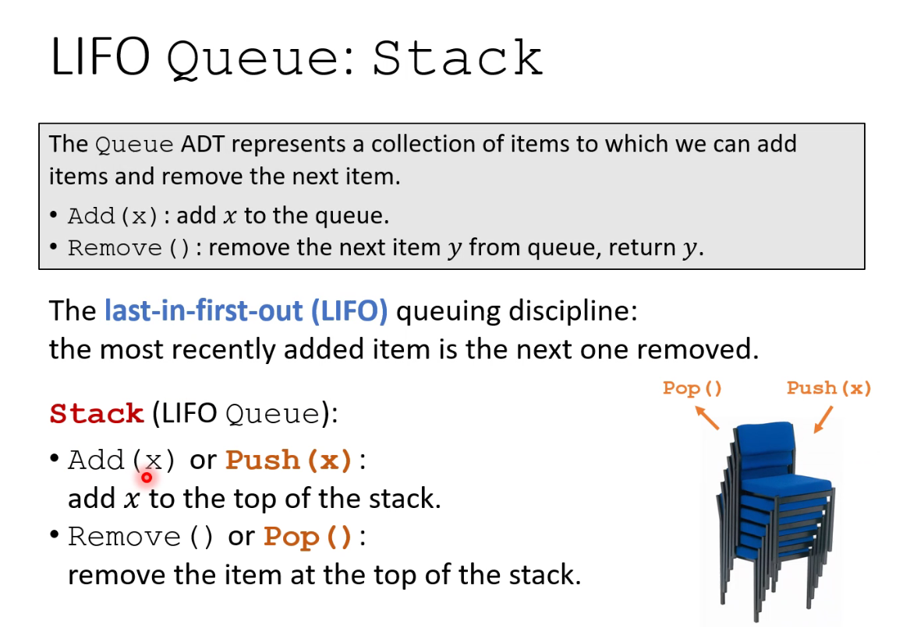
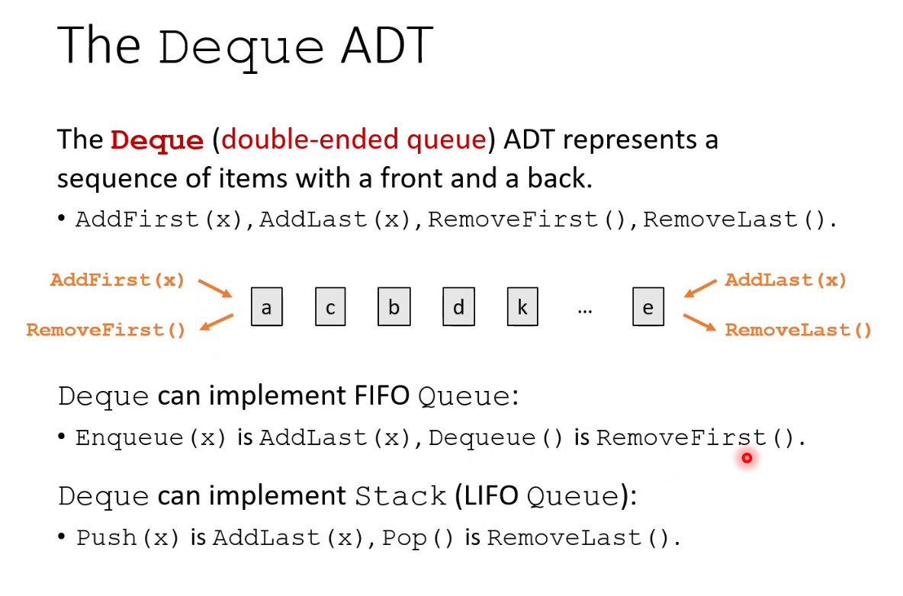
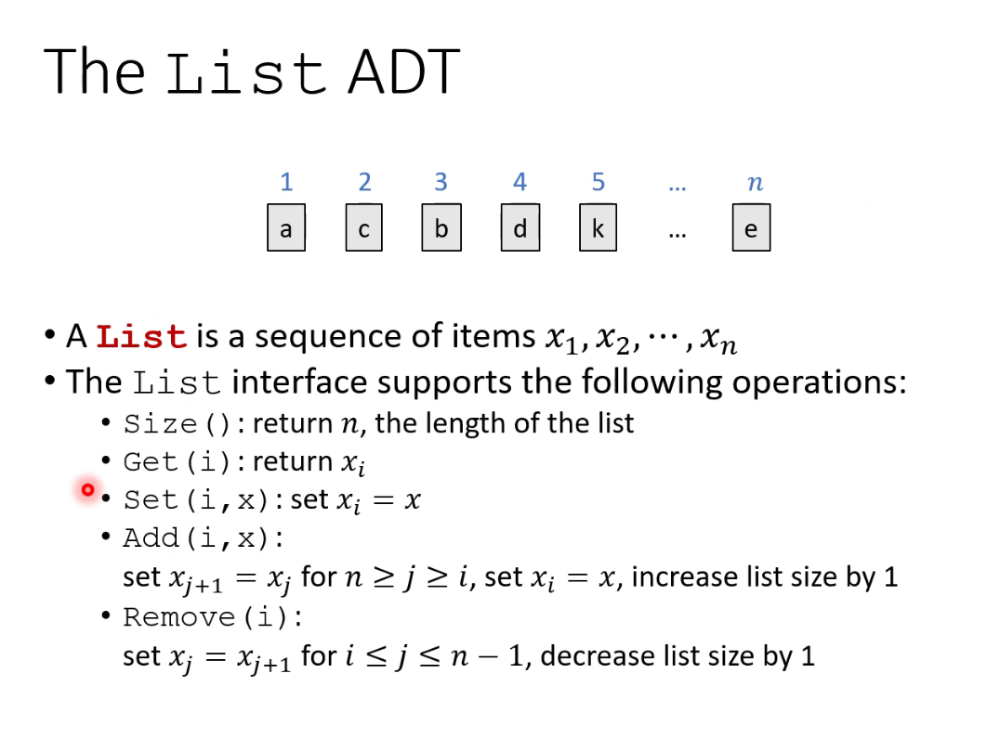
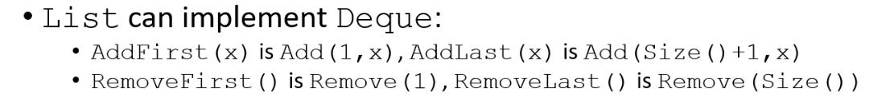
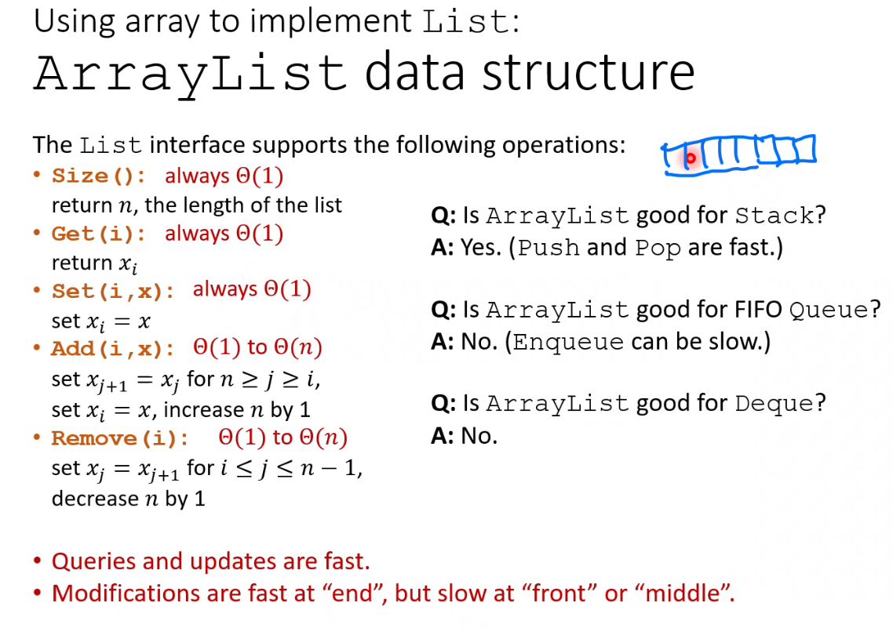

# 数据结构

## 抽象数据类型 (Abstract Data Type) (ADT)

即 **接口** (interface) 和 **实现** (implement) 的区别.

## 队列 (Queue)

## 列表 (List)

伪代码语法:

<pre class="pseudocode">
% This quicksort algorithm is extracted from Chapter 7, Introduction to Algorithms (3rd edition)
\begin{algorithm}
\caption{Quicksort}
\begin{algorithmic}
\PROCEDURE{Quicksort}{$A, p, r$}
    \IF{$p < r$}
        \STATE $q = $ \CALL{Partition}{$A, p, r$}
        \STATE \CALL{Quicksort}{$A, p, q - 1$}
        \STATE \CALL{Quicksort}{$A, q + 1, r$}
    \ENDIF
\ENDPROCEDURE
\PROCEDURE{Partition}{$A, p, r$}
    \STATE $x = A[r]$
    \STATE $i = p - 1$
    \FOR{$j = p$ \TO $r - 1$}
        \IF{$A[j] < x$}
            \STATE $i = i + 1$
            \STATE exchange
            $A[i]$ with $A[j]$
        \ENDIF
        \STATE exchange $A[i]$ with $A[r]$
    \ENDFOR
\ENDPROCEDURE
\end{algorithmic}
\end{algorithm}
</pre>