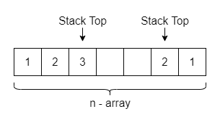

# Solution for Problem Set 1

## 20130005 方盛俊

## Problem 1

**(a)** We need to prove that $A'$ is a permutation (reordering) of $A$.

**(b)** 

- Loop invariant: After the $j$-th loop, $A[j-1]$ is the smallest element of $A[j-1...n]$.
- Proof:
  - Initialization: There is only one element, $A[n]$, when $i = 1$.
  - Maintain: $A[j]$ is the smallest element of $A[j...n]$. After exchange, $A[j-1]$ is the smaller than $A[j]$ and all elements in $A[j+1...n]$ so that $A[j-1]$ is the smallest element of $A[j-1...n]$, when $j\leftarrow j-1$.
  - Termination: $A[i]$ is the smallest element of $A[i...n]$, when $j = i$.

**(c)** 

- Loop invariant: After the $i$-th loop, subarray $A[1...i]$ is sorted and $A[i]$ is the smallest element of $A[i...n]$.
- Proof:
  - Initialization: There is only one element, $A[1]$, when $i = 1$.
  - Maintain: $A[i-1]$ is the smallest element of $A[i-1...n]$. After loop in lines 2-4, with the loop invariant proved in part (b), $A[i]$ is the smallest element of $A[i...n]$ and $A[1...i]$ is still sorted, when $i\leftarrow i+1$.
  - Termination: $A[1...n]$ is sorted, when $i = n$.
- Correctness: Elements are exchanged only and $A[1...n]$ is sorted. So inequality (1) holds.

## Problem 2

**(a)** $T(n)=c_1+c_2(n+2)+c_3(n+1)=(c_2+c_3)n+(c_1+2c_2+c_3)=\Theta(n)$

**(b)**

- Loop invariant: After thee $i$-th loop, $\displaystyle y=\sum_{k=i}^{n}c_kx^{k-i}$.
- Proof:
  - Initialization: $y=0$, before the loop.
  - Maintain: The old one $\displaystyle y=\sum_{k=i+1}^{n}c_kx^{k-i-1}$, so the new one $\displaystyle y'=c_i+xy=c_i+\sum_{k=i+1}^{n}c_kx^{k-i}=\sum_{k=i}^{n}c_kx^{k-i}$, when $i\leftarrow i-1$.
  - Termination: $\displaystyle y=\sum_{k=0}^{n}c_kx^{k}$, when $i = 0$.
- Correctness: The algorithm will be terminated within $n+1$ times of loop and the result $\displaystyle y=\sum_{k=0}^{n}c_kx^{k}$ is equal to $P(x)$.

## Problem 3

**(a)** $f\in \Theta(g)$

**(b)** $f\in O(g)$

**(c)** $f\in \Theta(g)$

**(d)** $f\in \Theta(g)$

**(e)** $f\in \Theta(g)$

**(f)** $f\in \Theta(g)$

**(g)** $f\in \Omega(g)$

**(h)** $f\in \Omega(g)$

**(i)** $f\in \Omega(g)$

**(j)** $f\in \Omega(g)$

**(k)** $f\in \Omega(g)$

**(l)** $f\in O(g)$

**(m)** $f\in O(g)$

**(n)** $f\in \Theta(g)$

**(o)** $f\in \Omega(g)$

**(p)** $f\in \Omega(g)$

## Problem 4

$\displaystyle 1 = n^{\frac{1}{\lg n}} \ll \lg(\lg^{*}n) = \lg^{*}(\lg n) \ll \lg^{*}n \ll 2^{\lg^{*}n} \ll \ln\ln n \ll \sqrt{\lg n} \ll \ln n \ll \lg^{2}n \ll n = 2^{\lg n} \ll n\lg n = \lg(n!) \ll n^{2} = 4^{\lg n} \ll n^{3} \ll 2^{\sqrt{2\lg n}} \ll (\sqrt{2})^{\lg n} \ll \left( \frac{3}{2} \right)^{n} \ll 2^{n} \ll e^{n} \ll n\cdot 2^{n} \ll (\lg n)! \ll (\lg n)^{\lg n} = n^{\lg\lg n} \ll n! \ll (n+1)! \ll 2^{2^{n}} \ll 2^{2^{n+1}}$

## Problem 5

**Overview:**

We save two index variances that indicate the positions of two stack tops. The 1-based one increases with push operation, and the n-based one decreases with push operation. Let $S$, $T$ be two stacks and $i$, $j$ be two indices.

**Algorithm:**

<pre class="pseudocode">
\begin{algorithm}
\caption{Two Stacks with One Array}
\begin{algorithmic}

\FUNCTION{Initiate}{}
    \STATE $i \leftarrow 0$
    \STATE $i \leftarrow n+1$
\ENDFUNCTION

\FUNCTION{S.push}{$x$}
    \STATE $i \leftarrow i+1$
    \STATE $A[i] \leftarrow x$
\ENDFUNCTION

\FUNCTION{S.pop}{}
    \STATE $i \leftarrow i-1$
    \RETURN $A[i + 1]$
\ENDFUNCTION

\FUNCTION{T.push}{$x$}
    \STATE $j \leftarrow j-1$
    \STATE $A[j] \leftarrow x$
\ENDFUNCTION

\FUNCTION{T.pop}{}
    \STATE $j \leftarrow j+1$
    \RETURN $A[j - 1]$
\ENDFUNCTION

\end{algorithmic}
\end{algorithm}
</pre>

## Problem 6

**Overview:**

Let $Q$, $U$ be two FIFO queues. When the operation is *push*, we enqueue $x$ to $U$. When the operation is *pop*, dequeue element from queue $U$ and enqueue it to queue $Q$, until the size of queue $U$ is 1. Then we dequeue the last element from queue $U$ and save it as $r$, then we restore all elements from $Q$ to $U$. Finally, return $r$.

**Algorithm:**

<pre class="pseudocode">
\begin{algorithm}
\caption{Stack Using Two FIFO Queues}
\begin{algorithmic}

\FUNCTION{Push}{$x$}
    \STATE $U$.enqueue($x$)
\ENDFUNCTION

\FUNCTION{Pop}{}
    \WHILE{$U$.size() > 1}
        \STATE $Q$.enqueue($U$.dequeue())
    \ENDWHILE
    \STATE $r \leftarrow U$.dequeue()
    \WHILE{$Q$ is not empty}
        \STATE $U$.enqueue($Q$.dequeue())
    \ENDWHILE
    \RETURN $r$
\ENDFUNCTION

\end{algorithmic}
\end{algorithm}
</pre>

**Time Complexity:**

Let $n$ be the size of $Q$.

- Push: $T(n)=c_0=\Theta(1)$
- Pop: $T(n)=(c_0+c_1)(n-1)+c_2+(c_0+c_1)(n-1)+c_3=(2c_0+2c_1)n+(c_2+c_3-2c_0-2c_1)=\Theta(n)$

## Bonus Problem

**Overview:**

Let $A[1...N]$ be an array, $n$ be size or index of queue. When the operation *add*, save it in the tail of array and let $n$ increases. When the operation *remove*, get an element randomly, swap it with the tail element, let $n$ decreases and return the element.  

**Algorithm:**

<pre class="pseudocode">
\begin{algorithm}
\caption{Stack Using Two FIFO Queues}
\begin{algorithmic}

\FUNCTION{Add}{$x$}
    \STATE $n \leftarrow n+1$
    \STATE $A[n] \leftarrow x$
\ENDFUNCTION

\FUNCTION{Remove}{}
    \STATE $i \leftarrow$ random(n)
    \STATE $r \leftarrow A[i]$
    \STATE $A[i] \leftarrow A[n]$
    \STATE $n \leftarrow n-1$
    \RETURN $r$
\ENDFUNCTION

\end{algorithmic}
\end{algorithm}
</pre>

**Time Complexity:**

- Push: $T(n)=c_0+c_1=O(1)$
- Pop: $T(n)=c_2+c_3+c_4+c_5=O(1)$

**Correctness:**

- Add: The used subarray is $A[1...n]$, and the new index $n'=n+1$, we save $x$ in $A[n']$, and then the used subarray will be $A[1...n+1]$.
- Remove: We get an element $A[i]$ randomly and save it in variance $r$. Then we move the tail element $A[n]$ to the position $A[i]$, which ensures that all remaining elements are still in subarray $A[1...n-1]$. Index $n$ decreases so that the used subarray will be $A[1...n-1]$. Finally we return variance $r$, the element originally in position $A[i]$, which was  chosen uniformly at random among all the elements. So we have proved the *remove* operation holds.