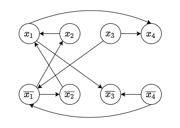
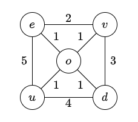

# Solution for Problem Set 10

## 201300035 方盛俊

## Problem 1

**伪代码:**

```python
# 全局的哈希表, 用于缓存数据, 保证最后时间复杂度为 O(|V|+|E|)
hash_table = {}

def count_simple_paths(graph, s, t) -> int:
    # 从哈希表中取出, 时间复杂度 O(1)
    if (graph, s, t) in hash_table:
        return hash_table[(graph, s, t)]

    # 主要的计算过程
    sum = 0
    # 对于从 s 出发的每一条边
    for (s, u) in graph:
        if u == t:
            # 基础情况, s 直接与 t 相连, 则加一
            sum += 1
        else:
            # 其他情况, 递归地获取 u 到 t 的简单路径数
            sum += count_simple_paths(graph, u, t)
  
    # 保存到哈希表然后返回
    hash_table[(graph, s, t)] = sum
    return sum

# 计算 s 到 t 的所有简单路径个数并输出
print(count_simple_paths(graph, s, t))
```

**时间复杂度:**

对于所有顶点, 由于哈希表的存在, 每个节点最多只会进行一次主要的计算过程, 并且由于这是一个有向无环图, 所以我们不会重复地计算路径, 这就相当于一个深度优先搜索 DFS.

对于每一条边, 我们只会查询一次, 对于每一个顶点, 主要计算过程也仅会计算一次, 因此最后的时间复杂度为 $O(n+m)$.

## Problem 2

**伪代码:**

```python
# 一个全局的图
graph = init_graph()
# 初始化一个空列表, 用于存放所有的强连通分量 scc
# 每一个 scc 都是一个并查集
all_scc = []

def DFSAll(graph):
    # 对所有节点基于 finish_time 逆序排序
    # graph.nodes.sort(key=lambda u: -u.finish_time)
    # 此时已经是排好序的了
    # 初始化
    for u in graph.nodes:
        u.color = colors.WHITE
        u.parent = None
    # 对于可行的每一个节点进行 DFS
    for u in graph.nodes:
        if u.color == colors.WHITE:
            # 初始化一个 scc 并查集
            scc = make_set(u)
            DFS(graph, u, scc)
            all_scc.append(scc)


def DFS(graph, s, scc):
    s.color = colors.GRAY
    # 对于与 s 连接的每一条边
    for (s, v) in graph.edges:
        if v.color == colors.WHITE:
            v.parent = s
            DFS(graph, v)
    s.color = colors.BLACK
    # 加入并查集 scc, 代表同一个强连通分量
    scc.union(s)
      
# 1. 对 graph.reverse() 进行 DFS, 并且记录所有的完成时间 finish_time,
#    在记录的时候逆序记录为 graph
graph = DFS_and_record_finish_times(graph.reverse())

# 2. 计算所有的强连通分量和连通图的所有边
DFSAll(graph, pre_process)

# 3. 新建一个图
new_graph = init_graph()

# 4. 对于每一个连通分量, 从头至尾连接称为一个圈
for scc in all_scc:
    for i in range(len(scc)):
        new_graph.add_edge((scc.get(i), scc.get((i + 1) % len(scc))))

# 5. 然后遍历 graph 的每一条边, 加入连通图的所有边, 即可得到满足题意的图 G'
for (e, p) in graph.edges:
    # u, v 是对应强连通分量的代表性顶点
    u = e.find()
    v = p.find()
    if u != v and (u, v) not in new_graph:
        new_graph.add_edge((u, v))

# 6. 输出新的图 G'
print(new_graph)
```

**正确性:**

因为想要形成一个强连通分量, 就至少要形成一个环, 对于 $n$ 个顶点就至少需要 $n$ 条边. 而要保证有相同的连通图, 就还需要统计各个强连通分量连接的边, 并在后面不重复地加入.

最后我们生成的图就能够满足题目中的三个条件了.

**时间复杂度:**

1. 记录所有完成时间, 执行了一次 DFS, 时间复杂度为 $O(|V|+|E|)$
2. 计算所有强连通分量和连通图边, 再次执行了一次 DFS, 时间复杂度为 $O(|V|+|E|)$
3. 新建图, 时间复杂度为 $O(1)$
4. 对于每一个强连通分量, 从头至尾连成圈, 时间复杂度为 $O(|V|)$
5. 遍历所有边并加入连通图的所有边, 时间复杂度为 $O(|E|)$
6. 输出新的图, 时间复杂度为 $O(1)$

因此总的时间复杂度为 $O(|V|+|E|)$

## Problem 3

**(a)**

将每一个交叉路口建模为有向图的顶点, 交叉路口之间的单向路建模成为顶点之间的单向边. 接下来的问题就变成了, 是否存在一条路径, 从任意一个顶点到达另一个顶点.

这个问题可以在线性时间内完成, 只需要用 Problem 2 也提到过的计算强连通分量 SCC 的方法, 判断最后的强连通分量是否只有一个, 就能在线性的 $O(|V|+|E|)$ 的时间内解决这个问题.

**(b)**

依旧是同 (1) 的建模方法, 这个问题等价于认为, 市政厅对应的顶点处于一个汇点 SCC 内部, 即从这个汇点任意一点任意行动, 总能回到这一点中.

判断市政厅是否处于汇点 SCC 中, 依旧能用 (1) 中的线性的 $O(|V|+|E|)$ 时间的算法计算.


## Problem 4

**(a)**



**(b)**

因为我们已知 $\alpha\lor \beta=(\bar{\alpha}\to \beta)\land (\bar{\beta}\to \alpha)$

那么我们往途中添加的有向边就可以视作蕴含关系. 如果一个连通分量中包含了 $x$ 和 $\bar{x}$, 那么就说明存在着路径 $x\to \cdots\to \bar{x}\to \cdots\to x$,

进而有 $x\leftrightarrow \bar{x}$, 但是这个关系是不可能成立的, 因此 $I$ 不存在可满足的赋值.

**(c)**

我们使用构造性算法将其中一个满足题意的赋值序列构造出来:

1. 使用 DFS 的方式找出每一个节点对应的强连通分量 SCC, 并构造出对应连通图;
2. 遍历所有节点, 如果有相抵的文字存在同一个 SCC 中, 就返回失败;
3. 将连通图, 一个有向无环图, 使用 DFS 进行逆拓扑排序, 这一步也可以在第一步中就生成好;
4. 从拓扑排序的顺序, 对于每一个仍未有真值赋值的部分, 所有文字赋值 `True`, 其相反的部分则自动为赋值为 `False`.
5. 返回最后生成的赋值序列.

这也是 (d) 中我们使用的算法.

由拓扑排序与偏序集的性质可知, 若文字 $x$ 被赋值了 `True`, 那么经过它的蕴含链则均已设为 `True`; 若文字 $x$ 被赋值了 `False`, 那么经过它的蕴含链则均已设为 `False`. 于是这个构造就满足了题意.

**(d)**

``` python
def two_satisfy(graph):
   # 1. 执行两次 DFS, 并且给每一个节点使用并查集的方式确定对应 SCC, 并生成连通图
   component_graph = execute_two_DFS_and_setting_scc(graph)

   # 2. 遍历所有节点, 如果同一个文字节点和其相反的文字节点有着相同 SCC, 就说明不成立
   for u in graph.nodes:
       if u.scc == u.reverse.scc:
           return None

    # 3. 对所有的 SCC 进行逆拓扑排序
    component_graph = reversed(topological_sort(component_graph))

    # 4. 按照拓扑排序的顺序依次给文字赋值
    for u in component_graph.nodes:
        if u.value == None and u.reverse.value = None:
            u.value = True
            u.reverse.value = False

    # 5. 返回赋值序列
    return component_graph.nodes
```

1. 相当于 DFS 的时间复杂度, $O(n+m)$
2. 遍历所有节点, $O(n)$
3. 逆拓扑排序, $O(n+m)$
4. 遍历所有节点并赋值, $O(n)$

因此总时间复杂度为 $O(n+m)$, 满足题意.


## Problem 5

**(a)**

假设有两棵不同的最小生成树 $T_1$ 和 $T_2$, 令 $S$ 作为 $T_1$ 和 $T_2$ 中不同边组成的集合, 从 $S$ 中取出权值最小的边 $e_1$, 不失一般性, 不妨认为 $e_1\in T_1$

由最小生成树的性质可知, $T_2\cup \{e_1\}$ 会产生一个环, 在这个环中取出一条不属于 $T_1$ 的边 $e_2$, 易知 $e_2\in S$, 结合题目中的每条边的权值不同的条件, 那么我们有 $w(e_1)<w(e_2)$

我们知道 $T_3=T_2\cup \{e_1\} / \{e_2\}$ 也是一棵生成树, 而且我们又有 $w(e_1)<w(e_2)$, 因此 $w(T_3)<w(T_2)$, 与 $T_2$ 是一棵最小生成树的说法矛盾

因此每条边权值不同的图, 最小生成树唯一.

**(b)**


如图所示, 有着权值同为 $1$ 的边, 但是最小生成树却是唯一的.

**(c)**

不同意, 反例如下:



最外层的循环的最小边没有被包括在最小生成树里.


## Problem 6

**伪代码:**

``` python
# 用于存储最大生成树的边的列表
max_spanning_tree_edges = []

# 随机挑选顶点 x, 开始最大生成树的生成
x = graph.pick_an_arbitrary_node()

for u in graph.nodes:
    u.dist = INF
    u.parent = None
    u.in = False

x.dist = 0
queue = build_a_priority_queue_based_on_dist()

while not queue.is_empty():
    u = queue.extract_max()
    u.in = True
    max_spanning_tree_edges.append((u.parent, u))
    for (u, v) in graph.edges:
        if v.in == false and w(u, v) < v.dist:
            v.parent = u
            v.dist = w(u,v)
            queue.update(v, w(u, v))

# 获取了所有边之后, 去除在最大生成树中的边
# 剩下的边就满足要求了
feedback_edges_set = set(graph.edges) - set(max_spanning_tree_edges)
```

**时间复杂度:**

基于二叉堆的最大生成树的时间复杂度与 Prim 算法的时间复杂度相同, 均为 $O(|E|\log |V|)$

若使用更快的优先队列实现, 速度还能进一步提升.


## Problem 7

**(a)**

``` python
def decrease(graph, tree, edge, new_weight):
    if edge in tree:
        # 如果边在树中, 可以不做任何处理, 树依旧是一个最小生成树
        return tree
    else:
        # 如果边不在树中, 树有可能不再是最小生成树了
        # 先将这条边加入到树中
        tree.add(edge)
        # 用 BFS 找出形成的环
        circle = BFS_to_find_circle(tree, edge)
        # 从环中找出权值最大的边, 并将其删除
        tree.remove(max(circle, key=lambda e: w(e)))
        return tree
```

**(b)**

``` python
def increase(graph, tree, edge, new_weight):
    if edge in tree:
        # 如果边在树中, 可以不做任何处理, 树依旧是一个最小生成树
        # 先将这条边从树中去除
        tree.add(edge)
        # 用 BFS 给每一个点确定对应的子树
        (u, v) = edge
        BFS_to_confirm_subtree(tree, u, v)
        # 然后找出所有连接子树 tree_u 和 tree_v 的边
        edges = [(s, t) for (s, t) in tree.edges if s.subtree != t.subtree]
        # 从环中找出权值最小的边, 并将其加入树中
        tree.add(min(edges, key=lambda e: w(e)))
        return tree
    else:
        # 如果边不在树中, 可以不做任何处理, 树依旧是一个最小生成树
        return tree
```
