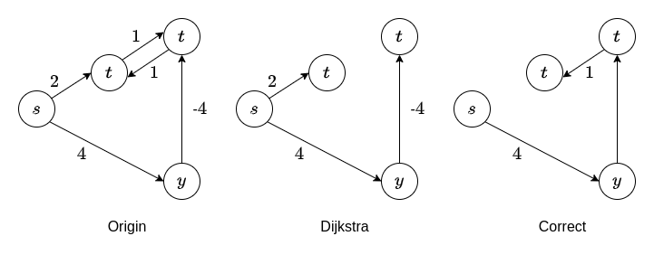
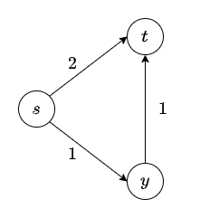
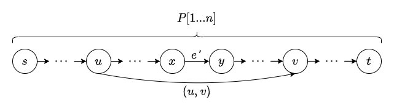
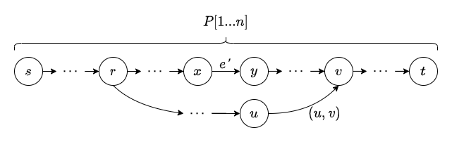
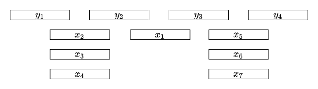

# Solution for Problem Set 11

## 201300035 方盛俊

## Problem 1

**(a)**

对于从 s 开始:

|     | s        | t      | y      | x          | z          | R           |
| --- | -------- | ------ | ------ | ---------- | ---------- | ----------- |
| 1   | (0, NIL) | (4, s) | (5, s) | (INF, NIL) | (INF, NIL) | {s}         |
| 2   | (0, NIL) | (4, s) | (5, s) | (10, t)    | (INF, NIL) | {s, t}      |
| 3   | (0, NIL) | (4, s) | (5, s) | (9, y)     | (11, y)    | {s, t, y}   |
| 4   | (0, NIL) | (4, s) | (5, s) | (9, y)     | (11, y)    | {s, t, y, x}|
| 5   | (0, NIL) | (4, s) | (5, s) | (9, y)     | (11, y)    |{s, t, y, x, z}|

对于从 z 开始:

|     | z        | x      | s      | t          | y          | R           |
| --- | -------- | ------ | ------ | ---------- | ---------- | ----------- |
| 1   | (0, NIL) | (1, z) | (3, z) | (INF, NIL) | (INF, NIL) | {z}         |
| 2   | (0, NIL) | (1, z) | (3, z) | (INF, NIL) | (INF, NIL) | {z, x}      |
| 3   | (0, NIL) | (1, z) | (3, z) | (7, s)     | (8, s)     | {z, x, s}   |
| 4   | (0, NIL) | (1, z) | (3, z) | (7, s)     | (8, s)     | {z, x, s, t}|
| 5   | (0, NIL) | (1, z) | (3, z) | (7, s)     | (8, s)     | {z, x, s, t, y}|

**(b)**



**(c)**




## Problem 2

对于一条最优路径上的节点 $s\to u\to \cdots\to v\to  t$,

我们要最大化成功率 $\max\{r(s,u)\times \cdots\times r(v,t)\}$,

即最大化 $\max\{\log r(s,u)+ \cdots+ \log r(v,t)\}$,

再取反, 则变为最小化 $\min\{(-\log r(s,u))+ \cdots+ (-\log r(v,t))\}$,

即可用 Dijkstra 算法求解.

``` python
def w(u, v):
    return - math.log(r(u, v))

def dijkstra(graph, s, t):
    for u in graph.vertices:
        u.dist = inf, u.parent = None
    s.dist = 0
    que = build_priority_queue_based_on_dist(graph)
    while not que.empty():
        u = que.extract_min()
        # 如果已经计算到 t 了, 就可以直接返回 t 了
        if u == t:
            return t
        for (u, v) in graph.edges:
            if v.dist > u.dist + w(u, v):
                v.dist = u.dist + w(u, v)
                v.parent = u
                que.decrease_key(v)

# 将找到的路径输出
print_path(dijkstra(graph, s, t))
```

## Problem 3

**(a)**



1. 先从顶点 `s` 开始, 跑一次 dijkstra 算法, 给每一个顶点 `v` 初始化好 `v.dist` 和 `v.parent`, 我们也得到了从 `s` 到 `t` 的最短路径 `P`, 用时 $O(|V|+|E|)$.
2. 我们通过 `t.parent` 这类数据, 初始化一个最短路径数组 `P`, 数组保存路径上所有顶点, 其中 `P[0]` 为 `s` 顶点, `P[n]` 为 `t` 顶点, 用时 $O(|V|)$.
3. 我们遍历除了路径 $P$ 以外的每一条边 `(u, v)`, 由题意 `P` 包含所有顶点可知 `u` 和 `v` 一定在 `P` 中, 其中 `u` 靠近 `s`, 而 `v` 靠近 `t`. 我们知道, 如果我们删除了 `e'`, `e'` 是路径 `P[u -> v]` 上的任意一条边, 那么边 `(u, v)` 就有可能取代 `P[u -> v]`, 使得 `P[s -> u] + (u, v) + P[v -> t]` 称为新的最短路径. 因此我们称 `(u, v)` 是 `e'` 的一条 "候选边".
4. 我们需要为每一条边 `(u, v)`, 更新 `P[u -> v]` 上的每一条边 `e'` 的 "候选边", 但是直接进行这两个循环可能会使得算法复杂度接近 $O(|E|\cdot |V|)$, 所以要采取其他策略来更新 "候选边". 我们使用线段树这个数据结构, 使用懒惰标记来进行区间 `(u,v)` 内部候选边的修改, 则每一次更新区间内候选边的时间复杂度就变为 $O(\log |V|)$. 其中我们更新区间信息的策略为: 我们计算 `value = w(u, v) - (v.dist - u.dist)`, 则 `value` 代表了我们采用这个候选边的话, 会使得最终的最短路径距离变大多少. 则我们就可以根据 `value` 来判断每个区间是否要保存当前的候选边, 我们始终保证对于 `e'` 来说我们保存的候选边 `value` 最小. 这个过程用时 $O(|E|\log |V|)$.
5. 最后, 我们就依次删除每一条边 `e`, 获取最终的最短路径: 如果删除的 `e` 并不是原来的最短路径 `P` 上的边, 那么 `P` 就仍然是最短路径 (用时 $O(1)$); 如果删除的 `e` 是 `P` 上的边, 那么我们就利用线段树, 找出 `value` 最小的候选边 `(u,v)` (用时 $O(\log |V|)$), 然后我们就可以知最后最短路径为 `P[s -> u] + (u, v) + P[v -> t]`. 总用时 $O(|E|\log |V|)$.

因此整个算法最后的时间复杂度为 $O(|V|+|E|\log |V|)$ 即 $O((|V|+|E|)\log |V|)$.

**(b)**



我们仍然可以采用大体上与 (a) 相同的算法. 只不过有几个地方有点区别:

1. 我们依然是跑一次 dijkstra 算法, 获取所有顶点 `v` 的 `v.dist` 和 `v.parent`. 并且我们给顶点加一个 `v.ancestor = None` 属性, 供后续使用.
2. 依然是初始化从 `s` 到 `t` 的最短路径数组 `P[1...n]`.
3. 依旧是遍历每一条边, 但是我们通过判断选出 `v` 在 `P` 中的边 `(u,v)`, 但我们并不能保证 `u` 在 `P` 中, 那么我们就一直重新遍历 `u.parent` 直到达到一个节点 `r`, 并且 `r` 在 `P` 中. 之后, 更新 `u` 到 `r` 的所有 `ancestor` 为 `r`. 这个过程有点像并查集中的路径压缩. 之后我们对于每个边 `(u, v)`, 就能直接将其转换为等价的边 `(r, v)`, 并且 `r` 和 `v` 均在 `P` 中, 进而继续使用 (a) 中的算法. 因为每个节点的 `ancestor` 只会被赋值一次, 所以最后整个过程的时间复杂度依然是 $O(|E|\log|V|)$.

因此整个算法最后的时间复杂度为 $O(|V|+|E|\log |V|)$ 即 $O((|V|+|E|)\log |V|)$.

## Problem 4

**(a)**

不正确.

反例:

$y[2, 3], z[4, 5], x[1, 6]$

**(b)**

不正确.

反例:

$y[2, 3], z[4, 5], x[1, 6]$

**(c)**

正确.

**(d)**

不正确.

反例:

$y_1[1, 3], y_2[4, 6], y_3[7, 9]$

$x_1[3, 4], x_2[6, 7]$

**(e)**

不正确.

反例:



**(f)**

不正确.

反例:

$y_1[1, 3], y_2[4, 6], y_3[7, 9]$

$x_1[3, 4], x_2[6, 7]$

**(g)**

不正确.

反例:


**(h)**

正确.


## Problem 5

**伪代码:**

``` python
def set_cover(L, R):
    # 按照左值升序的顺序将所有区间排序并转换成数组 A,
    # A[i] 对应排序后的第 i 个区间
    L, R = sort_by_increasing_order_of_L(L, R)
    A = transform(L, R)
    # 将左值最小的区间 A[1] 先加入到集合中
    SOL = { A[1] }
    # 保存上一次加入的区间
    last = A[1]
    # 保存下一个可能要加入的区间
    a = None
    for i in range(1, n + 1):
        # 如果当前区间的左值小于等于上一次加入区间的右值
        if A[i].left <= last.right:
            # 考虑要不要更新 a
            # 如果 A[i] 的右值超过了上一次加入区间的右值
            if A[i].right > last.right:
                # 并且也大于之前猜测的可能要加入区间的右值
                if a == None or A[i].right > a.right:
                    # 那就作为一个新候选区间
                    a = A[i]
        else:
            # 如果当前区间的左值大于上一次加入区间的右值
            # 说明是时候加入新区间到 SOL 了
            # 如果下一个可能要加入的区间为 None
            if a == None:
                # 那就直接加入 A[i] 吧
                SOL.add(A[i])
                # 更新 last
                last = A[i]
            else:
                # 区间不为 None, 那就将其加入
                SOL.add(a)
                # 更新 last
                last = a
                # 重置 下一个可能要加入的区间
                a = None
                # i 自减, 再考虑一遍这个区间
                # 因为 last 更新了, 并且 a = None, 
                # 所以不会重复判断这个区间超过两次
                i = i - 1
    # 在结束之前, 再将候选区间加进去
    if a != None:
        SOL.add(a)
    # 并且把 A[n], 最后一个区间加入
    SOL.add(A[n])
```

**时间复杂度:**

1. 排序用时 $O(n\log n)$
2. 一共循环 $n$ 次, 因此循环用时 $O(n)$

因此这个贪心算法最后的总时间复杂度为 $O(n\log n)$

**正确性:**

先证明 `A[1]` 一定是最优结果的一部分.

因为要覆盖所有区间, 如果 `OPT(S)` 不包括 `A[1]`, 那么 `A[1]` 的左端点就不会被包括在 `OPT(S)` 中, 与题设产生矛盾. 因此 `A[1]` 一定是最优结果的一部分.

同理, `A[n]` 也一定是最优结果的一部分.

再证明我们之后加入区间 `A[i]` 或 `a` (对应两种情况) 也是最优结果的一部分.

假设区间之间有空隙, 那么一定能根据这个空隙划分成为两个子问题, 这对应于候选区间 `a = None` 的情况, 我们通过直接加入 `A[i]`, 因为 `A[i]` 一定是第二个子问题的第一个区间, 因此 `A[i]` 也是最优结果的一部分.

假设区间之间没有空隙, 对于最优结果 `OPT(S)` 中的任意一个中间区间 `opt_a`, 它一定与上一个区间 `last` 接壤, 即 `opt_a.left < last.right`, 那么我们根据伪代码, 可知 `a` 的右值一定大于 `opt_a` 的右值, 即 `a.right > opt_a.right`, 即 `OPT(S) U {a}` 覆盖了 `{opt_a}`.

这说明我们有 `OPT(S) / {opt_a} U {a}` 也依然是一个最优解, 即有 `a` 也是最优结果的一部分.

综上所述, 伪代码的正确性可证.


## Problem 6

**(a)**

令 `n = 3`, 三枚硬币面值分别为 `c[1] = 1`, `c[2] = 3`, `c[3] = 4`.

那么如果我们要找 `6` 元的零钱, 使用上述的贪心算法, 我们取出的硬币为 `c[3], c[1], c[1]`, 一共三枚.

但是我们其实可以取出 `c[2], c[2]`, 这样只需要两枚. 说明这个贪心算法并不总是正确的.

**(b)**

解法 1:

其实我们可以将任何价值的零钱, 例如为 $n$, 表示成一个 $b$ 进制的数. 这个贪心算法, 其实就相当于将 $n$ 转化为 $b$ 进制的数, 并将各位上的数字加起来, 就是最后所需要的硬币枚数.

原因是, 对于 $b$ 进制的 $m$ 位数, 必定有 $100\cdots 0 > 0XX\cdots X$, 因此对于该贪心算法的结果, 我们不可能进一步地缩减硬币枚数.

解法 2:

假设我们有一个不同于贪心算法的最优的结果 $B$, 我们将其依照面值从大到小重新排序.

我们不妨认为和我们使用贪心算法得出来的结果相比, 从第 1 位开始不同, 否则我们就将前面相同的硬币抛到一边即可, 也就是说, 我们使用贪心算法得到的结果 $A[1]$ 的面值大于 $B[1]$ ~ $B[m]$, 即 $A[1]>B[i], i=1,2,\cdots,m$. 

并且根据题意我们可知, $A[1]\leqslant \sum_{i=1}^{m}A[i]=\sum_{i=1}^{m}B[i]$

我们假设对于 $B[i]$, 每个面值为 $b^{q}$ 的硬币均不超过 $b-1$ 个, 设 $A[1]=b^{k+1}$

但是 $\sum_{i=1}^{m}B[i]\leqslant \sum_{q=0}^{k}(b-1)b^{q}=b^{k + 1} - 1<b^{k+1}=A[1]$, 产生矛盾.

因此对于 $B[i]$ 存在面值为 $b^{q}$ 的硬币超过 $b-1$ 个, 那么我们将这超过 $b-1$ 个的硬币个数设为 $x$, 那么我们可以将其换成 $1$ 个 $b^{q+1}$ 面值的硬币和 $x-q$ 个面值 $b^{q}$ 的硬币, 这样硬币总和数就减少了 $x-(1+x-q)=q-1\geqslant b-1\geqslant 1$ 个硬币.

因此这与 $B$ 是一个最优结果的假设不符. 因此贪心算法在此处就是最优的算法.


