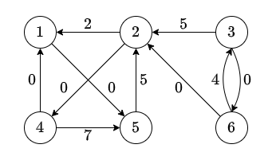

# Solution for Problem Set 12

## 201300035 方盛俊

## Problem 1

**(a)**

|        | z.dist | z.parent | x.dist | x.parent | s.dist | s.parent | t.dist | t.parent | y.dist | y.parent |
| ------ | ------ | -------- | ------ | -------- | ------ | -------- | ------ | -------- | ------ | -------- |
| pass 1 | 0      | NIL      | 9      | z        | 2      | z        | 8      | s        | 9      | s        |
| pass 2 | 0      | NIL      | 6      | y        | 2      | z        | 7      | x        | 9      | s        |
| pass 3 | 0      | NIL      | 6      | y        | 2      | z        | 4      | x        | 9      | s        |
| pass 4 | 0      | NIL      | 6      | y        | 2      | z        | 4      | x        | 9      | s        |

**(b)**

|        | r.dist | r.prnt | s.dist | s.prnt | t.dist | t.prnt | x.dist | x.prnt | y.dist | y.prnt | z.dist | z.prnt |
| ------ | ------ | ------ | ------ | ------ | ------ | ------ | ------ | ------ | ------ | ------ | ------ | ------ |
| iter 1 | 0      | NIL    | 5      | r      | 8      | r      | INF    | NIL    | INF    | NIL    | INF    | NIL    |
| iter 2 | 0      | NIL    | 5      | r      | 7      | s      | 11     | s      | INF    | NIL    | INF    | NIL    |
| iter 3 | 0      | NIL    | 5      | r      | 7      | s      | 11     | s      | 11     | t      | 9      | t      |
| iter 4 | 0      | NIL    | 5      | r      | 7      | s      | 11     | s      | 10     | x      | 9      | t      |
| iter 5 | 0      | NIL    | 5      | r      | 7      | s      | 11     | s      | 10     | x      | 8      | y      |
| iter 6 | 0      | NIL    | 5      | r      | 7      | s      | 11     | s      | 10     | x      | 8      | y      |


## Problem 2

**(a)**

开始:

|     | v1  | v2  | v3  | v4  | v5  | v6  |
| --- | --- | --- | --- | --- | --- | --- |
| v1  | 0   | INF | INF | INF | -1  | INF |
| v2  | 1   | 0   | INF | 2   | INF | INF |
| v3  | INF | 2   | 0   | INF | INF | -8  |
| v4  | -3  | INF | INF | 0   | 3   | INF |
| v5  | INF | 7   | INF | INF | 0   | INF |
| v6  | INF | 5   | 12  | INF | INF | 0   |

第 1 次外层循环后:

|     | v1  | v2  | v3  | v4  | v5  | v6  |
| --- | --- | --- | --- | --- | --- | --- |
| v1  | 0   | INF | INF | INF | -1  | INF |
| v2  | 1   | 0   | INF | 2   | 0   | INF |
| v3  | INF | 2   | 0   | INF | INF | -8  |
| v4  | -3  | INF | INF | 0   | -4  | INF |
| v5  | INF | 7   | INF | INF | 0   | INF |
| v6  | INF | 5   | 12  | INF | INF | 0   |

第 2 次外层循环后:

|     | v1  | v2  | v3  | v4  | v5  | v6  |
| --- | --- | --- | --- | --- | --- | --- |
| v1  | 0   | INF | INF | INF | -1  | INF |
| v2  | 1   | 0   | INF | 2   | 0   | INF |
| v3  | 3   | 2   | 0   | 4   | 2   | -8  |
| v4  | -3  | INF | INF | 0   | -4  | INF |
| v5  | 8   | 7   | INF | 9   | 0   | INF |
| v6  | 6   | 5   | 12  | 7   | 5   | 0   |

第 3 次外层循环后:

|     | v1  | v2  | v3  | v4  | v5  | v6  |
| --- | --- | --- | --- | --- | --- | --- |
| v1  | 0   | INF | INF | INF | -1  | INF |
| v2  | 1   | 0   | INF | 2   | 0   | INF |
| v3  | 3   | 2   | 0   | 4   | 2   | -8  |
| v4  | -3  | INF | INF | 0   | -4  | INF |
| v5  | 8   | 7   | INF | 9   | 0   | INF |
| v6  | 6   | 5   | 12  | 7   | 5   | 0   |

第 4 次外层循环后:

|     | v1  | v2  | v3  | v4  | v5  | v6  |
| --- | --- | --- | --- | --- | --- | --- |
| v1  | 0   | INF | INF | INF | -1  | INF |
| v2  | -1  | 0   | INF | 2   | -2  | INF |
| v3  | 1   | 2   | 0   | 4   | 0   | -8  |
| v4  | -3  | INF | INF | 0   | -4  | INF |
| v5  | 6   | 7   | INF | 9   | 0   | INF |
| v6  | 4   | 5   | 12  | 7   | 3   | 0   |

第 5 次外层循环后:

|     | v1  | v2  | v3  | v4  | v5  | v6  |
| --- | --- | --- | --- | --- | --- | --- |
| v1  | 0   | 6   | INF | 8   | -1  | INF |
| v2  | -1  | 0   | INF | 2   | -2  | INF |
| v3  | 1   | 2   | 0   | 4   | 0   | -8  |
| v4  | -3  | 3   | INF | 0   | -4  | INF |
| v5  | 6   | 7   | INF | 9   | 0   | INF |
| v6  | 4   | 5   | 12  | 7   | 3   | 0   |

第 6 次外层循环后:

|     | v1  | v2  | v3  | v4  | v5  | v6  |
| --- | --- | --- | --- | --- | --- | --- |
| v1  | 0   | 6   | INF | 8   | -1  | INF |
| v2  | -1  | 0   | INF | 2   | -2  | INF |
| v3  | -4  | -3  | 0   | -1  | -5  | -8  |
| v4  | -3  | 3   | INF | 0   | -4  | INF |
| v5  | 6   | 7   | INF | 9   | 0   | INF |
| v6  | 4   | 5   | 12  | 7   | 3   | 0   |


**(b)**

所有节点之间的最短路径距离值:

|     | v1  | v2  | v3  | v4  | v5  | v6  |
| --- | --- | --- | --- | --- | --- | --- |
| v1  | 0   | 6   | INF | 8   | -1  | INF |
| v2  | -1  | 0   | INF | 2   | -2  | INF |
| v3  | -4  | -3  | 0   | -1  | -5  | -8  |
| v4  | -3  | 3   | INF | 0   | -4  | INF |
| v5  | 6   | 7   | INF | 9   | 0   | INF |
| v6  | 4   | 5   | 12  | 7   | 3   | 0   |

每个节点的 $h$ 值:

|     | z   | v1  | v2  | v3  | v4  | v5  | v6  |
| --- | --- | --- | --- | --- | --- | --- | --- |
| h   | 0   | -4  | -3  | 0   | -1  | -5  | -8  |

因此更新的边权重为:




## Problem 3

**(a)**

定义 `v.paths` 为以 `v` 为终止顶点的所有路径数目, 并定义 `v.parents` 为以 `v` 终止的所有边的另一个顶点的集合.

我们知道, 对于 `v` 顶点来说, 以它为终止顶点的所有路径, 应该是以它为终止的所有边数, 加上 `v.parents` 每个元素的 `v.parent.paths` 的和.

同时, 我们使用 `v.paths` 来进行动态规划 (记答案).

``` python
# 1. 找出唯一的 source s 和 sink t
s, t = (None, None)
for u in graph.vertices:
    # 初始化 is_source 和 is_sink
    u.is_source = True
    u.is_sink = True
    # 初始化 paths 和 parents
    # paths 还可以用来记答案
    u.paths = None
    u.parents = []
for (u, v) in graph.edges:
    # 设定 is_sink 和 is_source
    u.is_sink = False
    v.is_source = False
    # 顺便设定 v.parents
    v.parents.append(u)
for u in graph.vertices:
    # 找出 source 和 sink
    if u.is_source:
        s = u
    if u.is_sink:
        t = u

# 使用 sum 保存所有路径数
sum = 0

# 2. 从 t 开始, 动态规划与递归地获取 paths
def calculate_paths(u):
    if u.paths != None:
        # 已经计算过了, 直接返回
        return u.paths
    elif u.parents == []:
        # parents 为空, 即为 source, 没有 parents, 返回 0 即可
        return 0
    else:
        # 主要的调用与计算
        # 对 parents 的 paths 求和, 更新 paths, 记录答案
        u.paths = sum([calculate_paths(v) + 1 for v in u.parents])
        # 通过 sum 记录一下, 每个 paths 不为空的顶点只会记录一次
        sum += u.paths
        # 然后返回
        return u.paths

calculate_paths(t)

# 输出 sum, 即所有路径的总数
print(sum)
```

时间复杂度:

因为 1. 可以很简单地看出, 三个循环分别遍历了顶点, 边, 顶点, 因此时间复杂度为 $O(|V|+|E|)$; 而 2. 虽然是递归的, 但是每一个顶点最多只会进行一次主要的调用与计算, 而且每个顶点对应的 `parents` 的个数和即是边数总和, 因此时间复杂度也是 $O(|V|+|E|)$.

因此总的时间复杂度为 $O(|V|+|E|)$.

**(b)**

理同 (a), 我们定义 `v.start_time` 为最早的开始时间.

``` python
# 1. 找出唯一的 source s 和 sink t
s, t = (None, None)
for u in graph.vertices:
    # 初始化 is_source 和 is_sink
    u.is_source = True
    u.is_sink = True
    # 初始化 start_time 和 parents
    # paths 还可以用来记答案
    u.paths = None
    u.parents = []
for (u, v) in graph.edges:
    # 设定 is_sink 和 is_source
    u.is_sink = False
    v.is_source = False
    # 顺便设定 v.parents
    v.parents.append(u)
for u in graph.vertices:
    # 找出 source 和 sink
    if u.is_source:
        s = u
    if u.is_sink:
        t = u

# 2. 从 t 开始, 动态规划与递归地获取 start_time
def calculate_start_time(u):
    if u.start_time != None:
        # 已经计算过了, 直接返回
        return u.start_time
    elif u.parents == []:
        # parents 为空, 即为 source, 没有 parents, 返回 0 即可
        return 0
    else:
        # 主要的调用与计算
        # 对 parents 的 start_time 加上顶点权重 (持续时间) 得出结束时间,
        # 求最大值, 更新 start_time, 记录答案
        u.start_time = max([calculate_start_time(v) + w(v) for v in u.parents])
        # 然后返回
        return u.start_time

calculate_start_time(t)

# 输出 graph
print(graph)
```

**(c)**

我们只需要将每一条边的方向逆转, 要求的最晚开始时间就变为 "结束时间", 即 "开始时间" + "持续时间" (当然, 要用总时间减去这个值).

``` python
# 1. 复制一份图, 并将边方向全部逆转
graph_reversed = copy_graph_and_reverse_all_edges(graph)

# 2. 使用 (b) 中的算法计算逆转图的所有开始时间, 并返回总时间
total_time = calculate_start_time_with_graph(graph_reversed)

# 3. 对原来的图的每一个节点, 根据其匹配的节点, 计算最终最迟开始时间
for u, u_reversed in zip(graph.vertices, graph_reversed.vertices):
    u.latest_start_time = total_time - (u_reversed.start_time + w(u_reversed))

# 输出 graph
print(graph)
```

可以看出, 1. 的时间复杂度为 $O(|V|+|E|)$, 2. 的时间复杂度为 $O(|V|+|E|)$, 3. 的时间复杂度为 $O(|V|)$, 因此总的时间复杂度仍然为 $O(|V|+|E|)$.


## Problem 4

因为题目给出所有边的权重均为负数, 我们仅仅需要判断有没有环, 就能判断有没有负环.

我们可以使用 DFS 算法来计算出所有的 SCC, 我们可以认为, 超过一个节点的 SCC 就形成了环, SCC 内部节点之间均为 $-\infty$, 然后可以使用拓扑排序后的 Component Graph 进行 DAG-APSP, 进行相应处理即可. 

**伪代码:**

``` python
# 一个用来保存距离的全局字典
dist = {}

# 1. 初始化每个点对之间的距离为正无穷
for u in graph.vertices:
    dist[u] = +infty

# 给 s 自身 dist 设为 0
dist[s] = 0

# 2. 通过 DFS 计算出 SCC, 并获取 component_graph
component_graph = computing_scc_by_dfs(graph)

# 3. 找出 s 所在的 scc, 可以通过 DFS 搜索
base_scc = search_scc_for_node(s)

# 4. 如果 base_scc 多于一个顶点, 那就直接从 s 开始 dfs,
#    把所有可以到达的点的距离全设为 -infty
if len(base_scc) > 1:
    dfs_and_set_all_dist_negative_infty(s)
else:
    # 5. 否则就对 component_graph 这个 DAG 图进行拓扑排序
    component_graph = topological_sort(component_graph)

    # 6. 进行 DAG-SSSP 处理
    for scc in component_graph.vertices.begin_with(base_scc):
        if len(scc.vertices) == 1:
            # 如果 SCC 中顶点数唯一, 说明没有形成负环, 可以照常处理
            for (scc, aft_scc) in component_graph.edges:
                if len(aft_scc) == 1:
                    # 如果 aft_scc 也只有一个顶点, 则是正常情况, 进行更新
                    if dist[aft_scc] > dist[scc] + w(scc, aft_scc):
                        dist[aft_scc] = dist[scc] + w(scc, aft_scc)
                else:
                    # 不然 aft_scc 就形成了负环, 直接设为 -infty,
                    # 且只有当 base_scc 与 scc 连通时才更新
                    if dist[scc] != +infty:
                        for v in aft_scc.vertices:                   
                            dist[v] = -infty
        else:
            # 如果 SCC 中顶点数不唯一, 说明形成负环, 要给对应路径全设为 -infty
            for (scc, aft_scc) in component_graph.edges:
                # 并且连通, 则设为负无穷
                if dist[scc.vertices[0]] != +infty:
                    dist[u, v] = -infty
```

**正确性:**

一开始所有点的距离被设置成为 $+\infty$, 然后我们通过 DFS 找到了所有的 SCC, 然后我们分了两种方式进行讨论: 如果 s 所在 SCC 成环, 就将 s 能够到达的所有顶点的距离都设为了 $-\infty$, 这种情况易知正确; 如果 s 所在 SCC 不成环, 那么我们经过拓扑排序后, 就可以进行一次常见的 DAGSSSP 算法, 对于单顶点组成的 SCC 由 DAGSSSP 的算法正确性即可知正确, 而对于多顶点的 SCC, 如果 s 与其相连, 我们就将多顶点的 SCC 内部节点也设置成了 $-\infty$, 在后续中, 对于 "单 -> 多 -> 单" 这样的情况, 我们知道 $-\infty$ 加上任何数依然等于 $-\infty$, 因此也是正确的.

**时间复杂度:**

1. 初始化所有点的字典, 时间复杂度为 $O(|V|)$
2. 通过 DFS 计算 SCC, 时间复杂度为 $O(|V|+|E|)$
3. 通过 DFS 找出 `base_scc`, 时间复杂度为 $O(|V|+|E|)$
4. 通过 DFS 设定 $-\infty$, 时间复杂度为 $O(|V|+|E|)$
5. 通过 DFS 进行拓扑排序, 时间复杂度为 $O(|V|+|E|)$
6. 对每一个 SCC 进行 DAG-SSSP 处理, 可以看出, 每个 SCC 最多只会被访问一次, 且每个 SCC 最多只会对其他 SCC 根据边进行一次判断与更新, 即原图中每个顶点最多只会访问其他所有顶点一次, 那么总时间复杂度为 $O(|V|^{2})$.

所以最后的总时间复杂度为 $O(|V|^{2})$.


## Problem 5

**(a)**

令 $C$ 是这一个负环.

$\therefore \sum_{(i, j)\in C}w_{ij}=\sum_{(i, j)\in C}(r\cdot c_{ij}-p_{j})=r\cdot \sum_{(i, j)\in C}c_{ij}-\sum_{(i, j)\in C}p_{j}<0$

$\therefore \displaystyle r<\frac{\sum_{(i,j)\in C}p_{j}}{\sum_{(i,j)\in C}c_{ij}}=r(C)\leqslant r^{*}$

即有 $r<r^{*}$

**(b)**

令 $C$ 为任意一个环.

$\therefore \sum_{(i, j)\in C}w_{ij}=\sum_{(i, j)\in C}(r\cdot c_{ij}-p_{j})=r\cdot \sum_{(i, j)\in C}c_{ij}-\sum_{(i, j)\in C}p_{j}>0$

$\therefore \displaystyle r>\frac{\sum_{(i,j)\in C}p_{j}}{\sum_{(i,j)\in C}c_{ij}}=r(C)$ 对于所有的环 $C$, 也包括了最大环 $C^{*}$, 且 $r(C^{*})=r^{*}$


$\therefore \displaystyle r>\frac{\sum_{(i,j)\in C^{*}}p_{j}}{\sum_{(i,j)\in C^{*}}c_{ij}}=r(C^{*})=r^{*}$

$\therefore r>r^{*}$

**(c)**

<!-- 其实完全用不到二分查找. 不管最后这个算法再怎么简单, 基本上也需要进行一次图搜索 (否则不可能确定所找到的答案是否满足 $r(C) \geqslant r^{*} - \epsilon$ 这个条件), 即该问题时间复杂度的下界为 $O(|V|+|E|)$.

所以如果我们能够提出一个算法, 这个算法能够在时间 $O(|V|+|E|)$ 的时间内完成所有环的查找与判断, 那么我们就根本不需要进行二分查找.

我们使用以下算法来找出所有环, 并判断其是否满足最优利润开销比:

1. 对该有向图的进行 DFS, 找出最后完成的顶点, 该顶点就位于一个 source SCC, 记该顶点为 `s`.
2. 因为这个图是一个连通图, 我们从 `s` 开始 DFS, 一定能遍历完所有边, 并且由于是 DFS, 每时每刻仅有一条路径上的顶点全为 `GRAY`.
3. 我们在从 `s` 开始 DFS 时, 对路径上的每个节点都计算两个属性: `v.p_sum` 和 `v.c_sum`, 分别代表了 $\sum_{(i,j) \in \text{path}(s, v)}p_{i}$ 和 $\sum_{(i, j)\in \text{path}(s,v)}c_{ij}$.
4. 当前节点为 `v`, 进行下一次拓展时, 如果该节点 `u` 颜色是 `GRAY`, 说明形成了一个环, 这个环为 `u -> v -> u`, 我们可以通过 `v.p_sum - u.p_sum + p(v)` 在常数时间内计算出这个环的 $\sum_{(i, j)\in C}p_{i}$, 通过 `v.c_sum - u.c_sum + c(v, u)` 算出这个环的 $\sum_{(i, j)\in C}c_{ij}$, 进而求出这个环的 $r(C)$, 然后我们更新一个全局的 `max_r`.
5. 最后我们找到了 `max_r`, 即题中的 $r^{*}$, 最大利润开销比. 这时候我们再进行一次 DFS, 方式如上, 并且在找到对应的节点后, 通过队列的 `que.pop()` 操作, 取出这个对应的环. 于是我们就在 $O(|V|+|E|)$ 的时间开销内完成了这个问题的解答, 因为 $r^{*}\geqslant r^{*}-\epsilon$ 是一定成立的.

``` python
def find_maximum_radio_cycle(graph, epsilon):

    # 1. 通过 DFS 找出位于 source SCC 的一个顶点 s
    s = find_source_scc_node_by_dfs(graph)

    # 用于保存最优 r 的变量 max_r
    max_r = 0

    # 用于进行主要的 DFS 找出对应的边,
    # 通过 max_r 是否等于零判断是哪次 DFS
    def calculate_r_by_dfs(graph, s, max_r):
        # 一个用于保存的新全局 r
        new_max_r = 0
        for u in graph.vertices:
            u.color = WHITE
        # 初始化 s 节点的 color, p_sum 和 c_sum
        s.color = GRAY
        s.p_sum = 0
        s.c_sum = 0
        que = init_LIFO_queue()
        que.enque(s)
        while not que.empty():
            v = que.deque()
            v.color = BLACK
            for (v, u) in graph.edges:
                # 颜色等于 GRAY, 说明形成了环
                if u.color == GRAY:
                    p_sum = v.p_sum - u.p_sum + p(v)
                    c_sum = v.c_sum - u.c_sum + c(v, u)
                    r = p_sum / c_sum
                    # 如果这个 max_r 不等于 0 且 max_r == r
                    if max_r != 0 and max_r == r:
                        # 就不断 deque 以获取这个环
                        cycle = [v]
                        while que.top() != u:
                            cycle.append(que.deque())
                        cycle.append(u)
                        cycle.reverse()
                        # 然后直接返回 max_r 和这个 cycle
                        return max_r, cycle
                    # 不然就继续更新全局 new_max_r
                    new_max_r = max(new_max_r, r)
            for (v, u) in graph.edges:
                # 颜色等于 WHITE, 照常拓展
                if u.color == WHILE:
                    u.color = GRAY
                    # 更新 p_sum 和 c_sum
                    u.p_sum = v.p_sum + p(v)
                    u.c_sum = v.c_sum + c(v, u)
                    que.enque(u)
        # 搜索所有环完毕, 返回最大的 new_max_r
        return new_max_r

    # 2. 进行 DFS, 找到最大的 max_r
    max_r = calculate_r_by_dfs(graph, s, max_r)

    # 3. 进行 DFS, 找到对应的环
    max_r, cycle = calculate_r_by_dfs(graph, s, max_r)

    # 返回 max_r 和这个环
    return max_r, cycle
```

可以看出, 我们在 $O(|V|+|E|)$ 即 $O(|V|^{2})$ 的时间内完成了这个问题的求解, 且满足 $r(C)\geqslant r^{*}-\epsilon$. -->

算法思路是:

1. 遍历一遍所有的边, 找出最大的权重边, 即题目中提到的 $R$, 然后 $0$ 作为初始下界 $m$, $R$ 作为初始上界 $M$.
2. 开始循环二分查找, 令 $r = (m + M) / 2$.
3. 通过 Floyd-Warshall 算法计算出所有点对的最短距离, 其中各边权重为 `lambda i, j: r * c(i, j) - p(j)`.
4. 利用得出来的点对之间的距离矩阵, 通过点对两两配对的方式, 找出最小环的总权重. 根据这个权重判断, 如果权重小于 $0$, 则更新下界: `m = r`; 否则更新上界 `M = r`.
5. 直到 `M - m <= epsilon`, 说明 $m \geqslant M - \epsilon\geqslant r^{*}-\epsilon$, 我们又有 C 的最小环 $m\cdot \sum c_{ij}-\sum p_{j}<0$ 即 $\displaystyle \frac{\sum p_{j}}{\sum c_{ij}}>m\geqslant r^{*}-\epsilon$, 我们找到的最小环即是我们需要的环, 就可以终止循环了.
6. 最后使用 Floyd-Warshall 算法计算出 `m` 对应的最小环, 即可得出答案.

``` python
def FloydWarshallAPSP(graph, fn):
    # 用来记录距离
    dist = {}
    # 用于保存中间节点, 便于后续查找环
    middle_node = {}
    for (u, v) in product(graph.vertices, graph.vertices):
        if (u, v) in graph.edges:
            dist[u, v, 0] = fn(u, v)
        else:
            dist[u, v, 0] = infty
    for r in range(1, n + 1):
        x = graph.vertices
        for (u, v) in product(graph.vertices, graph.vertices):
            dist[u, v, r] = dist[u, v, r - 1]
            if dist[u, v, r] > dist[u, x[r], r - 1] + dist[x[r], v, r - 1]:
                dist[u, v, r] = dist[u, x[r], r - 1] + dist[x[r], v, r - 1]
                middle_node[u, v, r] = x[r]
    return dist[:, :, n], middle_node

def binary_search(graph, epsilon):
    # 1. 遍历所有边获取 R
    R = max([p(j) / c(i, j) for (i, j) in graph.edges])
    
    # 初始化 m, M
    m = 0
    M = R

    # 2. 开始二分查找
    while M - m > epsilon:

        r = (m + M) / 2

        # 3. 通过 FloydWarshallAPSP 和 lambda i, j: r * c(i, j) - p(j) 计算最小环
        dist = FloydWarshallAPSP(graph, lambda i, j: r * c(i, j) - p(j))

        # 4. 顶点两两配对, 找出最小环的权值
        min_weight = infty
        for (u, v) in product(graph.vertices, graph.vertices):
            if min_weight > dist[u, v] + dist[v, u]:
                min_weight = dist[u, v] + dist[v, u]

        # 通过判断其是大于零还是小于零, 进行更新上界或下界
        if min_weight < 0:
            m = r
        else:
            M = r

    # 6. 再进行一次对最小值 m 的计算, 找出最小环, 然后返回
    cycle = FloydWarshallAPSP_and_find_minimum_cycle(graph,
        lambda i, j: m * c(i, j) - p(j))

    return cycle
```

时间复杂度:

1. 遍历所有边获取 $R$, 耗时 $O(|E|)$, 即 $O(|V|^{2})$
2. 开始二分查找, 进入一次执行 $\log R - \log \epsilon$ 遍的循环
3. 通过 FloydWarshallAPSP 计算所有顶点之间最小距离, 耗时 $O(|V|^{3})$
4. 顶点两两配对, 找出最小环权值, 耗时 $O(|V|^{2})$
5. 跳出循环之后, 最后进行一次 FloydWarshallAPSP 并找出最小环, 耗时 $O(|V|^{3})$

因此总的时间复杂度为 $O(|V|^{3}(\log R - \log \epsilon))$


## Problem 6

**(a)**

基本思路是, 当剩下的燃料不够跑到下一个站点时, 就在这个站点换一次电池.

``` python
# 用于保存当前剩余燃料 (单位, 还能行驶多少公里)
fuel = 0
# 更换了多少次燃料 (电池)
count = 0

for i in range(1, n):
    # 如果燃料不足
    if fuel < D[i + 1] - D[i]:
        # 换一次电池, 剩余里程数重置
        fuel = 100
        # 计数加一
        count += 1
    
    # 然后驾过这个站点
    fuel -= (D[i + 1] - D[i])

# 输出这个贪心算法的最小更换电池次数
print(count)
```

可以看出, 这个算法十分简单, 而且循环只进行了 $n-1$ 次, 循环内部时间开销为 $O(a)$, 因此总时间复杂度为 $O(n)$.

**(b)**

假设 `D = [0, 80, 90, 110], C = [1, 1, 2, 1]`.

可以看出, 如果使用我们的贪心算法的话, 将会在 `D[3] = 90, C[3] = 2` 处更换电池, 因此总开销为 `1 + 2 = 3`.

而我们其实可以在 `D[2] = 80, C[2] = 1` 处更换电池, 总开销为 `1 + 1 = 2`, 低于贪心算法的 `3`.

**(c)**

我们可以递归地去研究, 定义 $\mathrm{cost}(n)$ 为达到第 $n$ 个站点时的总开销.

可以看出, 我们想要能够到达 $n$, 就必须在 $(n - k) \sim (n - 1)$ 这 $k$ 个站点中更换一次电池, 其中 $D[n] - D[n - k]$ 恰好小于等于 $100$. (当然, 如果这个范围包括了 $1$ 这个节点, 就可以直接终止, 选择 $1$).

写为递推表达式可以表示为:

$\displaystyle \mathrm{cost}(n)=\begin{cases} 0, & n = 1 \\ \displaystyle \min_{D[n]-D[n-k] \leqslant 100}[\mathrm{cost}(n - k)+C[n-k]], & n > 1 \end{cases}$

伪代码:

``` python
# 用来动态规划的数组
cost = [0 for _ in range(n + 1)]

# 用来记录最终站点的数组
stat = [0 for _ in range(n + 1)]

# 主循环, 从 2 到 n
for i in range(2, n + 1):
    # 记录最小结果
    min_cost = +infty
    min_station = None
    # 倒过来找, 以减小时间开销
    k = 1
    while i - k >= 1 and D[i] - D[i - k] <= 100:
        if cost[i - k] + C[i - k] < min_cost:
            min_cost = cost[i - k] + C[i - k]
            min_station = i - k
        k += 1
    # 纪录开销
    cost[i] = min_cost
    # 记录站点
    stat[i] = min_station

# 遍历 stat 获取答案
print(get_ans(stat))
print(cost[n])
```

对时间复杂度进行分析, 我们可以看出, 一个大的循环内部套了一个小的循环, 大循环执行了 $n-1$ 次, 且小循环的执行次数也不会超过 $n-1$ 次, 最后的总时间开销为 $O(n^{2})$.


## Problem 7

我们定义 $p(A)$ 为 $A$ 对应的所有划分数. 

经过分析, 我们可以写出递推关系式子:

$\displaystyle p(A)=\begin{cases} 1, & \mathrm{len}(A) = 0 \\ \displaystyle \sum_{i=0}^{n-1}[\mathrm{p(A[1...i])\times IsWord}(A[(i+1)...n])], & \mathrm{len}(A) \neq 0 \end{cases}$

因此对应的伪代码为 (以下以 `0` 为基, 以 `1` 为基同理):

``` python
# A = 'ARTISTOIL'
# n = len(A)

# def IsWord(s):
#     return s == 'ART' or s == 'IS' or s == 'TOIL' or s == 'ARTIST' or s == 'OIL'

# 用于动态规划的数组
p = [0 for _ in range(n + 1)]

# 初始化 p[0]
p[0] = 1

# 主循环
for k in range(1, n + 1):
    sum = 0
    for i in range(0, k):
       if IsWord(A[i : k]):
           sum += p[i]
    p[k] = sum

# 输出最后结果
print(p[n])
```

时间复杂度:

外层主循环一共执行了 $n$ 次, 并且里面有一层小循环, 执行次数不会超过 $n$ 次, 内层小循环每一次调用一次 `IsWord(A[i : k])`, 因此最后的总时间复杂度为 $O(n^{2})$.

