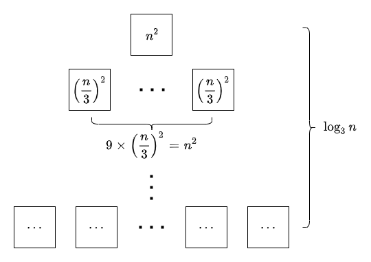

# Solution for Problem Set 2

## 20130005 方盛俊

## Problem 1

**(a)**

Let $L$ be the linked list.

<pre class="pseudocode">
\begin{algorithm}
\caption{Reversing Linked List}
\begin{algorithmic}

\FUNCTION{Reversed}{$L$}
    \STATE head = $L$.getHead()
    \STATE tail = head
    \WHILE{tail.next is not null}
        \STATE tail = tail->next
    \ENDWHILE
    \FOR{i = 1 \TO n}
        \STATE tail.next = \&head
        \STATE tail = head
        \STATE head = head->next
        \STATE $L$.setHead(head)
    \ENDFOR
    \STATE tail.next = null
\ENDFUNCTION

\end{algorithmic}
\end{algorithm}
</pre>

**(b)**

**Overview:**

We use `x.np` to simulate `x.next` and `x.prev`. Define `x.np = x.prev ⊕ x.next` so that we can get `x.prev` by `x.np ⊕ x.next` and get `x.next` by `x.np ⊕ x.prev`. We save a default node $S$ named sentinel to simplify the operation. We define `S.np = &head ⊕ &tail`. And we need the list $L$ provide (or save) $S$ and the head of list. 

**Algorithm:**

Let $S$ be the **sentinel** and $L$.getHead() be the head of the link. If there are nothing in $L$, $L$.getHead() will be $S$ itself.

<pre class="pseudocode">
\begin{algorithm}
\caption{Insert}
\begin{algorithmic}

\FUNCTION{Insert}{x, i}
    \STATE last = $S$
    \STATE curr = $L$.getHead()
    \STATE isNewHead = (i == 1)
    \IF{i > $L$.size() / 2}
        \STATE curr = *($S$.np $\oplus$ \&head)
        \STATE i = $L$.size() - i + 2
    \ENDIF
    \WHILE{i $\neq$ 1}
        \STATE next = *(curr.np $\oplus$ \&last)
        \STATE last = curr
        \STATE curr = next
    \ENDWHILE
    \STATE x.np = \&last $\oplus$ \&curr
    \STATE last.np = last.np $\oplus$ \&curr $\oplus$ \&x
    \STATE curr.np = curr.np $\oplus$ \&last $\oplus$ \&x
    \IF{isNewHead}
        \STATE $L$.setHead(x)
    \ENDIF
    \STATE $L$.setSize($L$.size() + 1)
\ENDFUNCTION

\end{algorithmic}
\end{algorithm}
</pre>

<pre class="pseudocode">
\begin{algorithm}
\caption{Delete}
\begin{algorithmic}

\FUNCTION{Delete}{i}
    \STATE last = $S$
    \STATE curr = $L$.getHead()
    \IF{i == 1}
        \STATE $L$.setHead(*(curr.np $\oplus$ \&last))
    \ENDIF
    \IF{i > $L$.size() / 2}
        \STATE curr = *($S$.np $\oplus$ \&head)
        \STATE i = $L$.size() - i + 2
    \ENDIF
    \WHILE{i $\neq$ 1}
        \STATE next = *(curr.np $\oplus$ \&last)
        \STATE last = curr
        \STATE curr = next
    \ENDWHILE
    \STATE next = *(\&last $\oplus$ curr.np)
    \STATE last.np = last.np $\oplus$ \&curr $\oplus$ \&next
    \STATE next.np = next.np $\oplus$ \&curr $\oplus$ \&last
    \STATE $L$.setSize($L$.size() - 1)
\ENDFUNCTION

\end{algorithmic}
\end{algorithm}
</pre>

## Problem 2

**Overview:**

We save the element $x$ with the current maximum, which makes sure that the top of the stack always is the current maximum. And we still can get the old maximum after twice pop operation.

**Algorithm:**

Let $S$ be the stack.

<pre class="pseudocode">
\begin{algorithm}
\caption{MaxStack}
\begin{algorithmic}

\FUNCTION{Max}{x}
    \IF{$S$.size() > 0}
        \STATE max = $S$.pop()
        \STATE $S$.push(max)
        \RETURN max
    \ELSE
        \RETURN NULL
    \ENDIF
\ENDFUNCTION

\FUNCTION{Push}{x}
    \IF{$S$.size() > 0}
        \STATE max = Max()
        \STATE $S$.push(x)
        \IF{x > max}
            \STATE $S$.push(x)
        \ELSE
            \STATE $S$.push(max)
        \ENDIF
    \ELSE
        \STATE $S$.push(x)
        \STATE $S$.push(x)
    \ENDIF
\ENDFUNCTION

\FUNCTION{Pop}{x}
    \IF{$S$.size() > 0}
        \STATE $S$.pop()
        \RETURN $S$.pop()
    \ELSE
        \RETURN NULL
    \ENDIF
\ENDFUNCTION

\end{algorithmic}
\end{algorithm}
</pre>

**Space Complexity:**

We need to save the element and the current maximum for each pushed element, so the time complexity $S(n)=c_1n+c_2n=(c_1+c_2)n=\Theta(n)$

<!-- ## Problem 3

**Overview:**

We need to find the main operator in an expression and divide it into two part (for $+$ and $\times$ operator) or one part simply (for $!$ operator). If the length of expression is 1, we add it to the array $A[1...n]$, where $n$ is the length of the origin infix expression.

**Algorithm:**

Let $I[1...n]$ be the origin infix expression.

<pre class="pseudocode">
\begin{algorithm}
\caption{Convert}
\begin{algorithmic}

\FUNCTION{Init}{}
    \STATE index = 1
\ENDFUNCTION

\FUNCTION{Add}{x}
    \STATE A[index] = x
    \STATE index = index + 1
\ENDFUNCTION

\FUNCTION{Parse}{begin, end}
    \IF{end == begin}
        \STATE Add(I[begin])
    \ELSE
        \STATE pos = 0
        \STATE factorialBegin = 0
        \STATE factorialEnd = 0
        \COMMENT{The position of the first multiple sign}
        \FOR{i = begin \TO end}
            \IF{I[i] == '+'}
                \STATE Parse(begin, i - 1)
                \STATE Parse(i + 1, end)
                \STATE Add('+')
                \RETURN
            \ELSEIF{I[i] == '$\times$' \AND pos == 0}
                \STATE pos = i
            \ELSEIF{I[i] == '!' \AND pos == 0}
                \IF{factorialBegin == 0}
                    \STATE factorialBegin = i
                \ENDIF
                \STATE factorialEnd = i
            \ENDIF
        \ENDFOR
        \IF{1 < pos < end}
            \STATE Parse(begin, pos - 1)
            \STATE Parse(pos + 1, end)
            \STATE Add('$\times$')
            \RETURN
        \ELSEIF{factorialBegin == begin + 1 \AND factorialEnd == end}
            \FOR{j = begin \TO end}
                \STATE Add($I[j]$)
                \COMMENT{For factorial expression like "2!!!!"}
            \ENDFOR
        \ELSE
            \RETURN NULL
            \COMMENT{Error: Bad Expression}
        \ENDIF
    \ENDIF
\ENDFUNCTION

\FUNCTION{Convert}{$I$}
    \STATE Init()
    \STATE Parse(1, n)
    \RETURN $A$
\ENDFUNCTION

\end{algorithmic}
\end{algorithm}
</pre>

**Time Complexity:** -->

## Problem 3

**Overview:**

Let the input expression array be $I$, create a output array named $O$ and two variances named `formerOp` and `latterOp`. Scan character in the input array $I$ one by one. If current character `ch` is a number or operator $!$, we add it to the output array. If `ch == '+'`, we assign it to `formerOp` when `formerOp` is empty, or we replace with formerOp and add `'*'` to output array when `formerOp == '×'`, or we add `'+'` to output array when `formerOp == '+'`. If `ch == '×'`, we assign it to `formerOp` when `formerOp` is empty, or we assign it to `latterOp` when `formerOp == '+'` and `latterOp` is empty, or we add it to output array when `formerOp == '×'` or `latterOp == '×'`. Finally, we add `latterOp` and `formerOp` to output array. 

**Algorithm:**

Let $I[1...n]$ be the origin infix expression.

<pre class="pseudocode">
\begin{algorithm}
\caption{Convert}
\begin{algorithmic}

\FUNCTION{Convert}{}
    \STATE $O[1...n]$
    \STATE $i = 1$
    \STATE formerOp = null, latterOp = null
    \FOR{ch in $I$}
        \IF{ch is number \OR ch == '!'}
            \STATE $O[i]$ = ch
            \STATE i = i + 1
        \ELSEIF{ch == '+'}
            \IF{formerOp == null}
                \STATE formerOp = '+'
            \ELSEIF{formerOp == '×'}
                \STATE formerOp = '+'
                \STATE $O[i]$ = '×'
                \STATE i = i + 1
            \ELSE
                \STATE $O[i]$ = '+'
                \STATE i = i + 1
            \ENDIF
        \ELSEIF{ch == '×'}
            \IF{formerOp == null}
                \STATE formerOp = '×'
            \ELSEIF{formerOp == '+' \AND latterOp == null}
                \STATE latterOp = '×'
            \ELSE
                \STATE $O[i]$ = '*'
                \STATE i = i + 1
            \ENDIF
        \ENDIF
    \ENDFOR
    \IF{latterOp != null}
        \STATE $O[i]$ = latterOp
        \STATE i = i + 1
    \ENDIF
    \IF{formerOp != null}
        \STATE $O[i]$ = formerOp
    \ENDIF
\ENDFUNCTION

\end{algorithmic}
\end{algorithm}
</pre>

**Time Complexity:**

The running time in the worst case: 

$T(n)=c_1+c_2n+c_3=O(n)$

## Problem 4

**Algorithm $A$:**

- Let $T(n)$ be the runtime of $A$ on instance of size $n$
- Clearly, $T(1)=c_1=\theta(1)$ for some constant $c_1$
- $\displaystyle T(n)=5\cdot T(\frac{n}{2})+c_2\cdot n=5\cdot T(\frac{n}{2})+\Theta(n)$

We guess that $T(n)\leqslant dn^{\lg 5}-d'n$ and use substitution-method.

- Induction Basis: $T(1)=c_1\leqslant d\cdot 1^{\lg 5}-d'\cdot 1$, so long as $d-d'\geqslant c_1$
- Inductive Step: $\displaystyle T(n)=5\cdot T(\frac{n}{2})+c_2\cdot n\leqslant 5(d(\frac{n}{2})^{\lg 5}-d'(\frac{n}{2}))+c_2n= dn^{\lg 5}-(\frac{5}{2}d'-c_2)n \leqslant dn^{\lg 5}-d'n$, so long as $\displaystyle \frac{3}{2}d'\geqslant c_2$

So $T(n)=O(n^{\lg 5})$

**Algorithm $B$:**

- Let $T(n)$ be the runtime of $B$ on instance of size $n$
- Clearly, $T(1)=c=\theta(1)$
- $\displaystyle T(n)=2\cdot T(n-1)+c=\sum_{i=1}^{n}2^{n-1}c=(2^{n}-1)c=O(2^{n})$

**Algorithm $C$:**

- Let $T(n)$ be the runtime of $C$ on instance of size $n$
- $\displaystyle T(n)=9\cdot T(\frac{n}{3})+c\cdot n^{2}$

So $T(n)=9\cdot T(\frac{n}{3})+c\cdot n^{2}=c\cdot n^{2}\log_3n=O(n^{2}\log_3n)$

**Answer:**

Obviously, the algorithm $T_{B}(n)=O(2^{n})$ is much slower than $T_{A}(n)=O(n^{\lg 5})$ and $T_{C}(n)=O(n^{2}\log_3n)$, so we compare the latter two algorithms. Because $\displaystyle \lim_{n \to \infty}\frac{n^{2}\log_3 n}{n^{\log_2 5}}=0$, we think the algorithm $C$ is faster than algorithm $A$. So we choose algorithm $C$.

## Problem 5

**Overview:**

We create an index array $I[1...n] = \{1,...,n\}$, sort the origin array $A[1...n]$ with index array $I$, in the time complexity $O(n\log n)$. Then we remove the duplicates in $A'$ and corresponding indices in $I'$, in the time complexity $O(n\log n)$. Finally, we reorder the new array $A''$ by sorting the new index array $I''$ and get the final result.

**Algorithm:**

Let $A[1...n]$ be the origin array and $I[1...n] = \{1,...,n\}$ be the index array.

<pre class="pseudocode">
\begin{algorithm}
\caption{Remove Duplicates}
\begin{algorithmic}

\FUNCTION{Merge}{leftA, rightA, leftB, rightB}
    \STATE $m$ = length of leftA
    \STATE $m'$ = length of rightA
    \STATE solA[1...($m$+$m'$)], solB[1...($m$+$m'$)]
    \STATE i = 1, j = 1, k = 1
    \WHILE{i <= $m$ + $m'$}
        \IF{k > $m'$ \OR j <= $m$ \AND leftA[j] <= rightA[k]}
            \STATE solA[i] = leftA[j]
            \STATE solB[i] = leftB[j]
            \STATE j = j + 1
        \ELSE
            \STATE solA[i] = rightA[k]
            \STATE solB[i] = rightB[k]
            \STATE k = k + 1
        \ENDIF
        \STATE i = i + 1
    \ENDWHILE
    \RETURN solA[1...($m$+$m'$)], solB[1...($m$+$m'$)]
\ENDFUNCTION

\FUNCTION{MergeSort}{$A$, $B$}
    \IF{n == 1}
        \STATE solA[1...n] = $A$[1...n]
        \STATE solB[1...n] = $B$[1...n]
    \ELSE
        \STATE leftSolA[1...(n/2)], leftSolB[1...(n/2)] = MergeSort($A$[1...(n/2)], $B$[1...(n/2)])
        \STATE rightSolA[1...(n/2)], rightSolB[1...(n/2)] = MergeSort($A$[(n/2+1)...n], $B$[(n/2+1)...n])
        \STATE solA[1...n] = Merge(leftSolA[1...(n/2)], rightSolA[1...(n/2)], leftSolB[1...(n/2)], rightSolB[1...(n/2)])
    \ENDIF
    \RETURN solA[1...n], solB[1...n]
\ENDFUNCTION

\FUNCTION{RemoveDuplicates}{$A$, $I$}
    \IF{n == 1}
        \RETURN $A$
    \ENDIF
    \STATE $A'$, $I'$ = MergeSort($A$, $I$)
    \STATE $A''[1...n]$, $I''[1...n]$
    \STATE length = n
    \STATE index = 1
    \STATE isDuplicated = false
    \STATE curr = $A'[1]$
    \FOR{i = 2 \TO n}
        \IF{curr == A'[i]}
            \IF{isDuplicated == false}
                \STATE length = length - 1
            \ENDIF
            \STATE length = length - 1
            \STATE isDuplicated = true
        \ELSE
            \IF{isDuplicated == false}
                \STATE $A''$[index] = $A'[i - 1]$
                \STATE $I''$[index] = $I'[i - 1]$
                \STATE index = index + 1
            \ENDIF
            \STATE curr = $A'[i]$
            \STATE isDuplicated = false
        \ENDIF
    \ENDFOR
    \IF{isDuplicated == false}
        \STATE $A''$[index] = $A'[n]$
        \STATE $I''$[index] = $I'[n]$
    \ENDIF
    \STATE $I'''$, $A'''$[1...length] = MergeSort($I''$[1...length], $A''$[1...length])
    \RETURN $A'''$[1...length]
\ENDFUNCTION

\end{algorithmic}
\end{algorithm}
</pre>

**Time Complexity:**

- **Merge:** $T_{1}(n)=c_1+c_2n=O(n)$
- **MergeSort:** $\displaystyle T_{2}(n)=2T_2(\frac{n}{2})+T_{1}(n)=T_{1}(n)\log n=O(n\log n)$
- **RemoveDuplicates:** $T_{3}(n)=T_{2}(n)+c_3+c_4(n-1)+c_5+T_{2}(n)=2T_{2}(n)+c_4n+(c_3-c_4+c_5)=O(n\log n)$

So the time complexity is $O(n\log n)$

**Correctness:**

We create an index array $I[1...n] = \{1,...,n\}$, sort the origin array $A[1...n]$ with index array $I$, and then we get the sorted array $A'$ and corresponding index array $I'$. Then we remove the duplicates in $A'$ and corresponding indices in $I'$, and get new array $A''$ with no duplicate and indices $I''$. Finally, we reorder the new array $A''$ by sorting the new index array $I''$ and get the final result array $A'''$ with no duplicate and correct order. 

## Problem 6

**(a)** $(2, 1), (3, 1), (8, 6), (8, 1), (6,1)$

**(b)**

**Answer:**

The running time of insertion sort is $\displaystyle T(n)=c_1n + c_2\left( \sum_{j=2}^{n}t_{j} \right) - c_2$ and $\displaystyle \sum_{j=2}^{n}t_{j}$ is the number of inversions in the input array.

**Prove:**

We know that swapping two adjacent elements in an array, provided that the former is greater than the latter, will only reduce the number of inversions by one. For example, $\{4,3,2,1\}\to \{4,2,3,1\}$, the number of inversions change from $6$ to $5$.

The only one swap operation (equivalently) in insertion sort is the 5-th line `A[i+1] = A[i]` and the 4-th line while-loop statement makes sure that `A[i]` is greater than `A[i+1]` before swapping. The 5-th line statement will be executed $\displaystyle \sum_{j=2}^{n}t_{j}$ times. It means that the number of inversions was reduced $\displaystyle \sum_{j=2}^{n}t_{j}$ times.

Finally, the array is sorted. We know that the number of inversions in the sorted array is zero, which means the number of inversions in the original array is $\displaystyle \sum_{j=2}^{n}t_{j}$. Proof completed.

**(c)**

Let $A$ be the array.

<pre class="pseudocode">
\begin{algorithm}
\caption{CountInversions}
\begin{algorithmic}

\FUNCTION{Merge}{left, right}
    \STATE $m$ = length of left
    \STATE $m'$ = length of right
    \STATE sol[1...($m$+$m'$)]
    \STATE i = 1, j = 1, k = 1
    \STATE count = 0
    \WHILE{i <= $m$ + $m'$}
        \IF{k > $m'$ \OR j <= $m$ \AND left[j] <= right[k]}
            \STATE sol[i] = left[j]
            \STATE j = j + 1
        \ELSE
            \STATE sol[i] = right[k]
            \STATE count = count + k
            \STATE k = k + 1
        \ENDIF
        \STATE i = i + 1
    \ENDWHILE
    \RETURN sol[1...($m$+$m'$)], count
\ENDFUNCTION

\FUNCTION{MergeSort}{$A$}
    \IF{n == 1}
        \RETURN A[1...n], 0
    \ELSE
        \STATE leftSol[1...(n/2)], leftCount = MergeSort($A$[1...(n/2)])
        \STATE rightSol[1...(n/2)], rightCount = MergeSort($A$[(n/2+1)...n])
        \STATE sol[1...n], mergeCount = Merge(leftSol[1...(n/2)], rightSol[1...(n/2)])
        \RETURN sol[1...n], leftCount + rightCount + mergeCount
    \ENDIF
\ENDFUNCTION

\FUNCTION{CountInversions}{$A$}
    \STATE $A'$, count = MergeSort($A$)
    \RETURN count
\ENDFUNCTION

\end{algorithmic}
\end{algorithm}
</pre>