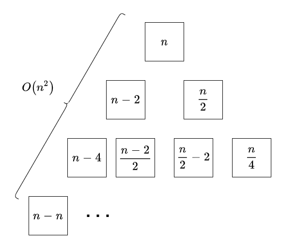
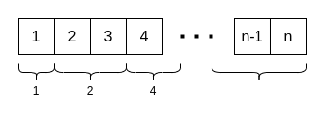

# Solution for Problem Set 3

## 201300035 方盛俊

## Problem 1

**(a)**

Use the substitution method.

We guess that $T(n)\leqslant dn\ln n-d'n, n\geqslant 2$ and use substitution-method.

- Induction Basis: $T(2)=c_1\leqslant d\cdot 2\cdot \lg 2-d'\cdot 2$, so long as $2d-2d'\geqslant c_1$
- Inductive Step: $\displaystyle T(n)=2\cdot T(\frac{n}{2})+ n\leqslant 2(d(\frac{n}{2})\lg \frac{n}{2}-d'(\frac{n}{2}))+n= dn(\lg n - \lg 2)-d'n+n=dn\lg n-d'n+(1-d)n\leqslant dn\lg n-d'n$, so long as $\displaystyle d\leqslant 1$

So $T(n)=O(n\lg n)$

**(b)**

**Sorry, I don't know how to solve the problem. I had tried my best but got nothing out.**

## Problem 2

**(a)**

$\displaystyle \because T(n)=T(\alpha)+T(n-\alpha)+cn=\cdots=\frac{n}{\alpha}\cdot T(\alpha)+c\cdot \frac{\displaystyle (n+0)\cdot \frac{n}{\alpha}}{2}=\frac{c}{2\alpha}\cdot n^{2}+\frac{T(\alpha)}{\alpha}\cdot n$

$\therefore T(n)\in \Theta(n^{2})$

**(b)**

$\therefore T(n)\in \Theta(n\log n)$

## Problem 3

**Overview:**

Because $xy=(2^{\frac{n}{2}}\cdot x_{L}+x_{R})(2^{\frac{n}{2}}\cdot y_{L}+y_{R})=2^{n}\cdot x_{L}y_{L}+2^{\frac{n}{2}}\cdot ((x_{L}+x_{R})(y_{L}+y_{R})-x_{L}y_{L}-x_{R}y_{R})+x_{R}y_{R}$, so the time is $\displaystyle T(n)=3T(\frac{n}{2})+c_1n$. Let the $y = x$ and the time still is $\displaystyle T(n)=3T(\frac{n}{2})+c_1n$.

**Algorithm:**

<pre class="pseudocode">
\begin{algorithm}
\caption{Square}
\begin{algorithmic}

\FUNCTION{FastMulti}{$x$, $y$}
    \IF{x \AND y are both of 1 bit}
        \RETURN $x\times y$
    \ENDIF
    \STATE $x_{L}, x_{R}$ = most, least significant $|x| / 2$ bits of $x$
    \STATE $y_{L}, y_{R}$ = most, least significant $|y| / 2$ bits of $y$
    \STATE $z_1$ = FastMulti($x_{L}$, $y_{L}$)
    \STATE $z_2$ = FastMulti($x_{R}$, $y_{R}$)
    \STATE $z_3$ = FastMulti($x_{L}+x_{R}$, $y_{L}y_{R}$)
    \RETURN $2^{n}\times z_1 + 2^{\frac{n}{2}}\times (z_3-z_1-z_2)+z_2$
\ENDFUNCTION

\FUNCTION{Square}{$x$}
    \RETURN FastMulti($x$, $x$)
\ENDFUNCTION

\end{algorithmic}
\end{algorithm}
</pre>

**Time Complexity:**

**FastMulti / Square:** $\displaystyle T(n)=3T(\frac{n}{2})+c_1n$

We guess that $T(n)\leqslant dn^{\lg 3}-d'n$ and use substitution-method.

- Induction Basis: $T(1)=c_2\leqslant d\cdot 1^{\lg 3}-d'\cdot 1$, so long as $d-d'\geqslant c_2$
- Inductive Step: $\displaystyle T(n)=3\cdot T(\frac{n}{2})+c_1\cdot n\leqslant 3(d(\frac{n}{2})^{\lg 3}-d'(\frac{n}{2}))+c_1n= dn^{\lg 3}-(\frac{3}{2}d'-c_2)n \leqslant dn^{\lg 3}-d'n$, so long as $\displaystyle \frac{1}{2}d'\geqslant c_1$

So $T(n)=O(n^{\lg 3})$

## Problem 4

**Overview:**

Compare $x$ with the $i$-th element and the $i$ increase exponentially by step $i = 2i$. If $x$ is less than $i$-th element, then search it by binary search algorithm, which the max time is $O(\lg n)$, else continue.

**Algorithm:**

Let the array be $A$.

<pre class="pseudocode">
\begin{algorithm}
\caption{Search}
\begin{algorithmic}

\FUNCTION{Search}{$x$}
    \STATE $i$ = 1
    \WHILE{\TRUE}
        \IF{$x$ == $A[i]$}
            \RETURN i
        \ENDIF
        \IF{$A[i / 2] == \infty$}
            \RETURN 0
        \ENDIF
        \IF{$x$ < $A[i]$}
            \RETURN BinarySearch($i / 2$, $i$)
        \ENDIF
        \STATE $i = 2i$
      \ENDWHILE
\ENDFUNCTION

\end{algorithmic}
\end{algorithm}
</pre>

**Time Complexity:**

In the worst case, the $x$ is the last element of array. So the time is $\displaystyle T(n)=c_1\lg n + T_{BinarySearch}(n)=c_1\lg n + O(\lg \frac{n}{2})=O(\lg n)$.

## Problem 5

**Overview:**

We need to find delegate belong to the majority party so that we can introduce him with other delegates to find if they are belong to the same party. In order to find the majority delegate, who smiles to over half persons, we can divide the delegates into two group, and get the majority delegates in the two group, and find the final delegate.

**Algorithm:**

Let $G$ be all delegates.

<pre class="pseudocode">
\begin{algorithm}
\caption{Search}
\begin{algorithmic}

\FUNCTION{CountSmileDelegates}{$x$, group}
    \STATE count = 0
    \FOR{delegate in group}
        \IF{PairwiseMeeting($x$, delegate) == "smile"}
            \STATE count = count + 1
        \ENDIF
    \ENDFOR
    \RETURN count
\ENDFUNCTION

\FUNCTION{GetMajorityDelegate}{group}
    \STATE n = length of group
    \IF{n == 1}
        \RETURN (group[1], 1)
    \ENDIF
    \STATE (left, leftCount) = GetMajorityDelegate(group[1...n/2])
    \STATE (right, rightCount) = GetMajorityDelegate(group[n/2+1...n])
    \STATE leftTotalCount = leftCount + CountSmileDelegates(left, group[n/2+1...n])
    \STATE rightTotalCount = rightCount + CountSmileDelegates(right, group[1...n/2])
    \IF{leftTotalCount >= rightTotalCount}
        \RETURN (left, leftTotalCount)
    \ELSE
        \RETURN (right, rightTotalCount)
    \ENDIF
\ENDFUNCTION

\FUNCTION{GetMajorityPartyDelegates}{}
    \STATE $x$ = GetMajorityDelegate($G$)
    \STATE $l$ = a new list of delegate
    \FOR{delegate in $G$}
        \IF{PairwiseMeeting($x$, delegate) == "smile"}
            \STATE $l$.add(delegate)
        \ENDIF
    \ENDFOR
    \RETURN $l$
\ENDFUNCTION

\end{algorithmic}
\end{algorithm}
</pre>

**Correctness:**

Firstly, we prove that it is impossible that the final delegate is not belong to the majority party. Because more than half of the delegates belong to the same political party, there is one group at least, where more than half of the delegates belong to the same political party, if we divide big group into two small groups. For example, there are $n+1$ delegates belong to the majority party in $2n$ group, we divide them into two groups equally, $\frac{n}{2}+1$ majority delegates in $n$ delegates group, and more than half of $n$ are majority delegates.

So we can get the majority delegate finally.

**Time Complexity:**

Based on the number of "pairwise meetings".

- **CountSmileDelegates:** $\Theta(n)$
- **GetMajorityDelegate:** $T_1(n)=2T_1(\frac{n}{2})+n=n\log n=\Theta(n\log n)$
- **GetMajorityPartyDelegates:** $T_2(n)=T_1(n)+n=n\log n + n=\Theta(n\log n)$
 

## Problem 6

**Overview:**

Using the Find-Maximum-Subarray algorithm in 4.1, but the `conquer` return two values more, which are the position of the first negative number in two sides. So the `combine` can be run in time $\Theta(1)$.

**Algorithm:**

Let the array be $A$.

<pre class="pseudocode">
\begin{algorithm}
\caption{FindMaximumSubarray}
\begin{algorithmic}

\FUNCTION{FindMaximumSubarray}{$A$, low, high}
    \IF{low == high}
        \IF{$A$[low] < 0}
            \RETURN (low, high, low, high, 0, 0, $A$[low])
        \ELSE
            \RETURN (low, high, 0, 0, $A$[low], $A$[low], $A$[low])
        \ENDIF
    \ELSE
        \STATE mid = (low + high) / 2
        \STATE (leftLow, leftHigh, leftLeftNegative, leftRightNegative, leftLeftSum, leftRightSum, leftSum) = 
        \STATE $\qquad$ FindMaximumSubarray($A$, low, mid)
        \STATE (rightLow, rightHigh, rightLeftNegative, rightRightNegative, rightLeftSum, rightRightSum, rightSum) = 
        \STATE $\qquad$ FindMaximumSubarray($A$, mid + 1, high)
        \STATE crossLow = (leftLeftNegative != 0 ? leftRightNegative + 1 : leftLow)
        \STATE crossHigh = (rightRightNegative != 0 ? rightLeftNegative - 1 : rightHigh)
        \STATE crossLeftNegative = the first no-zero number in [leftLeftNegative, leftRightNegative, rightLeftNegative, rightRightNegative]  
        \STATE crossRightNegative = the first no-zero number in [rightRightNegative, rightLeftNegative, leftRightNegative, leftLeftNegative]
        \STATE returnedLeftSum = (leftLeftNegative != 0 ? leftLeftSum : leftLeftSum + rightLeftSum)
        \STATE returnedRightSum = (rightRightNegative != 0 ? rightRightSum : rightRightSum + leftRightSum)
        \STATE crossSum = leftRightSum + rightLeftSum
        \IF{leftSum >= rightSum \AND leftSum >= crossSum}
            \RETURN (leftLow, leftHigh, crossLeftNegative, crossRightNegative, returnedLeftSum, returnedRightSum, leftSum)
        \ELSEIF{rightSum > leftSum \AND rightSum > crossSum}
            \RETURN (rightLow, rightHigh, crossLeftNegative, crossRightNegative, returnedLeftSum, returnedRightSum, rightSum)
        \ELSE
            \RETURN (crossLow, crossHigh, crossLeftNegative, crossRightNegative, returnedLeftSum, returnedRightSum, crossSum)
        \ENDIF
    \ENDIF
\ENDFUNCTION

\end{algorithmic}
\end{algorithm}
</pre>

## Problem 7

**(a)**

Let $H$ be the max-head.

<pre class="pseudocode">
\begin{algorithm}
\caption{SecondLargestElement}
\begin{algorithmic}

\FUNCTION{SecondLargestElement}{$x$}
    \STATE h = $H$.max
    \RETURN h.leftChild > h.rightChild ? h.leftChild : h.rightChild
\ENDFUNCTION

\end{algorithmic}
\end{algorithm}
</pre>

**(b)**

**Overview:**

We create a new max-heap $H$ and insert the maximum of the max-heap $M$ into $H$. Then repeat $k-1$ times the operation: extract maximum from $H$ (which is the $i^{\text{th}}$ largest element) and then insert the left and right child elements of the popped maximum. Finally, the maximum of $H$ is the $k^{\text{th}}$ largest element of $M$.

**Algorithm:**

<pre class="pseudocode">
\begin{algorithm}
\caption{SecondLargestElement}
\begin{algorithmic}

\FUNCTION{kThLargestElement}{$x$}
    \STATE $H$ = a new max-heap
    \STATE $H$.insert($M$.max)
    \FOR{i = 1 \TO k - 1}
        \STATE node = $H$.extractMax()
        \STATE $H$.insert(node.leftChild)
        \STATE $H$.insert(node.rightChild)
    \ENDFOR
    \RETURN $H$.max
\ENDFUNCTION

\end{algorithmic}
\end{algorithm}
</pre>

**Time Complexity:**

$T(n)=c_1+c_2\lg n + (k-1)(c_3\lg (k-t) + 2c_2\lg (k-t))+c_4=O(k\lg k)$