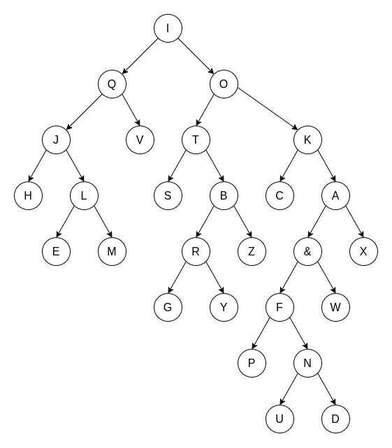
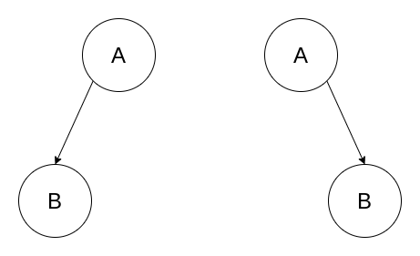
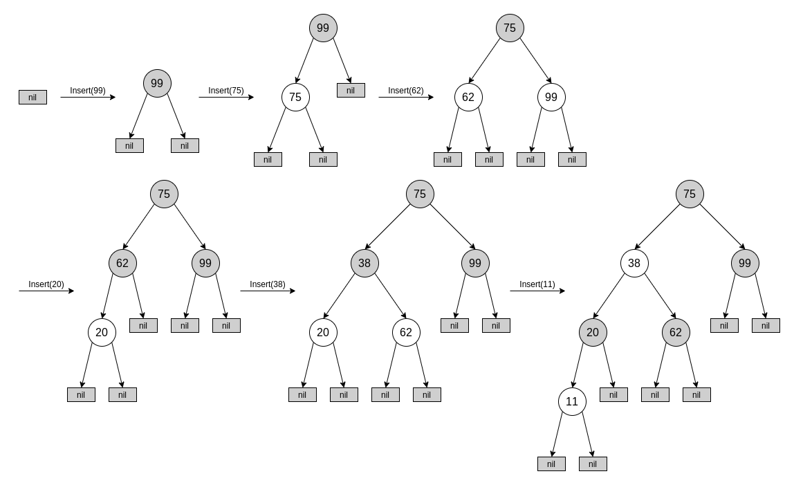
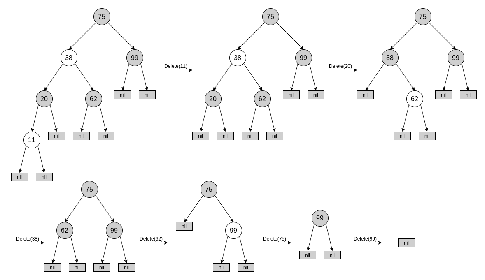
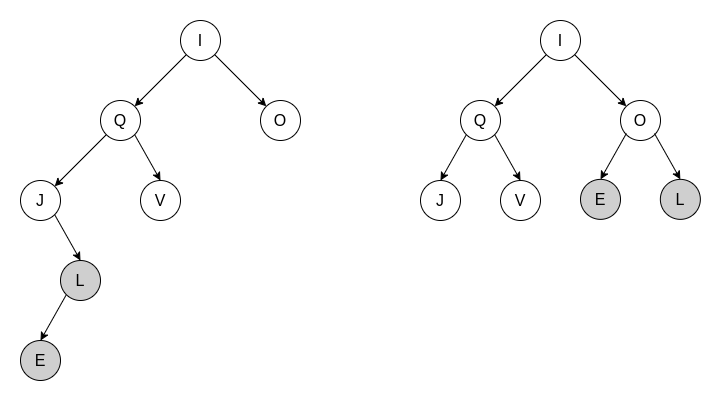

# Solution for Problem Set 6

## 201300035 方盛俊

## Problem 1

**(a)**

**(b)**

**Algorithm:**

We record the tree as $N$ recursively, let the preorder node sequences as FIFO queue be $R$, the postorder node sequences as FIFO queue be $O$.

<pre class="pseudocode">
\begin{algorithm}
\caption{RecursiveReconstruct}
\begin{algorithmic}

\FUNCTION{RecursiveReconstruct}{$N$}
    \IF{R.top() == O.top()}
        \STATE N.data = R.pop()
        \STATE O.pop()
    \ELSE
        \STATE N.data = R.pop()
        \STATE N.leftChild.parent = N
        \STATE RecursiveReconstruct(N.leftChild)
        \STATE N.rightChild.parent = N
        \STATE RecursiveReconstruct(N.rightChild)
        \STATE O.pop()
    \ENDIF
\ENDFUNCTION

\end{algorithmic}
\end{algorithm}
</pre>

**Correctness:**

For a full binary tree, which every non-leaf node has exactly two children, we reconstruct it recursively just like preorder traversal and postorder traversal.

If we only focus on the `R.pop()`, we will find it just replaced `R.push()` into `R.pop()` adapted from code of `PreorderTrav()`, so it is the inverse function of `PreorderTrav()`, it can reconstruct a tree that matches the preorder node sequences. Similarly, the reconstructed tree matches the postorder node sequences.

And the function is not a randomized algorithm, so the answer it produced is unique and correct.

**Time Complexity:**

Each turn of calling the `RecursiveReconstruct()` function will reduce the length of $R$ and $O$ by 1, and the length of $R$ and $O$ is $n$. We can conclude that the function will be called $n$ times.

Because the function's time complexity is $\Theta(1)$, without the recursive statement, the final time complexity is $T(n)=n\cdot \Theta(1)=O(n)$.

**(c)**

The answer of reconstructing an arbitrary binary tree from its preorder and postorder node sequences may be not unique.

For example, the simplest case is that preorder node sequences is `A B`, and the postorder sequences is `B A`. There are two trees meet the conditions:

The $B$ node is the left child of $A$ or the $B$ node is the right child of $A$.

The answer is not unique so that there is no algorithm to reconstruct an arbitrary binary tree from its preorder and postorder node sequences.

## Problem 2

**Algorithm:**

In a height-balanced binary search tree, the difference between the height of the left and right subtrees of every node is never more than 1. In other words, the different between the height of the left and right subtrees of every node is never more than $2^{h-1}$, where $h$ is the height of the tree, which means that `max <= 2 * min + 1`.

So the only thing we are supposed to do is balancing the difference by $O(n)$ rotations.

Let $M$ be the global hash map for storing the count of nodes for each node.

<pre class="pseudocode">
\begin{algorithm}
\caption{Balance}
\begin{algorithmic}

\FUNCTION{InitCount}{$N$}
    \IF{$N$ == NULL}
        \RETURN 0
    \ENDIF
    \STATE count = InitCount($N$.leftChild) + InitCount($N$.rightChild) + 1
    \STATE $M$.set(key = $N$, value = count)
    \RETURN count
\ENDFUNCTION

\FUNCTION{RecursiveBalance}{$N$}
    \STATE leftCount = $M$.get(key = $N$.leftChild)
    \STATE rightCount = $M$.get(key = $N$.rightChild)
    \WHILE{leftCount > 2 * rightCount + 1 \OR rightCount > 2 * leftCount + 1}
        \IF{leftCount > 2 * rightCount + 1}
            \STATE middleCount = $M$.get(key = $N$.leftChild.rightChild)
            \STATE leftLeftCount = $M$.get(key = $N$.leftChild.leftChild)
            \IF{rightCount + middleCount > 2 * leftLeftCount + 1}
                \STATE temp = $N$.leftChild
                \STATE $N$.leftChild = $N$.leftChild.rightChild
                \STATE $M$.set(key = temp, value = rightCount + middleCount + 1)
                \STATE $M$.set(key = temp.leftChild, value = rightCount + leftCount + 1)
                \STATE leftRotation(temp)
            \ELSE
                \STATE $M$.set(key = $N$, value = rightCount + middleCount + 1)
                \STATE $M$.set(key = $N$.leftChild, value = rightCount + leftCount + 1)
                \STATE rightRotation($N$)
                \STATE $N$ = $N$.leftChild
                \STATE leftCount = $M$.get(key = $N$.leftChild)
                \STATE rightCount = $M$.get(key = $N$.rightChild)
            \ENDIF
        \ELSE
            \STATE middleCount = $M$.get(key = $N$.rightChild.leftChild)
            \STATE rightRightCount = $M$.get(key = $N$.rightChild.rightChild)
            \IF{leftCount + middleCount > 2 * rightRightCount + 1}
                \STATE temp = $N$.rightChild
                \STATE $N$.rightChild = $N$.rightChild.leftChild
                \STATE $M$.set(key = temp, value = leftCount + middleCount + 1)
                \STATE $M$.set(key = temp.rightChild, value = leftCount + rightCount + 1)
                \STATE rightRotation(temp)
            \ELSE
                \STATE $M$.set(key = $N$, value = leftCount + middleCount + 1)
                \STATE $M$.set(key = $N$.rightChild, value = leftCount + rightCount + 1)
                \STATE leftRotation($N$)
                \STATE $N$ = $N$.rightChild
                \STATE leftCount = $M$.get(key = $N$.leftChild)
                \STATE rightCount = $M$.get(key = $N$.rightChild)
            \ENDIF
        \ENDIF
    \ENDWHILE
    \STATE RecursiveBalance($N$.leftChild)
    \STATE RecursiveBalance($N$.rightChild)
\ENDFUNCTION

\FUNCTION{Balance}{root}
    \STATE InitCount(root)
    \STATE RecursiveBalance(root)
\ENDFUNCTION

\end{algorithmic}
\end{algorithm}
</pre>

**Time Complexity:**

For each node, we will balance it by the main part of `RecursiveBalance()` function. In the function, we do a loop with severals rotations to make sure that its subtrees be divided into two nearly equal parts. The function `RecursiveBalance()` will rotations several times, which can be divided into two parts, at most `n / 3` times middle rotations (rotations to reduce `middleCount`) and once left rotation or right rotation.

The number of total middle rotations is no more than `n` (because middle count is no more than `n`), and the number of total other rotation is also no more than `n` (because each call of the function will rotation once or none).

So the final time complexity is $T(n)=O(n)+O(n)=O(n)$

## Problem 3

**Algorithm:**

<pre class="pseudocode">
\begin{algorithm}
\caption{Transform}
\begin{algorithmic}

\FUNCTION{RecursiveRotationsToChain}{$N$}
    \WHILE{$N$.leftChild != NULL}
        \STATE temp = $N$
        \STATE $N$ = temp.leftChild
        \STATE rightRotation(temp)
    \ENDWHILE
    \STATE RecursiveRotationsToChain($N$.rightChild)
    \STATE Return $N$
\ENDFUNCTION

\FUNCTION{MoveParentIntoTree}{$N$}
    \IF{$N$.leftChild == NULL \AND $N$.rightChild == NULL}
        \RETURN
    \ENDIF
    \IF{$N$.leftChild == NULL}
        \IF{$N$.data < $N$.rightChild.data}
            \STATE leftRotation($N$)
        \ELSE
            \STATE SwapSubtree($N$)
            \STATE rightRotation($N$)
        \ENDIF
    \ELSE
        \IF{$N$.data < $N$.leftChild.data}
            \STATE rightRotation($N$)
        \ELSE
            \STATE SwapSubtree($N$)
            \STATE leftRotation($N$)
        \ENDIF
    \ENDIF
    \STATE MoveParentIntoTree($N$)
\ENDFUNCTION

\FUNCTION{RecursiveBuildTree}{$N$}
    \IF{$N$.rightChild == NULL}
        \RETURN $N$
    \ENDIF
    \STATE RecursiveBuildTree($N$.rightChild)
    \STATE $N$ = MoveParentIntoTree($N$)
    \RETURN $N$
\ENDFUNCTION

\FUNCTION{Transform}{root}
    \STATE root = RecursiveRotationsToChain(root)
    \STATE RecursiveBuildTree(root)
\ENDFUNCTION

\end{algorithmic}
\end{algorithm}
</pre>

**Time Complexity:**

RecursiveRotationsToChain: $T_1(n)=O(n!)=O(n^{2})$

RecursiveBuildTree: $\displaystyle T_2(n)=O(n!)=O(n^{2})$

$\therefore T(n)=O(n^{2})+O(n^{2})=O(n^{2})$

## Problem 4

**(a)**

**(b)**

## Problem 5

**(a)**

For a tree of height $h$, it at least have two subtrees, whose heights are at least $h-1$ and $h-2$. To get a tree having least $F_{h}$ nodes, we need to make sure that their each subtrees have least $F_{h-1}$ and $F_{h-2}$ nodes.

So we can get a recursion formula:

$F_{h}=\begin{cases} 1 , & h=1 \\ 2, & h=2 \\ F_{h-1}+F_{h-2}+1, & h\geqslant 3 \end{cases}$

The $F_{h}$ is a kind of Fibonacci number.

We want to find the $h$ that meets the condition $n\leqslant F_{h}=F_{h-1}+F_{h-2}+1$

$\therefore n\leqslant 2^{\frac{h}{2}}\leqslant\cdots \leqslant 2F_{h-2}\leqslant F_{h}=F_{h-1}+F_{h-2}+1$

$\therefore h\geqslant 2\log n$

We let $h=2\log n$, then we can make sure that $F_{h}\geqslant n$

So an AVL tree with $n$ nodes has height $O(\log n)$

**(b)**

<pre class="pseudocode">
\begin{algorithm}
\caption{Balance}
\begin{algorithmic}

\FUNCTION{Balance}{x}
    \IF{x.leftChild.h > x.rightChild.h}
        \IF{x.leftChild.leftChild.h < x.leftChild.rightChild.h}
            \STATE leftRotation(x.leftChild)
            \RETURN rightRotation(x)
        \ELSE
            \RETURN rightRotation(x)
        \ENDIF
    \ELSE
        \IF{x.rightChild.rightChild.h < x.rightChild.leftChild.h}
            \STATE rightRotation(x.rightChild)
            \RETURN leftRotation(x)
        \ELSE
            \RETURN leftRotation(x)
        \ENDIF
    \ENDIF
\ENDFUNCTION

\end{algorithmic}
\end{algorithm}
</pre>

**(c)**

<pre class="pseudocode">
\begin{algorithm}
\caption{Insert}
\begin{algorithmic}

\FUNCTION{Insert}{x, z}
    \IF{z.data < x.data}
        \IF{x.leftChild == NULL}
            \STATE x.leftChild = z
        \ELSE
            \STATE Insert(x.leftChild, z)
        \ENDIF
        \IF{x.leftChild.h - x.rightChild.h == 2}
            \STATE x = Balance(x)
        \ENDIF
        \STATE x.h = max(x.leftChild.h, x.rightChild.h) + 1
    \ELSE
        \IF{x.rightChild == NULL}
            \STATE x.rightChild = z
        \ELSE
            \STATE Insert(x.rightChild, z)
        \ENDIF
        \IF{x.rightChild.h - x.leftChild.h == 2}
            \STATE x = Balance(x)
        \ENDIF
        \STATE x.h = max(x.rightChild.h, x.leftChild.h) + 1
    \ENDIF
\ENDFUNCTION

\end{algorithmic}
\end{algorithm}
</pre>

**(d)**

**Time Complexity:**

Because the insert function will call itself recursively, and $T(h)=T(h-1)+\Theta(1)$, where $h$ is the height of $x$. Because of (a), we know that an AVL tree with $n$ nodes has height $O(\log n)$, so $T(n)=O(\log n)$.

In order to prove that we only performs $O(1)$ rotations, we need to analyze how many times the Balance function will be called.

There are two cases, assure we have a node $x$, and $x$.leftChild.h $-$ $x$.rightChild.h $= 2$.

In first case, $x$.parent is height balanced, so the only thing we need to do is doing once `Balance()` on $x$, we can make sure that the final tree is height balanced. We only call `Balance()` once, so we only performs $O(1)$ rotations.

In second case, $x$.parent is also not height balanced. After we `balance(x)`, it is possible that the $x$.parent is still unbalanced, so we need to balance $x$.parent. In this call of `Balance(x.parent)`, we will rotation it and then the tree will return the form as if the first `balance(x)` was not executed. So, we can make sure that `x.leftChild.h - x.rightChild.h == 2` and `x.parent.leftChild.h - x.parent.rightChild.h == 2`, then we rotation the `x.parent`, will make sure that `x.leftChild.h = x.leftChild.h - 1` and `x.parent.rightChild.h = x.rightChild.h + 1`. After it, the tree is height balanced. We only call `Balance()` twice, so we only performs $O(1)$ rotations.

## Problem 6

**(a)**

Each `Meld(Q1, Q2)` will reduce the height of $Q_1$ or $Q_2$, and terminates when $Q_1$ and $Q_2$ are both empty. So we can think the problem can be transformed into the expected length of a random root-to-leaf path in an n-node binary tree, $Q_1$ and $Q_2$. 

We look at the $Q_1$. Let $m$ be the number of nodes of $Q_1$, $E(m)$ be the expected length of a random root-to-leaf path.

$E(m)=\begin{cases} 0, & m=0 \\ 1, & m=1 \\ \displaystyle \frac{1}{2}E(r_{m})+\frac{1}{2}E(m-r_{m}-1)+1, & m\geqslant 2, 0\leqslant r_{m} \leqslant m-1 \end{cases}$

For any node with height $h$, its contribution to $E(m)$ is $\displaystyle \frac{1}{2^{h}}$, which deceases when $h$ increases. 

So we can get $\displaystyle E(m)=\sum_{k=1}^{m}\frac{1}{2^{h_{k}}}$

We know that $\displaystyle \frac{1}{2^{h_{1}}}<\frac{1}{2^{h_{2}}}$, when $h_1>h_2$

As we can see, $E(m)$ of the left tree is smaller than the right tree. So we can know that, for an binary tree with $m$ nodes, $E(m)$ of the full-balanced tree is largest.

So $\displaystyle E(m)\leqslant 1+2\times \frac{1}{2}+4\times \frac{1}{4}+\cdots=\sum_{k=1}^{\log m}1=\log m=O(\log m)$

Finally, the running time of `Meld(Q1, Q2)` is $T(n)=O(\log m)+O(\log (n-m))=O(\log n)$

**(b)**

**MakeQueue:** Return a null node.

**FindMin:** Return `root.key` (except null node).

**DeleteMin:**

<pre class="pseudocode">
\begin{algorithm}
\caption{DeleteMin}
\begin{algorithmic}

\FUNCTION{DeleteMin}{Q}
    \RETURN Meld(Q.left, Q.right)
\ENDFUNCTION

\end{algorithmic}
\end{algorithm}
</pre>

**Insert:**

<pre class="pseudocode">
\begin{algorithm}
\caption{Insert}
\begin{algorithmic}

\FUNCTION{Insert}{Q, x}
    \STATE N = new Node(x)
    \RETURN Meld(Q, N)
\ENDFUNCTION

\end{algorithmic}
\end{algorithm}
</pre>

**DecreaseKey:**

<pre class="pseudocode">
\begin{algorithm}
\caption{DecreaseKey}
\begin{algorithmic}

\FUNCTION{DecreaseKey}{Q, x}
    \STATE Delete x and its subtrees from Q
    \STATE N = Replace x and y with the subtrees
    \RETURN Meld(Q, N)
\ENDFUNCTION

\end{algorithmic}
\end{algorithm}
</pre>

**Delete:**

<pre class="pseudocode">
\begin{algorithm}
\caption{Delete}
\begin{algorithmic}

\FUNCTION{Delete}{Q, x}
    \STATE N = Merge(x.left, x.right)
    \STATE Replace x in Q with N
    \RETURN Q
\ENDFUNCTION

\end{algorithmic}
\end{algorithm}
</pre>

So each of the other meldable priority queue operations can be implemented with at most one call to Meld and $O(1)$ additional time.
