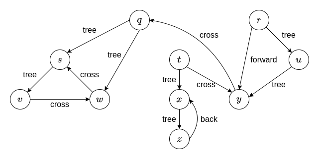
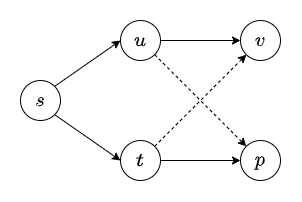
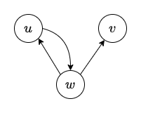

# Solution for Problem Set 9

## 201300035 方盛俊

## Problem 1

**(a)**

BFS 的过程为:

$q\to s\to w\to v$

$r\to u\to y$

$t\to x\to z$

其中各个点的距离和父节点分别为

$\{q.d = 0, q.p=\text{NIL}\}, \{s.d = 1, s.p=q\}, \{w.d = 2, w.p=s\}, \{v.d = 3, v.p=w\}$

$\{r.d = 0, r.p=\text{NIL}\}, \{u.d = 1, u.p=r\}, \{y.d = 2, y.p=u\}$

$\{t.d = 0, t.p=\text{NIL}\}, \{x.d = 1, x.p=t\}, \{z.d = 2, z.p=x\}$

**(b)**

|          | $q$ | $s$ | $v$ | $w$ | $r$  | $u$  | $y$  | $t$  | $x$  | $z$  |
| -------- | --- | --- | --- | --- | ---- | ---- | ---- | ---- | ---- | ---- |
| 发现时间 | $1$ | $2$ | $3$ | $6$ | $9$  | $10$ | $11$ | $15$ | $16$ | $17$ |
| 完成时间 | $8$ | $5$ | $4$ | $7$ | $14$ | $13$ | $12$ | $20$ | $19$ | $18$ |

各个边的分类为

## Problem 2

**(a)**

如图, 该树 (实线) 不可能通过 BFS 构造出来.

因为在发现了 $u$ 和 $t$ 之后, 通过 BFS 构造, $v$, $p$ 要么都和 $u$ 相连, 要么都和 $t$ 相连, 不可能出现 $v$, $p$ 分别连接 $u$, $t$ 的情况.

**(b)**

| i \ j | WHITE                         | GRAY                  | BLACK |
| ----- | ----------------------------- | --------------------- | ----- |
| WHITE | Tree / Back / Forward / Cross | Back / Cross          | Cross |
| GRAY  | Tree / Forward |Tree / Forward / Back | Tree / Forward/ Cross |
| BLACK | Null                          | Back  | Tree / Forward / Back / Cross |

**(c)**

<!-- 当 DFS 算法发现 $u$ 时, 此时只有可能有两种情况, $v$ 被发现了, 或者 $v$ 没有被发现.

对于 $v$ 被发现了的情况, 我们易知 $v.d < u.d < u.f$ 成立.

对于 $v$ 还没有发现的情况,

我们知道, $u$ 到 $v$ 存在一条路径, 因此我们从 $u$ 开始的 DFS 接下来一定会发现节点 $v$, 即 $u$ 是 $v$ 的一个祖先节点.

根据括号定理可知, $[v.d, v.f] \subset [u.d, u.f]$,

则我们可知 $v.d < u.f$ 成立. -->

如图, 存在 $u\to w\to v$ 的路径, 满足题意.

我们从 $w$ 开始执行 DFS, 并且首先探索 $w\to u$, 然后因为 $u$ 不能重新探索 $w$, 因此终止了, 再接着探寻 $w\to v$. 按照这个顺序我们知道:

$w.d = 1, w.f = 6; u.d = 2, u.f = 3; v.d = 4, v.f = 5$

可以看出, 这个例子中 $v.d > u.f$, 可以作为一个反例.

## Problem 3

<pre class="pseudocode">
\begin{algorithm}
\caption{DFS}
\begin{algorithmic}

\FUNCTION{DFSAll}{G}
    \FOR{each node u}
        \STATE u.color = WHITE
        \STATE u.parent = NIL
    \ENDFOR
    \STATE i = 0
    \FOR{each node u}
        \IF{u.color == WHITE}
            \STATE i = i + 1
            \STATE DFS(G, u, i)
        \ENDIF
    \ENDFOR
\ENDFUNCTION

\FUNCTION{DFS}{G, s, cc}
    \STATE s.color = GRAY
    \STATE s.cc = cc
    \FOR{each edge (s, v) in E}
        \IF{v.color == WHITE}
            \STATE v.parent = s
            \STATE DFS(G, u, cc)
        \ENDIF
    \ENDFOR
    \STATE s.color = BLACK
\ENDFUNCTION

\end{algorithmic}
\end{algorithm}
</pre>

## Problem 4

**(a)**

因为树是无回路连通图, 所以在使用 BFS 遍历时, 一定能遍历到树的所有边.

我们从任意一个顶点 $s$ 开始进行 BFS, 就能给每一个顶点赋予一个距离值 $s.d$

按照顶点距离 $v.d$ 的奇偶来区分, 将距离为奇数的顶点分到 $L$ 中, 距离为偶数的顶点分到 $R$ 中.

我们可以看出, 对于任意一个 $L$ 中的顶点 $u$, 与 $u$ 相连的均为偶数顶点, 均在 $R$ 中, 同理 $R$ 中顶点相连的点也均在 $L$ 中.

因此任何树都是一个二部图.

**(b)**

即证明无向图 $G$ 是二部图当且仅当 $G$ 没有奇数条边形成的环.

**$\Rightarrow$:**

我们给位于 $L$ 的顶点涂上蓝色, 位于 $R$ 的顶点涂上红色.

因为 $G$ 是一个二部图, 通过这样给顶点涂鸦, 我们可以保证蓝色顶点不会与蓝色顶点相邻, 红色顶点不会与红色顶点相邻, 即同色顶点不会相邻.

使用反证法, 假设 $G$ 中存在由奇数条边形成的环.

对于这样的环, 我们不断从中一次一次地拿走一对相邻的红蓝顶点, 不会改变剩下的环红蓝相邻的性质. 直到最后只剩下三条边形成的环, 只有三个顶点, 就必然会有两个同色顶点相邻, 产生矛盾.

因此二部图 $G$ 没有奇数条边形成的环.

**$\Leftarrow$:**

基于 (a) 的思路, 我们依然选定一个顶点, 并进行 BFS, 生成一棵树, 并给予每个顶点一个距离值, 并且仍然是奇数顶点位于 $L$, 偶数顶点位于 $R$.

在这棵树的基础上, 我们将原来的图 $G$ 中其他的边加上, 我们只需证明每一条额外的边均为距离相差 $1$ 的奇数顶点和偶数顶点相邻.

对于任意一条额外边 $(u,v)$,

首先我们有额外边距离差不会超过 $1$, 这是很显然的, 因为距离值大于等于 $2$ 的话, BFS 会优先选择这条边.

接下来我们证明 $u, v$ 距离差不会等于 $0$.

我们开始顶点 $s$ 的距离值为 $0$, 它与距离值为 $k$ 的顶点 $u$ 存在一条路径, 易知这条路径上的边数为 $k$. 如果 $u,v$ 同奇偶, 即 $u$ 的距离值等于 $v$, 则加上这条额外边之后, 形成的环 $s-u-v-s$ 就有 $2k+1$ 条边, 是奇数, 与题目中没有奇数条边的环产生矛盾.

因此 $u$, $v$ 的距离差一定为 $1$, 即 $u$, $v$ 一定不会同在 $L$ 或同在 $R$.

即可证明没有奇数条边的环的无向图是二部图.

**(c)**

<pre class="pseudocode">
\begin{algorithm}
\caption{BFS}
\begin{algorithmic}

\FUNCTION{BFS}{G}
    \FOR{each node u}
        \STATE u.color = WHITE, u.dist = INF, u.class = NIL
    \ENDFOR
    \FOR{each node u}
        \IF{u.color == WHITE}
            \STATE u.color = GRAY, u.dist = 0, u.class = R
            \STATE Q.enqueue(u)
            \WHILE{!Q.empty()}
                \STATE v = Q.dequeue()
                \STATE v.color = BLACK
                \FOR{each edge (v, w) in E}
                    \IF{w.color == WHITE}
                        \STATE w.color = GRAY, w.dist = v.dist + 1
                        \STATE Q.enqueue(w)
                    \ELSEIF{w.color == BLACK \AND w.dist == v.dist}
                        \RETURN False
                    \ENDIF
                \ENDFOR
            \ENDWHILE
        \ENDIF
    \ENDFOR
    \RETURN True
\ENDFUNCTION

\end{algorithmic}
\end{algorithm}
</pre>

## Problem 5

令 $M$ 为这个 Number Maze.

<pre class="pseudocode">
\begin{algorithm}
\caption{BFS}
\begin{algorithmic}

\FUNCTION{BFS}{G}
    \STATE colors = a new $n\times n$ array
    \STATE distances = a new $n\times n$ array
    \FOR{each (i, j) in $n\times n$}
        \STATE colors[i][j] = WHITE
    \ENDFOR
    \STATE colors[1][1] = GRAY
    \STATE distances[1][1] = 0
    \STATE Q.enqueue((1,1))
    \WHILE{!Q.empty()}
        \STATE (i, j) = Q.dequeue()
        \STATE colors[i][j] = BLACK
        \STATE distances[i][j] = distance of parent + 1
        \STATE v = M[i][j]
        \IF{(i, j) == (n, n)}
            \RETURN distances[i][j]
        \ENDIF
        \FOR{each (x, y) in [(i, j + v), (i, j - v), (i + v, j), (i - v, j)] within board}
            \IF{colors[x][y] == WHITE}
                \STATE colors[x][y] = GRAY
                \STATE Q.enqueue(w)
            \ENDIF
        \ENDFOR
    \ENDWHILE
    \STATE Print("The maze has no solution.")
    \RETURN Null
\ENDFUNCTION

\end{algorithmic}
\end{algorithm}
</pre>

运行时间等于 BFS 搜索的时间, 即 $O(n^{2}+m)$, $m$ 代表着边数, 易知一个节点最多与四条边相连, 并且只有 $n^{2}$ 个节点, 所以我们认为 $m=O(n^{2})$, 最后时间复杂度为 $O(n^{2})$

## Problem 6

<pre class="pseudocode">
\begin{algorithm}
\caption{BFS}
\begin{algorithmic}

\FUNCTION{BFS}{G}
    \FOR{each node u}
        \STATE u.color = WHITE, u.dist = INF
    \ENDFOR
    \STATE u.color = GRAY, u.dist = 0
    \STATE Q.enqueue(u)
    \WHILE{!Q.empty()}
        \STATE v = Q.dequeue()
        \STATE v.color = BLACK
        \STATE i = v.dist + 1
        \STATE COLOR = (i \% 3 == 0) ? RED : ((i \% 3 == 1) ? WHITE : BLUE)
        \FOR{each edge (v, w) in E}
            \IF{w.color == WHITE \AND edge (v, w) == COLOR}
                \STATE w.color = GRAY, w.dist = v.dist + 1
                \STATE Q.enqueue(w)
            \ENDIF
        \ENDFOR
    \ENDWHILE
\ENDFUNCTION

\end{algorithmic}
\end{algorithm}
</pre>

时间复杂度相当于 BFS, 即 $O(n+m)$, $n$ 是顶点数, $m$ 是边数.

