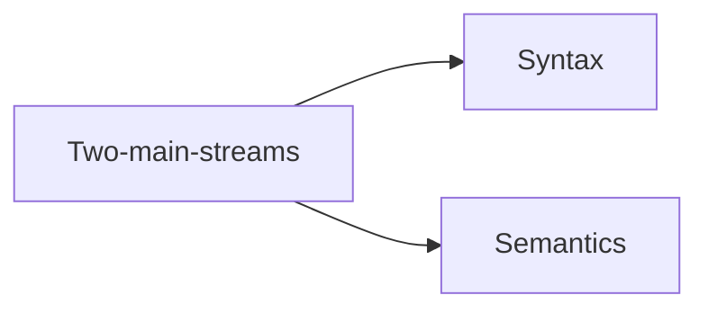

# 命题逻辑

## Language

* 语法 (Syntax)
* 语义 (Semantics)

## 命题的语法

符号表 | 命题的定义 | 构造序列 | 结构归纳法

### 字母表

1. 命题符: $P_0,P_1,P_2,\cdots, m\in \mathbb{N}$, 记为 $PS=\{P_n|n\in\mathbb{N}\}$
2. 联结词: $\lnot, \land, \lor,\to$
3. 辅助符: "(", ")"

$PS$ 为可数无穷集, $|PS|=\aleph_0$

### 命题的定义

1. 命题符为命题
2. 若 $A, B$ 为命题, 则 $(\lnot A), (A\land B), (A\lor B), (A\to B)$ 为命题
3. 命题仅限于此

#### Backus-Naur Form 定义

$\varphi ::= P | (\lnot\varphi) | (\varphi_1\land\varphi_2) | (\varphi_1\lor\varphi_2) | (\varphi_1\to\varphi_2)$, 其中 $P\in PS$

#### 封包法定义

* $C_{\lnot}(A)=\lnot A$
* $C_{\land}(A,B)=A\land B$
* $C_{\lor}(A,B)=A\lor B$
* $C_{\to}(A,B)=A\to B$

#### 所有命题集合

1. $PS\subseteq PROP$
2. 若 $A\in PROP$, 则 $C_{\lnot}(A)\in PROP$
3. 若 $A, B\in PROP$, 则 $C_{*}(A, B)\in PROP$

记 $PROP$ 为函数 $C_{\lnot},C_{\land},C_{\lor},C_{\to}$ 下的闭包

### 括号引理

若 $A$ 为命题, 则 $A$ 中所有左括号的个数等于右括号的个数.

用归纳法证明.

### 构造序列

易见 (Trivial)

## 命题的语义

* 联结词 $\lnot$ 被解释为一元函数 $H_{\lnot}:B\to B$
* 联结词 $*$ 被解释为二元函数 $H_{\lnot}:B^2\to B$

真值表:

## 归纳法

**Basis:**

**I.H.:**

**Ind. Step:**

**Case(a):**

**Case(b):**

**Case(c):**

