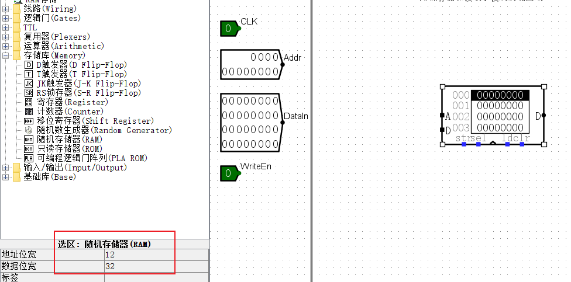
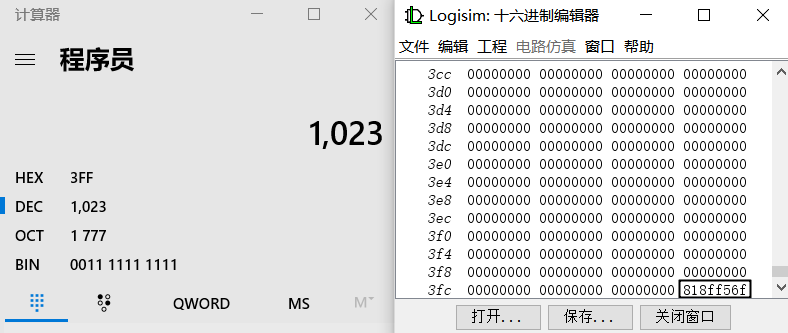
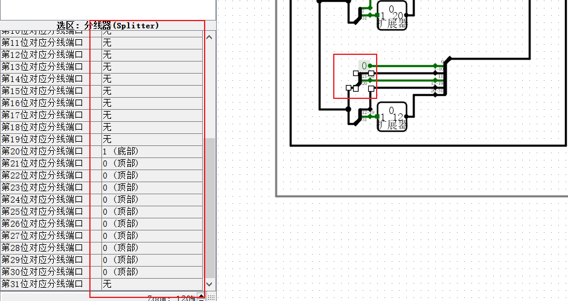

<style>
h1 {
    text-align: center;
}
h2, h3 {
    page-break-after: avoid; 
}
.center {
    margin: 0 auto;
    width: fit-content;
    margin-top: 2em;
    padding-top: 0.5em;
    padding-bottom: 0.5em;
    margin-bottom: 2em;
}
.title {
    font-weight: bold;
    border-top-style: solid;
    border-bottom-style: solid;
}
.newpage {
    page-break-after: always
}
@media print {
    @page {
        margin: 3cm;
    }
}
</style>

<h1 style="margin-top: 4em">
数字电路与数字系统实验报告
</h1>

# <h1 class="center title">实验五: 指令读取和控制器设计</h1>

<div class="center">
<h3>院系：人工智能学院</h3>
<h3>姓名：方盛俊</h3>
<h3>学号：201300035</h3>
<h3>班级：人工智能 20 级 2 班</h3>
<h3>邮箱：201300035@smail.nju.edu.cn</h3>
<h3>时间：2021年6月2日</h3>
</div>

<div class="newpage"></div>

<!-- 生成目录 -->

## <h1>目录</h1>

[TOC]

<div class="newpage"></div>

<!-- 文章主体内容 -->

## 一, 实验目的

1. 理解随机访问存储器 RAM 和只读存储器 ROM 的操作原理
2. 理解 RISC-V 指令类型和指令格式
3. 掌握使用 Logisim 软件实现取指, 指令解析, 立即数扩展, 操作数存取的方法

## 二, 实验环境 / 器材

### Logisim-ITA V2.16.1.2

https://sourceforge.net/projects/logisimit/

### 头歌线上评测平台

https://www.educoder.net/classrooms/10924/

## 三, 实验内容

### 1. 存储器的写入和读取

#### (a) 实验原理

**随机存取存储器 (Random Access Memory, RAM):** 是与 CPU 直接交换数据的内部存储器, 即我们通常所说的运行内存. 计算机将当前程序的程序代码和数据暂时保存在 RAM 中, 以便之后的访问与使用. 

要实现指令系统, 需要使用 RAM 进行指令和数据的保存和读取功能. Logisim 里面提供了 RAM, 可以很方便地调用.

Logisim 中 RAM 器件的地址位宽最多可设置为 24 位, 数据位宽最多可设置为 32 位. 在属性窗口的数据接口中有三种不同的工作模式. 若设置为 "分离的加载和存储引脚" 模式, 则有两个数据端口分别连接输入数据和输出数据.

这个实验, 将初步尝试 RAM 的使用.

**电路图:**


#### (b) 实验步骤

1. 放置一个 RAM 存储器, 设定 "分离的加载和存储引脚", 设置地址位宽为 12, 数据位宽为 32.



2. 进行连线.


#### (c) 仿真验证

按下 `Ctrl + K` 开始本地仿真, 结果良好.

**最后结果如下:**


#### (d) 实验结果

通过了头歌平台的验证.


### 2. 指令读取和控制信号生成

#### (a) 实验原理

**指令系统**处在软/硬件交界面, 同时被硬件设计者和系统程序员看到. 一条指令包含了以下信息:

1. 操作功能: op, 固定或者可变长度
2. 源操作数参照: 立即数或者源操作数的地址
3. 结果值参照: 结果存放地址
4. 下一条指令地址: 当前指令位置生成或者跳转

其中较为复杂的便是**寻址方式**.

指令寻址可以通过 PC 自增或者跳转实现;

操作数寻址需要考虑 1. 寄存器 2. 内存 3. 栈.

在这个实验中, 将实现 9 条 RV321 指令的控制. 它们是:

3 条 R-型指令:

``` text
add rd, rs1, rs2
slt rd, rs1, rs2
sltu rd, rs1, rs2
```

2 条 I-型指令:

``` text
ori rd, rs1, imm12
lw rd, rs1, imm12
```

1 条 U-型指令:

``` text
lui rd, imm20
```

1 条 S-型指令:

``` text
sw rs1, rs2, imm12
```

1 条 B-型指令:

``` text
beq rs1, rs2, imm12
```

1 条 J-型指令:

``` text
jal rd, imm20
```

#### (b) 实验步骤

1. 在指令存储器子电路中放置 ROM 并在 0 号地址开始写入
以下 8 条指令:

``` text
0x00a004b3 (汇编指令 add, x10, x0, x9)
0x0020af33 (汇编指令 slt, x30, x1, x2)
0x0020bf33 (汇编指令 sltu, x30, x1, x2)
0x0f00ef13 (汇编指令 ori, x30, x1, 0x0f0)
0x00412483 (汇编指令 lw, x9, x2, 0x004)
0x00008137 (汇编指令 lui, x2, 0x08000)
0x00912223 (汇编指令 sw, x2, x9, 0x004)
0x7ea500e3 (汇编指令 beq x10, x10, 0x7f0)

00a004b3 0020af33 0020bf33 0f00ef13 00412483 00008137 00912223 7ea500e3

0x818ff56f (汇编指令 jal, x10, 0xff80a)
```

Logisim 中 RAM 和 ROM 器件的数据输入可以采用 Logisim 十六进制编辑器和直接读取二进制编码文件的方法实现. 把鼠标移到存储器组件上, 点击鼠标右键, 弹出菜单框, 选中 "编辑存储内容", 打开 Logisim 十六进制编辑器, 可按照存储器设置的数据位宽, 直接使用键盘输入数据. 输入数据后, 点击保存按钮, 可把输入的数据保存到数据镜像文件中. 当需要从数据镜像文件中加载存储时, 在 RAM 器件上单击鼠标右键, 菜单中选择 "加载数据镜像文件" 或在 Logisim 十六进制编辑器中打开数据镜像文件直接读入文件内容到存储器. 

PS: 此处可以使用复制粘贴的方法输入数据.





2. 实现指令解系测试子电路.

后在指令解析测试子电路中利用 Logisim 内置库中的加法器实现指令的下地址逻辑, 使得该子电路能够依次读入9条指令, 并根据RISC-V指令格式将读出的指令解析为 opcode, rd, funct3, rs1, rs2, funct7 六个字段.

原理图为:


具体实现:


3. 实现立即数扩展部件.

原理图:


具体实现:


4. 实现控制器.

这里直接使用了提供的现成控制器.


#### (c) 仿真验证

按下 `Ctrl + K` 开始本地仿真, 结果良好.

#### (d) 实验结果

通过了头歌平台的测试.


## 四, 实验中遇到的问题和解决方法

### 1. 不清楚 PC 的实现方式

经过助教讲解, 以及自己认真看实验过程的 PDF 之后, 看明白了.

PC 用寄存器和加法器来实现, 每一次都加常量 `4`, 然后选取 `2-11` 位的 8 位作为地址使用.

### 2. 不清楚分线器的使用

经过助教的指导, 了解到分线器可以选择对应端口.



### 3. 复制控制器出错

在复制控制器的线路的时候, 我想着先 `Ctrl + A` 复制全部内容, 再删去不需要的输入和输出, 然后我的 main 电路就多出了很多个输入和输出, 导致出错.

解决方法:

小心翼翼地复制, 不复制输入和输出.


