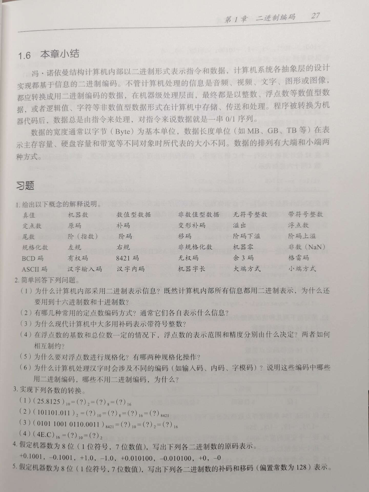
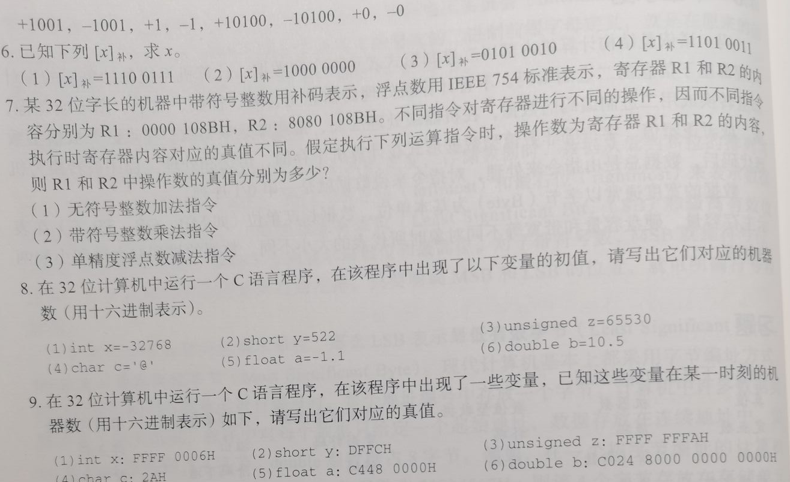
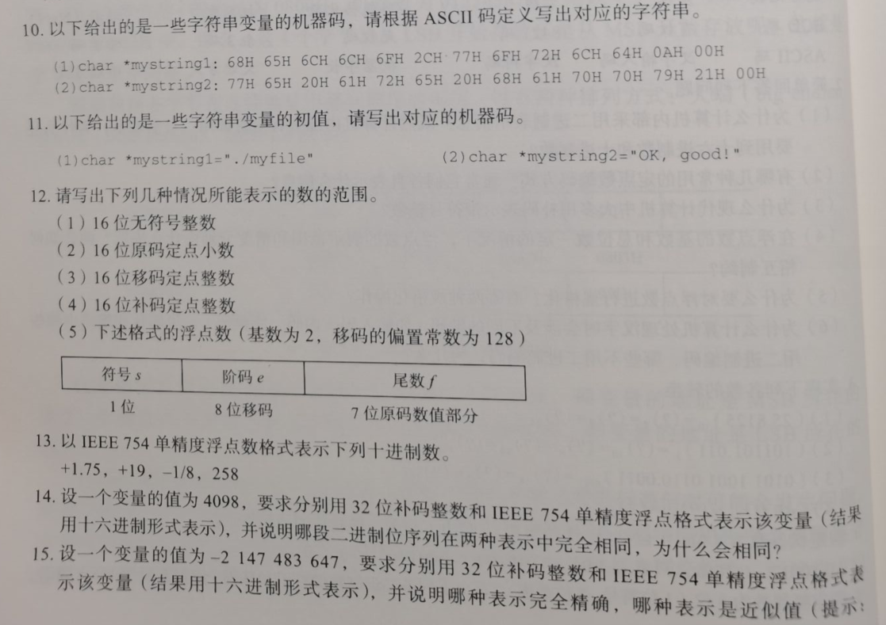

第一章习题3、4、5、6、8、9、17

<!-- 

 -->

# 3.

(1) $(25.8125)_{10}=(11001.1101)_2=(31.64)_8=(19.D)$

(2) $(101101.011)_2=(45.375)_{10}=(55.3)_8=(2D.6)_{16}=(01000101.001101110101)_{8421}$

(3) $(010110010110.0011)_{8421}=(596.3)_{10}=(1001010100.010011001100\cdots )_2=(254.4CC\cdots )_{16}$

--- (4) $(4E.C)_{16}=(78.75)_{10}=(01001110.101)_2$

+++ (4) $(4E.C)_{16}=(78.75)_{10}=(01001110.11)_2$

# 4.

--- 0.1001000, 1.1001000, 00000001, 10000001, 0.0101000, 1.0101000, 00000000, 10000000

+++ 0.1001000, 1.1001000, 溢出, 溢出, 0.0101000, 1.0101000, 00000000, 10000000

# 5.

(1) +1001 => 补码: 00001001, 移码: 10001001

(2) -1001 => 补码: 11110111, 移码: 01110111

(3) +1 => 补码: 00000001, 移码: 10000001

(4) -1 => 补码: 11111111, 移码: 01111111

(5) +10100 => 补码: 00010100, 移码: 10010100

(6) -10100 => 补码: 11101100, 移码: 01101100

(7) +0 => 补码: 00000000, 移码: 10000000

(8) -0 => 补码: 00000000, 移码: 10000000

# 6.

(1) $x=(-00011001)_2=-25$

(2) $x=(-10000000)_2=-128$

(3) $x=(1010010)_2=82$

(4) $x=(-00101101)_2=-45$

# 8.

(1) 0xFFFF8000

(2) 0x020A

(3) 0x0000FFFA

(4) 0x40

--- (5) 1 01111111 00011001100110011001100  =>  0xBF8CCCCC

+++ (5) 1 01111111 00011001100110011001101  =>  0xBF8CCCCD

(末三位是 110 = 7, 应该要进一位)

(6) 0 01000000010 0101 0000...  =>  0x2025000000000000

# 9.

(1) -65530

(2) -8195

(3) 4294967290

(4) '*'

(5) -800.0

(6) -10.25

# 17.

|  Addr       |100|101|102|103|...|108|109|110|111|112|113|
|-------------|---|---|---|---|---|---|---|---|---|---|---|
|  Big Endian |BE |00 |00 |00 |...|40 |F0 |00 |00 |00 |64 |
|Little Endian|00 |00 |00 |BE |...|00 |00 |F0 |40 |64 |00 |