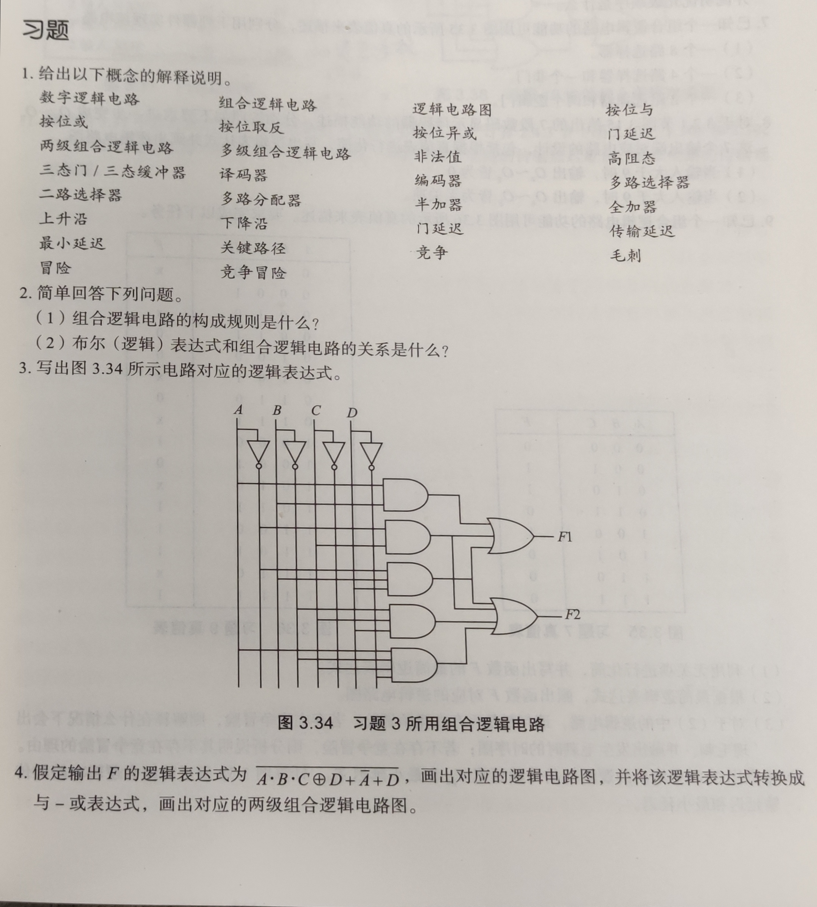
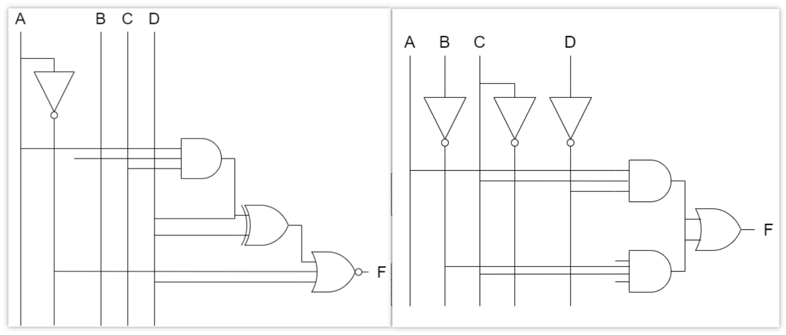
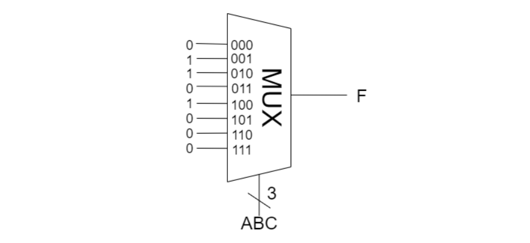
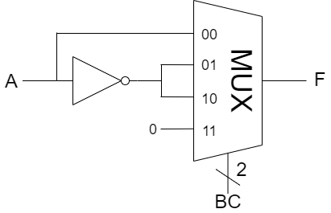

习题3、4、6、7、9、11

# 第三章作业

## 3.

$F_1=AB+\overline{A}C+\overline{A}BD$

$F_2=\overline{A}C+\overline{A}BD+\overline{B}CD+A\overline{B}C\overline{D}$

## 4.

| A | B | C | D | $\overline{A\cdot B\cdot C\oplus D+\overline{A}+D}$ |
|---|---|---|---|-----|
| 0 | 0 | 0 | 0 | 0 |
| 0 | 0 | 0 | 1 | 0 |
| 0 | 0 | 1 | 0 | 0 |
| 0 | 0 | 1 | 1 | 0 |
| 0 | 1 | 0 | 0 | 0 |
| 0 | 1 | 0 | 1 | 0 |
| 0 | 1 | 1 | 0 | 0 |
| 0 | 1 | 1 | 1 | 0 |
| 1 | 0 | 0 | 0 | 1 |
| 1 | 0 | 0 | 1 | 0 |
| 1 | 0 | 1 | 0 | 1 |
| 1 | 0 | 1 | 1 | 0 |
| 1 | 1 | 0 | 0 | 1 |
| 1 | 1 | 0 | 1 | 0 |
| 1 | 1 | 1 | 0 | 0 |
| 1 | 1 | 1 | 1 | 0 |

$\therefore F=A\cdot \overline{C}\cdot \overline{D}+A\cdot \overline{B}\cdot C\cdot \overline{D}$

## 6.

### (1)

### (2)

### (3)

