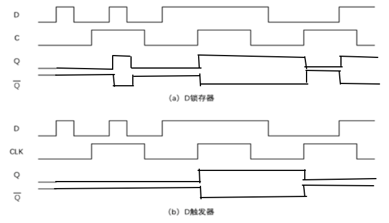
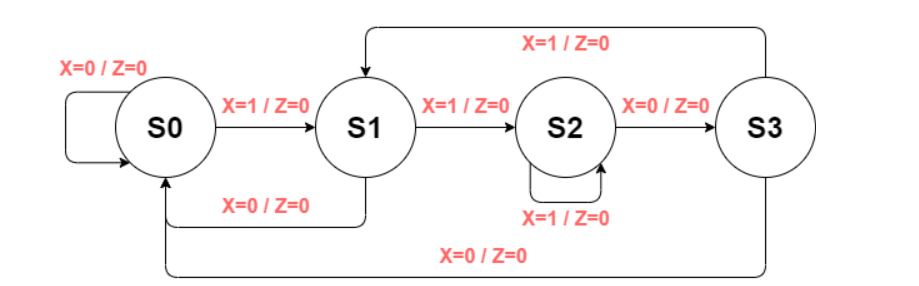

# 第四章作业

## 1.

## 2.

## 3.

## 4.

<!--  -->

**对应状态表:**

| 现态 | X=0 | X = 1|
|-----|------|------|
| S0  | S0/0 | S1/0 |
| S1  | S0/0 | S2/0 |
| S2  | S3/1 | S2/0 |
| S3  | S0/0 | S1/0 |

**合并状态表:**

| 现态 | X=0 | X = 1|
|-----|------|------|
| S0  | S0/0 | S1/0 |
| S1  | S0/0 | S2/0 |
| S2  | S0/1 | S2/0 |

**采用相邻法寻求次优编码方案:**

* 准则 1: 若两个状态的次态相同, 则其对应编码应尽量相邻
* 准则 2: 同一个现态的各个次态其编码应尽量相邻
* 准则 3: 若两个现态的输出相同, 则它们的编码应尽量相邻

可得

* 根据准则 1, S1 和 S2 可相邻
* 根据准则 2, S0 和 S1, S0 和 S2 可相邻
* 根据准则 3, S0 和 S1 可相邻

可选择 S0 和 S1 相邻, S1 和 S2 相邻.

得到编码: S0: 00, S1: 01, S2: 11.

**生成状态转移表:**

| Y1Y0| X=0 | X = 1|
|-----|------|------|
| 00  | 00/0 | 01/0 |
| 01  | 00/0 | 11/0 |
| 11  | 00/1 | 11/0 |

## 5.

