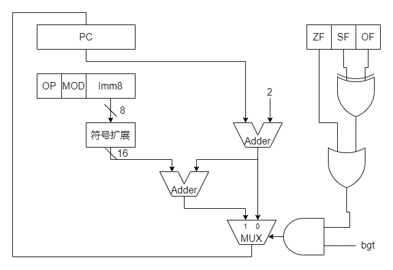

# 数电作业

## 1.

### (1)

因为 PC 默认自增 2, 即两个字节, 所以编址单位是 2 个字节 16 位.

### (2)




## 2.

若 RegWr = 0, 即寄存器的"写使能"信号为 0, 所有要将数据写入寄存器的指令都会失效, 把例如 R-型指令, I-型运算类指令, load 指令等等...

若 ALUASrc = 0, J - 型指令不能正确执行. 在 ALU 中计算 PC + 4 时, 需要根据 ALUASrc 选择是 busA 还是当前 PC 作为 ALU 的 A 口操作数, 而 ALUSrc 为 0 导致总是选择 busA.

若 Branch = 0, B - 型指令不能正确执行, 因为永远不会跳转.

若 Jump = 0, 则 J - 型指令中的无条件跳转指令不能正确执行.

若 MemWr = 0, 即存储器的"写使能"信号为 0, 则 store 指令不能正确执行, 因为存储器无法写入.

若 MemtoReg = 0, 则 load 指令不能正确执行, 因为控制信号 MemtoReg 控制将 ALU 结果还是存储器读出数据写入目的寄存器, 若 MemtoReg = 0 则无法将存储器读出数据写入寄存器.

## 3.

若 RegWr = 1, 即寄存器的"写使能"信号为 1, 所有无需将数据写入寄存器的指令都会失效, 把例如 store 指令, branch 指令等等...

若 ALUASrc = 1, J - 型指令不能正确执行. 在 ALU 中计算 PC + 4 时, 需要根据 ALUASrc 选择是 busA 还是当前 PC 作为 ALU 的 A 口操作数, 而 ALUSrc 为 0 导致总是选择 PC.

若 Branch = 1, 除了 B - 型指令之外的所有指令都不能正确执行, 因为永远都会跳转, 会发生不必要的跳转.

若 Jump = 1, 则 J - 型指令中的无条件跳转指令以外的指令都不能正确执行, 因为会发生不必要的跳转.

若 MemWr = 1, 即存储器的"写使能"信号为 0, 则除了 store 指令以外的指令都不能正确执行, 因为均给存储器写入没必要的数据.

若 MemtoReg = 1, 则 load 指令以外的所有用到 ALU 结果的指令都不能正确执行, 因为控制信号 MemtoReg 控制将 ALU 结果还是存储器读出数据写入目的寄存器, 若 MemtoReg = 1 则一直将寄存器的结果而不是 ALU 结果写入寄存器.


## 4.

### (1)

我们可以使用异或 xor 实现相应的功能.

``` python
xor rs, rs, rt
xor rt, rt, rs
xor rs, rs, rt
```

### (2)

假设 swap 指令在程序中占 $x$ 的比例.

若采用软件实现, 那么消耗时间为 $(1-x)+3x=1+2x$

若采用硬件实现, 那么消耗时间为 $1 + 10\% = 1.1$

令 $1.1<1+2x$ 即有 $x>0.05=5\%$

即 swap 指令占比至少达到 $5\%$ 才值得用硬件来实现.

### (3)

在单周期数据通路中, 因为数据总是在时钟边缘被写入寄存器堆, 一次只能写入一个寄存器, 而 swap 要写入两个寄存器, 因此在不改变通用寄存器组的情况下不能在单周期数据通路中实现 swap 指令.

多周期数据通路可以实现 swap 指令.


## 5.

实现 `bcmp t1, t2, t3` 的指令序列如下:

``` python
begin:      beq  zero, t3, equal    # 若剩余数据块长度为零, 则跳转到数据块相等的情况
            lw   t4, t1, 0          # 将 t1 寄存器所存数据地址对应的数据赋给 t4
            lw   t5, t2, 0          # 将 t2 寄存器所存数据地址对应的数据赋给 t5
            bne  t4, t5, not_equal  # 若当前数据不等, 则跳转到数据块不等的情况
            addi t1, t1, 4          # 没发生跳转, t1 继续自增 4, 指向下一个地址单元
            addi t2, t2, 4          # 没发生跳转, t2 继续自增 4, 指向下一个地址单元
            addi t3, t3, -1         # 没发生跳转, t3 要自减 1, 用于判断是否结束
            jal  zero, begin        # 无条件跳转到循环开头, 继续循环
equal:      lui  t1, 0              # 对于数据块相等的情况, 给 t1 置 0 表示其相等
not_equal:  ...                     # 对于数据块不相等的情况, 根据上面的过程我们可知,
                                    # 已经使得 t1 和 t2 存放第一次数据不等的位置,
                                    # 可以不做任何处理.
```