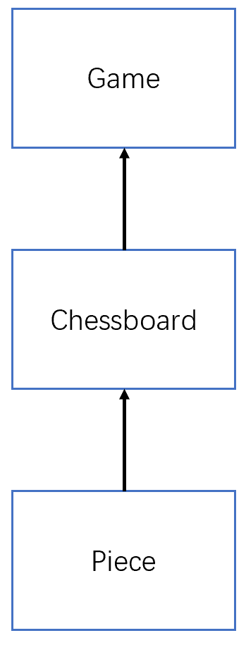
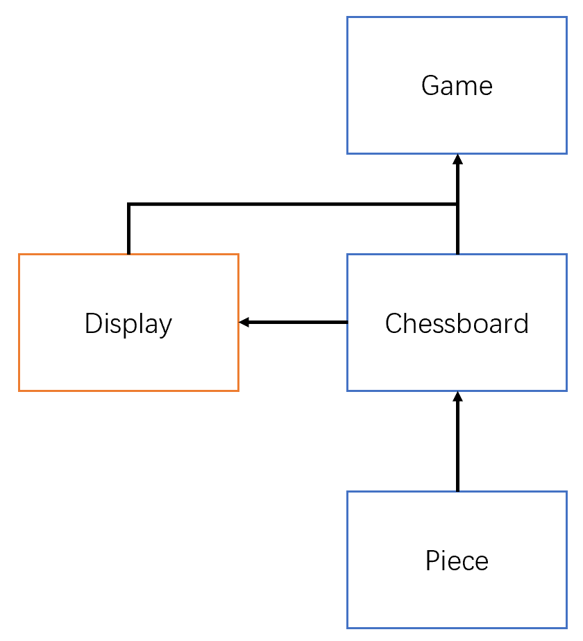

# 五子棋：年轻人的第一款游戏

基于本项目，你将从零开始设计并实现一款五子棋游戏。你需要实现必要概念的数据结构和游戏逻辑，本项目提供了基本的类框架，同时实现了基于控制台的用户交互模块，因此你不必关心图形显示和输入输出问题。

## 面向对象设计

在设计复杂系统时，面向对象思维往往是最重要的工具。在本小节，我们将脱离特定的程序设计序言，在更加抽象的层面上设计系统的架构。

### 一切皆对象

在许多程序设计语言中都有“一切皆对象”的说法，在进行面向对象设计时，可以从这个理念出发，考虑将系统中的各个部分抽象为一个个对象。

对于五子棋这样的场景，自然地，我们可以想到的对象有“棋子”、“棋盘”等等。如果你奉行“一切皆对象”的设计理念，那么也许会产生这样的困惑：“棋盘格子”、“黑子”“白子”和“玩家”等是否也应当作为对象考虑纳入到系统中？

#### 奥卡姆剃刀

在设计时，我们可能会在不同的粒度层面考虑对象，这里给出的准则是，我们关注的对象应当满足当前系统的需求，并保持系统的简洁性（奥卡姆剃刀）。

因此在这里，我们已经考虑了“棋盘”，因此“棋盘格子”就显得不必要，它的功能或许可以被纳入到“棋盘”中；“黑子”“白子”则可以通过“棋子”的属性表示；而“玩家”我们同样不做考虑，因为在五子棋中，“玩家”的行为较为简单，仅仅是提供一个落子位置，因此这个功能被我们纳入到用户交互模块中。

#### 关注系统的需求

上面提到，我们关注的对象应当满足当前系统的需求，如果系统的需求发生变化，那么我们的设计自然会发生改变，比如现在需要在五子棋中加入AI（AI也是“玩家”的一种）来与玩家进行对战，那么“玩家”的行为则变得更加复杂，这时可以考虑将“玩家”作为一个单独的对象。

#### 找出抽象概念

另外一个值得注意的问题是，我们在设计时可以轻易地找出系统中应该存在的实体，比如“棋盘”和“棋子”，然而抽象的概念往往也需要被视为对象纳入到系统中。在本场景下，“游戏”本身也应该被视为一个对象，因为“棋盘”和“棋子”显然不是五子棋的全部，我们还需要一个实体来指导“棋子”和“棋盘”如何进行交互，以及游戏按什么样的规则进行，它包含了“棋盘”和“棋子”这些游戏实体，同时也包含了游戏规则等抽象概念。

最后，我们总结出了完成这个游戏需要考虑的对象：“棋盘”，“棋子”，“游戏”。这个总结的过程不是一蹴而就的，你或许在一开始的设计中考虑了“棋盘”、“棋子”和“玩家”三个对象，随着开发的进行，发现删除“玩家”，加入“游戏”更加合理一些。

### 对象间的交互

我们罗列出了系统中应当存在的对象，现在我们要考虑这些对象之间的关系。

首先，“棋子”摆在“棋盘”上，那么一个“棋盘”应该包含若干“棋子”，因此“棋盘”与“棋子”间具有包含关系（这里的关系不是标准的类图关系表示，理解其含义即可）。
不难想象，一个“棋盘”应该具有如下能力：
* 在给定的位置放置一个给定的“棋子”。
* 告诉我给定的位置是否有一个“棋子”，如果有，是黑子还是白子。

然后，我们考虑“游戏”与“棋盘”间的关系，这里“棋盘”应该包含在“游戏”内，因为它是“游戏”的一部分。“游戏”应该具有如下能力：
* 从用户交互模块中得到玩家的指定的落子位置，并指定“棋盘”在该位置上放置相应的“棋子”。
* 扫描“棋盘”上的各个“棋子”，判断游戏是否结束。

上述的能力可以被认为是在编写程序时各个类具有的方法，但是在实际编程中，会存在一些差异。

另外，我们也不考虑“游戏”与“棋子”间的关系，因为“棋子”被包含在“棋盘”中，而“棋盘”被包含在“游戏”中，每当需要落子时，只需要告诉“棋盘”在给定的位置放置一个黑/白子，而不需要实际了解“棋子”具体是什么。这样的设计减少了系统的耦合，它们之间的关系如下图，箭头表示依赖关系。
<p align="center">
  
</p>

### 用户交互模块

在上面的设计中，我们似乎落下了一些东西。一款真正的游戏少不了与用户进行交互的过程，虽然在本项目中，我们已经帮你实现了该模块，但你仍然需要明白，这个模块在系统中的位置和它与其他对象间的关系。

这里我们将“用户交互模块”看作一个单独的对象。在进行游戏时，“游戏”会从“用户交互模块”中获取输入，然后“游戏”在“棋盘”上落子，最后“游戏”要求“用户交互模块”显示当前“棋盘”的内容。这涉及到“游戏”与“用户交互模块”的通信，同时涉及到“用户交互模块”与“棋盘”的通信，在本项目中，我们直接将“棋盘”传递给“用户交互模块”来显示“棋盘”内容，这虽然增加了系统的耦合程度，但是简化了系统的设计难度：每当我们需要显示“棋盘”内容时，只需将“棋盘”递给“用户交互模块”即可。

现在，我们的关系图如下，“用户交互模块”即“Display”，它的主要功能是显示棋盘，当然我们也顺带将一些输入输出功能塞了进去。我们使用不同的颜色标注“用户交互模块”，因为它不需要你实现。
<p align="center">
  
</p>

## 使用Python实现

根据以上的设计，我们可以开始Python程序开发了。在本小节，我们将重点介绍你将要完成哪些任务和“Display”为你提供的接口。

### 类

按照我们在上一节的设计，你需要实现三个类：`Piece`，`Chessboard`和`Game`。
请不要随意更改它们的名字并且保持大小写一致。

在实现时，我们将“空”也看作一种特殊的`Piece`，这意味着一个`Piece`可能有3种状态。这样设计的好处是，可以方便地为`Chessboard`设计容纳棋子的数据结构。

你可以在你的代码中创建额外的类来辅助你的程序设计，虽然在我们已经实现的版本中并没有这样做。

### 接口

接口是一种用来定义程序的协议，它描述可属于任何类或结构的一组相关行为。通俗地讲就是事先约定好你的程序/类应该具有哪些行为，这样其他人只要求你的程序/类实现约定的接口，而不必关心你的程序内部是如何实现的。

考虑我们的五子棋程序，我们如何在你的代码还没有写出来之前把`Display`类先写好，原因在于我们在框架内定义了`Piece`，`Chessboard`和`Game`的接口，因此，在`Display`内部，通过访问`Chessboard`的接口，可以打印出棋盘。另外，规定`Piece`和`Game`的接口似乎是不必要的，这里我们规定它们的接口的目的是为了减少你在程序设计时的难度。

接口的定义方式有许多中，在Java语言中，有专用的接口类型。在这里，我们使用继承的方式来定义接口。具体地，我们为`Piece`，`Chessboard`和`Game`定义了它们的父类`SuperPiece`，`SuperChessboard`和`SuperGame`。在实现时，你的类应继承自它们，并重写（override）父类中未实现的方法。

在父类中，我们为你实现了一些基础的方法，而未实现的方法（你需要重写的方法）在被调用后会抛出`NotImplementedError`异常。所有这些方法都标注了注释，以说明该方法的功能，输入和输出形式。

你可以在你的子类中创建额外的方法来辅助你的程序设计，重写构造方法`__init__`也是被允许的。总之，在接口定义范围外的事情我们不做约束。

### Display类

`Display`是上述“用户交互模块”的具体实现，它支持向用户显示棋盘和各种游戏信息，同时也支持从用户那里得到落子位置。`Display`提供的接口信息，如方法的功能，输入和输出，可以在代码文件中查看。这里我们提供一些调用的示例，以便你能够更好地理解它们的作用。

```python
>>> display = Display()
```
```python
>>> display.input_board_size()
请输入棋盘大小:
6
6
```
```python
>>> display.input_position() 
请输入坐标:
3 4
(3, 4)
```
```python
>>> display.display_winner(black_win=False) 
白棋获胜

```
```python
>>> display.display_round(round_num=3, black_turn=False)
----------------------------------------
回合3 白棋回合:

```
```python
>>> display.display_position_info(position=(3,4), black_turn=True)  
黑棋落子位置为 (3 4)

```
```python
>>> display.display_help_info()                                   
帮助信息:
坐标的形式如"3 5"，表示第3行第5列。坐标从1开始，最大不超过棋盘大小。

```
```python
>>> display.display_position_boundary_error()
输入的坐标范围有误

```
```python
>>> display.display_position_empty_error()   
该位置已经有棋子了

```
```python
>>> display.display_board(chessboard) 
--------------
  1 2 3 4 5 6
1 + + + + + +
2 + + + + + +
3 + + ● + + +
4 + + ○ + + +
5 + + + + + +
6 + + + + + +
--------------
```


## 其他

### 快速开始
1. 克隆仓库到本地
```
git clone https://github.com/DoubleVII/gobang_tutorial
```
如果你无法连接Github服务器，你可以尝试以下命令：
```
git clone https://hub.fastgit.org/DoubleVII/gobang_tutorial
```

2. 在`gobang.py`中创建`Piece`，`Chessboard`和`Game`类。

3. 运行`gobang.py`
```
python gobang.py
```

### 测试样例
我们提供了一个完整的游戏流程示例，请参考我们提供的样例完善你的代码。样例中的输出通过调用`Display`即可完成，你不必在自己的代码中使用`print`语句，如果你希望输出额外的信息，可以调用`Display.info`方法。你的输出不必与样例完全相同，但不应该缺少一些必要的部分。

样例如下：
```python
请输入棋盘大小:
6
帮助信息:
坐标的形式如"3 5"，表示第3行第5列。坐标从1开始，最大不超过棋盘大小。

----------------------------------------
回合1 黑棋回合:

--------------
  1 2 3 4 5 6
1 + + + + + +
2 + + + + + +
3 + + + + + +
4 + + + + + +
5 + + + + + +
6 + + + + + +
--------------
请输入坐标:
2 10
输入的坐标范围有误

请输入坐标:
2 2
黑棋落子位置为 (2 2)

----------------------------------------
回合2 白棋回合:

--------------
  1 2 3 4 5 6
1 + + + + + +
2 + ● + + + +
3 + + + + + +
4 + + + + + +
5 + + + + + +
6 + + + + + +
--------------
请输入坐标:
2 2
该位置已经有棋子了

请输入坐标:
2 3
白棋落子位置为 (2 3)

----------------------------------------
回合3 黑棋回合:

--------------
  1 2 3 4 5 6
1 + + + + + +
2 + ● ○ + + +
3 + + + + + +
4 + + + + + +
5 + + + + + +
6 + + + + + +
--------------
请输入坐标:
3 3
黑棋落子位置为 (3 3)

----------------------------------------
回合4 白棋回合:

--------------
  1 2 3 4 5 6
1 + + + + + +
2 + ● ○ + + +
3 + + ● + + +
4 + + + + + +
5 + + + + + +
6 + + + + + +
--------------
请输入坐标:
3 4
白棋落子位置为 (3 4)

----------------------------------------
回合5 黑棋回合:

--------------
  1 2 3 4 5 6
1 + + + + + +
2 + ● ○ + + +
3 + + ● ○ + +
4 + + + + + +
5 + + + + + +
6 + + + + + +
--------------
请输入坐标:
4 4
黑棋落子位置为 (4 4)

----------------------------------------
回合6 白棋回合:

--------------
  1 2 3 4 5 6
1 + + + + + +
2 + ● ○ + + +
3 + + ● ○ + +
4 + + + ● + +
5 + + + + + +
6 + + + + + +
--------------
请输入坐标:
4 5
白棋落子位置为 (4 5)

----------------------------------------
回合7 黑棋回合:

--------------
  1 2 3 4 5 6
1 + + + + + +
2 + ● ○ + + +
3 + + ● ○ + +
4 + + + ● ○ +
5 + + + + + +
6 + + + + + +
--------------
请输入坐标:
5 5
黑棋落子位置为 (5 5)

----------------------------------------
回合8 白棋回合:

--------------
  1 2 3 4 5 6
1 + + + + + +
2 + ● ○ + + +
3 + + ● ○ + +
4 + + + ● ○ +
5 + + + + ● +
6 + + + + + +
--------------
请输入坐标:
3 2
白棋落子位置为 (3 2)

----------------------------------------
回合9 黑棋回合:

--------------
  1 2 3 4 5 6
1 + + + + + +
2 + ● ○ + + +
3 + ○ ● ○ + +
4 + + + ● ○ +
5 + + + + ● +
6 + + + + + +
--------------
请输入坐标:
6 6
黑棋落子位置为 (6 6)

--------------
  1 2 3 4 5 6
1 + + + + + +
2 + ● ○ + + +
3 + ○ ● ○ + +
4 + + + ● ○ +
5 + + + + ● +
6 + + + + + ●
--------------
黑棋获胜

```

### 注意事项
1. 建议使用浅色背景的控制台运行程序，否则黑子和白子的颜色会反色。
2. 如果你的程序输出存在中文乱码的情况，那么你可以在`SuperGame`的构造函数中更改`Display`的初始化参数：`self.display = Display(gbk_console=True)`。
3. 如果你的程序的棋子无法正常显示，那么可以使用完全ASCII编码的版本，启用后，黑子以字母'x'表示，白子以字母'o'表示。启用方法与第2点相似，修改`Display`的初始化参数：`self.display = Display(ascii_piece=True)`。
4. 通常来说，黑子先手。


## 作业提交
你需要提交完成的程序文件`gobang.py`和一张运行截图，截图的内容应包含至少两回合的内容，并且其中一方获得胜利（即至少包含最后一回合和倒数第二回合），图中的棋盘大小为标准的五子棋棋盘大小（15x15）。

两份文件打包（zip或7z）上传至**教学立方的相应题目**中，压缩包命名格式为`"{}_{}.{}".format(学号, 姓名, 文件格式)`，如"201300009_雷军.zip"。