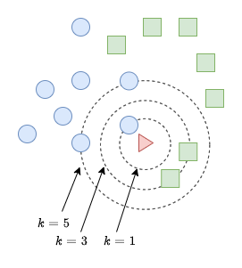
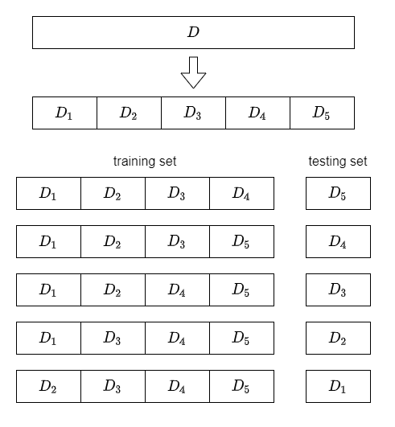

---
puppeteer:
  format: "A4"
  printBackground: true
---

# kNN 近邻分类算法及简单的 Python 实现

<style>
img {
    margin: 0 auto; 
    display: block;
}
</style>

## 0. 目录

[TOC]


## 1. 概念

**kNN 算法**是一种分类和回归算法, 这里我们讨论 kNN 算法在**分类问题**中的应用.

简而言之, kNN 算法, 即给定一个**含分类标记训练数据集 (training data)**, 对于一个新的未分类的新**测试样本 (testing sample)**, 找到和这个测试样本**最邻近的 k 个训练样本 (training samples)**, 则我们将这 k 个训练样本中**出现次数最多的类别**看作是这个**新测试样本的类别**, 这就完成了我们的分类问题.



例如该图, 图中的 `蓝色圆圈` 和 `绿色方块` 是两种已知的类别, 图中是它们样本点的分布. 我们的任务是, 确认中间的未知类别的 `红色三角` 是属于 `蓝色圆圈` 还是 `绿色方块` 类别.

我们采用 kNN 算法的思想考虑这个问题.

当 k = 1 时, 我们可以看出, 和 `红色三角` 最近的 1 个训练样本是 `蓝色圆圈`, 则我们断言 `红色三角` 属于 `蓝色圆圈` 类别. 

当 k = 3 时, 我们可以看出, 和 `红色三角` 最近的 3 个训练样本中有 2 个是 `绿色方块`, 则我们断言 `红色三角` 属于 `绿色方块` 类别. 

当 k = 5 时, 我们可以看出, 和 `红色三角` 最近的 5 个训练样本中有 3 个是 `蓝色圆圈`, 则我们断言 `红色三角` 属于 `蓝色圆圈` 类别. 

我们可以看到, **当我们选取不同的 k 值时, 会出现不同的分类结果.**

了解了 kNN 的基本概念之后, 我们还要完善具体的实现细节, 细节决定成败嘛. 我们可以考虑几个问题:

1. 如何计算两个样本之间的距离? 
2. 如何平衡各个特征维度在距离计算中影响 (归一化)?
3. 如何选取 k 值?
4. 如何优化算法的运算效率?
5. 如何确定样本不同特征的重要性?
6. 是否需要降维?
7. ...

我们一个一个地考虑这些问题 (慢慢地更新).

PS: 我们还可以发现 kNN 算法的一个特点, 它并不需要任何的显式的训练过程. 其实, 它是 **懒惰学习 (lazy learning)** 的代表算法, 训练过程仅仅是保存数据, 即训练时间为 0, 但是后续运算时消耗资源和消耗时间较大.


## 2. 距离的计算

通过线性代数课程的学习, 我们知道, 对于 $n$ 维向量空间 $\mathbb{R}^{n}, \alpha=(a_1,a_2,\cdots ,a_{n}), \beta=(b_1,b_2,\cdots ,b_{n})$, 距离 $L_{p}$ 定义为:

$$
L_{p}(\alpha,\beta)=\left( \sum_{i=1}^{n}|a_{i}-b_{i}|^{p}\right)^{\frac{1}{p}}
$$

当 $p=2$ 时, 称为**欧氏距离 (Euclidean distance)**, 即

$$
L_{2}(\alpha,\beta)=\left( \sum_{i=1}^{n}|a_{i}-b_{i}|^{2}\right)^{\frac{1}{2}}
$$

当 $p=1$ 时, 称为**曼哈顿距离 (Manhattan distance)**, 即

$$
L_{1}(\alpha,\beta)=\sum_{i=1}^{n}|a_{i}-b_{i}|
$$

当 $p=+\infty$ 时, 它是各个坐标距离的最大值, 即

$$
L_{\infty}(\alpha,\beta)=\max_{i}|a_{i}-b_{i}|
$$

最常用的是欧氏距离, 我们在中学和大学期间便经常使用. 这里我们也是使用欧式距离来衡量两个样本之间的距离, 而且因为只是要判断距离的大小, 没有必要开平方, 即有

$$
L^{2}(\alpha,\beta)=\sum_{i=1}^{n}(a_{i}-b_{i})^{2}
$$

**相应的 python 实现:**

``` python
import numpy as np
from sklearn import datasets  # 读取 sklearn 自带的数据集

iris = datasets.load_iris()  # 读取 iris 数据集
x1 = iris.data[0]  # 第一个样本
x2 = iris.data[1]  # 第二个样本

# 计算两个样本之间的距离平方
distance = ((x1 - x2) ** 2).sum()

# 查看结果
print('x1:', x1)
print('x2:', x2)
print('distance:', distance)
```

输出为

``` text
x1: [5.1 3.5 1.4 0.2]
x2: [4.9 3.  1.4 0.2]
distance: 0.2899999999999997
```

## 3. 数据归一化

假设我们有一堆样本, 但是这些样本的两个维度的数值差距较大, 如下图


当 k = 3 时, 

**左图**表明 `红色三角` 应该属于 `蓝色圆圈` 类别; 

**右图**却告诉我们, `红色三角` 应该属于 `绿色方块` 类别.

明明看起来像是同一批的数据, 为什么会有不同的结果呢?

我们观察左图, 左图的数据呈现出长方形的形状, 其中**长度远远大于宽度**. 而右图的数据是经过左图**归一化**而来, 长方形被压缩成了正方形, **长度等于宽度**.

那么左图和右图哪一种比较合理呢?

我们不妨假设一种极端情况: 有那么一批数据, 它的样本有两个维度, 其中 $x$ 特征维度上的数据是 $10^{3}$ 级别的, 而 $y$ 特征维度上的数据仅仅是个位级别的. 此时, 我们再去衡量两个点之间的距离.

我们发现, 判断两个点是否是最近的时候, **它们在 $y$ 维度上的数据对距离几乎没有任何影响, 它们相当于只是用 $x$ 维度上的数据衡量两点的距离, 数据退化成了一维了**.

我们辛辛苦苦收集来的数据, 却只用到了其中的一半, 这怎么行?

所以**我们需要对原始数据进行归一化**.

归一化的方法有很多, 在这里, 我们可以使用简单的**线性归一化**:

$$
x_{i}'=\frac{x_{i} - \min\{x\}}{\max\{x\}-\min\{x\}}
$$

这样可以将数据线性映射到区间 $[0, 1]$ 上.

**相应的 python 实现:**

``` python
import numpy as np
from sklearn import datasets  # 读取 sklearn 自带的数据集

iris = datasets.load_iris()  # 读取 iris 数据集
data = iris.data

# 计算公式 x' = (x - min(x)) / (max(x) - min(x))
data = (data - data.min(axis=0)) / (data.max(axis=0) - data.min(axis=0)) 

# 查看结果
print(data[:5])
```

输出为:

``` text
[[0.22222222 0.625      0.06779661 0.04166667]
 [0.16666667 0.41666667 0.06779661 0.04166667]
 [0.11111111 0.5        0.05084746 0.04166667]
 [0.08333333 0.45833333 0.08474576 0.04166667]
 [0.19444444 0.66666667 0.06779661 0.04166667]]
```

## 3. k 折交叉验证法

**交叉验证法** 即先将数据集 $D$ 分成 $k$ 个大小相斥的互斥子集 $D_{i}$, 然后再将每一个分别作为测试集, 其余作为验证集进行训练和测试, 最后取平均值, 用于判断算法的好坏.

这里我们采用 5 折交叉验证, 如图



**相应的 python 代码实现:**

``` python
from sklearn import datasets  # 读取 sklearn 自带的数据集
from sklearn.model_selection import KFold  # 使用 sklearn 内含的 k 折函数
import numpy as np

iris = datasets.load_iris()  # 读取 iris 数据集
X = iris.data
y = iris.target

# 初始化 k 折函数, 第一个参数是多少折, 第二个参数是随机数种子, 用于生成相同的随机数, 并且要设置 shuffle=True 才能生效
kf = KFold(n_splits=5, random_state=2021, shuffle=True)
for i, (train_index, test_index) in enumerate(kf.split(X)):
    print(f'\nKFold {i+1}:')
    print("Test index:", test_index)

    X_train, X_test = X[train_index], X[test_index]
    y_train, y_test = y[train_index], y[test_index]
    print("Shape of X_train:", X_train.shape)
    print("Shape of X_test:", X_test.shape)
    print("Shape of y_train:", y_train.shape)
    print("Shape of y_test:", y_test.shape)
```

输出为:

``` text
KFold 1:
Test index: [  0   2   4   6   8  12  13  22  23  28  30  35  42  43  55  61  65  66
  69  72  73  74  80  91 112 113 115 125 133 134]
Shape of X_train: (120, 4)
Shape of X_test: (30, 4)
Shape of y_train: (120,)
Shape of y_test: (30,)

KFold 2:
Test index: [ 16  24  29  34  39  45  46  56  58  59  64  67  68  77  81  83  88  92
  97 104 105 108 118 127 129 132 136 143 146 149]
Shape of X_train: (120, 4)
Shape of X_test: (30, 4)
Shape of y_train: (120,)
Shape of y_test: (30,)

KFold 3:
Test index: [  3  18  20  26  31  32  37  47  48  60  75  79  84  86  87  95  96  98
  99 100 103 107 114 117 119 122 126 139 142 144]
Shape of X_train: (120, 4)
Shape of X_test: (30, 4)
Shape of y_train: (120,)
Shape of y_test: (30,)
```

``` text
KFold 4:
Test index: [  9  10  11  15  17  19  25  27  36  40  41  50  51  53  71  76  78  82
  89  90 111 121 131 135 137 138 141 145 147 148]
Shape of X_train: (120, 4)
Shape of X_test: (30, 4)
Shape of y_train: (120,)
Shape of y_test: (30,)

KFold 5:
Test index: [  1   5   7  14  21  33  38  44  49  52  54  57  62  63  70  85  93  94
 101 102 106 109 110 116 120 123 124 128 130 140]
Shape of X_train: (120, 4)
Shape of X_test: (30, 4)
Shape of y_train: (120,)
Shape of y_test: (30,)
```


## 4. kNN 算法简单实现

根据上面描述的过程和代码, 我们可以实现一个基本的 kNN 算法.

大致过程为:

1. 导入数据集, 并进行线性归一化;
2. 进行 5 折交叉验证, 划分训练集和测试集;
3. 对每一个测试集的样本, 遍历所有训练集的样本并算出距离;
4. 选出最近的 k 个邻居, 进行投票统计类别;
5. 求正确率的平均值, 最后算出总的正确率.

**具体的 python 代码实现:**

``` python
from sklearn import datasets  # 读取 sklearn 自带的数据集
from sklearn.model_selection import KFold  # 使用 sklearn 内含的 k 折函数
from collections import Counter  # 用于后续投票
import matplotlib.pyplot as plt  # 用于可视化分析
import numpy as np

iris = datasets.load_iris()  # 读取 iris 数据集
X = iris.data 
y = iris.target

class knn_classifier:

    def __init__(self, X_train: np.ndarray, y_train: np.ndarray, k: int):
        '''
        初始化 kNN 模型. 
        X_train: 训练数据的特征;
        y_train: 训练数据的标签;
        k: kNN 中 k 的取值, 即选取多少个邻居.
        '''

        # 进行数据归一化
        # 计算公式 x' = (x - min(x)) / (max(x) - min(x))
        self._min = X_train.min(axis=0)
        self._max = X_train.max(axis=0)
        self._X_train: np.ndarray = (X_train - self._min) / (self._max - self._min)
        self._y_train: np.ndarray = y_train
        self._k: int = k

    def get_distance(self, first_sample: np.ndarray, second_sample: np.ndarray):
        return ((first_sample - second_sample) ** 2).sum()

    # kNN 分类算法的实现
    def classify_sample(self, X_sample: np.ndarray):
        '''
        给定一个测试样本 X_sample, 通过 kNN 算法来预测它的类别并返回. 
        X_sample: 一个测试样本.
        '''

        # 进行数据归一化
        # 计算公式 x' = (x - min(x)) / (max(x) - min(x))
        X_sample = (X_sample - self._min) / (self._max - self._min)

        # 简单的遍历计算距离, 待优化
        distances = [self.get_distance(X_train_sample, X_sample) for X_train_sample in self._X_train]

        # 从小到大取出前 k 个数据的下标, 使用 np.argsort 函数
        index = np.argsort(distances)[:self._k]
        # 进行投票, 选出出现次数最多的类别
        count = Counter(y[index])
        return count.most_common()[0][0]


# 使用 k 折函数和 knn 的结合
def k_fold_knn(X: np.ndarray, y: np.ndarray, *, k: int, k_fold: int = 5) -> float:
    '''
    使用 k 折交叉验证来计算分类结果准确率, 返回准确率.
    X: 数据集的特征;
    y: 数据集的标签;
    k: kNN 中 k 的取值, 即选取多少个邻居.
    k_fold: 进行多少折验证, 默认为 5 折.
    '''
    # 初始化 k 折函数, 第一个参数是多少折, 第二个参数是随机数种子, 用于生成相同的随机数, 并且要设置 shuffle=True 才能生效
    kf = KFold(n_splits=k_fold, random_state=2021, shuffle=True)
    # 用于保存每一折算出来的正确率
    results = []
    for train_index, test_index in kf.split(X):
        # 每一折的训练集
        X_train, X_test = X[train_index], X[test_index]
        y_train, y_test = y[train_index], y[test_index]
        knn = knn_classifier(X_train, y_train, k=k)

        # 获取预测分类结果
        y_predict = [knn.classify_sample(X_test_sample) for X_test_sample in X_test]

        # 将预测分类结果与正确分类数据比对,
        # 正确则为 1.0, 错误则为 0.0, 最后取平均值
        results.append(sum([1.0 if y_predict[i] == y_test[i] else 0.0 for i in range(len(y_test))]) / len(y_test))

    return sum(results) / len(results)

# 进行超参数 k 的 5 折交叉验证测试
k_values = range(1, 30, 2)
k_accuracy = [k_fold_knn(X, y, k=k) for k in k_values]

# 输出最优的 k 值
print('The best k is', k_values[k_accuracy.index(max(k_accuracy))])
print('The best accuracy is', max(k_accuracy))

# 生成折线图, 用于分析
plt.rcParams['font.sans-serif'] = ['SimHei']  # 用来正常显示中文标签
plt.rcParams['axes.unicode_minus'] = False  # 用来正常显示负号

# 'b': 颜色蓝色, 'o': 点形圆形, '-': 线形实线, 线条宽度为 2
plt.plot(k_values, k_accuracy, 'bo-', linewidth=2)
plt.xlabel('k')  # 横坐标轴的标题
plt.ylabel('accurate')  # 纵坐标轴的标题
plt.grid()  # 显示网格
plt.title('不同的 k 值的 kNN 分类准确率') # 图形的标题

# 显示图形
plt.show()
```

输出为:

``` text
The best k is 15
The best accuracy is 0.8733333333333334
```


我们可以看出, 对于 iris 数据集来说, **最优的 k 值为 15, 准确率可达 0.87**.

对于这个 3 分类问题, 这能算是一个不错的模型.

