# 第二课

## 刚体位姿描述

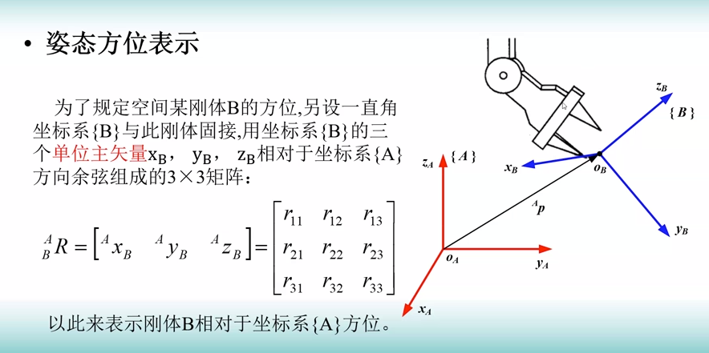

$_B^AR$ 也被称为旋转矩阵。

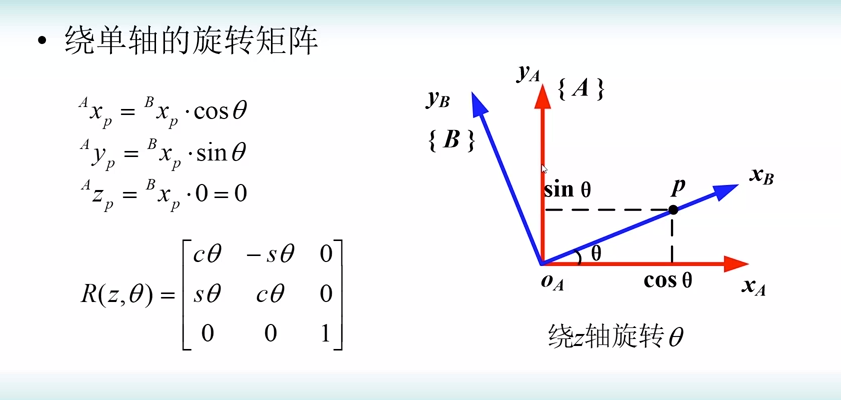

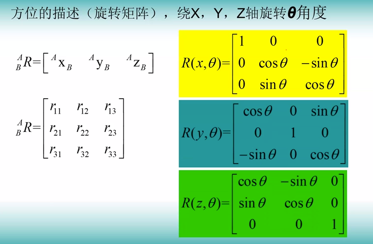

## 坐标变换

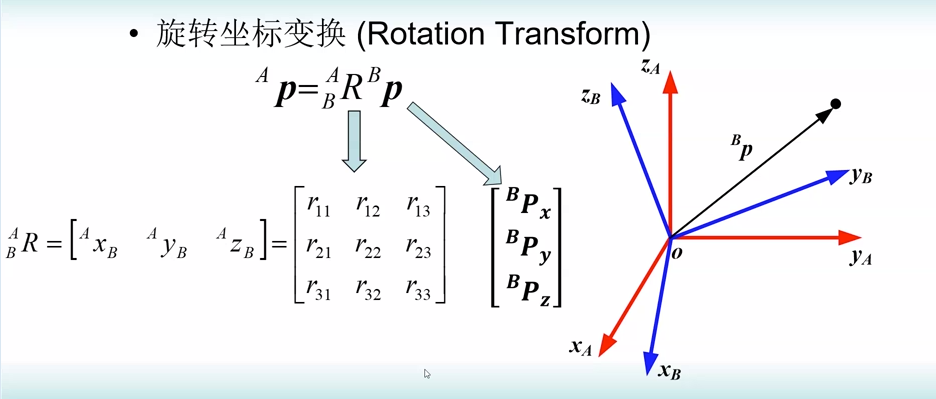

即正交矩阵。

## 齐次坐标变换

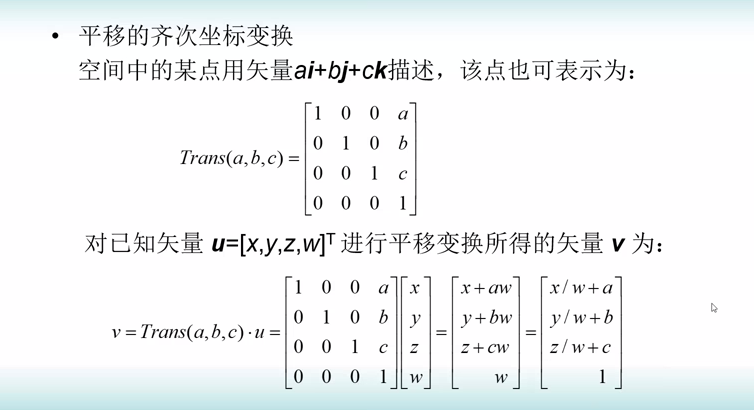

## 物体的变换和变换方程

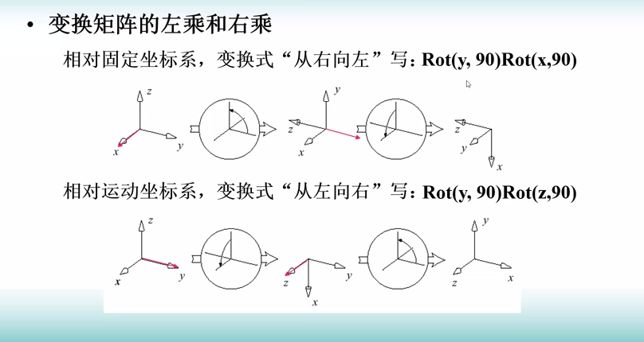

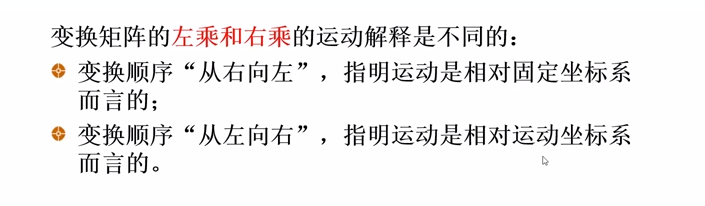

相对运动坐标系变换：

$\begin{bmatrix} 0 &-1 &0 &0 \\ 1 &0 &0 &0 \\ 0 &0 &1 &0 \\ 0 &0 &0 &1\end{bmatrix}\begin{bmatrix} 0 &0 &1 &0 \\ 0 &1 &0 &0 \\ -1 &0 &0 &0 \\ 0 &0 &0 &1\end{bmatrix}\begin{bmatrix} 1 &0 &0 &4 \\ 0 &1 &0 &-3 \\ 0 &0 &1 &7 \\ 0 &0 &0 &1 \\\end{bmatrix}\begin{pmatrix} 7 \\ 3 \\ 2 \\ 1\end{pmatrix}=\begin{bmatrix}0\\9\\-11\\1\end{bmatrix}$

## 欧拉角和 RPY 角

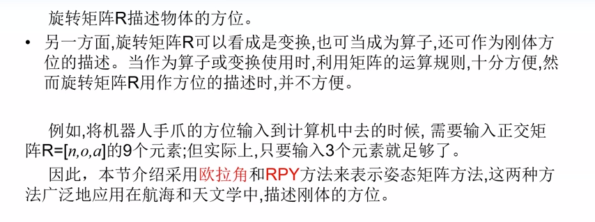

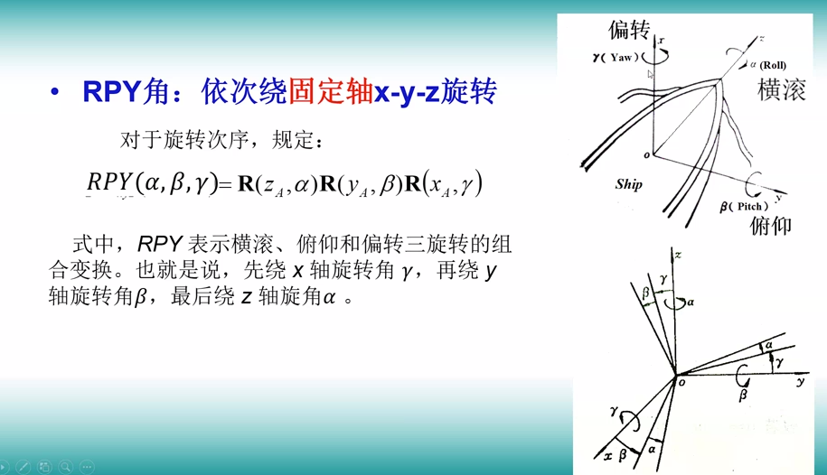

$\mathrm{Atan2}(y,x)$ 可以通过 $y,x$ 的符号知道角度的象限。

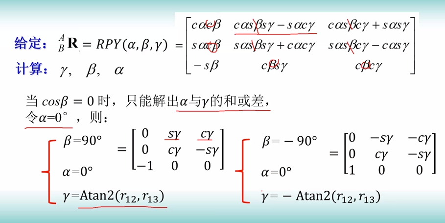

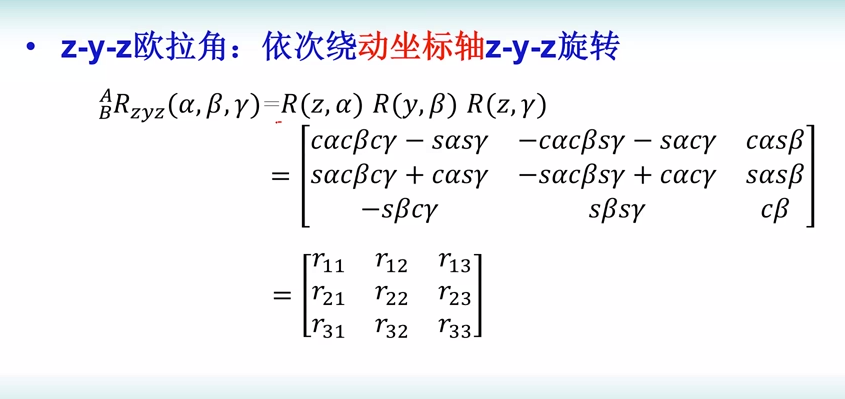

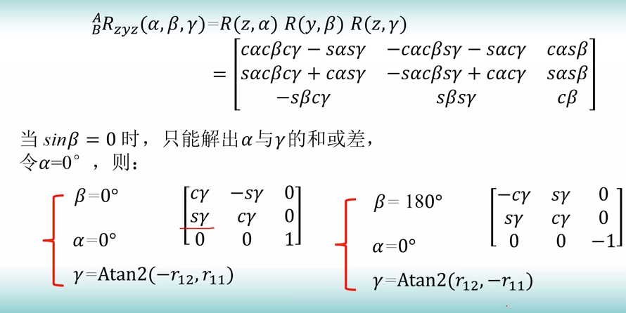

## 通用旋转变换

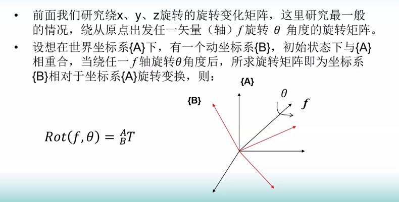

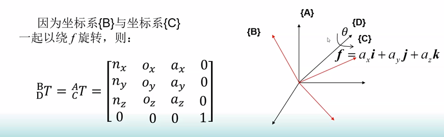

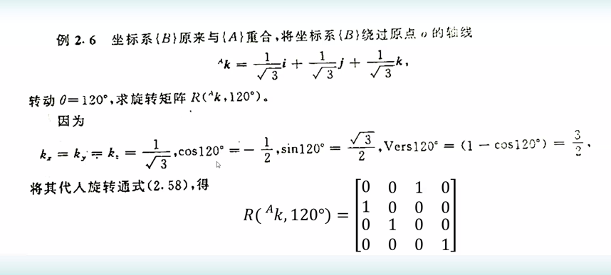

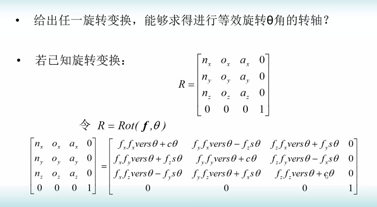

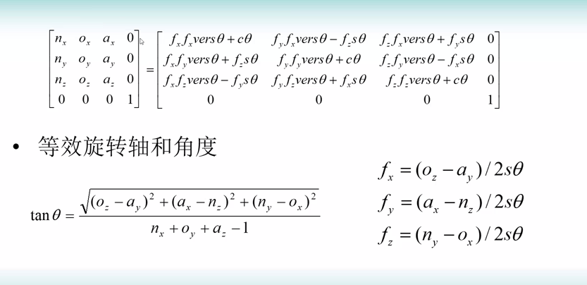

作业：

$\begin{bmatrix} 1 &0 &0 &0 \\ 0 &0.866 &-0.500 &10 \\ 0 &0.500 &0.866 &-20 \\ 0 &0 &0 &1 \\\end{bmatrix}\begin{bmatrix} 0.866 &-0.500 &0 &11 \\ 0.508 &0.866 &0 &-1 \\ 0 &0 &1 &8 \\ 0 &0 &0 &1 \\\end{bmatrix}^{T}\begin{bmatrix} 0.866 &-0.500 &0 &-3 \\ 0.433 &0.750 &-0.5 &-3 \\ 0.250 &0.433 &0.866 &3 \\ 0 &0 &0 &1 \\\end{bmatrix}^{T}$

$\begin{bmatrix} 0.866 &0.508 &0  \\ -0.500 &0.866 &0  \\ 0 &0 &1 \\\end{bmatrix}\begin{pmatrix} 11 \\ -1 \\ 8 \\\end{pmatrix}=\begin{bmatrix}9.018\\- 6.366\\8\end{bmatrix}$

$\begin{bmatrix} 0.866 &0.433 &0.250 \\ -0.500 &0.750 &0.433 \\ 0 &-0.5 &0.866 \\\end{bmatrix}\begin{pmatrix} -3 \\ -3 \\ 3 \\\end{pmatrix}=\begin{bmatrix}- 3.147\\0.549\\4.098\end{bmatrix}$

$\begin{bmatrix} 1 &0 &0 &0 \\ 0 &0.866 &-0.500 &10 \\ 0 &0.500 &0.866 &-20 \\ 0 &0 &0 &1 \\\end{bmatrix}\begin{bmatrix} 0.866 &0.508 &0 &-9.018 \\ -0.500 &0.866 &0 &6.366  \\ 0 &0 &1 &-8 \\ 0 & 0 & 0 & 1\end{bmatrix}\begin{bmatrix} 0.866 &0.433 &0.250 &3.147 \\ -0.500 &0.750 &0.433 &-0.549 \\ 0 &-0.5 &0.866 &-4.098 \\ 0 & 0 & 0 & 1\end{bmatrix}=\begin{bmatrix}0.495956 & 0.755978 & 0.436464 & - 6.57159\\- 0.749956 & 0.624978 & - 0.216519052 & 19.787579156\\- 0.433 & - 0.2165 & 0.874945 & - 28.318335\\0 & 0 & 0 & 1\end{bmatrix}$