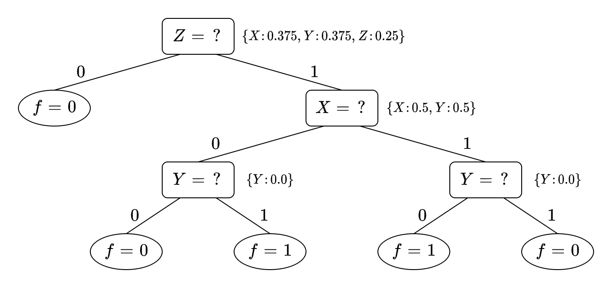
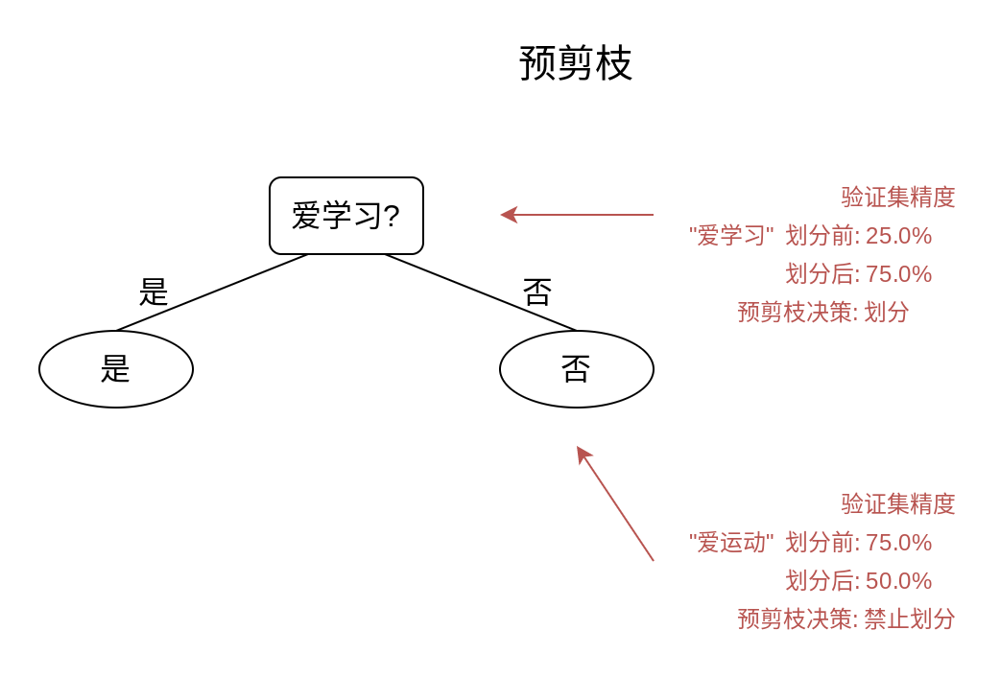
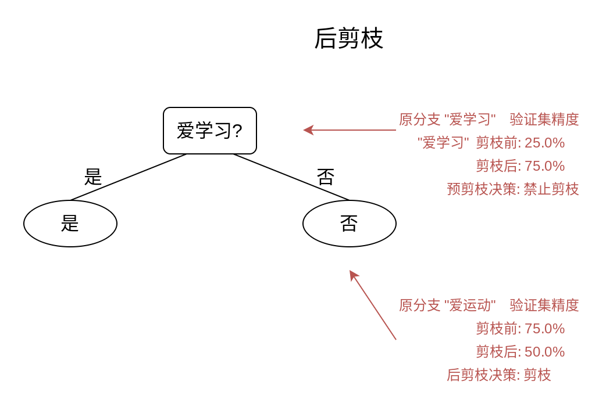
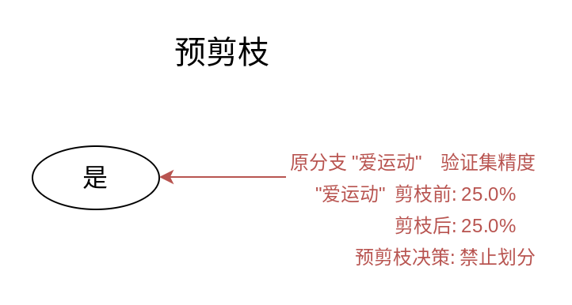
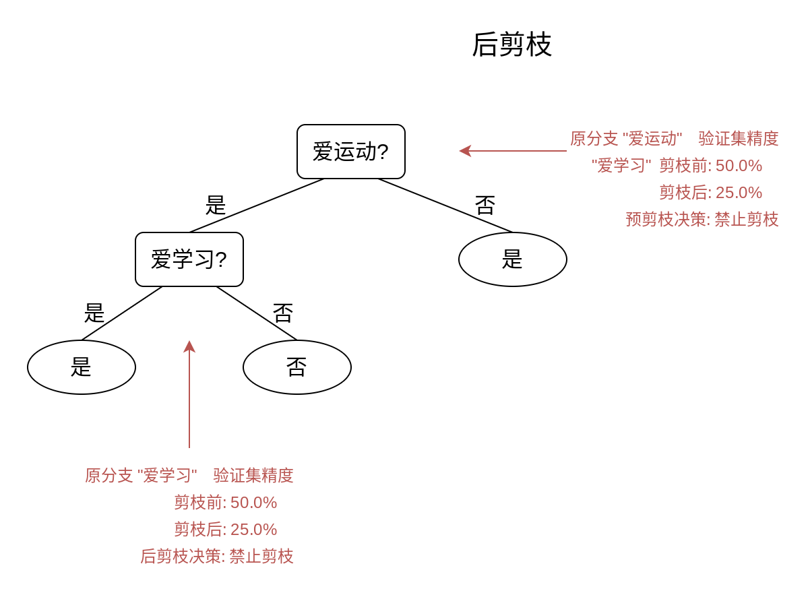
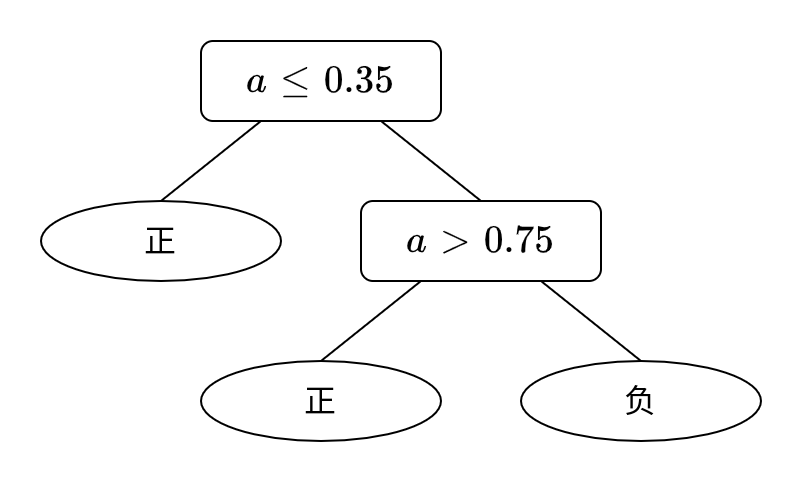
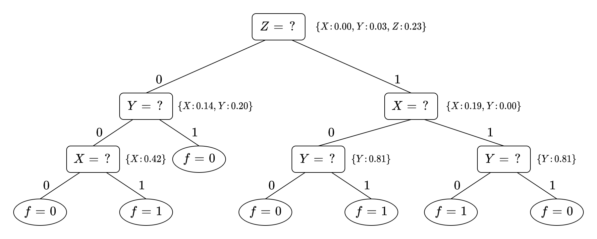

# PS3

## 一、

**(1)**

对于属性值均为有限取值的离散值的训练集来说, 存在与训练集一致的深度有限决策树. 因为对于有限取值的离散值, 每一层都会减少一种待选的属性, 所以深度必然有限.

对于属性值为有无限中取值时, 例如有一种属性是连续值时, 不一定存在与训练集一致的深度有限决策树.

例如我们构造一个只有单个属性和单个标记的训练集 $D = \{ (x_{i}, y_{i}) \}$, 其中

$$
y = D(x) =
\begin{cases}
1, & x \in \mathbb{Q} \\
0, & x \in \mathbb{R} \backslash \mathbb{Q}
\end{cases}
$$

而 $x\in [0,1]$, 即定义域为 $[0,1]$ 的 Dirichlet 函数.

我们这样取出我们的无穷多个训练集样本: 从 $x_1=0$ 开始取, 此时 $i=1$, 不断取出比 $x_{2i-1}$ 大且相邻的有理数 $x_{2i+1}$, 其中 $i=1,2,\cdots$, 并且在两个相邻的有理数 $x_{2i-1}$ 和 $x_{2i+1}$ 之间任取一个无理数 $x_{2i}$, 并使得 $x_{2i-1} < x_{2i} < x_{2i+1}$. 而它们对应的 $y_{i} = D(x_{i})$.

这样, 我们就构造出了一个标记为 $1$ 和 $0$ 交替出现的无穷个样本的训练集.

对于一个这样的训练集, 我们使用处理连续值属性的决策树算法, 我们在训练集中不断地对属性 $x$ 进行划分, 无论划分区间多小, 也不可能得到一个标记 $y$ 完全为 $1$ 或 $0$ 的子集, 因此决策树算法会不断继续下去, 生成深度无限的决策树.

**(2)**

因为 $0 \le p_{k} \le 1$, 则有 $p_k\log_2 p_k \le 0$, 因此

$$
-\sum_{k=1}^{|\mathcal{Y}|}p_k\log_2 p_k \ge 0
$$

令 $-\sum_{k=1}^{|\mathcal{Y}|}p_k\log_2 p_k = 0$, 则有 $p_k\log_2 p_k = 0$

即有当每一个 $p_k = 0$ 或 $p_k = 1$ 时等号成立.

对于原式

$$
\operatorname{Ent}(D) = -\sum_{k=1}^{|\mathcal{Y}|}p_k\log_2 p_k, \sum_{k=1}^{|\mathcal{Y}|}p_k=1
$$

显然在 $0\le p_k\le 0$ 时是上凸函数, 因此是一个凸优化问题.

对应拉格朗日函数为

$$
L(\bm{p}, \lambda) = -\sum_{k=1}^{|\mathcal{Y}|}p_k\log_2 p_k + \lambda(\sum_{k=1}^{|\mathcal{Y}|}p_k-1)
$$

将其转化为矩阵形式则有

$$
L(\bm{p}, \lambda) = -\bm{p}^{\mathrm{T}}\log_2 \bm{p} + \lambda(\bm{1}^{\mathrm{T}}\bm{p}-1)
$$

对其求微分得

$$
\begin{aligned}
&\quad\ \mathrm{d} L(\bm{p}, \lambda) \\
&=\operatorname{tr}(-\bm{p}^{\mathrm{T}}(\mathrm{d}\log_2 \bm{p}) - (\mathrm{d}\bm{p})^{\mathrm{T}}\log_2 \bm{p} + \lambda \bm{1}^{\mathrm{T}}\mathrm{d}\bm{p})  \\
&= -\operatorname{tr}(\bm{p}^{\mathrm{T}}(\frac{1}{\ln 2}\ln' \bm{p} \odot \mathrm{d}\bm{p})) - \operatorname{tr}((\mathrm{d}\bm{p})^{\mathrm{T}}\log_2 \bm{p}) + \lambda \operatorname{tr}(\bm{1}^{\mathrm{T}}\mathrm{d}\bm{p}) \\
&= -\frac{1}{\ln 2}\operatorname{tr}(\bm{p}^{\mathrm{T}}(\ln' \bm{p} \odot \mathrm{d}\bm{p})) - \frac{1}{\ln 2}\operatorname{tr}((\mathrm{d}\bm{p})^{\mathrm{T}}\ln \bm{p})+ \frac{1}{\ln 2}\operatorname{tr}(\lambda \ln 2\bm{1}^{\mathrm{T}}\mathrm{d}\bm{p}) \\
&= -\frac{1}{\ln 2}\operatorname{tr}((\bm{p}\odot \ln' \bm{p})^{\mathrm{T}}\mathrm{d}\bm{p}) - \frac{1}{\ln 2}\operatorname{tr}(\ln \bm{p}^{\mathrm{T}} \mathrm{d}\bm{p})  - \frac{1}{\ln 2}\operatorname{tr}(-\lambda \ln 2\bm{1}^{\mathrm{T}}\mathrm{d}\bm{p}) \\
&= -\frac{1}{\ln 2}\operatorname{tr}(\bm{1}^{\mathrm{T}}\mathrm{d}\bm{p}) - \frac{1}{\ln 2}\operatorname{tr}(\ln \bm{p}^{\mathrm{T}} \mathrm{d}\bm{p})  - \frac{1}{\ln 2}\operatorname{tr}(-\lambda \ln 2\bm{1}^{\mathrm{T}}\mathrm{d}\bm) \\
&= \operatorname{tr}(- \frac{1}{\ln 2}((1-\lambda \ln 2)\bm{1}+\ln \bm{p})^{\mathrm{T}} \mathrm{d}\bm{p}) \\
\end{aligned}
$$

因此有

$$
\frac{\partial L(\bm{p}, \lambda)}{\partial \bm{p}} = - \frac{1}{\ln 2}((1-\lambda \ln 2)\bm{1}+\ln \bm{p})
$$

令 $\displaystyle \frac{\partial L(\bm{p}, \lambda)}{\partial \bm{p}} = 0$ 即可知 $\bm{p}$ 各分量相同, 即 $p_{i} = p_{j}, i \neq j$

再由我们知道 $\displaystyle \sum_{k=1}^{|\mathcal{Y}|}p_k = 1$ 则有

$$
p_k = \frac{1}{|\mathcal{Y}|}
$$

即当 $\displaystyle p_k = \frac{1}{|\mathcal{Y}|}$ 时我们取得最大值

$$
\operatorname{Ent}(D) = -\sum_{k=1}^{|\mathcal{Y}|}\frac{1}{|\mathcal{Y}|}\log_2\frac{1}{|\mathcal{Y}|} = \log_2 |\mathcal{Y}|
$$

**(3)**

$$
\begin{aligned}
&\quad\ \operatorname{Gain}(D, a)  \\
&= \operatorname{Ent}(D) - \sum_{v=1}^{V}\frac{|D^{v}|}{|D|}\operatorname{Ent}(D^{v}) \\
&= -\sum_{v=1}^{V}\frac{|D^{v}|}{|D|}\sum_{k=1}^{|\mathcal{Y}|}p_k\log_2 p_k + \sum_{v=1}^{V}\frac{|D^{v}|}{|D|}\sum_{k=1}^{|\mathcal{Y}|}p_k^{v}\log_2 p_k^{v} \\
&= -\sum_{k=1}^{|\mathcal{Y}|}\sum_{v=1}^{V}\frac{|D^{v}|}{|D|}\frac{|D_{k}|}{|D|}\log_2 \frac{|D_{k}|}{|D|} + \sum_{k=1}^{|\mathcal{Y}|}\sum_{v=1}^{V}\frac{|D^{v}|}{|D|}\frac{|D_k^{v}|}{|D^{v}|}\log_2 \frac{|D_k^{v}|}{|D^{v}|} \\
&= -\sum_{k=1}^{|\mathcal{Y}|}\sum_{v=1}^{V}\frac{|D_k^{v}|}{|D|}\frac{|D|}{|D_k^{v}|}\frac{|D^{v}|}{|D|}\frac{|D_{k}|}{|D|}\log_2 \frac{|D_{k}|}{|D|} + \sum_{k=1}^{|\mathcal{Y}|}\sum_{v=1}^{V}\frac{|D_k^{v}|}{|D|}\log_2 \frac{|D_k^{v}|}{|D^{v}|} \\
&= -\sum_{k=1}^{|\mathcal{Y}|}\sum_{v=1}^{V}\frac{|D_k^{v}|}{|D|}\log_2 \frac{|D_{k}|}{|D|}\cdot 2^{\frac{|D^{v}|}{|D_k^{v}|}\frac{|D_{k}|}{|D|}} + \sum_{k=1}^{|\mathcal{Y}|}\sum_{v=1}^{V}\frac{|D_k^{v}|}{|D|}\log_2 \frac{|D_k^{v}|}{|D^{v}|} \\
&= -\sum_{k=1}^{|\mathcal{Y}|}\sum_{v=1}^{V}\frac{|D_k^{v}|}{|D|}\log_2 \frac{|D^{v}|}{|D_k^{v}|}\frac{|D_{k}|}{|D|}\cdot 2^{\frac{|D^{v}|}{|D_k^{v}|}\frac{|D_{k}|}{|D|}} \\
&\ge -\log_2\sum_{k=1}^{|\mathcal{Y}|}\sum_{v=1}^{V}\frac{|D_k^{v}|}{|D|}\frac{|D^{v}|}{|D_k^{v}|}\frac{|D_{k}|}{|D|}\cdot 2^{\frac{|D^{v}|}{|D_k^{v}|}\frac{|D_{k}|}{|D|}} \\
&= -\frac{|D^{v}|}{|D_k^{v}|}\frac{|D_{k}|}{|D|}\log_2\sum_{v=1}^{V}\frac{|D^{v}|}{|D|}\sum_{k=1}^{|\mathcal{Y}|}\frac{|D_{k}|}{|D|} \\
&= -\frac{|D^{v}|}{|D_k^{v}|}\frac{|D_{k}|}{|D|}\log_2 1 \cdot 1 \\
&= 0 \\
\end{aligned}
$$

其中不等号使用了 Jensen 不等式, 即 $\mathbb{E}[f(x)] \ge f(\mathbb{E}[x])$, 其中 $f$ 是凸函数.

因此信息增益 $\operatorname{Gain}(D, a)$ 非负.

## 二、

**(1)**

通过写了一个 Python 程序计算得出:

对于一开始的八个样本, $X$ 信息增益为 $0$, $Y$ 信息增益为 $0$, $Z$ 信息增益为 $0.31$, 因此首先选择 $Z$.

其他同理, 最后得出如下图:

**(2)**

对于一开始的八个样本, $X$ 基尼指数为 $0.375$, $Y$ 信息增益为 $0.375$, $Z$ 信息增益为 $0.25$, 因此首先选择最小的 $Z$.

其他同理, 最后得出如下图:

## 三、

**(1)**

对于一开始的五个样本, "爱运动" 的信息增益为 $0.42$, "爱学习" 的信息增益也为 $0.42$, 所以两棵决策树的第一层无论是选择 "爱运动" 还是 "爱学习", 均是正确的.

对于左边的决策树, 第二层的 "爱运动" 的信息增益为 $0.92$, 因此左边的决策树验证完毕.

对于右边的决策树, 第二层的 "爱学习" 的信息增益为 $0.92$, 因此右边的决策树验证完毕.

**(2)**

对于左边的决策树:

首先是预剪枝, 对于 "预剪枝" 若不进行剪枝, 那么每个样本都会被标记为 "是", 编号 $\{ 6 \}$ 的样例被分类正确, 精度为 $25.0\%$. 若进行划分, 那么第 $6$ 个或第 $7$ 个样例会被分类错误, 第 $8$ 和第 $9$ 个样例分类正确, 精度为 $75.0\%$, 因此我们进行划分.

对于 "爱学习", 如果进行剪枝, 那么第 $9$ 个样例会从正确转为错误, 使得验证集精度变为 $50\%$, 因此我们禁止划分.

同理有后剪枝的结果:

对于右边的决策树:

首先是预剪枝, 对于 "预剪枝" 若不进行剪枝, 那么每个样本都会被标记为 "是", 编号 $\{ 6 \}$ 的样例被分类正确, 精度为 $25.0\%$. 若进行划分, 只有第 $8$ 个样例会被分类正确, 精度为 $25.0\%$, 因此我们禁止划分.

同理有后剪枝的结果:

**(3)**

对于左边的决策树来说, 预剪枝和后剪枝在训练集上的准确率均为 $80\%$, 在测试集上的准确率均为 $75\%$.

对于右边的决策树来说, 预剪枝在训练集上的准确率均为 $60\%$, 在测试集上的准确率均为 $25\%$. 后剪枝在训练集上的准确率均为 $100\%$, 在测试集上的准确率均为 $50\%$.

因此我们可知, 后剪枝的拟合能力较强.

## 四、

**(1)**

对于第一层,

计算可得 $T_a = \{ 3.5, 5.0, 7.5 \}$

并且有 $\displaystyle \operatorname{Ent}(D) = -\sum_{k=1}^{2}\frac{1}{2}\log_2 \frac{1}{2} = 1.0$

同理可以算出 $\displaystyle \operatorname{Gain}(D, a, 3.5) = 0.31, \operatorname{Gain}(D, a, 5.0) = 0.0, \operatorname{Gain}(D, a, 7.5) = 0.31$

因此第一层是以 $3.5$ 为划分点进行划分.

对于第二层,

同理可以算出 $\displaystyle \operatorname{Gain}(D', a, 5.0) = 0.25, \operatorname{Gain}(D', a, 7.5) = 0.92$

因此第一层是以 $7.5$ 为划分点进行划分.

**(2)**

使用公式

$$
\operatorname{Gain}(D, a) = \rho \times (\operatorname{Ent}(\tilde{D}) - \sum_{v=1}^{V}\tilde{r}_v \operatorname{Ent}(\tilde{D}^{v}))
$$

$\operatorname{Gain}(D, X) = 0.0, \operatorname{Gain}(D, Y) = 0.03, \operatorname{Gain}(D, Z) = 0.24$

因此我们第一层选择 $Z$ 节点进行划分, 并且通过 $w_{\bm{x}}' = \tilde{r}_v \cdot w_{\bm{x}}$ 不断调整权重值.

其他层同理, 最终可得

与问题二第 1 小问构造的决策树进行比较我们可以看出, 使用带缺失值的样本进行决策, 由于带缺失值样本会被不断复制到不同的分支中, 并且要维持每个样本的权重, 所以需要更大的计算量.

局限性就是, 由于带缺失值样本进入到了不同的分支中, 可能会导致一些分支出现了本不该有的节点, 导致过拟合, 例如这里的 $Z = 0$ 分支.

**(3)**

用类似于构造决策树的方式, 碰到缺失值, 就划分给每个分支对应的权重.

下面我们统一使用问题二左边的决策树进行讨论.

对于编号 6 的样例, 有 $0.5 + 0.0 = 50\%$ 的概率, 标签为 "是", 有 $0.0 + 0.5 = 50\%$ 的概率, 标签为 "否". 默认选择标签为 "是".

对于编号 7 的样例, 有 $100\%$ 的概率, 标签为 "是".

对于编号 8 的样例, 有 $0.5 + 0.5 = 1.0 = 100\%$ 的概率, 标签为 "是".

对于编号 9 的样例, 有 $50\%$ 的概率, 标签为 "是", 有 $50\%$ 的概率, 标签为 "否". 默认选择标签为 "是".

该方法的特点是, 并不能确定性地输出一个标签, 只能输出选择各个标签的各个概率值.

该方法的局限性是, 最后划分很有可能各个标签有着相同的概率, 只能任意从中选择一个, 很有可能会选择错误.

