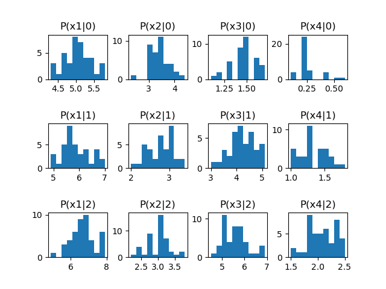

# PS5

## 一、

**(1)**

我们设定一个新的分类 $c_h$, 用其来表示 "拒绝", 也就是交给人类专家处理. 则我们可知, 将 $\bm{x}$ 分类为 $c_h$ 的期望损失, 也即风险为 $\lambda_h$, 所以有 $R(c_h|\bm{x}) = c_h$.

令 $\mathcal{Y}' = \mathcal{Y} \cup \{ c_h \}$. 此时, 贝叶斯最优分类器 $h^{*}(\bm{x})$ 的表达式仍可以写为

$$
h^{*}(\bm{x}) = \argmin_{c \in \mathcal{Y}'} R(c|\bm{x})
$$

其中 $R(c_h|\bm{x}) = c_h$.

**(2)**

当 $R(c_h|\bm{x})$ 是 $R(c_i|\bm{x})$ 之中的最小值, 也就是 $\displaystyle c_h \le R(c_i|\bm{x})=\sum_{j=1}^{N}\lambda_{ij}P(c_j|\bm{x})$, 对于所有 $1 \le i \le N$ 时, 分类器将一直拒绝分类.

如果令表达式与 $\bm{x}$ 无关, 则我们有 $\displaystyle c_h \le \min\{ \sum_{j=1}^{N}\lambda_{ij}P(c_j|\bm{x}) \} = \min\{ \lambda_{ij} \}$. 也即是 $c_h$ 小于等于 $\lambda_{ij}$ 的最小值时.

当 $R(c_h|\bm{x})$ 是 $R(c_i|\bm{x})$ 之中的最大值, 也就是 $\displaystyle c_h \ge R(c_i|\bm{x})=\sum_{j=1}^{N}\lambda_{ij}P(c_j|\bm{x})$, 对于所有 $1 \le i \le N$ 时, 分类器将一直拒绝分类.

如果令表达式与 $\bm{x}$ 无关, 则我们有 $\displaystyle c_h \le \max\{ \sum_{j=1}^{N}\lambda_{ij}P(c_j|\bm{x}) \} = \max\{ \lambda_{ij} \}$. 也即是 $c_h$ 大于等于 $\lambda_{ij}$ 的最大值时.

**(3)**

我们将二分类问题两种分类的风险和拒绝的风险计算得

$R(c_1|\bm{x}) = \lambda_{11}P(c_1|\bm{x}) + \lambda_{12}P(c_2|\bm{x}) = 1-p_1$

$R(c_2|\bm{x}) = \lambda_{21}P(c_1|\bm{x}) + \lambda_{22}P(c_2|\bm{x}) = p_1$

$R(c_h|\bm{x}) = \lambda_h$

由贝叶斯最优分类器表达式 $\displaystyle h^{*}(\bm{x}) = \argmin_{c \in \mathcal{Y}'} R(c|\bm{x})$ 可知

当 $p_1 \le \lambda_h$ 且 $p_1 \le 1-p_1$, 即 $p_1 \le \min\{ \lambda_h, 0.5 \} = 0.3$ 时, 预测为第二类.

当 $\lambda_h \le 1-p_1$ 且 $\lambda_h \le p_1$, 即 $0.3 = \lambda_h \le p_1 \le 1-\lambda_h = 0.7$ 时, 拒绝预测.

当 $1-p_1 \le \lambda_h$ 且 $1-p_1 \le p_1$, 即 $p_1 \ge \max\{ 1-\lambda_h, 0.5 \} = 0.7$ 时, 预测为第二类.

则我们有 $\theta_1 = 0.3, \theta_2 = 0.7$.


## 二、

**(1)**

我们令 $D = \{ x_1, x_2, \cdots, x_{99} \}$.

使用最大似然估计, 假设硬币正面向上的概率为 $\theta$, 记 $x = 1$ 为正面朝上, $x = 0$ 为反面朝上. 则对数似然为

$$
\begin{aligned}
LL(\theta) &= \log P(D | \theta)  \\
&= \sum_{x \in D} \log P(x|\theta)  \\
&= \sum_{x \in D} \log \theta \\
&= 99\log \theta
\end{aligned}
$$

则参数 $\theta$ 的极大似然估计为 $\displaystyle \hat{\theta} = \argmax_{\theta} LL(\theta) = 1.0$.

则第 100 次抛硬币正面朝上的概率为 $P(1|\theta) = \theta = 1.0$.

**(2)**

如果依然使用频率主义学派的思想, 认为参数 $\theta$ 是一个客观存在的固定值, 那么根据专家的见解 "肯定有 50% 的概率正面向上", 则有 $\theta = 0.5$. 则在第 100 次抛硬币时, 其正面朝上的概率为 $P(1|\theta) = \theta = 0.5$.

如果使用贝叶斯学派的思想, 那么其正面朝上的概率我们会在第 (3) 问中用类似的方法求出. 

**(3)**

我们令 $D = \{ x_1, x_2, \cdots, x_{400} \}$.

首先做极大似然估计:

对数似然为

$$
\begin{aligned}
LL(\theta) &= \log P(D | \theta)  \\
&= \sum_{x \in D} \log P(x|\theta)  \\
&= 100\log \theta + 300\log (1-\theta) \\
&= 100(\log \theta + 3 \log(1-\theta))
\end{aligned}
$$

则参数 $\theta$ 的极大似然估计为 $\displaystyle \hat{\theta} = \argmax_{\theta} LL(\theta) = 0.25$.

然后做最大后验估计:

由贝叶斯公式可知

$$
P(\theta|D) = \frac{P(D|\theta)P(\theta)}{P(D)}
$$

由于先对于 $\theta$ 来说, $P(x)$ 与 $\theta$ 无关, 可以视作常数, 因此

$$
\hat{\theta} = \argmax_{\theta} P(\theta|D) = \argmax_{\theta} P(D|\theta)P(\theta)
$$

由于专家认为 $\displaystyle \theta \sim \mathcal{N}(\frac{1}{2}, \frac{1}{900})$, 因此先验为 $\displaystyle P(\theta) = \frac{1}{\sqrt{2\pi}\sigma}e^{-\frac{(\theta-\mu)^{2}}{2\sigma^{2}}} = \frac{1}{30\sqrt{2\pi}}e^{-450(\theta-0.5)^{2}}$.

则有

$$
\begin{aligned}
\hat{\theta} &= \argmax_{\theta} P(D|\theta)P(\theta)  \\
&= \argmax_{\theta} \theta^{100} \cdot (1-\theta)^{300} \cdot \frac{1}{30\sqrt{2\pi}}e^{-450(\theta-0.5)^{2}}  \\
&= \argmax_{\theta} 100\log\theta + 300\log(1-\theta) -450(\theta-0.5)^{2}  \\
&= \argmax_{\theta} 2\log\theta + 6\log(1-\theta) -9(\theta-0.5)^{2}  \\
\end{aligned}
$$

令 $L(\theta) = 2\log\theta + 6\log(1-\theta) -9(\theta-0.5)^{2}$, 则有

$$
\begin{aligned}
\frac{\mathrm{d}L(\theta)}{\mathrm{d}\theta}
&= \frac{2}{\theta} - \frac{6}{1-\theta} - 18\theta + 9  \\
&= \frac{- 18 \theta^{3} + 27 \theta^{2} - \theta - 2}{\theta (\theta - 1)}  \\
\end{aligned}
$$

令 $\displaystyle - 18 \theta^{3} + 27 \theta^{2} - \theta - 2 = 0$ 且 $0 < \theta < 1$ 可得 $\displaystyle \hat{\theta} = \theta = \frac{1}{3} \thickapprox 0.33$.

**(4)**

极大似然估计是频率主义学派的思想, 认为参数 $\theta$ 是一个客观存在的固定值, 可以通过优化似然函数等准则来确定参数值, 因此最后的估计出的 $\theta$ 是由所测数据唯一决定的, 不会被人类专家的先验概率知识影响, 因此得到的结果常常比较 "极端". 例如第 (1) 问中 $\theta$ 被干脆地估计成了 $1.0$, 也就是必然事件. 而第 (3) 问中地极大似然估计所得结果是 $0.25$, 比较偏离 $0.5$.

最大后验估计是贝叶斯学派地思想, 认为参数 $\theta$ 是未观察到的随机变量, 其本身也可以有分布, 而不是一个固定值. 所以我们可以引入人类专家的先验 $\theta \sim \mathcal{N}(\frac{1}{2}, \frac{1}{900})$, 然后用其参与 $\theta$ 的估计. 最后得出的结果受数据影响也较小, 因此最终结果 $0.33$ 没有那么偏离 $0.5$.


## 三、

**(1)**

检查训练集上类别分类情况可知, 分类为类别 $0$ 的数量为 $39$, 分类为类别 $0$ 的数量为 $37$, 分类为类别 $0$ 的数量为 $44$.

由题意可知 $n=120$. 设随机变量 $Y_0$ 为 $n$ 次中分类为类别 $0$ 的次数, $Y_1$ 为分为类别 $1$ 的次数, $Y_2$ 为分为类别 $2$ 的次数. 则我们有多项分布

$$
P(Y_0=y_0, Y_1=y_1, Y_2=y_2) = \frac{n!}{y_0!y_1!y_2!}p_0^{y_0}p_1^{y_1}p_2^{y_2}
$$

其中 $y_0+y_1+y_2=n$, $p_0+p_1+p_2=1$, $0 \le p_i \le 1$, 且 $p_0, p_1, p_2$ 分别对应分类为对应类别的概率.

由极大似然估计可知

$$
\begin{aligned}
\hat{p}_0, \hat{p}_1, \hat{p}_2 & = \argmax_{p_0, p_1, p_2}P(Y_0=39, Y_1=37, Y_2=44)  \\
& = \argmax_{p_0, p_1, p_2}\frac{120!}{39!37!44!}p_0^{39}p_1^{37}p_2^{44}  \\
& = \argmax_{p_0, p_1, p_2}39\log p_0 + 37\log p_1 + 44\log p_2  \\
\end{aligned}
$$

我们编写 Python 代码优化可得最终结果

$$
\hat{p}_0 = 0.32500634, \hat{p}_1 = 0.30835317, \hat{p}_2 = 0.3666405
$$

因此先验为

$$
P(y) = \begin{cases}
  0.32500634, & y = 0 \\
  0.30835317, & y = 1 \\
  0.3666405, & y = 2 \\
\end{cases}
$$

**(2)**

代码为:

```python
GNB_classifier = GaussianNB()
GNB_classifier.fit(feature_train, label_train)
print(f"score: {GNB_classifier.score(feature_test, label_test)}")
```

最终测试性能得分为 $0.9666667$.

**(3)**

代码为:

```python
GNB_classifier = GaussianNB(priors=[1./3., 1./3., 1./3.])
GNB_classifier.fit(feature_train, label_train)
print(f"score: {GNB_classifier.score(feature_test, label_test)}")
```

手动指定先验为三个类上的均匀分布, 即各个类均为 $\frac{1}{3}$, 最终测试性能得分仍为 $0.9666667$.

**(4)**



我们画出每个类别 ($y=0,1,2$) 下不同特征 $(x_1, x_2, x_3, x_4)$ 对应的频率直方图, 这些图像部分地展现了其真实的数值分布的形状, 我们可以根据这些图像形状判断出应该使用哪一类概率分布形式.

如图所示, 基本所有图像都呈现出 "中间高, 两边低" 的形状, 基本没有出现 "均匀分布" 或者 "多峰" 的形状, 因此我们选择高斯分布, 就能较为真实地反映条件概率的形式.

