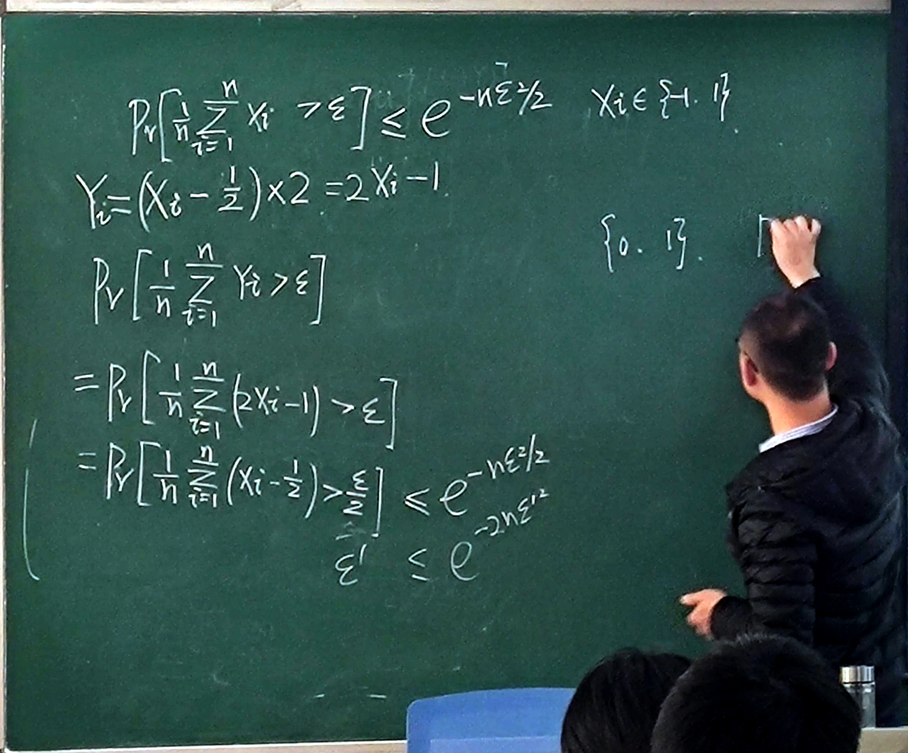

# Chernoff 方法

## Chernoff 方法

根据 Markov 不等式有

$\displaystyle P[X\geqslant \epsilon]=P[e^{tX}\geqslant e^{t\epsilon}]\leqslant e^{-t\epsilon}E[e^{tX}]$

特别地, 有

$\displaystyle P[X\geqslant \epsilon]\leqslant \min_{t>0}\{e^{-t\epsilon}E[e^{tX}]\}$

同理

$\displaystyle P[X-E(X)\leqslant -\epsilon]=P[e^{t(X-E(X))}\geqslant e^{-\epsilon t}]\leqslant e^{\epsilon t}E[e^{t(X-E(X))}]$

## 二值 Chernoff 界

$\displaystyle X_1,X_2,\cdots,X_{n}$ 相互独立且 $X_{i}\sim \mathrm{Ber}(p_{i})$, 令 $\displaystyle \mu=\sum_{i=1}^{n}E[X_{i}]=\sum_{i=1}^{n}p_{i}$, 对任意 $\epsilon>0$ 有

$\displaystyle P[\sum_{i=1}^{n}X_{i}\geqslant (1+\epsilon)\mu]\leqslant \left( \frac{e^{\epsilon}}{(1+\epsilon)^{1+\epsilon}} \right)^{\mu}$

同理有

$\displaystyle P[\sum_{i=1}^{n}X_{i}\leqslant (1-\epsilon)\mu]\leqslant \left( \frac{e^{-\epsilon}}{(1-\epsilon)^{1-\epsilon}} \right)^{\mu}\leqslant e^{\frac{\mu \epsilon^{2}}{2}}$

**证明:**

$\displaystyle E[e^{tX_{i}}]=1-p_{i}+p_{i}e^{t}\leqslant e^{\pi(e^{t}-1)}$

$
\begin{aligned}
&\quad\ P[\sum_{i=1}^{n}X_{i}>(1+\epsilon)\mu] \\
&= P[e^{t\sum_{i=1}^{n}X_{i}}>e^{t(1+\epsilon)\mu}] \\
&\leqslant e^{-t(1+\epsilon)\mu}\prod_{i=1}^{n} E[e^{tX_{i}}] \\
&\leqslant e^{-(1+\epsilon)t\mu}e^{\mu(e^{t}-1)} \\
&= e^{\mu(e^{t}-1)-(1+\epsilon)t\mu}
\end{aligned}
$

$\because \displaystyle f(t)=e^{t}-1-(1+\epsilon)t$

$\therefore \displaystyle f'(t)=e^{t}-(1+\epsilon)$

$\therefore \displaystyle t=\ln(1+\epsilon)>0$

代入 $t$ 即可

## Rademacher 随机变量

若随机变量 $X \in \{+1,-1\}$ 满足 $\displaystyle P(X=+1)=P(X=-1)=\frac{1}{2}$, 则有

$\displaystyle P\left[ \frac{1}{n}\sum_{i=1}^{n}X_{i}\geqslant \epsilon \right]\leqslant e^{-\frac{n\epsilon^{2}}{2}}$

$\displaystyle P\left[ \frac{1}{n}\sum_{i=1}^{n}X_{i}\leqslant -\epsilon \right]\leqslant e^{-\frac{n\epsilon^{2}}{2}}$

证明:

## 有界的 Chernoff 不等式

**证明:**

