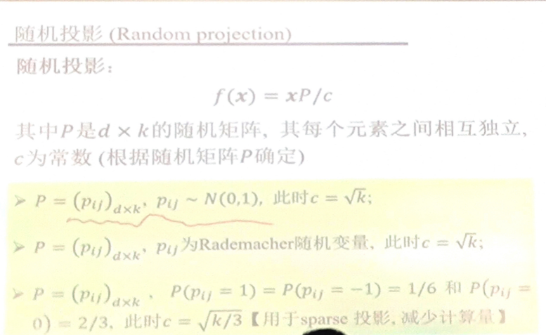
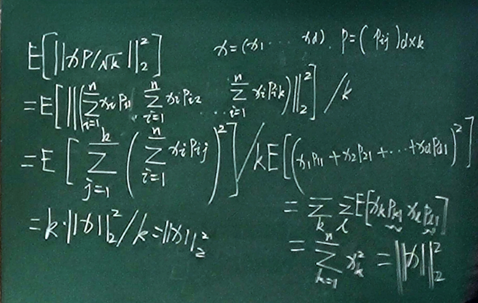
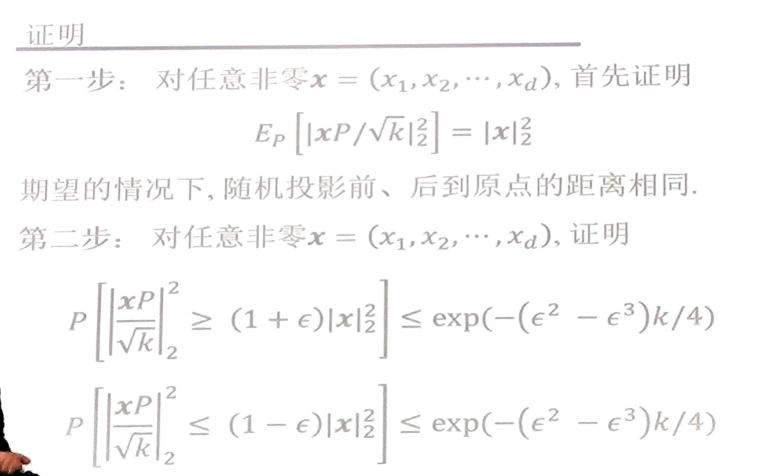
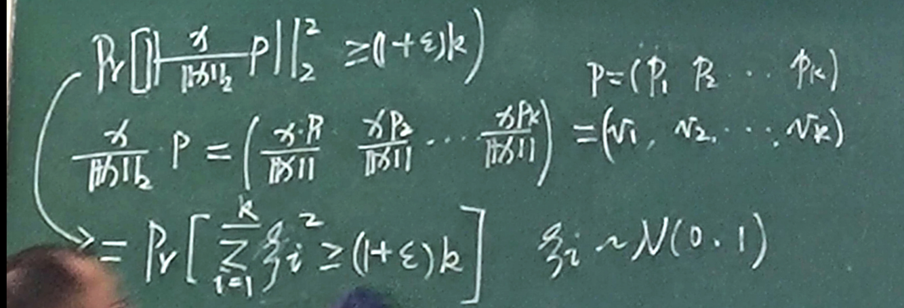

# 保距变换

## 随机投影

$\displaystyle f(x)=\frac{xP}{c}$

其中 $P$ 是 $d\times k$ 的随机矩阵, 其中每个元素相互独立, $c$ 为常数 (根据随机矩阵 $P$ 确定).

看作

$\displaystyle (1-\epsilon)\|z_{ij}\|\leqslant \|z_{ij}\frac{P}{\sqrt{k}}\|\leqslant (1+\epsilon)\|z_{ij}\|$

先证明

$\displaystyle E_{p}[\|\frac{xP}{\sqrt{k}}\|_{2}^{2}]=\|x\|_{2}^{2}$

