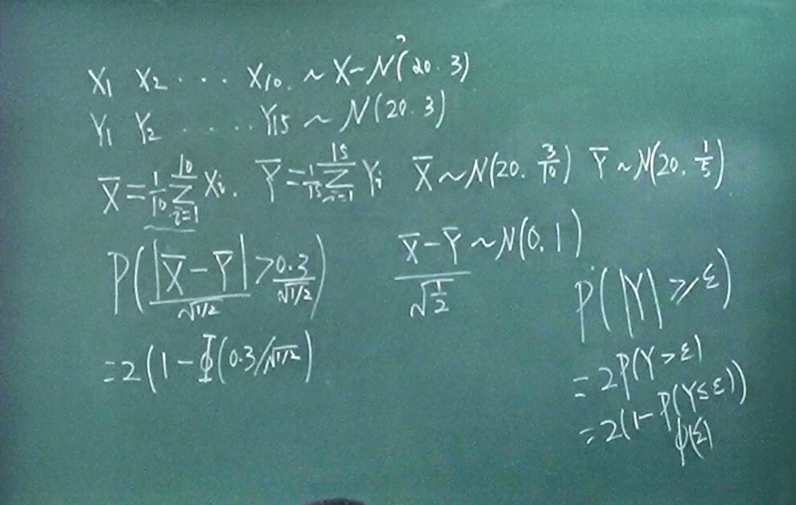
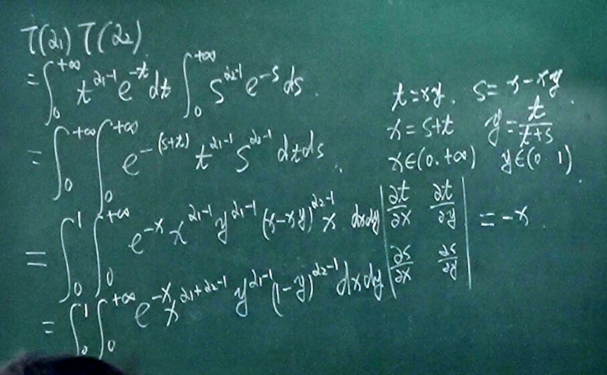
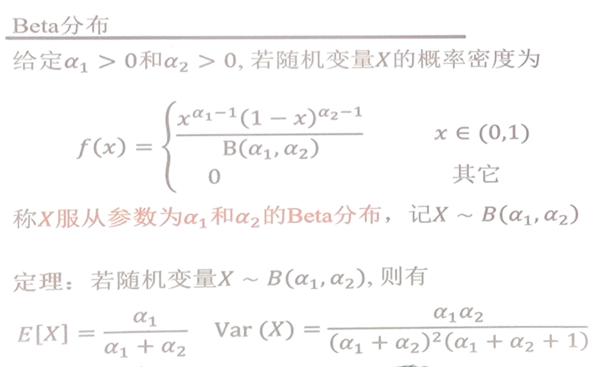
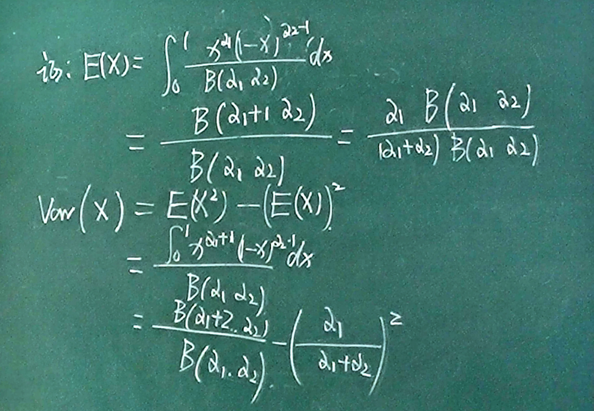
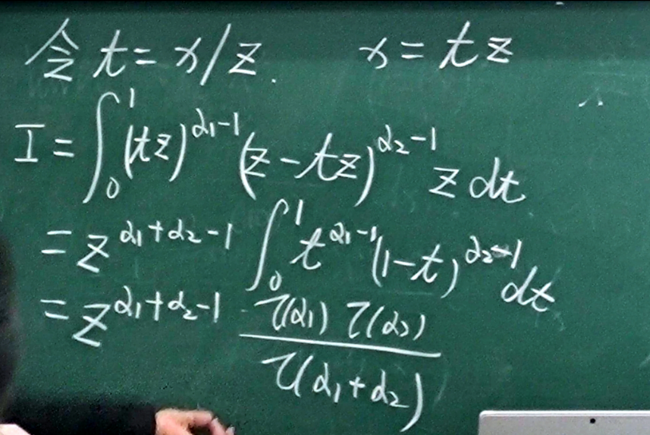
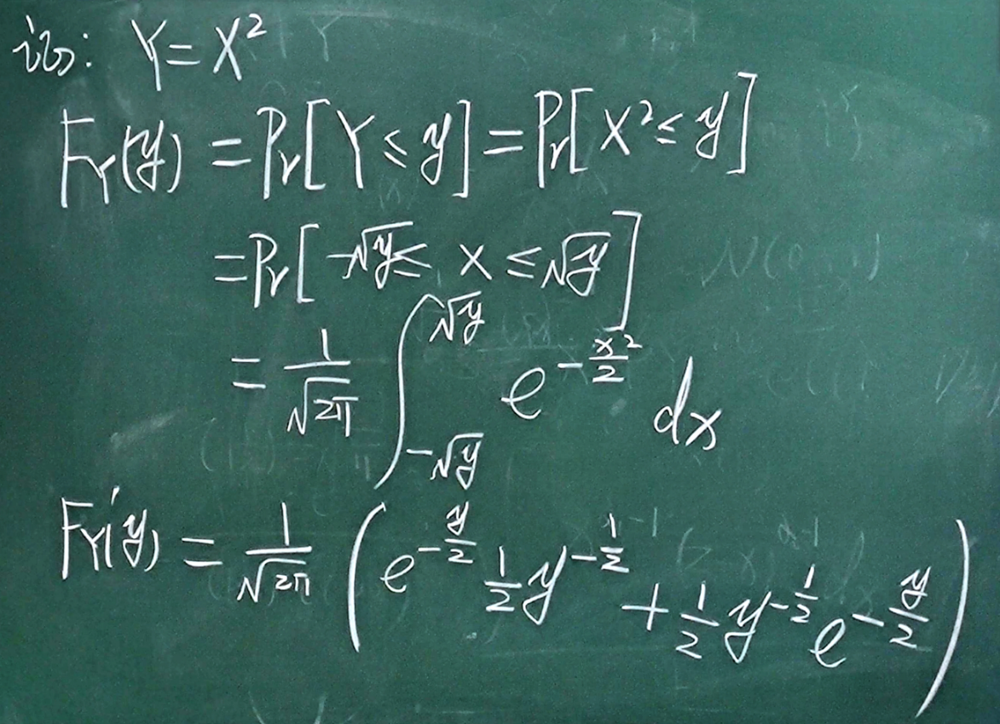

# 统计

## 样本方差与修正方差

## 原点矩与中心矩

$\displaystyle \frac{1}{n}\sum_{i=1}^{n}X_{i}^{k}$ 和 $\displaystyle \frac{1}{n}\sum_{i=1}^{n}(X_{i}-\bar{X})^{k}$

## 次序统计量

$X_{(k)}$ 是第 $k$ 小的样本.

$\displaystyle F_{k}(x)=\sum_{r=k}^{n}\binom{n}{r}[F(x)]^{r}[1-F(x)]^{n-r}$

$\displaystyle f_{k}(x)=\frac{n!}{(k-1)!(n-k)!}[F(x)]^{k-1}[1-F(x)]^{n-k}f(x)$

结论:

$\displaystyle \sum_{r=k}^{n}\binom{n}{r}p^{r}(1-p)^{n-r}=\frac{n!}{(k-1)!(n-k)!}\int_{0}^{p}t^{k-1}(1-t)^{n-k}\mathrm{d}t$

移项, 对 $p$ 求导, 可得 $g'(p)=0$, 然后就恒等于常数 $g(p)=0$, 便有等式成立.

## Beta 函数

$\displaystyle \mathrm{Beta}(\alpha_1, \alpha_2)=\int_{0}^{1}x^{\alpha_1-1}(1-x)^{\alpha_2-1}\mathrm{d}x$

第一类欧拉积分函数

$\displaystyle \mathrm{Beta}(\alpha_1, \alpha_2)=\mathrm{Beta}(\alpha_2, \alpha_1)$

## $\Gamma$ - 函数

$\displaystyle \Gamma(\alpha)=\int_{0}^{+\infty}x^{\alpha-1}e^{-x}\mathrm{d}x$

第二类欧拉积分函数

定理: $\Gamma(\alpha)=(\alpha-1)\Gamma(\alpha-1)$

$\displaystyle \Gamma(\alpha)=\int_{0}^{+\infty}x^{\alpha-1}e^{-x}\mathrm{d}x=-\int_{0}^{+\infty}x^{\alpha-1}\mathrm{d}e^{-x}=-[x^{\alpha-1}e^{-x}]_{0}^{+\infty}+\int_{0}^{+\infty}(\alpha-1)x^{\alpha-2}e^{-x}\mathrm{d}x=(\alpha-1)\Gamma(\alpha-1)$

然后 $\Gamma(n)=(n-1)!$

定理: $\displaystyle \mathrm{Beta}(\alpha_1, \alpha_2)=\frac{\Gamma(\alpha_1)\Gamma(\alpha_2)}{\Gamma(\alpha_1+\alpha_2)}$

推论: $\displaystyle \mathrm{Beta}(\alpha_1, \alpha_2)=\frac{\alpha_1-1}{\alpha_1+\alpha_2-1}\mathrm{Beta}(\alpha_1-1, \alpha_2)$

## 多维 Beta 函数

$\displaystyle \mathrm{Beta}(\alpha_1,\alpha_2,\cdots,\alpha_{k})=\frac{\Gamma(\alpha_1)\Gamma(\alpha_2)\cdots \Gamma(\alpha_{k})}{\Gamma(\alpha_1+\alpha_2+\cdots+\alpha_{k})}$

## Beta 分布

## 均匀分布的第 k 顺序统计量

$\displaystyle X_{(k)}\sim B(k, n-k+1)$

## Gamma 分布

$X\sim \Gamma(\alpha, \gamma)$

$\displaystyle f(x)=\begin{cases} \displaystyle \frac{\lambda^{\alpha}}{\Gamma(\alpha)}x^{\alpha-1}e^{-\lambda x}, & x>0 \\ 0, & x\leqslant 0 \end{cases}$

$\displaystyle E(X)=\frac{\alpha}{\gamma}, D(X)=\frac{\alpha}{\gamma^{2}}$

将其配成另外一个 Gamma 分布, 然后就能消掉了.

## 独立 Gamma 分布相加

$X\sim \Gamma(\alpha_1, \lambda), Y\sim \Gamma(\alpha_2, \lambda), X+Y\sim \Gamma(\alpha_1+\alpha_2, \lambda)$

转变为 Beta 函数, 进而转为 Gamma 函数.

## 正态分布和 Gamma 分布

$\displaystyle Y\sim \Gamma(\frac{1}{2}, \frac{1}{2})$, 密度函数为

$\displaystyle f(x)=\begin{cases} \displaystyle \frac{1}{\sqrt{2\pi}}x^{-\frac{1}{2}}e^{-\frac{x}{2}}, & x>0 \\ 0, & x\leqslant 0 \end{cases}$

性质: 若 $\displaystyle X\sim N(0, 1)$, 则 $X^{2}\sim \Gamma(\frac{1}{2}, \frac{1}{2})$

## Dirichlet 分布

多元随机变量 $X=(X_1,X_2,\cdots,X_{k})$

$\displaystyle f(x)=\begin{cases} \displaystyle \frac{x_{1}^{\alpha_1-1}x_{2}^{\alpha_2-1}\cdots x_{k}^{\alpha_{k}-1}}{B(\alpha_1,\alpha_2,\cdots,\alpha_{k})}, & \sum_{i}x_{i}=1, x_{i}\in (0,1) \\ 0 , & \text{otherwise}  \end{cases}$

Dirichlet 分布是 Beta 分布的一种推广.

真正使用时都是退化到 Gamma 函数的.

设 $\tilde{\alpha}=\alpha_1+\alpha_2+\cdots+\alpha_{k}, \tilde{\alpha}_{i}=$

$\displaystyle E(X_{i})=$

## $\chi^{2}$ 分布

自由度为 $n$.

$X=X_{1}^{2}+\cdots+X_{n}^{2}, X_{i}\sim N(0,1)$

若 $X\sim \chi^{2}(n)$, 则 $E(X)=n, D(X)=2n$

若 $X\sim \chi^{2}(m), Y\sim \chi^{2}(n)$, 则 $X+Y\sim \chi^{2}(m+n)$

## t 分布

$\displaystyle X\sim N(0,1), Y\sim \chi^{2}(n)$

随机变量 $\displaystyle T=\frac{X}{\sqrt{Y / n}}$

自由度为 $n$.

记为 $T\sim t(n)$

$\displaystyle f(x)=\frac{\Gamma(\frac{n+1}{2})}{\Gamma(\frac{n}{2})\sqrt{n\pi}}(1+\frac{x^{2}}{n})^{-\frac{n+1}{2}}, x\in (-\infty,+\infty)$

## F 分布

随机变量 $X\sim \chi^{2}(m), Y\sim \chi^{2}(n)$ 相互独立, 称随机变量

$\displaystyle F=\frac{X / m}{Y / n}$

为服从自由度 $(m,n)$ 的 F 分布, 记作 $F\sim F(m,n)$
