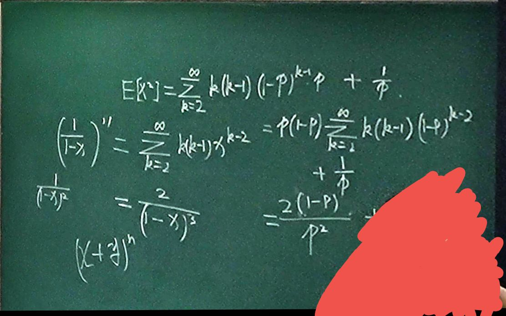
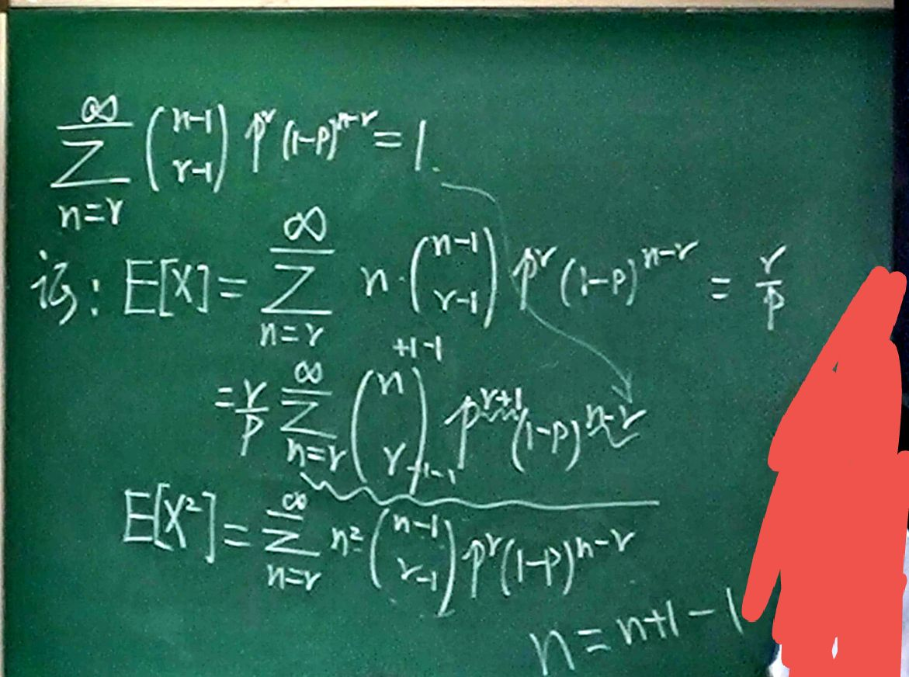

# 常用的离散型随机变量

## 0/1 分布

$X\sim Ber(p)$

## 二项分布

$X\sim B(n,p)$

## 几何分布

在多重 Bernoulli 试验, 设 $A$ 发生概率为 $p$.

用 $X$ 表示事件 $A$ 首次发生的试验次数, 则其分布列为 

$P(X=k)=(1-p)^{k-1}p$

称为 $X$ 服从参数为 $p$ 的几何分布, **记为 $X\sim G(p)$**

$\displaystyle E(X)=\frac{1}{p}, \mathrm{Var}(X)=\frac{1-p}{p^{2}}$

$\displaystyle E(X)=\sum_{k=1}^{\infty}k(1-p)^{k-1}\cdot p=p\sum_{k=1}^{\infty}k(1-p)^{k-1}=p\cdot \frac{1}{\frac{1}{(1-(1-p))^{2}}}=\frac{1}{p}$

### 几何分布无记忆性

$\displaystyle P(X>m+n|X>m)=P(X>n)$

**证明:**

$\displaystyle P(X>i)=\sum_{k=i+1}^{\infty}(1-p)^{k+1}p=p\frac{(1-p)^{i}}{1-(1-p)}=(1-p)^{i}$

## 负二项分布 (Pascal 分布)

用 $X$ 表示事件 $A$ 第 $r$ 次成功时发生的试验次数, 则 $X$ 取值为 $r, r+1, r+2\cdots$

$\displaystyle P(X=n)=\binom{n-1}{r-1}p^{r-1}(1-p)^{n-r}\cdot p$

$\displaystyle E(X)=\frac{r}{p}, \mathrm{Var}(X)=\frac{r(1-p)}{p^{2}}$

$\displaystyle E(X)=\sum_{n=r}^{\infty}n\binom{n-1}{r-1}p^{r}(1-p)^{n-r}=\frac{r}{p}$

## 泊松分布

$\displaystyle P(X=k)=\frac{\lambda^{k}}{k!}e^{-\lambda}$

$\displaystyle E(X)=\lambda, \mathrm{Var}(X)=\lambda$

$\displaystyle E(X)=\sum_{k=1}^{\infty}k \frac{\lambda^{k}}{k!}e^{-\lambda}=\lambda \sum_{k=2}^{\infty}\frac{\lambda^{k}}{k!}e^{-\lambda}=\lambda$

### 泊松定理

设 $np_{n}=\lambda$, 给定任意非负 $k$, 有

$\displaystyle \lim_{n \to \infty}\binom{n}{k}p_{n}^{k}(1-p_{n})^{n-k}=\frac{\lambda^{k}}{k!}e^{-\lambda}$

应用:

设 $X\sim B(n,p)$, 当 $n$ 比较大 $p$ 比较小时, 令 $\lambda=np$, 有

$\displaystyle P(X=k)=\binom{n}{k}p^{k}(1-p)^{n-k}=\frac{\lambda^{k}}{k!}e^{-\lambda}$

