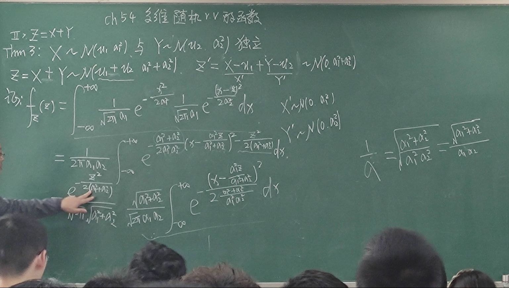

# 二维随机变量

## 最大最小值随机变量

$X\sim e(\alpha), Y\sim e(\beta)$， 求 $Z_1=\max(X,Y), Z_2=\min(X,Y)$ 的概率密度.

$F_{x}(x)=1-e^{\alpha x}, x\geqslant 0$

## 分布求和

例题:

$X\sim e(\lambda_1)$ 与 $Y\sim u(0,1)$ 相互独立, 求 $Z=X+Y$ 的概率密度.

解:

$\displaystyle f_{x}(x)=\begin{cases} \lambda_1 e^{-\lambda_1 x}, & x\geqslant 0 \\ 0, & x<0 \end{cases}$

$\displaystyle f_{z}(z)=\int_{-\infty}^{+\infty}f_{x}(x)f_{y}(z-x)\mathrm{d}x, x\in (0,+\infty), z-x\in (0,1), x\leqslant z\leqslant x+1$

$\displaystyle f_{z}(z)=\begin{cases} 0, & z < 0 \\ \displaystyle \int_{0}^{z}\lambda_1e^{-\lambda_1x}\mathrm{d}x, & z\in [0,1] \\ \displaystyle \int_{z-1}^{z}\lambda_1e^{-\lambda_1x}\mathrm{d}x, & z>1 \end{cases}$

## 联合分布函数

$
\begin{aligned}
F_{u, v}
&=P(U\leqslant u, V\leqslant v) \\
&=P(X\leqslant x(u,v), Y\leqslant y(u,v)) \\
\end{aligned}
$

$\displaystyle f_{UV}(u,v)=f_{XY}(x(u,v), y(u,v))|J|$

$\displaystyle J=\left| \frac{\partial (x,y)}{\partial (u,v)} \right|=\left| \frac{\partial (u,v)}{\partial (x,y)} \right|^{-1}=\begin{vmatrix} \frac{\partial u}{\partial x} &\frac{\partial u}{\partial y} \\ \frac{\partial v}{\partial x} &\frac{\partial v}{\partial y} \\\end{vmatrix}^{-1}$

$\displaystyle \int_{-\infty}^{+\infty}e^{-x^{2}}\mathrm{d}x=\sqrt{\pi}$

$\displaystyle \int_{-\infty}^{+\infty}e^{-\frac{x^{2}}{2}}\mathrm{d}x=\sqrt{2\pi}$

$\displaystyle \int_{-\infty}^{+\infty}e^{-\frac{x^{2}}{3}}\mathrm{d}x=\sqrt{3\pi}$

$\displaystyle E(|X-Y|)=\int_{0}^{1}\mathrm{d}y\int_{0}^{1}|x-y|\mathrm{d}x=2\int_{0}^{1}\mathrm{d}y\int_{y}^{1}(x-y)\mathrm{d}x=2\int_{0}^{1}(\frac{y^{2}}{2} - y + \frac{1}{2})\mathrm{d}y=\frac{1}{3}$

## 性质

Cauchy-Schwartz 不等式:

$\displaystyle E[XY]\leqslant \sqrt{E[X^{2}]E[Y^{2}]}$

令 $\displaystyle f(t)=(tX+Y)^{2}$

## 方差

$\displaystyle \mathrm{Var}(X+Y)=\mathrm{Var}(X)+\mathrm{Var}(Y)+2E[(X-E(X))(Y-E(Y))]$

$\displaystyle \mathrm{Var}(X-Y)=\mathrm{Var}(X)+\mathrm{Var}(Y)-2E[(X-E(X))(Y-E(Y))]$

独立时有

$\displaystyle \mathrm{Var}(X+Y)=\mathrm{Var}(X)+\mathrm{Var}(Y)$

减法也仍是加号

$\displaystyle \mathrm{Var}(X-Y)=\mathrm{Var}(X)+\mathrm{Var}(Y)$

## 协方差

定义协方差为

$\displaystyle \mathrm{Cov}(X,Y)=E[(X-E(X))(Y-E(Y))]=E(XY)-E(X)E(Y)$

$\displaystyle \mathrm{Cov}(X,X)=\mathrm{Var}(X)$

那么我们也可以看出

$\displaystyle \mathrm{Var}(X+Y)=\mathrm{Var}(X)+\mathrm{Var}(Y)+2\mathrm{Cov}(X, Y)$

### 性质

1. $\mathrm{Cov}(X,c)=0$
2. $\mathrm{Cov}(X,Y)=\mathrm{Cov}(Y,X)$
3. $\mathrm{Cov}(aX,bY)=ab\mathrm{Cov}(X,Y)$
4. $\mathrm{Cov}(X+a,Y+b)=\mathrm{Cov}(X,Y)$
5. $\mathrm{Cov}(X_1+X_2,Y)=\mathrm{Cov}(X_1,Y)+\mathrm{Cov}(X_2,Y)$

$X, Y$ 独立可以推出 $\mathrm{Cov}(X,Y)=0$.

但 $\mathrm{Cov}(X,Y)=0$ 不能推出 $X, Y$ 独立.

可以构造反例 $X\sim u(-1,1), Y=\begin{cases} 1, & X=0 \\ 0, & X\neq 0 \end{cases}$

$\because \displaystyle E(XY)\leqslant \sqrt{E(X^{2})E(Y^{2})}$

$\therefore \mathrm{Cov}(X,Y)^{2}\leqslant \mathrm{Var}(X)\mathrm{Var}(Y)$

等号成立的条件是 $Y=aX+b$, 即两者存在线性关系.

证明:

已知 $\mathrm{Cov}(X,Y)^{2}=\mathrm{Var}(X)\mathrm{Var}(Y)$

令 $f(t)=(t(X-E(X))+(Y-E(Y)))^{2}$

$\therefore E(f(t))=t^{2}\mathrm{Var}(X)+2t\mathrm{Cov}(X,Y)+\mathrm{Var}(Y)$

$\therefore \Delta=0$

$\therefore \exists t_0$ 使得 $E(f(t_0))=E(t_0(X-E(X))+(Y-E(Y)))^{2}=0$

$\therefore t_0(X-E(X))+(Y-E(Y))\equiv 0$

$\therefore Y=-t_0X+t_0E(X)+E(Y)$

### 相关系数

我们知道 $\displaystyle -1\leqslant \frac{\mathrm{Cov}(X,Y)}{\sqrt{\mathrm{Var}(X)\mathrm{Var}(Y)}}\leqslant 1$

我们定义 **相关系数**:

$\displaystyle \rho_{XY}=\frac{\mathrm{Cov}(X,Y)}{\sqrt{\mathrm{Var}(X)\mathrm{Var}(Y)}}$

这是线性相关系数.

- 相关系数大于 $0$, 则称为正相关;
- 相关系数小于 $0$, 则称为负相关;
- 相关系数等于 $0$, 则称为不相关, 注意不相关不等于独立;

