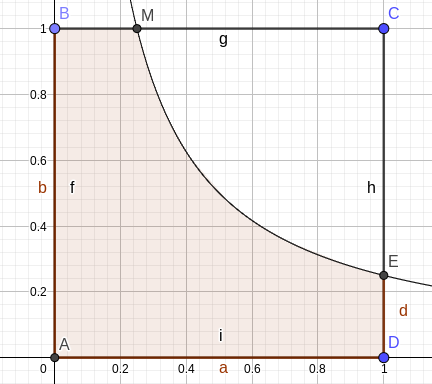

# 概率统计第二次作业

## 201300035 方盛俊

## 1.10

**(i)** $\displaystyle P(A)=\frac{\binom{4}{2}}{\binom{16}{2}}=\frac{1}{20}$

**(ii)** $\displaystyle P(B)=\frac{\binom{4}{1}\binom{12}{1}}{\binom{16}{2}}=\frac{2}{5}$

**(iii)** $\displaystyle P(C)=\frac{1}{2}\times \frac{\binom{4}{1}\binom{12}{1}}{\binom{16}{2}}+\frac{\binom{12}{2}}{\binom{16}{2}}=\frac{3}{4}$

## 1.11

两个女生间恰好有 $k$ 个男生的情况数可以用这种方法获取: 抽出 $k$ 个男生, 对这 $k$ 个男生进行全排列, 再对两个女生进行全排列, 将这 $k$ 个男生和两个女生看作一个团体, 让他们排入进行了全排列的剩下 $(n-k)$ 个男生当中, 可以排入的位置有 $(n - k + 1)$ 个.

而任意排列的情况, 只需要 $(n + 2)$ 全排列就好.

记 "两女生之间恰有 $k$ 个男生" 为事件 $A$, 则

$\displaystyle P(A)=\frac{\binom{n}{k}\cdot (k)_{k}\cdot (2)_{2}\cdot (n-k)_{n-k}\cdot (n-k+1)}{(n+2)_{n+2}}=\frac{- 2 k + 2 n + 2}{\left(n + 1\right) \left(n + 2\right)}$

## 1.12

记 "排成一列任意两个女生不相邻" 为事件 $A$, "排成一圆环任意两个女生不相邻" 为事件 $B$.

$\displaystyle P(A)=\frac{(n)_n\cdot \binom{n+1}{m}\cdot (m)_m}{(m+n)_{m+n}}$

$\displaystyle P(B)=\frac{(n)_n\cdot \binom{n}{m}\cdot (m)_m}{(m+n)_{m+n}}$

## 1.13

**对于 $m$ 只不同的白球和 $n$ 只不同的红球:**

$\displaystyle P(D)=\frac{\binom{n}{1}\cdot (m+n-1)_{m+n-1}}{(m+n)_{m+n}}=\frac{n}{m+n}$

**对于 $m$ 只不同的白球和 $n$ 只相同的红球:**

$\displaystyle P(A)=\frac{\displaystyle \frac{\binom{n}{1}\cdot (m+n-1)_{m+n-1}}{(n)_{n}}}{\displaystyle \frac{(m+n)_{m+n}}{(n)_{n}}}=\frac{n}{m+n}$

**对于 $m$ 只相同的白球和 $n$ 只不同的红球:**

$\displaystyle P(A)=\frac{\displaystyle \frac{\binom{n}{1}\cdot (m+n-1)_{m+n-1}}{(m)_{m}}}{\displaystyle \frac{(m+n)_{m+n}}{(m)_{m}}}=\frac{n}{m+n}$

**对于 $m$ 只相同的白球和 $n$ 只相同的红球:**

$\displaystyle P(A)=\frac{\displaystyle \frac{\binom{n}{1}\cdot (m+n-1)_{m+n-1}}{(n)_{n}\cdot (m)_{m}}}{\displaystyle \frac{(m+n)_{m+n}}{(n)_{n}\cdot (m)_{m}}}=\frac{n}{m+n}$

## 1.14

分别记杯中球的最大个数为 1, 2, 3 为事件 $A$, $B$, $C$.

$\displaystyle P(A)=\frac{(4)_{3}}{4^3}=\frac{3}{8}$

$\displaystyle P(C)=\frac{\binom{4}{1}}{4^3}=\frac{1}{16}$

$\displaystyle P(B)=1-P(A)-P(C)=\frac{9}{16}$

## 1.15

将两个事件依次记为 $A$, $B$.

$\displaystyle P(A)=\frac{\binom{b}{1}\cdot (a+b-1)_{k-1}}{(a+b)_{k}}=\frac{b}{a+b}$

$\displaystyle P(B)=\frac{\binom{b}{1}\cdot (a+b)^{k-1}}{(a+b)^{k}}=\frac{b}{a+b}$

## 1.16

使用容斥原理.

总排列数: $\displaystyle \frac{(2n)!}{2n}=(2n-1)!$

选定一对夫妻, 他们坐在一起的排列数: $\displaystyle 2\cdot \binom{n}{1}\cdot \frac{(2n-1)!}{2n-1}=2\cdot \binom{n}{1}\cdot (2n-2)!$

选定两对夫妻, 他们坐在一起的排列数: $\displaystyle 2^{2}\cdot \binom{n}{2}\cdot \frac{(2n-2)!}{2n-2}=2^{2}\cdot \binom{n}{2}\cdot (2n-3)!$

$\cdots$

选定 $k$ 对夫妻, 他们坐在一起的排列数: $\displaystyle 2^{k}\cdot \binom{n}{k}\cdot (2n-k-1)!$

$\cdots$

当 $k=0$ 时, 恰好满足 $\displaystyle 2^{k}\cdot \binom{n}{k}\cdot (2n-k-1)! = (2n-1)!$, 即总排列数.

因此, 由容斥原理可知, 任意一对夫妻不相邻的排列数为: $\displaystyle \sum_{i=0}^{n}(-2)^{k}\cdot \binom{n}{k}\cdot (2n-k-1)!$

任意一对夫妻不相邻的概率为 $\displaystyle P(A)=\frac{\displaystyle \sum_{i=0}^{n}(-2)^{k}\cdot \binom{n}{k}\cdot (2n-k-1)!}{(2n-1)!}$

## 1.17

既有 $\displaystyle \begin{cases} 0\leqslant x\leqslant 1 \\ 0\leqslant y\leqslant 1 \\ xy\leqslant \frac{1}{4} \end{cases}$

$\displaystyle P(A)=\frac{\displaystyle \frac{1}{4}\times 1 + \int_{\frac{1}{4}}^{1}\frac{1}{4x}\mathrm{d}x}{1\times 1}=\frac{1}{4} + \frac{2\ln 2}{4}$

## 1.18

<pre class="pseudocode">
\begin{algorithm}
\caption{Probability}
\begin{algorithmic}

\FUNCTION{Probability}{}
    \STATE $n_{A} \leftarrow 0$
    \FOR{$i = 1$ \TO N}
        \STATE $a \leftarrow$ Random(0,1)
        \STATE $b \leftarrow$ Random(0,1)
        \STATE $c \leftarrow$ Random(0,1)
        \STATE $d \leftarrow$ Random(0,1)
        \IF{$a^{2}+\sin(b)+a\cdot e^{c}\leqslant d$}
            \STATE $n_{A} \leftarrow n_{A} + 1$
        \ENDIF
    \ENDFOR
    \RETURN the 5-digit of ($n_{A}$ / $N$) 
\ENDFUNCTION

\end{algorithmic}
\end{algorithm}
</pre>

## 1.19

$\displaystyle \binom{9}{3, 4, 2}=\binom{9}{3}\cdot \binom{6}{4}\cdot \binom{2}{2}=\frac{9!}{3!\times 4!\times 2!}=1260$

## 1.20

对于 $\displaystyle \binom{n+1}{r}=\binom{n}{r}+\binom{n}{r-1}$:

$\displaystyle \binom{n}{r}+\binom{n}{r-1}=\frac{n!}{r!(n-r)!}+\frac{n!}{(r-1)!(n-r+1)!}=\frac{n!(n-r+1)}{r!(n-r+1)!}+\frac{n!r}{r!(n-r+1)!}=\frac{(n+1)!}{r!(n-r+1)!}=\binom{n+1}{r}$

更好的解释是, 从 $n+1$ 个元素中取出 $r$ 个元素, 可以分为两个方式的和: 选定一个元素 $x$, 第一种方式是从除 $x$ 以外的 $n$ 个元素中取出 $r$ 个元素, 第二种方式是先确定要选取 $x$, 然后从剩下的 $n$ 个元素中取出还需要的 $r-1$ 个元素.

对于 $\displaystyle \binom{m+n}{r}=\sum_{i=0}^{r}\binom{m}{i}\binom{n}{r-i}$:

$\displaystyle \binom{m+n}{r}$ 可以看作是从 $m+n$ 个人中挑出 $r$ 个人, 这件事我们可以分成几件事的和: 先从 $m$ 个人中挑 $i$ 个人, 再从 $n$ 个人中挑还需要的 $r-i$ 个人. 只要这个 $i$ 取了 $0$ 到 $r$ 中的所有值, 我们就可以认为它们的结果一致.

因此我们有 $\displaystyle \binom{m+n}{r}=\sum_{i=0}^{r}\binom{m}{i}\binom{n}{r-i}$

对于 $\displaystyle \binom{2n}{n}=\sum_{i=0}^{n}\binom{n}{i}^{2}$:

我们使用上面的结论可知

$\displaystyle \binom{2n}{n}=\binom{n+n}{n}=\sum_{i=0}^{n}\binom{n}{i}\binom{n}{n-i}=\sum_{i=0}^{n}\binom{n}{i}^{2}$

## 1.21

从 $m$ 个不同元素中无放回地取出 $r$ 个元素进行排列的排法: $\displaystyle \binom{m}{r}\cdot (r)_{r}=(m)_{r}$

从 $m$ 个不同元素中有放回地取出 $r$ 个元素进行排列的排法: $\displaystyle \prod_{i=1}^{r} \binom{m}{1} =m^{r}$

从 $m$ 个不同元素中无放回地取出 $r$ 个元素的取法: $\displaystyle (m)_{r}$

从 $m$ 个不同元素中有放回地取出 $r$ 个元素的取法: $m^{r}$

## 1.22

方程 $x_1+x_2+\cdots+x_{k}\leqslant n$ 的正整数解个数, 等同于求 $x_1+x_2+\cdots+x_{k}=i, k\leqslant i\leqslant n$ 的正整数解个数的和, 即 $\displaystyle \sum_{i=k}^{n}\binom{i-1}{k-1}$

方程 $x_1+x_2+\cdots+x_{k}\leqslant n$ 的非负整数解个数, 等同于求 $x_1+x_2+\cdots+x_{k}=i, 0\leqslant i\leqslant n$ 的非负整数解个数的和, 即 $\displaystyle \sum_{i=k}^{n}\binom{i+k-1}{k-1}$

## 1.23

方程 $x_1+x_2+\cdots+x_{k}<n$ 的正整数解个数, 等同于求 $x_1+x_2+\cdots+x_{k}=i, k\leqslant i\leqslant n-1$ 的正整数解个数的和, 即 $\displaystyle \sum_{i=k}^{n-1}\binom{i-1}{k-1}$

方程 $x_1+x_2+\cdots+x_{k}< n$ 的非负整数解个数, 等同于求 $x_1+x_2+\cdots+x_{k}=i, 0\leqslant i\leqslant n-1$ 的非负整数解个数的和, 即 $\displaystyle \sum_{i=k}^{n-1}\binom{i+k-1}{k-1}$

# 1.24

我们已知递推关系 $S(n,k)=kS(n-1,k)+S(n-1,k-1)$

使用归纳法.

**奠基 (Basis):**

当 $k=1$ 时, 将 $n$ 个不同的球放入 $k$ 个相同的箱子, 放法只有 $1$ 种.

代入公式 $\displaystyle S(n,1)=\frac{1}{1!}\sum_{i=0}^{1}(-1)^{i}\binom{1}{i}(1-i)^{n}=1+0=1$ 成立.

当 $n=1, k>1$ 时, 我们认为 $S(1,k)=0$.

代入公式 $\displaystyle S(1,k)=\frac{1}{k!}\sum_{i=0}^{k}(-1)^{i}\binom{k}{i}(k-i)^{1}=\frac{1}{k!}\sum_{i=0}^{k}(-1)^{i}\frac{k!}{i!(k-i-1)!}=0$ 成立.

**归纳假设 (I.H.):**

假设 $\displaystyle S(n-1,k)=\frac{1}{k!}\sum_{i=0}^{k}(-1)^{i}\binom{k}{i}(k-i)^{n-1}$ 成立.

假设 $\displaystyle S(n-1,k-1)=\frac{1}{(k-1)!}\sum_{i=0}^{k-1}(-1)^{i}\binom{k-1}{i}(k-i-1)^{n-1}$ 成立.

**归纳推理 (I.S.):**

$
\begin{aligned}
S(n,k)
&=kS(n-1,k)+S(n-1,k-1) \\
&=k\cdot \frac{1}{k!}\sum_{i=0}^{k}(-1)^{i}\binom{k}{i}(k-i)^{n-1}+\frac{1}{(k-1)!}\sum_{i=0}^{k-1}(-1)^{i}\binom{k-1}{i}(k-i-1)^{n-1} \\
&=\frac{1}{(k-1)!}\left[\sum_{i=0}^{k}(-1)^{i}\binom{k}{i}(k-i)^{n-1}+\sum_{i=0}^{k-1}(-1)^{i}\binom{k-1}{i}(k-i-1)^{n-1}\right] \\
&=\frac{1}{(k-1)!}\sum_{i=0}^{k-1}(-1)^{i}\left[\binom{k}{i}(k-i)^{n-1}+\binom{k-1}{i}(k-i-1)^{n-1}\right] \\
&=\frac{1}{k!}\sum_{i=0}^{k-1}(-1)^{i}\left[k\frac{k!}{i!(k-i)!}(k-i)^{n-1}+k\frac{(k-1)!\cdot (k-i)}{i!(k-i)!}(k-i-1)^{n-1}\right] \\
&=\frac{1}{k!}\sum_{i=0}^{k-1}(-1)^{i}\left[\frac{k\cdot k!\cdot (k-i)^{n-1}+k!\cdot (k-i)\cdot (k-i-1)^{n-1}}{i!(k-i)!}\right] \\
&=\frac{1}{k!}\sum_{i=0}^{k-1}(-1)^{i}\left[k!\cdot \frac{(k-i)^{n-1}}{i!(k-i)!}\right] \\
&=\frac{1}{k!}\sum_{i=0}^{k}(-1)^{i}\binom{k}{i}(k-i)^{n-1}
\end{aligned}
$

归纳成立.

因此 $\displaystyle S(n,k)=\frac{1}{k!}\sum_{i=0}^{k}(-1)^{i}\binom{k}{i}(k-i)^{n-1}$