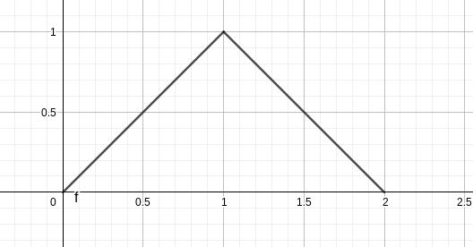

# 概率统计第五次作业

## 201300035 方盛俊

## 4.1

### 18.

$\because$ 在 $[0,a]$ 上任意投掷一个质点

$\therefore F(0)=P(X\leqslant 0)=0, F(a)=P(X\leqslant a)=1$

$\because$ 质点落在 $[0,a]$ 中任意小区间内的概率与这个小区间的长度成正比例

$\therefore \displaystyle F(x)=\frac{x}{a}\cdot 1=\frac{x}{a}, 0\leqslant x< 1$

$\therefore F(x)=\begin{cases} 0, & x<0 \\ \displaystyle \frac{x}{a}, & 0\leqslant x < 1 \\ 1, & x > 1 \end{cases}$

### 19.

**(1)** $\displaystyle P(X\leqslant 3)=F(3)=1-e^{-1.2}$

**(2)** $\displaystyle P(X > 4)=1-F(4)=e^{-1.6}$

**(3)** $\displaystyle P(3< X\leqslant  4)=F(4)-F(3)=e^{-1.2}-e^{-1.6}$

**(4)** $\displaystyle P(X\leqslant 3 \ \ \text{or} \ \ X > 4)=1-e^{-1.2}+e^{-1.6}$

**(5)** $\displaystyle P(X=2.5)=0$

### 20.

**(1)**

$\displaystyle P(X<2)=\lim_{x \to 2^{-}} F(x)=\ln 2$

$\displaystyle P(0<X\leqslant 3)=F(3)-F(0)=1$

$\displaystyle P(2<X<\frac{5}{2})=F(\frac{5}{2}-0)-F(2)=\ln \frac{5}{2}-\ln 2=\ln 5 - 2\ln 2$

**(2)**

$\displaystyle f(x)=\begin{cases} 0, & x < 1 \\ \displaystyle \frac{1}{x}, & 1\leqslant x < e \\ 0, & x \geqslant  e \end{cases}$

### 21.

**(1)**

$\because \displaystyle F(x)=\int_{-\infty}^{x}f(x)\mathrm{d}x=\int_{1}^{x}2(1-\frac{1}{x^{2}})\mathrm{d}x=2 x + \frac{2}{x} - 4$

$\therefore \displaystyle F(x)=\begin{cases} 0, & x<0 \\ \displaystyle 2x + \frac{2}{x} - 4, & 1 \leqslant x \leqslant 2 \\ 1, & x > 2 \end{cases}$

**(2)**

当 $0\leqslant x<1$ 时,

$\displaystyle F(x)=0+\int_{0}^{x}x\mathrm{d}x=\frac{x^{2}}{2}$

当 $1\leqslant x<2$ 时,

$\displaystyle F(x)=\frac{1}{2}+\int_{1}^{x}(2-x)\mathrm{d}x=- \frac{x^{2}}{2} + 2 x -1$

$\therefore F(x)=\begin{cases} 0, & x < 0 \\ \displaystyle \frac{x^{2}}{2}, & 0\leqslant x<1 \\ \displaystyle - \frac{x^{2}}{2} + 2 x -1, & 1\leqslant x <2 \\ 1, & x \geqslant 2 \end{cases}$

### 23.

$\because \displaystyle f(x)=\frac{1000}{x^{2}}, x>1000$

$\therefore \displaystyle F(x)=\int_{1000}^{x}\frac{1000}{x^{2}}\mathrm{d}x=\frac{x - 1000}{x}, x>1000$

$\therefore \displaystyle P(X\leqslant 1500)=F(1500)=\frac{1500-1000}{1500}=\frac{1}{3}$

$\therefore \displaystyle p=1-(\binom{5}{1}\cdot \frac{1}{3}\cdot (\frac{2}{3})^{4}+\binom{5}{0}(\frac{2}{3})^{5})=\frac{131}{243}$

### 24.

$\because \displaystyle f(x)=\frac{1}{5}e^{-\frac{x}{5}}, x>0$

$\therefore \displaystyle F(x)=\int_{0}^{x}\frac{1}{5}e^{-\frac{x}{5}}\mathrm{d}x=1 - e^{- \frac{x}{5}}$

$\therefore \displaystyle P(X>10)=1-F(10)=e^{-2}$

$\therefore Y\sim B(5, e^{-2})$

$\therefore \displaystyle P(Y=k)=\binom{5}{k}e^{-2k}(1-e^{-2})^{5-k}$

$\therefore \displaystyle P(Y\geqslant 1)=1-P(Y=0)=1-(1-e^{-2})^{5}$

### 25.

$\because X\sim U(0,5)$

求 $4x^{2}+4Kx+K+2=0$ 有实根的概率, 即 $\Delta=(4K)^{2}-4\times 4(K+2)\geqslant 0$

$\therefore \displaystyle P(X\leqslant -1 \ \ \text{and} \ \ X>2)=P(2<X\leqslant 5)=\int_{2}^{5}\frac{1}{5-0}\mathrm{d}x=\frac{3}{5}$

### 18.

$\therefore \displaystyle E(X)=\int_{-\infty}^{+\infty}f(x)\mathrm{d}x= \int_{0}^{+\infty}x\cdot \frac{x}{\sigma^{2}}e^{-\frac{x^{2}}{2\sigma^{2}}}\mathrm{d}x=\sqrt{\iint_{S}\frac{x^{2}y^{2}}{\sigma^{4}}e^{-\frac{x^{2}+y^{2}}{2\sigma^{2}}}\mathrm{d}x\mathrm{d}y}=\frac{\sqrt{2\pi} \sigma}{2}$

$\therefore \displaystyle E(X^{2})=\int_{0}^{+\infty}x^{2}\cdot \frac{x}{\sigma^{2}}e^{-\frac{x^{2}}{2\sigma^{2}}}\mathrm{d}x=2\sigma^{2}$

$\therefore \displaystyle D(X)=E(X^{2})-E(X)^{2}=(2-\frac{\pi}{2})\sigma^{2}$

## 4.2

设 $X$ 为长方形的宽的随机变量, $Y$ 为长方形周长的随机变量.

$\because \displaystyle X\sim U(0,2), Y=2X+\frac{20}{X}$

$\therefore \displaystyle E(X)=\int_{0}^{2}x\cdot \frac{1}{2-0}\mathrm{d}x=1, E(\frac{1}{X})=\int_{0}^{2}\frac{1}{x}\cdot \frac{1}{2-0}=\infty$

$\therefore \displaystyle E(X^{2})=\int_{0}^{2}x^{2}\cdot \frac{1}{2-0}\mathrm{d}x=\frac{4}{3}, E(\frac{1}{X^{2}})=\int_{0}^{2}\frac{1}{x^{2}}\cdot \frac{1}{2-0}=\infty$

即 $\displaystyle E(\frac{1}{X})$ 和 $\displaystyle E(\frac{1}{X^{2}})$ 期望不存在.

$\therefore \displaystyle E(Y)=2E(X)+20E(\frac{1}{X})=2+20E(\frac{1}{X})$

$\quad \displaystyle D(Y)=E(Y^{2})-E(Y)^{2}=E(4X^{2}+80+\frac{400}{X^{2}})-4E(X)^{2}-80E(X)E(\frac{1}{X})-400E(\frac{1}{X})^{2}=\frac{244}{3}+400E(\frac{1}{X^{2}})-80E(\frac{1}{X})-400E(\frac{1}{X})^{2}$

## 4.3

$\therefore \displaystyle 1=\int_{-\infty}^{+\infty}f(x)=\int_{0}^{+\infty}Ae^{-x}\mathrm{d}x=A$

$\therefore \displaystyle E(Y)=\int_{0}^{+\infty}e^{-2x}\cdot e^{-x}\mathrm{d}x=\int_{0}^{+\infty}e^{-3x}\mathrm{d}x=\frac{1}{3}$

## 4.4

$\because \displaystyle \int_{-\infty}^{+\infty}e^{-\frac{(t-\mu)^{2}}{2\sigma^{2}}}\mathrm{d}t=\int_{-\infty}^{+\infty}e^{-\frac{x^{2}}{2\sigma^{2}}}\mathrm{d}x$

$\therefore \displaystyle \int_{-\infty}^{+\infty}e^{-\frac{x^{2}}{2\sigma^{2}}}\mathrm{d}x\int_{-\infty}^{+\infty}e^{-\frac{y^{2}}{2\sigma^{2}}}\mathrm{d}y=\iint_{S}e^{-\frac{x^{2}+y^{2}}{2\sigma^{2}}}\mathrm{d}x\mathrm{d}y=\int_{0}^{2\pi}\mathrm{d}\theta\int_{0}^{+\infty}e^{-\frac{\rho^{2}}{2\sigma^{2}}}\cdot \rho\mathrm{d}\rho=2\pi\cdot \int_{0}^{+\infty}\frac{1}{2}e^{-\frac{t}{2\sigma^{2}}}\mathrm{d}t=2\pi \sigma^{2}$

$\therefore \displaystyle \int_{-\infty}^{+\infty}e^{-\frac{(t-\mu)^{2}}{2\sigma^{2}}}\mathrm{d}t=\sqrt{2\pi}\sigma$

