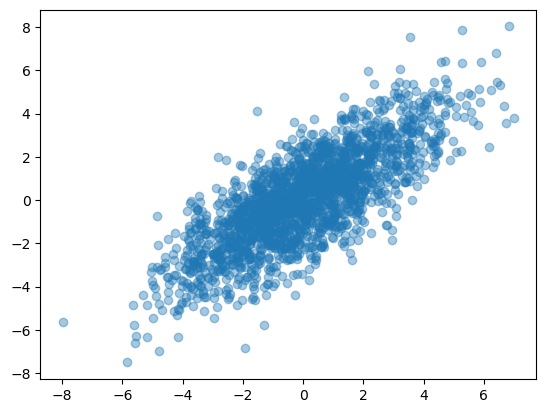
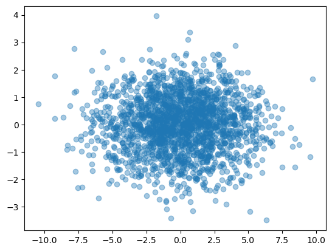
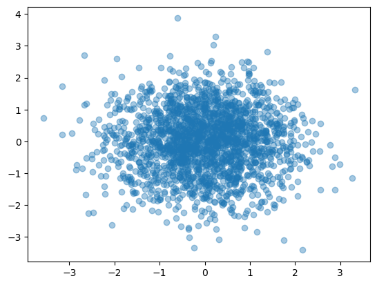

<style>
.title-box {
    border-style: solid;
    border-width: 1px;
    padding: 16px;
    padding-bottom: 32px;
}
</style>

<div class="title-box">
    <div>
        <b style="float: left;">模式识别与计算机视觉</b>
        <b style="float: right;">人工智能学院</b>
    </div>
    <h1 style="text-align: center;">Homework 2</h1>
    <div>
        <span style="float: left;"><i>Instructor:</i> 吴建鑫</span>
        <span style="float: right;"><i>Name:</i> 方盛俊, <i>StudentId:</i> 201300035</span>
    </div>
</div>


## 1. 习题一

#### (a)

题目中引入了 $\gamma_{ij}$, 其标识着样本 $\bm{x}_j$ 是否 被分到了第 $i$ 组, 同时引入了 $\bm{\mu}_i$ 作为第 $i$ 组的代表, 因此我们使用 $\gamma_{ij}$ 和 $\bm{\mu}_i$ 对 K-means 的目标进行形式化.

K-means 的目标是每组的样本彼此相似, 即属于相同组的一对样本之间的距离很小. 为了形式化地定义 K-means 的目标, 我们认为 $\bm{\mu}_i$ 表示了聚类的中心, 我们的目标是找到数据点分别属于的聚类, 以及一组向量 $\{ \bm{\mu}_i \}$, 使得每个数据点和它最近的向量 $\bm{\mu}_i$ 之间的距离的平方和最小. 因此, 我们就可以定义一个目标函数

$$
J = \sum_{j=1}^{M}\sum_{i=1}^{K}\gamma_{ij}\left\| \bm{x}_j - \bm{\mu}_i \right\|^{2}
$$

其表示每个数据点和它被分配到的向量 $\bm{\mu}_i$ 之间距离的平方和, 只需要最小化目标函数 $J$ 即可求解出最优 $\gamma_{ij}$ 和 $\bm{\mu}_i$, 进而完成样本的聚类, 即有

$$
\argmin_{\gamma_{ij}, \bm{\mu}_i}\sum_{i=1}^{K}\sum_{j=1}^{M}\gamma_{ij}\left\| \bm{x}_j - \bm{\mu}_i \right\|^{2}
$$

#### (b)

第 i 步:

在固定 $\bm{\mu}_i$ 的情况下, 每个样本 $\bm{x}_j$ 对应的 $J$ 的每一个贡献成分

$$
J_j = \sum_{i=1}^{K}\gamma_{ij}\left\| \bm{x}_j - \bm{\mu}_i \right\|^{2}
$$

互相独立, 因此我们只要最优化每一个 $J_j$ 即可最优化最终的 $J$.

由于 $\displaystyle \sum_{i=1}^{K}\gamma_{ij} = 1$ 且 $\gamma_{ij} \in \{ 0, 1 \}$, 因此 $\{\gamma_{ij}, i = 1, 2, \cdots, K\}$ 中只有一个元素为 $1$, 其他元素均为零. 则我们易知最优化问题

$$
\argmin_{i}\sum_{i=1}^{K}\gamma_{ij}\left\| \bm{x}_j - \bm{\mu}_i \right\|^{2}
$$

与最优化问题

$$
\argmin_{i}\left\| \bm{x}_j - \bm{\mu}_i \right\|^{2}
$$

等价.

因此我们可以简单地将数据点对应的聚类设置为最近的聚类中心, 形式化地表达即为

$$
\gamma_{ij} = \begin{cases} 1, & \text{if } i = \arg\min_{i}\left\| \bm{x}_j - \bm{\mu}_i \right\|^{2} \\ 0, & \text{otherwise}  \end{cases}
$$

第 ii 步:

在固定 $\gamma_{ij}$ 的情况下, $J$ 是一个关于 $\bm{\mu}_i$ 的二次函数, 为了最小化 $J$, 我们只需令 $J$ 关于 $\bm{\mu}_i$ 的导数等于零, 即可有最小值, 即

$$
\frac{\partial J}{\partial \bm{\mu}_i} = 2\sum_{j=1}^{M}\gamma_{ij}(\bm{x}_j - \bm{\mu}_i) = 0
$$

解出 $\bm{\mu}_i$ 即可得这一步的更新规则, 即

$$
\bm{\mu}_i = \frac{\sum_{j=1}^{M}\gamma_{ij}\bm{x}_j}{\sum_{j=1}^{M}\gamma_{ij}}
$$

#### (c)

**对于第 i 步**:

由于我们有更新后的 $\gamma_{ij}'$:

$$
\gamma_{ij}' = \begin{cases} 1, & \text{if } i = \arg\min_{i}\left\| \bm{x}_j - \bm{\mu}_i \right\|^{2} \\ 0, & \text{otherwise}  \end{cases}
$$

因此新目标函数值减去原目标函数值为

$$
\begin{aligned}
J' - J &= \sum_{i=1}^{K}\sum_{j=1}^{M}\gamma'_{ij}\left\| \bm{x}_j - \bm{\mu}_i \right\|^{2} - \sum_{i=1}^{K}\sum_{j=1}^{M}\gamma_{ij}\left\| \bm{x}_j - \bm{\mu}_i \right\|^{2} \\
&= \sum_{i=1}^{K}\sum_{j=1}^{M}(\gamma'_{ij}-\gamma_{ij})\left\| \bm{x}_j - \bm{\mu}_i \right\|^{2} \\
&= \sum_{i=1}^{K}(\left\| \bm{x}_j - \bm{\mu}_i' \right\|^{2} - \left\| \bm{x}_j - \bm{\mu}_{i} \right\|^{2}) \\
&\le 0
\end{aligned}
$$

其中 $\bm{\mu}_i'$ 是离 $\bm{x}_j$ 最近的簇, 而 $\bm{\mu}_{i}$ 可能是任意一个簇, 因此我们有 $J' \le J$. 即第 i 步会使目标函数 $J$ 的值减小或持平.

**对于第 ii 步**:

对于任意一个簇 $i$ 来说, 它的簇中心原来是 $\bm{\mu}_{i}$, 可能是任意一个向量, 之后被优化为

$$
\bm{\mu}_i' = \frac{\sum_{j=1}^{K}\gamma_{ij}\bm{x}_j}{\sum_{j=1}^{K}\gamma_{ij}}
$$

原来的目标函数可以改写为

$$
J = \sum_{j=1}^{M}\sum_{i=1}^{K}\gamma_{ij}\left\| \bm{x}_j - \bm{\mu}_i \right\|^{2}
$$

即交换求和符号, 这样我们只需要证明 $\displaystyle J_{j} = \sum_{i=1}^{K}\gamma_{ij}\left\| \bm{x}_j - \bm{\mu}_i \right\|^{2}$ 降低或不增加即可.

$$
\begin{aligned}
J_j' - J_j & = \sum_{i=1}^{K}\gamma_{ij}\left\| \bm{x}_j - \bm{\mu}_i' \right\|^{2} - \sum_{i=1}^{K}\gamma_{ij}\left\| \bm{x}_j - \bm{\mu}_i \right\|^{2}  \\
& = \sum_{i=1}^{K}\gamma_{ij}(\left\| \bm{x}_j - \bm{\mu}_i' \right\|^{2} - \left\| \bm{x}_j - \bm{\mu}_i \right\|^{2})  \\
& = \sum_{i=1}^{K}\gamma_{ij}(\bm{x}_j - \bm{\mu}_i' + \bm{x}_j - \bm{\mu}_i)^{\mathrm{T}}(\bm{x}_j - \bm{\mu}_i' - \bm{x}_j + \bm{\mu}_i)  \\
& = \sum_{i=1}^{K}\gamma_{ij}(\bm{\mu}_i - \bm{\mu}_i')^{\mathrm{T}}(2\bm{x}_j - \bm{\mu}_i' - \bm{\mu}_i)  \\
& = (\bm{\mu}_i - \bm{\mu}_i')^{\mathrm{T}}(2(\sum_{i=1}^{K}\gamma_{ij}\bm{x}_j) - (\sum_{i=1}^{K}\gamma_{ij})(\bm{\mu}_i' + \bm{\mu}_i))  \\
& = (\sum_{i=1}^{K}\gamma_{ij})(\bm{\mu}_i - \bm{\mu}_i')^{\mathrm{T}}(2\frac{\sum_{i=1}^{K}\gamma_{ij}\bm{x}_j}{\sum_{i=1}^{K}\gamma_{ij}} - \bm{\mu}_i' - \bm{\mu}_i)  \\
& = (\sum_{i=1}^{K}\gamma_{ij})(\bm{\mu}_i - \bm{\mu}_i')^{\mathrm{T}}(2\bm{\mu}_i' - \bm{\mu}_i' - \bm{\mu}_i)  \\
& = -(\sum_{i=1}^{K}\gamma_{ij})(\bm{\mu}_i - \bm{\mu}_i')^{\mathrm{T}}(\bm{\mu}_i - \bm{\mu}_i')  \\
& \le 0  \\
\end{aligned}
$$

因此我们有 $J_j' - J_j$, 也即有第 ii 步会使目标函数 $J$ 的值降低或不增加.

**下面证明 Lloyd 算法会停止**:

假设算法不会在有限步内停止, 则目标函数的值 $J$ 一直在变化.

由 (1) 可知, 目标函数 $J$ 的值降低或不增加, 又因为 $J$ 一直在变化, 可以将一系列 $J$ 的值视作严格单调递减数列, 由于 $J \ge 0$, 有下界, 因此一定收敛.

并且我们可知, $J$ 的值由簇的分类 $i$ 和簇中心 $\bm{\mu}_i$ 唯一确定, 而 $\displaystyle \bm{\mu}_i = \frac{\sum_{i=1}^{K}\gamma_{ij}\bm{x}_{i}}{\sum_{i=1}^{K}\gamma_{ij}}$, 因此 $\bm{\mu}_i$ 也由 $i$ 唯一确定, 也即 $J$ 由 $i$ 唯一确定, 其中 $j = 1, \cdots, k$.

由于样本 $\bm{x}_j$ 是有限个的, 因此 $i$ 的划分方式是有限个的, 也就是 $J$ 的取值是离散的有限个的值, 再由 $J$ 是严格单调递减数列且有下界可知, 一定会有一个最小值 $J_{\min} \le J$, 对于任何一个 $J$ 值来说. 因此 $J$ 一定会在 $J_{\min}$ 的时候停止, 与假设矛盾.

因此算法会在有限步内停止, 即能够收敛.


## 2. 习题二

#### (a)

由线性回归的模型假设

$$
y = \bm{x}^{\mathrm{T}}\bm{\beta} + \epsilon
$$

可得平方误差

$$
\sum_{i=1}^{n} \epsilon_i^{2} = \sum_{i=1}^{n} (y_i - \bm{x}_i^{\mathrm{T}}\bm{\beta})^{2}
$$


则线性回归任务可以表示为优化问题

$$
\argmin_{\bm{\beta}} \sum_{i=1}^{n} (y_i - \bm{x}_i^{\mathrm{T}}\bm{\beta})^{2}
$$

#### (b)

使用 $\bm{X}$ 和 $\bm{y}$ 重写优化问题即有

$$
\argmin_{\bm{\beta}} (\bm{y} - \bm{X}\bm{\beta})^{\mathrm{T}}(\bm{y} - \bm{X}\bm{\beta})
$$


#### (c)

令平方误差 $\displaystyle E = \sum_{i=1}^{n} \epsilon_i^{2} = (\bm{y} - \bm{X}\bm{\beta})^{\mathrm{T}}(\bm{y} - \bm{X}\bm{\beta})$

为了最小化 $E$, 我们对 $\beta$ 求导且令其等于零向量有

$$
\frac{\partial E}{\partial \bm{\beta}} = 2\bm{X}^{\mathrm{T}}(\bm{X}\bm{\beta} - \bm{y}) = \bm{0}
$$

由于 $\bm{X}^{\mathrm{T}}\bm{X}$ 是可逆的, 则有最优

$$
\bm{\beta}^{*} = (\bm{X}^{\mathrm{T}}\bm{X})^{-1}\bm{X}^{\mathrm{T}}\bm{y}
$$


#### (d)

由于 $d > n$, 且我们知道 $\bm{X}$ 是一个 $n \times d$ 矩阵, 则其秩 $\operatorname{rank}(\bm{X}) \le n < d$.

由矩阵的性质可知 $\operatorname{rank}(\bm{X}^{\mathrm{T}}\bm{X}) = \operatorname{rank}(\bm{X}) \le n < d$.

而我们又知道 $\bm{X}^{\mathrm{T}}\bm{X}$ 是一个 $d \times d$ 的矩阵, 因此 $\bm{X}^{\mathrm{T}}\bm{X}$ 必然不满秩, 因此 $\bm{X}^{\mathrm{T}}\bm{X}$ 不可逆.


#### (e)

该正则项带来的影响为减少模型的复杂度. 在实际问题中, 我们常常会遇到示例相对较少, 而特征较多的情况, 这种情况下 $\bm{X}^{\mathrm{T}}\bm{X}$ 不一定可逆, 因此无法获得唯一的模型参数, 会有多个模型能够 "完美" 拟合训练集中的所有样例. 在加入正则化项之后, 由于正则化表示了对模型的一种偏好, 可以对模型的复杂度进行约束, 因此相对于在多个训练集上表现痛的预测结果的模型中选出模型复杂度最低的一个.


#### (f)

加入正则化项后得到的岭回归的优化问题为

$$
\argmin_{\bm{\beta}} (\bm{y} - \bm{X}\bm{\beta})^{\mathrm{T}}(\bm{y} - \bm{X}\bm{\beta}) + \lambda \bm{\beta}^{\mathrm{T}}\bm{\beta}
$$

为了最小化 $E$, 我们对 $\bm{\beta}$ 求导并令其等于零向量可得

$$
\frac{\partial E}{\partial \bm{\beta}} = 2\bm{X}^{\mathrm{T}}(\bm{X}\bm{\beta} - \bm{y}) + 2\lambda\bm{\beta} = \bm{0}
$$

解得最优

$$
\bm{\beta}^{*} = (\bm{X}^{\mathrm{T}}\bm{X} + \lambda \bm{I})^{-1}\bm{X}^{\mathrm{T}}\bm{y}
$$


#### (g)

当 $\bm{X}^{\mathrm{T}}\bm{X}$ 不可逆时, 我们无法求解普通线性回归, 也即无法获得唯一的模型参数, 会有多个模型能够 "完美" 拟合训练集中的所有样例. 加入岭回归正则项后, $\bm{X}^{\mathrm{T}}\bm{X} + \lambda \bm{I}$ 几乎总是可逆的, 进而可以求解.

在加入正则化项之后, 由于正则化表示了对模型的一种偏好, 可以对模型的复杂度进行约束, 因此相对于在多个训练集上表现痛的预测结果的模型中选出模型复杂度最低的一个.


#### (h)

如果 $\lambda = 0$, 岭回归退化为普通线性回归.

如果 $\lambda = \infty$, 则优化问题变为 $\argmin_{\bm{\beta}} \bm{\beta}^{\mathrm{T}}\bm{\beta}$, 进而只能解出 $\bm{\beta} = \bm{0}$.


#### (i)

不能, 因为联合优化的话岭回归会退化为普通线性回归, 即一定有 $\lambda = 0$.

我们可以使用反证法来说明:

假设我们联合优化后得到最优 $\bm{\beta}^{*}$ 和非零的最优 $\lambda^{*}$, 对应的岭回归损失函数值为

$$
E^{*} = (\bm{y} - \bm{X}\bm{\beta}^{*})^{\mathrm{T}}(\bm{y} - \bm{X}\bm{\beta}^{*}) + \lambda^{*} \bm{\beta}^{*\mathrm{T}}\bm{\beta}^{*}
$$

但是我们令 $\lambda = 0$ 有

$$
(\bm{y} - \bm{X}\bm{\beta}^{*})^{\mathrm{T}}(\bm{y} - \bm{X}\bm{\beta}^{*}) < (\bm{y} - \bm{X}\bm{\beta}^{*})^{\mathrm{T}}(\bm{y} - \bm{X}\bm{\beta}^{*}) + \lambda^{*} \bm{\beta}^{*\mathrm{T}}\bm{\beta}^{*} = E^{*}
$$

则与 $E^{*}$ 是最小岭回归损失矛盾, 因此一定有 $\lambda = 0$.


## 3. 习题三

#### (a)

| 下标 | 类别标记 | 得分 | 查准率 P | 查全率 R | AUC-PR |   AP   |
|-----|----------|------|---------|---------|--------|--------|
| 0   |     -    |  -   | 1.0000  | 0.0000  |    -   |    -   |
| 1   |     1    |  1.0 | 1.0000  | 0.2000  | 0.2000 | 0.2000 |
| 2   |     2    |  0.9 | 0.5000  | 0.2000  | 0.0000 | 0.0000 |
| 3   |     1    |  0.8 | 0.6667  | 0.4000  | 0.1167 | 0.1333 |
| 4   |     1    |  0.7 | 0.7500  | 0.6000  | 0.1417 | 0.1500 |
| 5   |     2    |  0.6 | 0.6000  | 0.6000  | 0.0000 | 0.0000 |
| 6   |     1    |  0.5 | 0.6667  | 0.8000  | 0.1267 | 0.1333 |
| 7   |     2    |  0.4 | 0.5714  | 0.8000  | 0.0000 | 0.0000 |
| 8   |     2    |  0.3 | 0.5000  | 0.8000  | 0.0000 | 0.0000 |
| 9   |     1    |  0.2 | 0.5556  | 1.0000  | 0.1056 | 0.1111 |
| 10  |     2    |  0.1 | 0.5000  | 1.0000  | 0.0000 | 0.0000 |
|  -  |     -    |  -   |    -    |    -    | 0.6906 | 0.7278 |


#### (b)

如表格所示. 由于 AUC-PR 和 AP 都是对 PR 曲线的总结, 因此它们的值确实彼此相似. 但是由于所采取的计算方法不同, 精度估计不同, 最后得到的结果也会有所差异, 例如此处的 AP 就比 AUC-PR 要大 0.0372.

同理我们也可以通过数学推导的方式证明相似:

$$
AUC\_PR = \sum_{i=1}^{n}(r_i-r_{i-1})\frac{p_{i}+p_{i-1}}{2}
$$

$$
AP = \sum_{i=1}^{n}(r_i-r_{i-1})p_{i}
$$

两式相减可得

$$
\begin{aligned}
AP - AUC\_PR & = \sum_{i=1}^{n}(r_i-r_{i-1})p_{i} - \sum_{i=1}^{n}(r_i-r_{i-1})\frac{p_{i}+p_{i-1}}{2}  \\
& = \sum_{i=1}^{n}\frac{1}{2}(r_{i} - r_{i-1})(p_{i} - p_{i-1})  \\
\end{aligned}
$$

可以看出 AP 总是比 AUC-PR 大一点, 但是不会过分地大.

#### (c)

交换了第 9 行和第 10 行的类别标记之后, 新的 AUC-PR 为 0.6794, 新的 AP 为 0.7167.


#### (d)

代码如下:

```python
values = [1.0, 0.9, 0.8, 0.7, 0.6, 0.5, 0.4, 0.3, 0.2, 0.1]
labels = [1, 2, 1, 1, 2, 1, 2, 2, 1, 2]
# swap 9 and 10
# labels = [1, 2, 1, 1, 2, 1, 2, 2, 2, 1]

P = [1.0]
R = [0.0]
TPR = [0.0]
FPR = [0.0]

for i in range(1, len(values) + 1):
    P_counter = Counter(labels[:i])
    N_counter = Counter(labels[i:])
    TP = P_counter.get(1, 0)
    FP = P_counter.get(2, 0)
    FN = N_counter.get(1, 0)
    TN = N_counter.get(2, 0)
    P.append(TP / (TP + FP))
    R.append(TP / (TP + FN))

AUC_PR = [0.5 * (R[i] - R[i - 1]) * (P[i] + P[i - 1])
    for i in range(1, len(R))]
AUC_PR_SUM = sum(AUC_PR)
AP = [(R[i] - R[i - 1]) * P[i] for i in range(1, len(R))]
AP_SUM = sum(AP)

print('P:', ['%.4f' % f for f in P])
print('R:', ['%.4f' % f for f in R])
print('AUC_PR:', ['%.4f' % f for f in AUC_PR])
print('AUC_PR_SUM:', '%.4f' % AUC_PR_SUM)
print('AP:', ['%.4f' % f for f in AP])
print('AP_SUM:', '%.4f' % AP_SUM)
```


## 4. 习题四

#### (a)

以下推导均为选定一个训练集上的样本 $\bm{x}$ 的情况下进行的.

我们知道误差是

$$
\mathbb{E}_{D}[(y - f(\bm{x}; D))] = \mathbb{E}_{D}[(F(\bm{x}) - f(\bm{x};D) + \epsilon)^{2}]
$$

因为噪声 $\epsilon$ 独立于其他随机变量, 则有

$$
\begin{aligned}
&\quad\ \mathbb{E}_{D}[(y - f(\bm{x}; D))]  \\
&= \mathbb{E}_{D}[(F(\bm{x}) - f(\bm{x};D) + \epsilon)^{2}]  \\
&= \mathbb{E}_{D}[(F(\bm{x}) - f(\bm{x};D))^{2} + \epsilon^{2} + 2(F(\bm{x}) - f(\bm{x};D))\epsilon]  \\
&= \mathbb{E}_{D}[(F(\bm{x}) - f(\bm{x};D))^{2}] + \sigma^{2}  \\
\end{aligned}
$$

其中, 由于独立性有

$$
\mathbb{E}_{D}[\epsilon^{2}] = (\mathbb{E}_{D}[\epsilon])^{2} + \operatorname{Var}(\epsilon) = \sigma^{2}
$$

以及有

$$
\mathbb{E}_{D}[(F(\bm{x}) - f(\bm{x};D))\epsilon] = \mathbb{E}_{D}[(F(\bm{x}) - f(\bm{x};D))]\mathbb{E}_{D}[\epsilon] = 0
$$

我们进一步展开 $\mathbb{E}_{D}[(F(\bm{x}) - f(\bm{x};D))^{2}]$ 可得

$$
\mathbb{E}_{D}[(F(\bm{x}) - f(\bm{x};D))^{2}] = (\mathbb{E}_{D}[F(\bm{x}) - f(\bm{x};D)])^{2} + \operatorname{Var}(F(\bm{x}) - f(\bm{x};D))
$$

对于右边表达式的第一项, 由于 $F(\bm{x})$ 是确定的, 与训练集 $D$ 无关, 即 $\mathbb{E}_{D}[F(\bm{x})] = F(\bm{x})$, 则有

$$
\begin{aligned}
(\mathbb{E}_{D}[F(\bm{x}) - f(\bm{x};D)])^{2} & = (\mathbb{E}_{D}[F(\bm{x})] - \mathbb{E}_{D}[f(\bm{x};D)])^{2}  \\
& = (F(\bm{x}) - \mathbb{E}_{D}[f(\bm{x};D)])^{2}  \\
\end{aligned}
$$

对于右边表达式的第二项, 由于 $F(\bm{x})$ 是确定的, 在这里可以视为一个常数, 不影响方差, 因此我们有

$$
\operatorname{Var}(F(\bm{x}) - f(\bm{x};D)) = \operatorname{Var}(f(\bm{x};D)) = \mathbb{E}_{D}[(f(\bm{x};D) - \mathbb{E}_{D}[f(\bm{x};D)])^{2}]
$$

综合上面的结果, 我们可以得到偏置-方差分解

$$
\begin{aligned}
&\quad\ \mathbb{E}_{D}[(y - f(\bm{x}; D))] \\
&= (F(\bm{x}) - \mathbb{E}_{D}[f(\bm{x};D)])^{2} + \mathbb{E}_{D}[(f(\bm{x};D) - \mathbb{E}_{D}[f(\bm{x};D)])^{2}] + \sigma^{2}  \\
\end{aligned}
$$

其中第一项为真实标记 $F(\bm{x})$ 与所有训练集 $D$ 下期望输出标记的偏差, 第二项为 $f(\bm{x};D)$ 关于训练集 $D$ 的方差, 第三项为噪声 $\epsilon$ 关于训练集 $D$ 的方差.


#### (b)

$$
\mathbb{E}[f] = \mathbb{E}[\frac{1}{k}\sum_{i=1}^{k}y_{nn(i)}] = \frac{1}{k}\sum_{i=1}^{k}\mathbb{E}[F(\bm{x}_{nn(i)})+\epsilon] = \frac{1}{k}\sum_{i=1}^{k}\mathbb{E}[F(\bm{x}_{nn(i)})]
$$


#### (c)

$$
\begin{aligned}
&\quad\ \mathbb{E}_{D}[(y - f(\bm{x}; D))] \\
&= (F(\bm{x}) - \mathbb{E}_{D}[f(\bm{x};D)])^{2} + \mathbb{E}_{D}[(f(\bm{x};D) - \mathbb{E}_{D}[f(\bm{x};D)])^{2}] + \sigma^{2}  \\
&= (F(\bm{x}) - \frac{1}{k}\sum_{i=1}^{k}\mathbb{E}_{D}[F(\bm{x}_{nn(i)})])^{2} + \mathbb{E}_{D}[\frac{1}{k}(\sum_{i=1}^{k}y_{nn(i)} - \frac{1}{k}\sum_{i=1}^{k}\mathbb{E}_{D}[F(\bm{x}_{nn(i)})])^{2}] + \sigma^{2}  \\
&= (F(\bm{x}) - \frac{1}{k}\sum_{i=1}^{k}\mathbb{E}_{D}[F(\bm{x}_{nn(i)})])^{2} + \frac{1}{k^{2}}\mathbb{E}_{D}[(\sum_{i=1}^{k}(y_{nn(i)} - \mathbb{E}_{D}[F(\bm{x}_{nn(i)})]))^{2}] + \sigma^{2}  \\
\end{aligned}
$$


#### (d)

方差项为

$$
\frac{1}{k^{2}}\mathbb{E}_{D}[(\sum_{i=1}^{k}(y_{nn(i)} - \mathbb{E}_{D}[F(\bm{x}_{nn(i)})]))^{2}]
$$

当 $k$ 增加时, 在训练集上寻找的最近邻数就越多, 就越有可能使得 $y_{nn(i)}$ 与 $\mathbb{E}_{D}[F(\bm{x}_{nn(i)})]$ 项接近, 同时方差项的系数 $\frac{1}{k^{2}}$ 会不断减小, 因此方差项总体会变得平滑, 并且总体上会不断减小.


#### (e)

偏置的平方项为

$$
(F(\bm{x}) - \frac{1}{k}\sum_{i=1}^{k}\mathbb{E}_{D}[F(\bm{x}_{nn(i)})])^{2}
$$

当 $k$ 增加时, 由于寻找的最近邻数变得更多, 因此 $\displaystyle \frac{1}{k}\sum_{i=1}^{k}\mathbb{E}_{D}[F(\bm{x}_{nn(i)})]$ 会逐渐远离 $F(\bm{x})$, 导致偏置的平方项会不断增大.

当 $k = n$ 时, $\displaystyle \frac{1}{k}\sum_{i=1}^{k}\mathbb{E}_{D}[F(\bm{x}_{nn(i)})]$ 会变为样本均值, 此时偏置的平方项会最大.


## 5. 习题五

#### (a) (b) (c) 代码

见代码文件 `problem_5.ipynb`.

#### (a)



#### (b)



#### (c)



#### (d)

为了推导保留所有维度的 PCA, 也即多维 PCA 的特殊情况, 我们先从 PCA 降维到 0 维开始, 依次推广到多维.

**PCA 降维到 0 维**:

即找到固定的向量 $\bm{m}$ 使得 $\min_{\bm{m}}\sum_{i=1}^{n}\left\| \bm{x}_i - \bm{m} \right\|^{2}$. 通过对 $\bm{m}$ 求导等于零我们可得 $\sum_{i=1}^{n}(\bm{m}^{*}-\bm{x}_i) = 0$, 解得 $\bm{m}^{*} = \frac{1}{n}\sum_{i=1}^{n}\bm{x}_i$.

**PCA 降维到 1 维**:

在 PCA 降维到 0 维的基础上, 我们进一步准备 PCA 降维到 1 维, 即有找到 $\bm{\omega}$ 使得 $\bm{x}_i \approx \bar{\bm{x}} + a_i \bm{\omega}$ 最近似, 即最小化残差 $\bm{x}_i - (\bar{\bm{x}} + a_i \bm{\omega})$, 其中 $\bar{\bm{x}}$ 即是我们 PCA 降维到 0 维的结果.

令 $\bm{a} = (a_1, a_2, \cdots, a_n)^{\mathrm{T}}$, 我们定义优化目标 $J(\bm{\omega}, \bm{a}) = \frac{1}{n}\sum_{i}^{n}\left\| \bm{x}_i - (\bar{\bm{x}} + a_i \bm{\omega}) \right\|^{2} = \frac{1}{n}\sum_{i=1}^{n}(a_i^{2}\left\| \bm{\omega} \right\|^{2} + \left\| \bm{x}_i-\bar{\bm{x}} \right\|^{2} - 2 a_i \bm{\omega}^{\mathrm{T}}(\bm{x}_i - \bar{\bm{x}}))$.

令对 $a_i$ 的偏导等于零即可得

$$
\frac{\partial J}{\partial a_i} = \frac{2}{n}(a_i\left\| \bm{\omega} \right\|^{2} - \bm{\omega}^{\mathrm{T}}(\bm{x}_i - \bar{\bm{x}})) = 0,  \forall i \\
$$

可以解得 $\displaystyle a_i = \frac{(\bm{x}_i - \bar{\bm{x}})^{\mathrm{T}}\bm{\omega}}{\left\| \bm{\omega} \right\|^{2}} = \frac{(\bm{x}_i - \bar{\bm{x}})^{\mathrm{T}}\bm{\omega}}{\left\| \bm{\omega} \right\|} \cdot \frac{1}{\left\| \bm{\omega} \right\|}$.

因此我们可以得到 $a_i$ 即为向量 $\bm{x}_i - \bar{\bm{x}}$ 在向量 $\bm{\omega}$ 上的投影乘上 $1 / \left\| \bm{\omega} \right\|$. 并且容易发现, $J(\bm{\omega}, \bm{a})$ 等价于 $J(c\bm{\omega}, \frac{1}{c}\bm{a})$, 因此为了简化计算, 我们可以令 $\left\| \bm{\omega} \right\| = 1$, 这也是后续我们推导出 PCA 是数据通过减去均值平移后得一个旋转这个结论的基础.

这时 $a_i$ 的取值就简化为 $\bm{x}_i - \bar{\bm{x}}$ 到单位向量 $\bm{\omega}$ 的投影 $a_i = (\bm{x}_i - \bar{\bm{x}})^{\mathrm{T}}\bm{\omega}$.

重新带入优化目标则有 $J(\bm{\omega}, \bm{a}) = \frac{1}{n}\sum_{i=1}^{n}(\left\| \bm{x}_i - \bar{\bm{x}} \right\|^{2} - a_i^{2})$. 因此只需要最大化 $\frac{1}{n}\sum_{i=1}^{n}a_i^{2}$ 即可得到最优参数.

再令对 $\bm{\omega}$ 的偏导等于零即可得

$$
\frac{\partial J}{\partial \omega} = \frac{2}{n}\sum_{i=1}^{n}(a_i^{2}\bm{\omega} - a_i(\bm{x}_i - \bar{\bm{x}})) = \bm{0}
$$

也就有

$$
\frac{1}{n}(\sum_{i=1}^{n}a_i^{2})\bm{\omega} = \frac{1}{n}\sum_{i=1}^{n}a_i(\bm{x}_i - \bar{\bm{x}}) = \frac{1}{n}\sum_{i=1}^{n}(\bm{x}_i - \bar{\bm{x}})(\bm{x}_i - \bar{\bm{x}})^{\mathrm{T}}\bm{\omega} = \operatorname{Cov}(\bm{x})\bm{\omega}
$$

也即有

$$
\operatorname{Cov}(\bm{x})\bm{\omega} = \frac{\sum_{i=1}^{n}a_i^{2}}{n}\bm{\omega}
$$

即 $\bm{\omega}$ 是 $\operatorname{Cov}(\bm{x})$ 的特征向量, 而 $\frac{1}{n}\sum_{i=1}^{n}a_i^{2}$ 是该特征向量对应的特征值.

我们不妨令 $\operatorname{Cov}(\bm{x})$ 对应的特征值为 $\lambda_1 \ge \lambda_2 \ge \cdots \ge \lambda_{d}$, 以及每个特征值对应的特征向量 $\bm{\omega}_1, \bm{\omega}_2, \cdots, \bm{\omega}_d$, 其中 $d$ 为样本 $\bm{x}_i$ 的维度.

为了最大化 $\frac{1}{n}\sum_{i=1}^{n}a_i^{2}$ 以取得最优参数, 我们应该选择 $\operatorname{Cov}(\bm{x})$ 中最大的特征值 $\lambda_1$ 对应的特征向量 $\bm{\omega}_1$, 且有特征向量是单位向量, 即 $\left\| \bm{\omega}_1 \right\| = 1$.

**PCA 降维到多维**:

为了将 PCA 从 1 维推广到多维, 我们由谱分解即可得

$$
\operatorname{Cov}(\bm{x}) = \sum_{i=1}^{d} \lambda_i \omega_i \omega_i^{\mathrm{T}}
$$

我们构造一个矩阵 $\bm{W} = \begin{bmatrix} \bm{\omega}_1 & \bm{\omega}_2 & \cdots & \bm{\omega}_d \\\end{bmatrix}$. 由于实对称矩阵 $\operatorname{Cov}(\bm{x})$ 的特征向量满足 $\bm{\omega}_i^{\mathrm{T}}\bm{\omega}_j = 0, i \neq j$, 因此我们有 $\bm{W}$ 是正交矩阵, 即有 $\bm{W}\bm{W}^{\mathrm{T}} = \bm{W}^{\mathrm{T}}\bm{W} = \bm{I}$.

因此我们有

$$
\bm{x}_i - \bar{\bm{x}} = \bm{W}\bm{W}^{\mathrm{T}}(\bm{x}_i - \bar{\bm{x}}) = \bm{\omega}_1^{\mathrm{T}}(\bm{x}_i - \bar{\bm{x}})\bm{\omega}_1 + \cdots + \bm{\omega}_d^{\mathrm{T}}(\bm{x}_i - \bar{\bm{x}})\bm{\omega}_d
$$

为了将 PCA 降维推广到多维, 我们用原样本减去已经进行了 1 维 PCA 得到的结果, 即

$$
\bm{x}_i' = \bm{x}_i - (\bar{\bm{x}} + \bm{\omega}_1^{\mathrm{T}}(\bm{x}_i - \bar{\bm{x}})\bm{\omega}_1) = \sum_{j=2}^{d}\bm{\omega}_j^{\mathrm{T}}(\bm{x}_i - \bar{\bm{x}})\bm{\omega}_j
$$

可以看出, 如果我们在新数据集 $\{ \bm{x}_i = \sum_{j=2}^{d}\bm{\omega}_j^{\mathrm{T}}(\bm{x}_i - \bar{\bm{x}})\bm{\omega}_j, i = 1, \cdots, n \}$ 上做 1 维 PCA 变换, 则对于每个新样本会得到 PCA 结果 $\bm{\omega}_2^{\mathrm{T}}(\bm{x}_i - \bar{\bm{x}})\bm{\omega}_2$, 以此类推, 直到最后一维.

我们逐一进行 PCA 的过程, 其本质和我们直接选取前 $d'$ 个最大特征值和特征向量是等价的, 其中 $d'$ 为要降到的维度.

如果我们直接保留所有的维度, 其实质就是保留整个 $\bm{W}$, 也就是有

$$
\bm{x}_i - \bar{\bm{x}} = \sum_{j=1}^{d}\bm{\omega}_j^{\mathrm{T}}(\bm{x}_i - \bar{\bm{x}})\bm{\omega}_j = \bm{W}^{\mathrm{T}}(\bm{x}_i - \bar{\bm{x}})\bm{W}
$$

即我们最终得到的新表示为

$$
\bm{y}_i = \bm{W}^{\mathrm{T}}(\bm{x}_i - \bar{\bm{x}})
$$

**以上即为多维 PCA 的推导, 基于这个推导我们有下面结论**:

由于 $\bm{W}$ 是一个 $d \times d$ 的正交矩阵, 因此我们可知保留所有维度的 PCA 是数据在进行平移之后的一个旋转.

我们保留所有维度的 PCA, 也就是进行了一个旋转, 之所以有用, 是因为 PCA 本质是将数据视作了一个多维空间中的椭球, PCA 要做的事情就是将这个椭球的各个轴旋转对齐到坐标轴上 (即将各方差最大的方向对齐到坐标轴上). 如果我们需要进行降维, 那就将这个椭球的几个短轴对应的维度去掉, 保留几个长轴对应的维度, 由于数据已经与坐标轴对齐, 我们可以很简单地将短轴对应的那几个维度对应的数字去掉, 进而得到新的降维后数据. 这就是 PCA 的本质, 这也是 PCA 旋转这一操作有效的原因.


## 6. 习题六

#### (a)

由矩阵 2-范数的定义可知 $\left\| \bm{X} \right\|_{2} = \sigma_1$, 且由矩阵的逆的性质可知 $\left\| \bm{X}^{-1} \right\|_{2} = \frac{1}{\sigma_n}$, 因此有

$$
\kappa_2(\bm{X}) = \left\| \bm{X} \right\|_{2}\left\| \bm{X}^{-1} \right\|_{2} = \frac{\sigma_1}{\sigma_n}
$$


#### (b)

若我们想要求解 $\bm{A}\bm{x} = \bm{b}$, 则有 $\bm{x} = \bm{A}^{-1} \bm{b}$.

我们要说明的就是, 在 $\kappa_2(\bm{A})$ 很大的情况下, 稍微改变 $\bm{A}$ 或 $\bm{b}$ 就会导致 $\bm{x}$ 有很大的改变.

推导可知 (本小问中的 $\left\| \cdot \right\|$ 均指 2-范数 $\left\| \cdot \right\|_{2}$)

$$
\bm{A} \bm{x} = \bm{b}  \\
\bm{A} (\bm{x} + \Delta \bm{x}) = \bm{b} + \Delta \bm{b}  \\
\bm{A} \Delta \bm{x} = \Delta \bm{b}  \\
\Delta \bm{x} = A^{-1} \Delta \bm{b}  \\
$$

由上面的式子可得

$$
\left\| \bm{b} \right\| \le \left\| \bm{A} \right\| \left\| \bm{x} \right\|  \\
\left\| \Delta \bm{x} \right\| \le \left\| \bm{A}^{-1} \right\| \left\| \Delta \bm{b} \right\|  \\
$$

两式相乘再除以 $\left\| \bm{b} \right\| \left\| \bm{x} \right\|$ 可得

$$
\frac{\left\| \Delta \bm{x} \right\|}{\left\| \bm{x} \right\|} \le \left\| \bm{A} \right\| \left\| \bm{A}^{-1} \right\| \frac{\left\| \Delta \bm{b} \right\|}{\bm{b}} = \kappa_2(\bm{A}) \frac{\left\| \Delta \bm{b} \right\|}{\left\| \bm{b} \right\|}
$$

同理我们对 $\bm{A}$ 进行扰动变为 $\bm{A} + \Delta \bm{A}$ 可得

$$
(\bm{A} + \Delta \bm{A})(\bm{x} + \Delta \bm{x}) = \bm{b}  \\
\bm{A}\Delta \bm{x} = -\Delta \bm{A}(\bm{x} + \Delta \bm{x})  \\
\Delta \bm{x} = -\bm{A}^{-1}\Delta \bm{A}(\bm{x} + \Delta \bm{x})  \\
$$

因此我们使用范数不等式并两边除以 $\left\| \bm{x} + \Delta \bm{x} \right\|$ 有

$$
\frac{\left\| \Delta \bm{x} \right\|}{\left\| \bm{x} + \Delta \bm{x} \right\|} \le \left\| \bm{A} \right\| \left\| \bm{A}^{-1} \right\| \frac{\left\| \Delta \bm{A} \right\|}{\left\| \bm{A} \right\|} = \kappa_2(\bm{A}) \frac{\left\| \Delta \bm{A} \right\|}{\left\| \bm{A} \right\|}
$$

可以看出, 当有较小的扰动 $\Delta \bm{A}$ 或者 $\Delta \bm{b}$ 的时候, 尤其是能够取得等号的时候, 均会带来较大的 $\Delta \bm{x}$, 即较小的输入变换就会导致较大的输出变化. 这种变化对我们使用计算机进行一定精度的矩阵计算尤为不利.

例如用 Matlab 求解下列方程时:

$$
\begin{bmatrix} 1 & 1 \\ 1 & 0.999 \\\end{bmatrix}\bm{x} = \begin{bmatrix} 1 \\ 0.999 \end{bmatrix}  \Rightarrow  \bm{x} = \begin{bmatrix} 0 \\ 1 \end{bmatrix}
$$

条件数 $\kappa_2(\bm{A}) = 3998$, 可以看出是一个较大的数.

扰动 $\bm{A}$ 后求解 $\bm{x}$:

$$
\begin{bmatrix} 1.001 & 1.001 \\ 1.001 & 0.999 \\\end{bmatrix}\bm{x} = \begin{bmatrix} 1 \\ 0.999 \end{bmatrix}  \Rightarrow  \bm{x} = \begin{bmatrix} 0.499 \\ 0.500 \end{bmatrix}
$$

扰动 $\bm{b}$ 后求解 $\bm{x}$:

$$
\begin{bmatrix} 1 & 1 \\ 1 & 0.999 \\\end{bmatrix}\bm{x} = \begin{bmatrix} 1.001 \\ 0.999 \end{bmatrix}  \Rightarrow  \bm{x} = \begin{bmatrix} -0.999 \\ +2.000\end{bmatrix}
$$

可以看出, 无论是对 $\bm{A}$ 还是 $\bm{b}$ 做一个轻微的扰动, 均会导致解出来的 $\bm{x}$ 产生较大的变化, 因此这个线性系统是病态的.

#### (c)

对于正交矩阵 $\bm{W}$, 我们有 $\bm{W}^{-1} = \bm{W}^{\mathrm{T}}$, 且 $\bm{W}^{\mathrm{T}}$ 与 $\bm{W}$ 有相同的特征值, 以及 $\bm{W}$ 的奇异值 (特征值) 绝对值为 $1$. 因此有

$$
\kappa_2(\bm{X}) = \left\| \bm{W} \right\|_{2}\left\| \bm{W}^{-1} \right\|_{2} = \left\| \bm{W} \right\|_{2}\left\| \bm{W}^{\mathrm{T}} \right\|_{2} = (\left\| \bm{W} \right\|_{2})^{2} = 1
$$

因此正交矩阵是良态的, 有较小的条件数.
