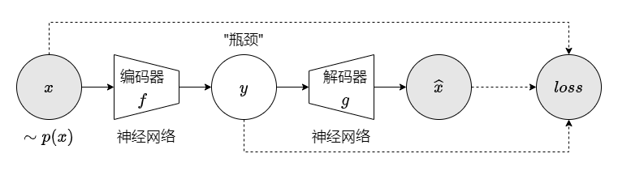

<style>
.title-box {
    border-style: solid;
    border-width: 1px;
    padding: 16px;
    padding-bottom: 32px;
}
</style>

<div class="title-box">
    <div>
        <b style="float: left;">模式识别与计算机视觉</b>
        <b style="float: right;">人工智能学院</b>
    </div>
    <h1 style="text-align: center;">Homework 3</h1>
    <div>
        <span style="float: left;"><i>Instructor:</i> 吴建鑫</span>
        <span style="float: right;"><i>Name:</i> 方盛俊, <i>StudentId:</i> 201300035</span>
    </div>
</div>


## 1. 习题一

#### (a)

为了将 PCA 从 1 维推广到多维, 我们由谱分解即可得

$$
\operatorname{Cov}(\bm{x}) = \sum_{i=1}^{D} \lambda_i \xi_i \xi_i^{\mathrm{T}}
$$

我们构造一个矩阵 $\bm{E} = \begin{bmatrix} \bm{\xi}_1 & \bm{\xi}_2 & \cdots & \bm{\xi}_D \\\end{bmatrix}$. 由于实对称矩阵 $\operatorname{Cov}(\bm{x})$ 的特征向量满足 $\bm{\xi}_i^{\mathrm{T}}\bm{\xi}_j = 0, i \neq j$, 因此我们有 $\bm{E}$ 是正交矩阵, 即有 $\bm{E}\bm{E}^{\mathrm{T}} = \bm{E}^{\mathrm{T}}\bm{E} = \bm{I}$.

因此我们有

$$
\begin{aligned}
\bm{x} - \bar{\bm{x}} & = \bm{E}\bm{E}^{\mathrm{T}}(\bm{x} - \bar{\bm{x}})  \\
& = (\sum_{i=1}^{D}\bm{\xi}_i\bm{\xi}_i^{\mathrm{T}})(\bm{x} - \bar{\bm{x}})  \\
& = \bm{\xi}_1\bm{\xi}_1^{\mathrm{T}}(\bm{x} - \bar{\bm{x}}) + \bm{\xi}_2\bm{\xi}_2^{\mathrm{T}}(\bm{x} - \bar{\bm{x}}) + \cdots + \bm{\xi}_D\bm{\xi}_D^{\mathrm{T}}(\bm{x} - \bar{\bm{x}})  \\
& = \bm{\xi}_1^{\mathrm{T}}(\bm{x} - \bar{\bm{x}})\bm{\xi}_1 + \bm{\xi}_2^{\mathrm{T}}(\bm{x} - \bar{\bm{x}})\bm{\xi}_2 + \cdots + \bm{\xi}_D^{\mathrm{T}}(\bm{x} - \bar{\bm{x}})\bm{\xi}_D  \\
\end{aligned}
$$

则有

$$
\bm{y}_i = \bm{x}_i - \bm{\xi}_1^{\mathrm{T}}(\bm{x}_i - \bar{\bm{x}})\bm{\xi}_1 = \bar{\bm{x}} + \sum_{j=2}^{D}\bm{\xi}_j^{\mathrm{T}}(\bm{x}_i - \bar{\bm{x}})\bm{\xi}_j
$$

由于 $\bm{y}_i$ 的均值

$$
\bar{\bm{y}} = \frac{1}{N}\sum_{i=1}^{N} (\bar{\bm{x}} + \sum_{i=2}^{D}\bm{\xi}_i^{\mathrm{T}}(\bm{x}_i - \bar{\bm{x}})\bm{\xi}_i) = \bar{\bm{x}} + \sum_{i=2}^{D}\bm{\xi}_i^{\mathrm{T}}(\frac{1}{N}\sum_{i=1}^{N} \bm{x}_i - \bar{\bm{x}})\bm{\xi}_i = \bar{\bm{x}}
$$

并且由特征值和特征向量的定义有

$$
\operatorname{Cov}(\bm{x})\bm{\xi}_j = \frac{1}{N}\sum_{i=1}^{N}(\bm{x}_i - \bar{\bm{x}})(\bm{x}_i - \bar{\bm{x}})^{\mathrm{T}} \bm{\xi}_j = \lambda_j \bm{\xi}_j
$$

因此有

$$
\begin{aligned}
\operatorname{Cov}(\bm{y}) & = \frac{1}{N}\sum_{i=1}^{N}(\bm{y}_i-\bar{\bm{y}})(\bm{y}_i-\bar{\bm{y}})^{\mathrm{T}}  \\
& = \frac{1}{N}\sum_{i=1}^{N}(\bm{y}_i-\bar{\bm{x}})(\bm{y}_i-\bar{\bm{x}})^{\mathrm{T}}  \\
& = \frac{1}{N}\sum_{i=1}^{N}(\sum_{j=2}^{D}\bm{\xi}_j^{\mathrm{T}}(\bm{x}_i - \bar{\bm{x}})\bm{\xi}_j)(\sum_{k=2}^{D}\bm{\xi}_k^{\mathrm{T}}(\bm{x}_i - \bar{\bm{x}})\bm{\xi}_k)^{\mathrm{T}}  \\
& = \frac{1}{N}\sum_{i=1}^{N}\sum_{j=2}^{D}\bm{\xi}_j^{\mathrm{T}}(\bm{x}_i - \bar{\bm{x}})\bm{\xi}_j\bm{\xi}_j^{\mathrm{T}}(\bm{x}_i - \bar{\bm{x}})^{\mathrm{T}}\bm{\xi}_j  \\
& = \frac{1}{N}\sum_{i=1}^{N}\sum_{j=2}^{D}\bm{\xi}_j\bm{\xi}_j^{\mathrm{T}}(\bm{x}_i - \bar{\bm{x}})(\bm{x}_i - \bar{\bm{x}})^{\mathrm{T}}\bm{\xi}_j\bm{\xi}_j^{\mathrm{T}}  \\
& = \sum_{j=2}^{D}\lambda_j\bm{\xi}_j\bm{\xi}_j^{\mathrm{T}}\bm{\xi}_j\bm{\xi}_j^{\mathrm{T}}  \\
& = \sum_{i=2}^{D}\lambda_i\bm{\xi}_i\bm{\xi}_i^{\mathrm{T}}  \\
\end{aligned}
$$


#### (b)

代码输出如下:

```txt
second eigenvalue of X: 3.2500000000000013
second eigenvector of X: [ 1.96116135e-01 -9.80580676e-01 -1.16380915e-17]
first eigenvalue of Y: 3.25
first eigenvector of Y: [ 1.96116135e-01 -9.80580676e-01  5.45191062e-16]
```


## 2. 习题二

#### (a)

由于 $S_w$ 是正定的实对称矩阵, 因此存在 Cholesky 分解 $S_w = LL^{\mathrm{T}}$, $L$ 满秩.

则原式可以改写为

$$
S_{B} w = \lambda LL^{\mathrm{T}}w
$$

我们令 $y = L^{\mathrm{T}} w$, 则有

$$
L^{-1} S_{B}(L^{\mathrm{T}})^{-1} y = \lambda y
$$

这是一个标准特征值问题.

由于 $L^{-1} S_{B}(L^{\mathrm{T}})^{-1}$ 也为实对称矩阵, 因此对于特征值 $\lambda_1 \ge \lambda_2 \ge \cdots \ge \lambda_n$, 一定存在一组归一化的正交向量 $y_1, y_2, \cdots, y_n$ 满足

$$
y_i^{\mathrm{T}}y_j = \begin{cases} 1, & i=j \\ 0, & i\neq j \end{cases}
$$

我们使用 $w = (L^{\mathrm{T}})^{-1} y$ 还原 $w$ 得到


$$
y_i^{\mathrm{T}}y_j = (w_i^{\mathrm{T}}L)(L^{\mathrm{T}}w_j) = w_i^{\mathrm{T}}S_w w_j = \begin{cases} 1, & i=j \\ 0, & i\neq j \end{cases}
$$

因此广义特征向量之间带权正交.


#### (b)

由于 $y_1, y_2, \cdots, y_n$ 正交, 因此 $w_1, w_2, \cdots, w_n$ 线性无关, 则有 $\forall w \in \mathbb{R}^{n}$ 均存在 $a_1,a_2,\cdots,a_n \in \mathbb{R}$ 使得

$$
w = \sum_{i=1}^{n}a_i w_i
$$

因此我们有

$$
w^{\mathrm{T}} S_{w} w = (\sum_{i=1}^{n}a_i w_i)^{\mathrm{T}} S_{w} (\sum_{j=1}^{n}a_j w_j) = \sum_{i=1}^{n}\sum_{j=1}^{n}a_i a_j w_i^{\mathrm{T}} S_{w} w_j = \sum_{i=1}^{n}a_i^{2}
$$

$$
w^{\mathrm{T}}S_{B} w = \sum_{i=1}^{n}\sum_{j=1}^{n}a_i a_j w_i^{\mathrm{T}} S_{B} w_j = \sum_{i=1}^{n}\sum_{j=1}^{n}a_i a_j w_i^{\mathrm{T}} \lambda_j S_{w} w_j = \sum_{i=1}^{n}\lambda_i a_i^{2}
$$

因此可将广义瑞利商改写为

$$
J(w) = \frac{w^{\mathrm{T}}S_{B} w}{w^{\mathrm{T}} S_w w} = \frac{\sum_{i=1}^{n}\lambda_i a_i^{2}}{\sum_{i=1}^{n}a_i^{2}}
$$

由于我们有 $\lambda_1 \ge \lambda_2 \ge \cdots \ge \lambda_n$, 因此易得

$$
\lambda_1 = \frac{\sum_{i=1}^{n}\lambda_1 a_i^{2}}{\sum_{i=1}^{n}a_i^{2}} \ge \frac{\sum_{i=1}^{n}\lambda_i a_i^{2}}{\sum_{i=1}^{n}a_i^{2}} \ge \frac{\sum_{i=1}^{n}\lambda_n a_i^{2}}{\sum_{i=1}^{n}a_i^{2}} = \lambda_n
$$

当 $a_1 \neq 0, a_i = 0, i = 2, 3, \cdots, n$ 时 $J(w) = \max J(w) = \lambda_1$

当 $a_n \neq 0, a_i = 0, i = 1, 2, \cdots, n - 1$ 时 $J(w) = \min J(w) = \lambda_n$

因此广义瑞利商 $J(w)$ 的最大值为 $\lambda_1$, 最小值为 $\lambda_n$.


#### (c)

这里没有说清楚 $|\cdot |$ 具体的含义, 如果是指矩阵范数中的 $\operatorname{tr}(\cdot)$, 则有

$$
J = \frac{\operatorname{tr}(W^{\mathrm{T}}S_{B}W)}{\operatorname{tr}(W^{\mathrm{T}}S_{w}W)} = \frac{\sum_{i=1}^{n} w_i^{\mathrm{T}}S_{B}w_i}{\sum_{i=1}^{n} w_i^{\mathrm{T}}S_{w}w_i} = \frac{\sum_{i=1}^{n} w_i^{\mathrm{T}}\lambda_i S_{w}w_i}{\sum_{i=1}^{n} w_i^{\mathrm{T}}S_{w}w_i} = \frac{1}{n}\sum_{i=1}^{n}\lambda_i
$$

如果是指行列式, 则有

$$
J = \frac{|W^{\mathrm{T}}S_{B}W|}{|W^{\mathrm{T}}S_{w}W|} = \prod_{i=1}^{n} \lambda_i
$$


## 3. 习题三

#### (a)

$\kappa$ 是合法的核函数.

证明:

对于任意 $n$ 和 $\{ \bm{x}_1, \bm{x}_2, \cdots, \bm{x}_{n} \}$,

因为 $\kappa_1$ 和 $\kappa_2$ 是核函数, 因此其对应的核矩阵 $\bm{K}_1$ 和 $\bm{K}_2$ 是半正定矩阵,

即有 $\bm{y}^{\mathrm{T}} \bm{K}_1 \bm{y} \ge 0$ 与 $\bm{y}^{\mathrm{T}} \bm{K}_2 \bm{y} \ge 0$, 对于任何 $n$ 维向量 $\bm{y}$ 成立.

因为 $\kappa(\bm{x}_i, \bm{x}_j) = \kappa_1(\bm{x}_i, \bm{x}_j)+ \kappa_2(\bm{x}_i, \bm{x}_j)$,

所以有 $\bm{K}_{ij} = \kappa(\bm{x}_i, \bm{x}_j) = \kappa_1(\bm{x}_i, \bm{x}_j) + \kappa_2(\bm{x}_i, \bm{x}_j)$

因此有 $\bm{K} = \bm{K}_1 + \bm{K}_2$.

则我们有 $\bm{y}^{\mathrm{T}}\bm{K}\bm{y} = \bm{y}^{\mathrm{T}}(\bm{K}_1 + \bm{K}_2)\bm{y} = \bm{y}^{\mathrm{T}}\bm{K}_1\bm{y} + \bm{y}^{\mathrm{T}}\bm{K}_2\bm{y} \ge 0$

所以可知 $\bm{K}$ 也是半正定矩阵, $\kappa$ 是合法的核函数.


#### (b)

$\kappa$ 不是合法的核函数.

证明:

令 $\kappa_1(\bm{x}, \bm{y}) = 0, \kappa_2(\bm{x}, \bm{y}) = \bm{x}^{\mathrm{T}}\bm{y}$, 易知两者均为合法的核函数, 则我们有 $\kappa(\bm{x}, \bm{y}) = \kappa_1(\bm{x}, \bm{y}) - \kappa_2(\bm{x}, \bm{y}) = -\bm{x}^{\mathrm{T}}\bm{y}$, 不妨令 $d = 2$.

则存在两个样本 $\bm{x}_1 = (1, 0)^{\mathrm{T}}, \bm{x}_2 = (0, 1)^{\mathrm{T}}$, 其对应的核矩阵为

$\bm{K} = \begin{bmatrix} -1 & 0 \\ 0 & -1 \\\end{bmatrix}$

令 $\bm{y} = (1, 0)^{\mathrm{T}}$, 我们有 $\bm{y}^{\mathrm{T}}\bm{K}\bm{y} = -1 < 0$

因此 $\bm{K}$ 不是一个半正定矩阵, 也即 $\kappa$ 不是合法的核函数.

#### (b)

$\kappa$ 不是合法的核函数.

证明:

我们只需要举出一个反例.

令 $\kappa_1(\bm{x}, \bm{y}) = 0, \kappa_2(\bm{x}, \bm{y}) = \bm{x}^{\mathrm{T}}\bm{y}$, 易知两者均为合法的核函数, 则我们有 $\kappa(\bm{x}, \bm{y}) = \kappa_1(\bm{x}, \bm{y}) - \kappa_2(\bm{x}, \bm{y}) = -\bm{x}^{\mathrm{T}}\bm{y}$, 不妨令 $d = 2$.

则存在两个样本 $\bm{x}_1 = (1, 0)^{\mathrm{T}}, \bm{x}_2 = (0, 1)^{\mathrm{T}}$, 其对应的核矩阵为

$\bm{K} = \begin{bmatrix} -1 & 0 \\ 0 & -1 \\\end{bmatrix}$

令 $\bm{y} = (1, 0)^{\mathrm{T}}$, 我们有 $\bm{y}^{\mathrm{T}}\bm{K}\bm{y} = -1 < 0$

因此 $\bm{K}$ 不是一个半正定矩阵, 也即 $\kappa$ 不是合法的核函数.


#### (c)

$\kappa$ 是合法的核函数.

证明:

对于任意 $n$ 和 $\{ \bm{x}_1, \bm{x}_2, \cdots, \bm{x}_{n} \}$,

因为 $\kappa_1$ 是核函数, 因此其对应的核矩阵 $\bm{K}_1$ 是半正定矩阵,

即有 $\bm{y}^{\mathrm{T}} \bm{K}_1 \bm{y} \ge 0$, 对于任何 $n$ 维向量 $\bm{y}$ 成立.

因为 $\kappa(\bm{x}_i, \bm{x}_j) = \alpha\kappa_1(\bm{x}_i, \bm{x}_j)$,

所以有 $\bm{K}_{ij} = \kappa(\bm{x}_i, \bm{x}_j) = \alpha\kappa_1(\bm{x}_i, \bm{x}_j)$

因此有 $\bm{K} = \alpha\bm{K}_1$.

因为 $\alpha \in \mathbb{R}^{+}$ 是一个正实数,

则我们有 $\bm{y}^{\mathrm{T}}\bm{K}\bm{y} = \bm{y}^{\mathrm{T}}(\alpha\bm{K}_1)\bm{y} = \alpha\bm{y}^{\mathrm{T}}\bm{K}_1\bm{y} \ge 0$

所以可知 $\bm{K}$ 也是半正定矩阵, $\kappa$ 是合法的核函数.


#### (d)

$\kappa$ 不是合法的核函数.

证明:

我们只需要举出一个反例.

令 $\alpha = 1$ 以及 $\kappa_1(\bm{x}, \bm{y}) = \bm{x}^{\mathrm{T}}\bm{y}$, 易知其为合法的核函数, 则我们有 $\kappa(\bm{x}, \bm{y}) = -\alpha\kappa_1(\bm{x}, \bm{y})= -\bm{x}^{\mathrm{T}}\bm{y}$, 不妨令 $d = 2$.

则存在两个样本 $\bm{x}_1 = (1, 0)^{\mathrm{T}}, \bm{x}_2 = (0, 1)^{\mathrm{T}}$, 其对应的核矩阵为

$\bm{K} = \begin{bmatrix} -1 & 0 \\ 0 & -1 \\\end{bmatrix}$

令 $\bm{y} = (1, 0)^{\mathrm{T}}$, 我们有 $\bm{y}^{\mathrm{T}}\bm{K}\bm{y} = -1 < 0$

因此 $\bm{K}$ 不是一个半正定矩阵, 也即 $\kappa$ 不是合法的核函数.


#### (e)

$\kappa$ 是合法的核函数.

证明:

对于任意 $n$ 和 $\{ \bm{x}_1, \bm{x}_2, \cdots, \bm{x}_{n} \}$,

因为 $\kappa_1$ 和 $\kappa_2$ 是核函数, 因此其对应的核矩阵 $\bm{K}_1$ 和 $\bm{K}_2$ 是半正定矩阵,

因为 $\kappa(\bm{x}_i, \bm{x}_j) = \kappa_1(\bm{x}_i, \bm{x}_j) \kappa_2(\bm{x}_i, \bm{x}_j)$,

所以有 $\bm{K}_{ij} = \kappa(\bm{x}_i, \bm{x}_j) = \kappa_1(\bm{x}_i, \bm{x}_j)\kappa_2(\bm{x}_i, \bm{x}_j)$

因此有 $\bm{K} = \bm{K}_1 \circ \bm{K}_2$, 即 $\bm{K}_1$ 与 $\bm{K}_2$ 的逐元素相乘.

则我们可证明 Schur 乘积定理:

对于 $\mathbb{R}^{n \times n}$ 上的半正定矩阵 $\bm{A}$ 与 $\bm{B}$, 对于 $\forall \bm{x} \in \mathbb{R}^{n}$, 我们可以证明 $\bm{C} = \bm{A} \circ \bm{B}$ 半正定.

由于 $\bm{A}$ 为半正定矩阵, 因此存在 $\bm{U} \in \mathbb{R}^{n}$ 使得 $\bm{A} = \bm{U}^{\mathrm{T}}\bm{U}$.

$
\begin{aligned}
\bm{x}^{\mathrm{T}}\bm{C}\bm{x} & = \sum_{i=1}^{n}\sum_{j=1}^{n}a_{ij}b_{ij}x_i x_j  \\
& = \sum_{i=1}^{n}\sum_{j=1}^{n}\sum_{k=1}^{n} u_{ki}u_{kj}b_{ij}x_i x_j  \\
& = \sum_{k=1}^{n}[\sum_{i=1}^{n}\sum_{j=1}^{n} b_{ij} (u_{ki}x_i) (u_{kj} x_j)]  \\
& \ge 0  \\
\end{aligned}
$

即 $\bm{C} = \bm{A} \circ \bm{B}$ 半正定.

所以同理可知 $\bm{K}$ 也是半正定矩阵, $\kappa$ 是合法的核函数.


#### (f)

$\kappa$ 是合法的核函数.

证明:

对于任意 $n$ 和 $\{ \bm{x}_1, \bm{x}_2, \cdots, \bm{x}_{n} \}$, 通过核函数 $\kappa(\bm{x}, \bm{y}) = \kappa_3(\phi(\bm{x}), \phi(\bm{y}))$ 得到的 $\bm{K}$ 为

$[\bm{K}]_{ij} = \kappa_3(\phi(\bm{x}_i), \phi(\bm{x}_j))$

我们使用函数 $\phi(\cdot)$ 处理得到 $\{ \phi(\bm{x}_1), \phi(\bm{x}_2), \cdots, \phi(\bm{x}_{n}) \}$, 这也是一组样本集合, 因此通过核函数 $\kappa_3$ 得到的 $\bm{K}_3$ 是半正定矩阵, 其中

$[\bm{K}_3]_{ij} = \kappa_3(\phi(\bm{x}_i), \phi(\bm{x}_j))$

可见 $\bm{K} = \bm{K}_3$.

所以可知 $\bm{K}$ 也是半正定矩阵, $\kappa$ 是合法的核函数.


## 4. 习题四

#### (a)

我们对每个样例 $(\bm{x}_i, y_i)$ 附上一个代价系数 $k_i$,

其中 $\displaystyle k_i = \begin{cases} 1, & y_i = +1 \\ k, & y_i = -1 \end{cases}$ 也即 $\displaystyle k_i = 1 - \frac{1}{2}(k - 1)(y_i - 1)$.

然后相应的 SVM 优化问题即可改为

$$
\begin{aligned}
\min_{\bm{w}, b, \xi_i} &\quad \frac{1}{2}\bm{w}^{\mathrm{T}}\bm{w} + C\sum_{i=1}^{n}k_i\xi_i \\
\text{s.t.}
&\quad y_i(\bm{w}^{\mathrm{T}}\bm{x}_i + b) \ge 1 - \xi_i, & 1 \le i \le n  \\
&\quad \xi_i \ge 0, & 1 \le i \le n  \\
\end{aligned}
$$

#### (b)

通过拉格朗日乘子法得到拉格朗日函数

$$
\begin{aligned}
L(\bm{w}, b, \bm{\alpha}, \bm{\xi}, \bm{\mu}) & = \frac{1}{2}\bm{w}^{\mathrm{T}}\bm{w} + C\sum_{i=1}^{n}k_i\xi_i  \\
& \quad +\sum_{i=1}^{n}\alpha_i(1-\xi_i-y_i(\bm{w}^{\mathrm{T}}\bm{x}_i + b)) - \sum_{i=1}^{n}\mu_i\xi_i  \\
\end{aligned}
$$

其中 $\alpha_i \ge 0, \mu_i \ge 0$ 是拉格朗日乘子.

令 $L(\bm{w}, b, \bm{\alpha}, \bm{\xi}, \bm{\mu})$ 对 $\bm{w}, b, \xi_i$ 的偏导等于零可得

$$
\bm{w} = \sum_{i=1}^{n}\alpha_i y_i \bm{x}_i
$$

$$
0 = \sum_{i=1}^{n}\alpha_i y_i
$$

$$
k_i C = \alpha_i + \mu_i
$$

将上三式逐步带入有

$$
\begin{aligned}
&\quad L(\bm{w}, b, \bm{\alpha}, \bm{\xi}, \bm{\mu}) \\
&= \frac{1}{2} \left\| \bm{w} \right\|_{2}^{2} + C\sum_{i=1}^{n}k_i\xi_i + \sum_{i=1}^{n}\alpha_i(1-\xi_i-y_i(\bm{w}^{\mathrm{T}}\bm{x}_i + b)) - \sum_{i=1}^{n}\mu_i\xi_i \\
&= \frac{1}{2} \left\| \bm{w} \right\|_{2}^{2} + \sum_{i=1}^{n}\alpha_i(1-y_i(\bm{w}^{\mathrm{T}}\bm{x}_i + b)) + C\sum_{i=1}^{n}k_i\xi_i - \sum_{i=1}^{n}\alpha_i\xi_i - \sum_{i=1}^{n}\mu_i\xi_i \\
&= -\frac{1}{2}\sum_{i=1}^{n}\alpha_i y_i \bm{x}_i^{\mathrm{T}}\sum_{i=1}^{n}\alpha_i y_i \bm{x}_i + \sum_{i=1}^{n}\alpha_i + \sum_{i=1}^{n}k_i C \xi_i - \sum_{i=1}^{n}\alpha_i\xi_i - \sum_{i=1}^{n}\mu_i\xi_i \\
&= -\frac{1}{2}\sum_{i=1}^{n}\alpha_i y_i \bm{x}_i^{\mathrm{T}}\sum_{i=1}^{n}\alpha_i y_i \bm{x}_i + \sum_{i=1}^{n}\alpha_i + \sum_{i=1}^{n}(k_i C - \alpha_i - \mu_i)\xi_i \\
&= \sum_{i=1}^{n}\alpha_i - \frac{1}{2}\sum_{i=1}^{n}\sum_{j=1}^{n}\alpha_i\alpha_j y_i y_j\bm{x}_i^{\mathrm{T}}\bm{x}_j \\
\end{aligned}
$$

又因为 $\alpha_i \ge 0, \mu_i \ge 0, k_i C = \alpha_i + \mu_i$,

消去 $\mu_i$ 即可得到约束条件 $0 \le \alpha_i \le k_i C$.

因此对偶问题为

$$
\begin{aligned}
\max_{\bm{\alpha}} &\quad \sum_{i=1}^{n}\alpha_i - \frac{1}{2}\sum_{i=1}^{n}\sum_{j=1}^{n}\alpha_i\alpha_j y_i y_j\bm{x}_i^{\mathrm{T}}\bm{x}_j\\
\text{s.t.}
&\quad \sum_{i=1}^{n}\alpha_i y_i = 0, & 1 \le i \le n  \\
&\quad 0 \le \alpha_i \le k_i C, & 1 \le i \le n  \\
\end{aligned}
$$

其中 $\displaystyle k_i = \begin{cases} 1, & y_i = +1 \\ k, & y_i = -1 \end{cases}$ 也即 $\displaystyle k_i = 1 - \frac{1}{2}(k - 1)(y_i - 1)$.

根据 (a) 中的原优化问题所需满足的条件 $y_i(\bm{w}^{\mathrm{T}}\bm{x}_i + b) \ge 1 - \xi_i$ 可知 KKT 条件 $\alpha_i(y_i f(\bm{x}_i) - 1 + \xi_i) = 0$, 根据 $\xi_i \ge 0$ 可知 $\mu_i \xi_i = 0$.

因此, KKT 条件要求

$$
\begin{cases}
\alpha_i \ge 0, \mu_i \ge 0,  \\
y_i f(\bm{x}_i) - 1 + \xi_i \ge 0,  \\
\alpha_i(y_i f(\bm{x}_i) - 1 + \xi_i) = 0,  \\
\xi_i \ge 0, \mu_i \xi_i = 0.
\end{cases}
$$


## 5. 习题五

#### (a)

朴素贝叶斯的基本假设是 "属性条件独立性假设": 对已知类别, 假设所有属性相互独立, 即假设每个属性独立地对分类结果发生影响.

优点是能够缓解计算联合概率时的组合爆炸问题或数据上的样本稀疏问题, 能够用较少的样本就计算出置信度较高的结果; 局限是由于使用了样本属性独立性的假设, 而这个假设在实际应用中往往是不成立的, 所以如果样本属性有关联时, 朴素贝叶斯的效果不好.

朴素贝叶斯是参数化的, 因为朴素贝叶斯的参数个数在分类类数, 样本维度等给定的情况下, 参数个数不会随着样本个数的增长而增长, 也即参数空间的维度不是无限的.


#### (b)

先验概率: $P(A) = \frac{4}{12} = \frac{1}{3}, P(B) = \frac{4}{12} = \frac{1}{3}, P(C) = \frac{4}{12} = \frac{1}{3}$

类别 $A$ 属性 1:

均值 $\mu_{A,1} = \frac{1}{4} \cdot (1 + 2 + 3 + 4) = 2.5$

方差 $\sigma_{A,1}^{2} = \frac{1}{4} \cdot [(1 - 2.5)^{2} + (2 - 2.5)^{2} + (3 - 2.5)^{2} + (4 - 2.5)^{2}] = 1.25$

类别 $A$ 属性 2:

均值 $\mu_{A,2} = \frac{1}{4} \cdot (2 + 3 + 4 + 5) = 3.5$

方差 $\sigma_{A,1}^{2} = \frac{1}{4} \cdot [(2 - 3.5)^{2} + (3 - 3.5)^{2} + (4 - 3.5)^{2} + (5 - 3.5)^{2}] = 1.25$

类别 $B$ 属性 1:

均值 $\mu_{B,1} = \frac{1}{4} \cdot (1 + 2 + 3 + 4) = 2.5$

方差 $\sigma_{B,1}^{2} = \frac{1}{4} \cdot [(1 - 2.5)^{2} + (2 - 2.5)^{2} + (3 - 2.5)^{2} + (4 - 2.5)^{2}] = 1.25$

类别 $B$ 属性 2:

均值 $\mu_{B,2} = \frac{1}{4} \cdot (4 + 5 + 6 + 7) = 5.5$

方差 $\sigma_{B,2}^{2} = \frac{1}{4} \cdot [(4 - 5.5)^{2} + (5 - 5.5)^{2} + (6 - 5.5)^{2} + (7 - 5.5)^{2}] = 1.25$

类别 $C$ 属性 1:

均值 $\mu_{C,1} = \frac{1}{4} \cdot (4 + 5 + 6 + 7) = 5.5$

方差 $\sigma_{C,1}^{2} = \frac{1}{4} \cdot [(4 - 5.5)^{2} + (5 - 5.5)^{2} + (6 - 5.5)^{2} + (7 - 5.5)^{2}] = 1.25$

类别 $C$ 属性 2:

均值 $\mu_{C,2} = \frac{1}{4} \cdot (1 + 2 + 3 + 4) = 2.5$

方差 $\sigma_{C,2}^{2} = \frac{1}{4} \cdot [(1 - 2.5)^{2} + (2 - 2.5)^{2} + (3 - 2.5)^{2} + (4 - 2.5)^{2}] = 1.25$

因此对于样本 $\bm{x} = (2, 2)$ 和 $\bm{y} = (6, 1)$ 有

$p_{x_1|A} = \frac{1}{\sqrt{2\pi} \sqrt{1.25}}\exp(-\frac{(2 - 2.5)^{2}}{2 \times  1.25}) \approx 0.323$

$p_{x_1|B} = \frac{1}{\sqrt{2\pi} \sqrt{1.25}}\exp(-\frac{(2 - 2.5)^{2}}{2 \times  1.25}) \approx 0.323$

$p_{x_1|C} = \frac{1}{\sqrt{2\pi} \sqrt{1.25}}\exp(-\frac{(2 - 5.5)^{2}}{2 \times  1.25}) \approx 0.003$

$p_{x_2|A} = \frac{1}{\sqrt{2\pi} \sqrt{1.25}}\exp(-\frac{(2 - 3.5)^{2}}{2 \times  1.25}) \approx 0.145$

$p_{x_2|B} = \frac{1}{\sqrt{2\pi} \sqrt{1.25}}\exp(-\frac{(2 - 5.5)^{2}}{2 \times  1.25}) \approx 0.003$

$p_{x_2|C} = \frac{1}{\sqrt{2\pi} \sqrt{1.25}}\exp(-\frac{(2 - 2.5)^{2}}{2 \times  1.25}) \approx 0.323$

$p_{y_1|A} = \frac{1}{\sqrt{2\pi} \sqrt{1.25}}\exp(-\frac{(6 - 2.5)^{2}}{2 \times  1.25}) \approx 0.003$

$p_{y_1|B} = \frac{1}{\sqrt{2\pi} \sqrt{1.25}}\exp(-\frac{(6 - 2.5)^{2}}{2 \times  1.25}) \approx 0.003$

$p_{y_1|C} = \frac{1}{\sqrt{2\pi} \sqrt{1.25}}\exp(-\frac{(6 - 5.5)^{2}}{2 \times  1.25}) \approx 0.323$

$p_{y_2|A} = \frac{1}{\sqrt{2\pi} \sqrt{1.25}}\exp(-\frac{(1 - 3.5)^{2}}{2 \times  1.25}) \approx 0.029$

$p_{y_2|B} = \frac{1}{\sqrt{2\pi} \sqrt{1.25}}\exp(-\frac{(1 - 5.5)^{2}}{2 \times  1.25}) \approx 0.0001$

$p_{y_2|C} = \frac{1}{\sqrt{2\pi} \sqrt{1.25}}\exp(-\frac{(1 - 2.5)^{2}}{2 \times  1.25}) \approx 0.145$

于是我们有

$P(A) \times p_{x_1|A} \times p_{x_2|A} \approx 0.016$

$P(B) \times p_{x_1|B} \times p_{x_2|B} \approx 0.00029$

$P(C) \times p_{x_1|C} \times p_{x_2|C} \approx 0.00029$

$P(A) \times p_{y_1|A} \times p_{y_2|A} \approx 2.59 \cdot 10^{-5}$

$P(B) \times p_{y_1|B} \times p_{y_2|B} \approx 9.59 \cdot 10^{-8}$

$P(C) \times p_{y_1|C} \times p_{y_2|C} \approx 0.016$

所以 $\bm{x} = (2, 2)$ 被分类为 $A$ 类, $\bm{y} = (6, 1)$ 被分类为 $C$ 类.


## 6. 习题六

#### (a)

$x$ 的信息熵: $H_{x} = - (0.5\log_{2}0.5 + 0.25\log_{2}0.25 + 0.25\log_{2}0.25) = 1.5$

$y$ 的信息熵: $H_{y} = - (0.5\log_{2}0.5 + 0.5\log_{2}0.5) = 1$

$\hat{x}$ 的信息熵: $H_{\hat{x}} = - (0.5\log_{2}0.5 + 0.5\log_{2}0.5) = 1$

可以看出, $x$ 变为 $\hat{x}$ 的过程中, 信息熵减小了, 并且存在 $x = 3$ 而 $\hat{x} = 2$ 这种情况使得系统无法恢复原信息, 因此系统是有损的.

系统会在 $x = 3$ 时产生信息损失, 当 $x = 3$ 时, 恢复得到的 $\hat{x} = 2$. 其他情况没有信息损失.


#### (b)

这里我们考虑的是 $x$ 是实数, $y$ 是有限范围内的整数的情况.

记 $x \sim p(x)$, $y$ 遵循的分布列为 $Q(y=y_i) = Q_i, i = 1, 2, \cdots, m$, 则有性能指标

$$
I = D + \lambda R = \int_{-\infty}^{\infty}p(x)[x - g(f(x))]^{2}\mathrm{d}x - \lambda \sum_{j=1}^{m}Q_j\log_2 Q_j
$$

若 $x$ 是一个有限范围内的整数, 遵循的分布列为 $P(x=x_i) = P_i, i = 1, 2, \cdots, n$, 则同理有性能指标

$$
I = D + \lambda R = \sum_{i=1}^{n} P_i[x_i - g(f(x_i))]^{2} - \lambda \sum_{j=1}^{m}Q_j\log_2 Q_j
$$

为了让码率最小, 则信息熵最小有 $R = 0$, 即我们可以令编码器 $y = f(x) = 0$, 而 $\hat{x} = g(y) = c$, 其中 $c$ 为一个常数.

当 $c = 1$ 时, 重构误差 $D = 0.5 \times (1 - 1)^{2} + 0.25 \times (2 - 1)^{2} + 0.25 \times (3 - 1)^{2} = 1.25$

当 $c = 2$ 时, 重构误差 $D = 0.5 \times (1 - 2)^{2} + 0.25 \times (2 - 2)^{2} + 0.25 \times (3 - 2)^{2} = 0.75$

因此我们选择 $c = 2$, 也即 $g(y) = 2$.

我们使用公式计算得到 (a) 中的系统性能指标

$I_a = [0.5 \times (1 - 1)^{2} + 0.25 \times (2 - 2)^{2} + 0.25 \times (3 - 2)^{2}] - \lambda [0.5 \times \log_2 0.5 + 0.5 \times \log_2 0.5] = 0.25 + \lambda$

我们再有 (b) 中的系统性能指标

$I_b = 0.75 - \lambda \times 0 = 0.75$

我们分别带入 $\lambda$ 的不同取值可得

| $I$ \ $\lambda$ | $0.1$  | $1$    | $10$    |
| --------------- | ------ | ------ | ------- |
| $I_a$           | $0.35$ | $1.25$ | $10.25$ |
| $I_b$           | $0.75$ | $0.75$  | $0.75$  |

而性能指标越小, 系统性能越好.

因此在 $\lambda = 0.1$ 时 (a) 的系统性能好; 当 $\lambda = 1, 10$ 时 (b) 的系统性能好.


#### (c)

当 $y \in \{ 0, 1 \}$ 时, 我们从信息熵的角度分析, 可知 $y$ 最大的信息熵为 $-(0.5\log_2 0.5 + 0.5\log_2 0.5) = 1$, 一旦 $x \sim p(x)$ 的信息熵大于 $1$ 便无法达到无损压缩了.

或者从重构 $x$ 的角度出发, 对于一个确定性的解码器 $g$, $\hat{x} = g(y)$ 只有两个取值, 因此一旦 $x$ 可能的取值大于两个 (基本所有情形都是大于两个的), 就一定会存在信息损失, 无法达到无损压缩了. (a) 中的例子中 $x$ 有三种可能的取值, 因此对于 $y \in \{ 0, 1 \}$ 无法达到无损压缩.

如果我们让 $y \in \mathbb{Z}$ 或 $y \in \mathbb{R}$, 我们有新的性能指标,

当 $y \in \mathbb{Z}$ 时, 我们仿照 (b) 中的结果, 但是 $y$ 的可能取值个数 $m$ 可以达到无穷:

$$
I = D + \lambda R = \int_{-\infty}^{\infty}p(x)[x - g(f(x))]^{2}\mathrm{d}x - \lambda \sum_{j=1}^{\infty}Q_j\log_2 Q_j
$$

当 $y \in \mathbb{\mathbb{R}}$ 时, 我们仿照 (b) 中的结果, 而有 $y \sim q(y)$:

$$
I = D + \lambda R = \int_{-\infty}^{\infty}p(x)[x - g(f(x))]^{2}\mathrm{d}x - \lambda \int_{-\infty}^{\infty}q(y)\ln q(y) \mathrm{d}y
$$

从表达能力上来说, $y \in \mathbb{R}$ 相较于 $y \in \mathbb{Z}$ 更强, $y \in \mathbb{R}$ 可以取连续值, 而 $y \in \mathbb{Z}$ 只能取离散值.

从编码难度上来说, $y \in \mathbb{R}$ 是连续值, 因此编码难度更高, 想要将其存储在离散状态的计算机中, 很多情况下需要用近似的方式来编码存储. 而 $y \in \mathbb{Z}$ 是离散值, 一般来说可以直接编码存储.

从编解码器设计难度上来说, 由于 $y \in \mathbb{R}$ 是连续值, 难以编码, 进而也难以设计出较为通用的编解码器, 设计起来更为复杂, 而 $y \in \mathbb{Z}$ 的编解码器设计起来就较为简单, 也存在许多较为通用的编码方法, 例如 Huffman 编码.


#### (d)

可以通过机器学习自动地学习出编解码器. 我们可以将 $\hat{x} = g(f(x))$ 当成一个整体的模型, 而 $y = f(x)$ 是模型中的一层宽度为 $1$ 的 "瓶颈", 如此我们便可以使用神经网络训练的方式同时训练编码器和解码器.



如图所示, 其中损失函数 $loss$ 需要用到 $x, y, \hat{x}$ 三者共同计算, 而损失函数的计算方法为

$$
loss = MSE(x, \hat{x}) + \lambda R(y)
$$

其中 $R(y)$ 为对 $y$ 码率的计算, 而 $\lambda$ 是权衡 $MSE(x, \hat{x})$ 和 $R(y)$ 的超参数.

这里我们依然可以使用信息熵的定义来计算 $y$ 的码率, 我们要求最终得到所有样本的平均误差 $\bar{R}(y)$ 等于信息熵 $\displaystyle \int_{-\infty}^{\infty}-q(y)\ln q(y)\mathrm{d}y$, 即要求 $-\ln q(y)$ 在 $q(y)$ 分布下的期望, 我们即应有

$$
R(y) = -\ln q(y)
$$

其中 $q(y)$ 为 $y$ 的连续分布密度函数. 这样一来, 问题就转换为了如何求得 $q(y)$. 我们可以假定 $q(y)$ 遵循某个分布, 例如高斯混合模型, 然后在训练过程中逐批次地迭代更新 $q(y)$ 的参数 (例如 EM 算法), 这样一来我们就可以通过信息熵来求出 $y$ 的码率, 进而优化这里的神经网络.

除了使用信息熵的方式计算 $y$ 的码率 $R(y)$, 我们也可以从码率的概念出发: 如果 $y \in \mathbb{Z}$ 的话, 那么为了让码率最小, 我们可以令

$$
R(y) = \left\| y \right\|_{p}
$$

即优化 $y$ 的 Lp 范数, 进而让 $y$ 的取值范围尽可能小, 以达到减小码率的效果. 这样一来, $\lambda R(y)$ 也就相当于一个正则化项.

常用的码率定义有 L2 范数

$$
R(y) = \left\| y \right\|_{2} = y^{2}
$$

和 L1 范数

$$
R(y) = \left\| y \right\|_{1} = |y|
$$


#### (e)

分析训练过程中的 $\hat{y} = y + \epsilon$ 的分布有概率密度函数:

$\displaystyle f_{\hat{y}}(y) = f_{y + \epsilon}(y) = \int_{-\infty}^{\infty}f_{y}(y - x)f_{\epsilon}(x)\mathrm{d}x = \int_{-0.5}^{0.5}f_{y}(y - x)\mathrm{d}x$

而我们在训练过程中的 $\hat{y} = [y]$ 的分布根据取整操作 $[\cdot]$ 的定义 (即四舍五入到整数) 即有分布列

$P(\hat{y} = y) = P([y] = y) = \begin{cases} \displaystyle \int_{-0.5}^{0.5}f_{y}(y - x)\mathrm{d}x, & y \in \mathbb{Z} \\ 0, & \text{otherwise} \end{cases}$

因此可以看出, 在 $\hat{y}$ 为整数的情况下, 训练过程通过加性噪声得到的概率密度函数值和测试过程中的概率在数值上是一致的, 因此我们可以通过加性噪声来解决取整操作的有效梯度产生问题.


#### (f)

这里我选择使用 PyTorch 来完成我们的基于神经网络的数据压缩系统.

我们先是通过构建了一个类 `gmm_dataset`, 用于生成 12000 个遵循 $0.25 N(x; 0, 1) + 0.75 N(x; 6, 4)$ 的样本点, 其中 10000 个样本用于训练, 1000 个样本用于验证 (学习超参数), 1000 个样本用于测试最终性能.

神经网络使用 `x ==encoder==> y ==> yhat ==decoder==> xhat` 架构, 而编码器和解码器使用相同的架构, 即网络是对称的, 中间存在着 "瓶颈" `yhat`. 编码器和解码器的神经网络使用的是通过 relu 函数激活的全连接层, `hidden_size` 超参数控制每一个隐层的参数个数, `hidden_layers` 超参数控制隐层的个数 (每个隐层包含一个全连接层和一个 relu 激活层).

基于 (e) 的结论, 在训练过程和测试过程中使用不同的方式从 `y` 生成 `yhat`, 训练过程中使用一个分布为 $U(-0.5, 0.5)$ 的加性噪声 $\epsilon$, 而测试过程使用取整函数 `yhat = torch.round(y)`.

为了训练神经网络, 这里选择使用 Adam 优化器, 而损失函数为

$$
loss(x) = MSE(x, g(f(x))) + \lambda |f(x)| = MSE(x, \hat{x}) + \lambda |y|
$$

即超参数 `lmbda` 控制码率 (正则化项) 所占比例, `epochs` 超参数控制迭代次数, `lr` 超参数控制学习率.

为了确定 `lmbda` 的大小, 我们首先得明确我们需要什么: 我们希望知道 $MSE$ 与 $|y|$ 在数量级上占比互相平衡时的 `lmbda` 大小. 由不等式

$$
\frac{1}{\sigma}A + \sigma B \ge 2\sqrt{AB}
$$

当且仅当 $\frac{1}{\sigma} A = \sigma B$ 取得等号 (也即有最小值) 可知, 我们可以通过超参数学习优化

$$
loss(x) = \frac{1}{\sigma} MSE(x, \hat{x}) + \sigma |y|
$$

最后得到 $\sigma^{*}$ 值之后, 则有 $MSE$ 与 $|y|$ 平衡时的

$$
\lambda^{*} = \sigma^{*2}
$$

通过代码优化我们得到

$$
\lambda^{*} = 10^{-4.4}
$$

则我们可以令 $\lambda = 10 \times 10^{-4.4}$, 让码率的影响对损失函数的影响为 $MSE$ 的 10 倍.

然后我们在以下超参数选择范围内进行网格搜索:

```python
config = {
    'hidden_size': [5, 10, 20, 50],
    'hidden_layers': [1, 2, 3],
    'lmbda': [10 * 10 ** -4.4],
    'checkpoint': 10,
    'epochs': 200,
    'lr': [0.001, 0.005, 0.01],
}
```

根据验证集 `valid_dataset` 的数据跑出来的最佳超参数为:

```python
best_hidden_size: 5
best_hidden_layers: 3
best_lmbda: 0.00039810717055349697
best_epochs: 190
best_lr: 0.01
best_valid_loss: 0.008435608819127083
```

在测试集上的误差为:

```python
test loss: 0.009454215876758099
```

最后的网络结构为:

```python
autoencoder(
  (encoder): Sequential(
    (input): Linear(in_features=1, out_features=5, bias=True)
    (relu_input): ReLU()
    (hidden_layer_0): Linear(in_features=5, out_features=5, bias=True)
    (relu_0): ReLU()
    (hidden_layer_1): Linear(in_features=5, out_features=5, bias=True)
    (relu_1): ReLU()
    (hidden_layer_2): Linear(in_features=5, out_features=5, bias=True)
    (relu_2): ReLU()
    (output): Linear(in_features=5, out_features=1, bias=True)
  )
  (decoder): Sequential(
    (input): Linear(in_features=1, out_features=5, bias=True)
    (relu_input): ReLU()
    (hidden_layer_0): Linear(in_features=5, out_features=5, bias=True)
    (relu_0): ReLU()
    (hidden_layer_1): Linear(in_features=5, out_features=5, bias=True)
    (relu_1): ReLU()
    (hidden_layer_2): Linear(in_features=5, out_features=5, bias=True)
    (relu_2): ReLU()
    (output): Linear(in_features=5, out_features=1, bias=True)
  )
)
```

我们尝试使用一些常见数据, 可以看出在 $\hat{y}$ 为整数的情况下, 最后拟合的结果也仍然不错:

```python
x = -1.0, yhat = 29.0, xhat = -1.0349719524383545
x = 0.5, yhat = 18.0, xhat = 0.48566997051239014
x = 1.25, yhat = 13.0, xhat = 1.1768709421157837
x = 4.5, yhat = -0.0, xhat = 4.4466633796691895
x = 6.0, yhat = -9.0, xhat = 6.080208778381348
x = 6.5, yhat = -11.0, xhat = 6.443219184875488
```

即使是非常偏离原始数据分布的数据, 也仍然能有不错的拟合效果:

```python
x = -100.0, yhat = 263.0, xhat = -6.937225818634033
x = -50.0, yhat = 152.0, xhat = -5.142919063568115
x = 50.0, yhat = -189.0, xhat = 38.75682830810547
x = 100.0, yhat = -381.0, xhat = 73.6153793334961
```

而我们如果令 $\lambda = 0$, 则会得到如下结果:

```python
x = -1.0, yhat = 7.0, xhat = -0.9560794234275818
x = 0.5, yhat = -12.0, xhat = 0.5415831804275513
x = 1.25, yhat = -21.0, xhat = 1.2605472803115845
x = 4.5, yhat = -87.0, xhat = 4.493512153625488
x = 6.0, yhat = -120.0, xhat = 5.989358425140381
x = 6.5, yhat = -131.0, xhat = 6.487973213195801
x = -100.0, yhat = 229.0, xhat = -4.962228775024414
x = -50.0, yhat = 131.0, xhat = -4.036450386047363
x = 50.0, yhat = -1010.0, xhat = 46.33588790893555
x = 100.0, yhat = -2007.0, xhat = 91.53396606445312
```

可以看出 $\lambda |y|$ 对码率存在着不错的限制效果, 如果不加入正则化项则会导致 `yhat` 的取值范围较大.

