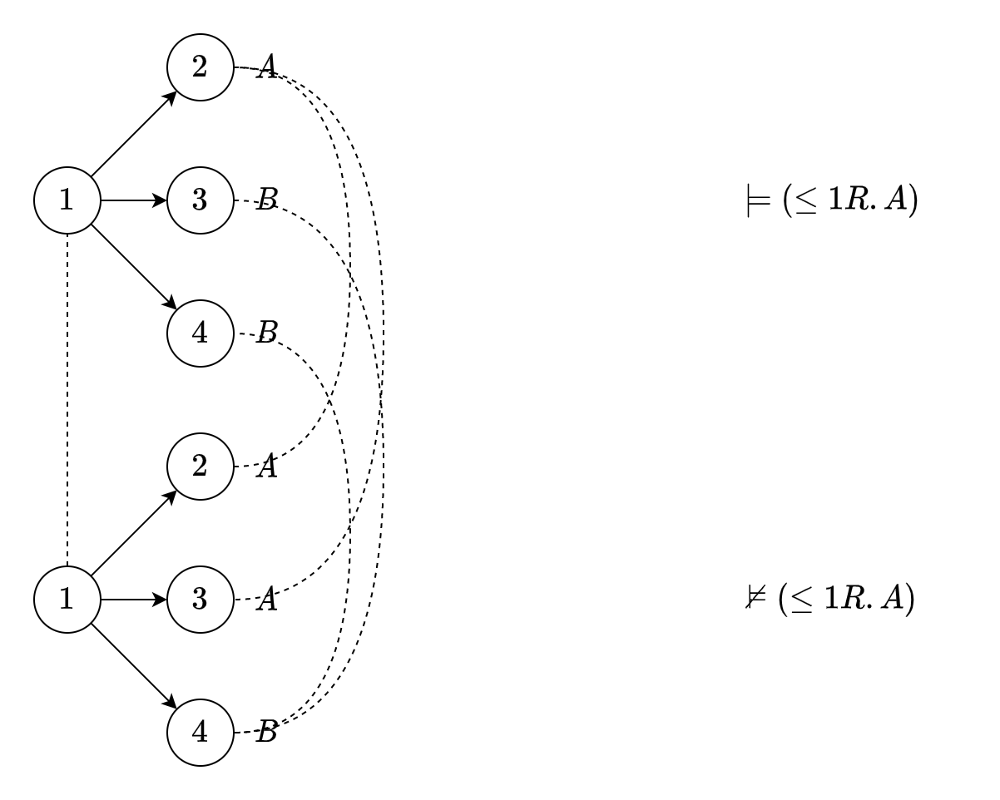

# Assignment 2

## 201300035 方盛俊

## Question 1. Some interesting properties of $\mathcal{EL}$

**(1)**

Let $\mathcal{I} = (\Delta^{\mathcal{I}}, \cdot ^{\mathcal{I}})$ be an interpretation and $\Delta^{\mathcal{I}} = \{ a \}$, $A^{\mathcal{I}} = \{ a \}$ for all concept name $A$, $r^{\mathcal{I}} = \{ (a, a) \}$ for all role $r$.

By induction on the structure of $\mathcal{EL}$-concept $C$:

- Assume that $C = \top$, then $C^{\mathcal{I}} = \Delta^{\mathcal{I}} = \{ a \}$.
- Assume that $C = A \in \mathbf{C}$, then $C^{\mathcal{I}} = A^{\mathcal{I}} = \{ a \}$ by definition.
- Assume that $C = D \sqcap E$, then $C^{\mathcal{I}} = D^{\mathcal{I}} \cap  E^{\mathcal{I}} = \{ a \} \cap \{ a \} = \{ a \}$.
- Assume that $C = \exists r.D$, then $C^{\mathcal{I}} = \{ a \}$ by the semantics of existential restriction.

So there exists an interpretation $\mathcal{I}$ such that $C^{\mathcal{I}} \neq \empty$.

**(2)**

We use the same interpretation $\mathcal{I}$ in (1).

For any $\mathcal{EL}$ concept inclusion $C \sqsubseteq D$ in $\mathcal{EL}$-TBox $\mathcal{T}$ (replace $C \equiv D$ with $C \sqsubseteq D$ and $D \sqsubseteq C$), we can know that $C^{\mathcal{I}} \subseteq D^{\mathcal{I}}$ as $C^{\mathcal{I}} = D^{\mathcal{I}} = \{ a \}$ by (1).

So there exists an intterpretation $\mathcal{I}$ such that $\mathcal{I} \models \mathcal{T}$.

## Question 2. Reasoning in $\mathcal{EL}$

**(1)**

Consider $\mathcal{T}$:

$$
\begin{aligned}
\text{Bird} &\equiv \text{Vertebrate} \sqcap \exists \text{has\_part}.\text{Wing} \\
\text{Reptile} &\sqsubseteq \text{Vertebrate} \sqcap \exists \text{lays}.\text{Egg}
\end{aligned}
$$

Step 1 gives:

$$
\begin{aligned}
\text{Bird} &\sqsubseteq \text{Vertebrate} \sqcap \exists \text{has\_part}.\text{Wing} \\
\text{Vertebrate} \sqcap \exists \text{has\_part}.\text{Wing} &\sqsubseteq \text{Bird} \\
\text{Reptile} &\sqsubseteq \text{Vertebrate} \sqcap \exists \text{lays}.\text{Egg} \\
\end{aligned}
$$

Step 2 gives:

$$
\begin{aligned}
\text{Bird} &\sqsubseteq \text{Vertebrate} \\
\text{Bird} &\sqsubseteq \exists \text{has\_part}.\text{Wing} \\
\text{Vertebrate} \sqcap \exists \text{has\_part}.\text{Wing} &\sqsubseteq \text{Bird} \\
\text{Reptile} &\sqsubseteq \text{Vertebrate} \\
\text{Reptile} &\sqsubseteq \exists \text{lays}.\text{Egg} \\
\end{aligned}
$$

Step 4 gives:

$$
\begin{aligned}
\text{Bird} &\sqsubseteq \text{Vertebrate} \\
\text{Bird} &\sqsubseteq \exists \text{has\_part}.\text{Wing} \\
X &\sqsubseteq \exists \text{has\_part}.\text{Wing} \\
\exists \text{has\_part}.\text{Wing} &\sqsubseteq X\\
\text{Vertebrate} \sqcap X &\sqsubseteq \text{Bird} \\
\text{Reptile} &\sqsubseteq \text{Vertebrate} \\
\text{Reptile} &\sqsubseteq \exists \text{lays}.\text{Egg} \\
\end{aligned}
$$

So it is the $\mathcal{T}'$.

**(2)**

Initalise:

$$
\begin{aligned}
S(\text{Bird}) &= \{ \text{Bird} \} \\
S(\text{Vertebrate}) &= \{ \text{Vertebrate} \} \\
S(\text{Wing}) &= \{ \text{Wing} \} \\
S(X) &= \{ X \} \\
S(\text{Reptile}) &= \{ \text{Reptile} \} \\
S(\text{Egg}) &= \{ \text{Egg} \} \\
R(\text{has\_part}) &= \empty \\
R(\text{lays}) &= \empty \\
\end{aligned}
$$

Application of (simpleR) and axiom 1, 6 gives:

$$
\begin{aligned}
S(\text{Bird}) &= \{ \text{Bird}, \text{Vertebrate} \} \\
S(\text{Reptile}) &= \{ \text{Reptile}, \text{Vertebrate} \} \\
\end{aligned}
$$

Application of (rightR) and axiom 2, 3, 7 gives:

$$
\begin{aligned}
R(\text{has\_part}) &= \{ (\text{Bird}, \text{Wing}), (X, \text{Wing}) \} \\
R(\text{lays}) &= \{ (\text{Reptile}, \text{Egg}) \} \\
\end{aligned}
$$

Application of (leftR) and axiom 4 gives:

$$
\begin{aligned}
S(\text{Bird}) &= \{ \text{Bird}, \text{Vertebrate}, X \} \\
\end{aligned}
$$

No more rules are applicable.

So the final result is:

$$
\begin{aligned}
S(\text{Bird}) &= \{ \text{Bird}, \text{Vertebrate}, X \} \\
S(\text{Vertebrate}) &= \{ \text{Vertebrate} \} \\
S(\text{Wing}) &= \{ \text{Wing} \} \\
S(X) &= \{ X \} \\
S(\text{Reptile}) &= \{ \text{Reptile}, \text{Vertebrate} \} \\
S(\text{Egg}) &= \{ \text{Egg} \} \\
R(\text{has\_part}) &= \{ (\text{Bird}, \text{Wing}), (X, \text{Wing}) \} \\
R(\text{lays}) &= \{ (\text{Reptile}, \text{Egg}) \} \\
\end{aligned}
$$

**(3)**

Use the result of (2) and $A \sqsubseteq_{\mathcal{T}'} B$ if and only if $B \in S(A)$, we can obtain that

- $\text{Reptile} \sqsubseteq_{\mathcal{T}'} \text{Vertebrate}$
- $\text{Vertebrate} \not \sqsubseteq_{\mathcal{T}'} \text{Bird}$

## Question 3. Bisimulation & bisimulation invariance

**(1)**

We extend the notion of bisimulation relation to $\mathcal{ALCN}$ firstly.

Let $\mathcal{I}$ and $\mathcal{J}$ be interpretations. The relation $\rho \subseteq \Delta^{\mathcal{I}} \times \Delta^{\mathcal{J}}$ is a bisimulation between $\mathcal{I}$ and $\mathcal{J}$ if

(i) $d \rho e$ implies $d \in A^{\mathcal{I}}$ if and only if $e \in A^{\mathcal{J}}$ for all $d \in \Delta^{\mathcal{I}}$, $e \in \Delta^{\mathcal{J}}$, and $I \in \mathbf{C}$.

(ii) if $d_1, \cdots, d_{n}$ are all the distinct elements of $\Delta^{\mathcal{I}}$ such that $(d, d_i) \in R^{\mathcal{I}}$ for $1 \le i \le n$, then there are exactly $n$ distinct elements $e_1, \cdots, e_{n}$ of $\Delta^{\mathcal{J}}$ such that $(e, e_i) \in R^{\mathcal{J}}$ for all $1 \le i \le n$.

(iii) if $e_1, \cdots, e_{n}$ are all the distinct elements of $\Delta^{\mathcal{J}}$ such that $(e, e_i) \in R^{\mathcal{J}}$ for $1 \le i \le n$, then there are exactly $n$ distinct elements $d_1, \cdots, d_{n}$ of $\Delta^{\mathcal{I}}$ such that $(d, d_i) \in R^{\mathcal{J}}$ for all $1 \le i \le n$.

Then we prove that $\mathcal{ALCN}$ is bisimulation invariant for the bisimulation relation.

We omit the part of original part and add new step:

Assumed that $C = (\le n R)$. Then $d \in (\le n R)^{\mathcal{I}}$

if and only if exists all $m \le n$ elements $d_1, \cdots, d_{m}$ with $(d, d_{i}) \in R^{\mathcal{I}}$ (semantics of $\le n R$)

if and only if exists exactly $m \le n$ elements $e_1, \cdots, e_{m}$ with $(e, e_{i}) \in R^{\mathcal{I}}$ (hypothesis and $d\rho e$)

if and only if $d_2 \in (\le n R)^{\mathcal{I}_2}$.

Assumed that $C = (\ge n R)$. Then $d \in (\ge n R)^{\mathcal{I}}$

if and only if exists all $m \ge n$ elements $d_1, \cdots, d_{m}$ with $(d, d_{i}) \in R^{\mathcal{I}}$ (semantics of $\ge n R$)

if and only if exists exactly $m \ge n$ elements $e_1, \cdots, e_{m}$ with $(e, e_{i}) \in R^{\mathcal{I}}$ (hypothesis and $d\rho e$)

if and only if $d_2 \in (\ge n R)^{\mathcal{I}_2}$.

**(2)**

As the image, there is a bisimulation between $\mathcal{I}$ and $\mathcal{J}$, so $\mathcal{ALC}$ cannot distinguish the interpretations $\mathcal{I}$ and $\mathcal{J}$ because of (1).

But $\mathcal{ALCQ}$ can distinguish them by $(\le 1 R.A)$.

So $\mathcal{ALCQ}$ is more expressive than $\mathcal{ALCN}$.

## Question 4. Closure under Disjoint Union

Let $\mathcal{K}=(\mathcal{T}, \mathcal{A})$ be an $ALC$-knowledge base and $(\mathcal{I}_{v})_{v \in \Omega}$ a family of models of $\mathcal{K}$. 

We extend the notion of disjoint union to individual names.

- $\Delta^{\mathcal{J}} = \{ (d,v)| v \in \Omega \text{ and } d \in \Delta^{\mathcal{I}_v} \}$
- $A^{\mathcal{J}} = \{ (d,v)| v \in \Omega \text{ and } d \in A^{\mathcal{I}_v} \}$ for all $A \in \mathbf{C}$
- $r^{\mathcal{J}} = \{ ((d,v), (e,v)) | v \in \Omega \text{ and } (d, e) \in r^{\mathcal{I}_v} \}$ for all $r \in \mathbf{R}$
- $a^{\mathcal{J}} = (a^{\mathcal{I}_{v_0}}, v_0)$ for all individual names $a$ occurring in $\mathcal{A}$ and $v_0 \in \Omega$ is a singe index picked up previously and arbitrarily.

Then we prove that its disjoint union $\mathcal{J} = \biguplus_{v \in \Omega}$ is also a model of $\mathcal{K}$.

Assume that $\mathcal{J}$ is not a model of $\mathcal{T}$. Then there is a GCI $C \sqsubseteq D$ in $\mathcal{T}$ and an element $(d,v) \in \Delta^{\mathcal{J}}$ such that $(d,v) \in C^{\mathcal{J}}$, but $(d,v) \not \in D^{\mathcal{J}}$. By the bisimulation between $\mathcal{I}_v$ and $\mathcal{J}$, this implies $d \in C^{\mathcal{I}_v}$ and $d \not \in D^{\mathcal{I}_v}$, which contradicts our assumption that $\mathcal{I}_v$ is a model of $\mathcal{K}$. 

Assume that $\mathcal{J}$ is not a model of $\mathcal{A}$. And we assume that there is assertion $a: C$ in $\mathcal{A}$ and the element $(a^{\mathcal{I}_{v_0}}, v_0) \not \in C^{\mathcal{J}}$. By the bisimulation between $\mathcal{I}_{v_0}$ and $\mathcal{J}$, this implies $a^{\mathcal{I}_{v_0}} \not \in C^{\mathcal{I}_{v_0}}$, which contradicts our assumption that $\mathcal{I}_{v_0}$ is a model of $\mathcal{K}$. Then we assume that there is assertion $(a, b): r$ in $\mathcal{A}$ and $((a^{\mathcal{I}_{v_0}}, v_0), (b^{\mathcal{I}_{v_0}}, v_0)) \not \in r^{\mathcal{J}}$. By the bisimulation between $\mathcal{I}_{v_0}$ and $\mathcal{J}$, this implies $(a^{\mathcal{I}_{v_0}}, b^{\mathcal{I}_{v_0}}) \not \in r^{\mathcal{I}_{v_0}}$, which contradicts our assumption that $\mathcal{I}_{v_0}$ is a model of $\mathcal{K}$.

## Question 5. Closure under Disjoint Union

**$\Leftarrow:$**

We have $C \sqsubseteq_{\mathcal{T}} D$, so $C^{\mathcal{I}} \subseteq D^{\mathcal{I}}$ holds for every model $\mathcal{I}$ of $\mathcal{T}$.

Because each model $J$ of $\mathcal{K}$ is must be a model of $\mathcal{T}$, so $C^{\mathcal{J}} \subseteq D^{\mathcal{J}}$ holds for every model $\mathcal{J}$ of $\mathcal{K}$.

So we know $C \sqsubseteq_{\mathcal{K}} D$.

**$\Rightarrow:$**

We have $C \sqsubseteq_{\mathcal{K}} D$, so $C^{\mathcal{I}} \subseteq D^{\mathcal{I}}$ holds for every model $\mathcal{I}$ of $\mathcal{K}$. And because $\mathcal{K}$ is a consisten $\mathcal{ALC}$-KB, so there is a model $\mathcal{I}_1$ of $\mathcal{K}$ satisfying $C^{\mathcal{I}_1} \subseteq D^{\mathcal{I}_1}$, which is also a model of $\mathcal{T}$.

Assumed $C \not \sqsubseteq_{\mathcal{T}} D$, then there is an model $\mathcal{I}_{2}$ of $\mathcal{T}$ and $C^{\mathcal{I}_2} \not \subseteq D^{\mathcal{I}_2}$.

We can get the disjoint union $\mathcal{J}$ of $\mathcal{I}_1$ and $\mathcal{I}_2$. By the previous exercise we attain that there is a bisimulation between $\mathcal{I}_1$ and $\mathcal{J}$. We need to prove $C^{\mathcal{J}} \subseteq D^{\mathcal{J}}$. Assumed $C^{\mathcal{J}} \not \subseteq D^{\mathcal{J}}$, then there is an element $(d, v) \in C^{\mathcal{J}}$ but $(d, v) \not \in D^{\mathcal{J}}$. By bisimulation between $\mathcal{I}_1$ and $\mathcal{J}$, this implies $d \in C^{\mathcal{I}_1}$ but $d \not \in D^{\mathcal{I}_1}$, which contradicts the former conclusion $C^{\mathcal{I}_1} \subseteq D^{\mathcal{I}_1}$. So we know $C^{\mathcal{J}} \subseteq D^{\mathcal{J}}$. Using the bisimulation between $\mathcal{J}$ and $\mathcal{I}_2$, and the same steps, we could attain $C^{\mathcal{I}_2} \subseteq D^{\mathcal{I}_2}$, which contradicts the former assumption $C^{\mathcal{I}_2} \not \subseteq D^{\mathcal{I}_2}$.

So we know $C \sqsubseteq_{\mathcal{T}} D$.

## Question 6. Finite model property

**(1)**

Because $C$ is a satisfiable $\mathcal{ALC}$-concept with respect to $\mathcal{T}$. So by the finite model property, there is a finite model $\mathcal{I}$ such that $|C^{\mathcal{I}}| \ge 1$.

Let $\mathcal{I}_m = \biguplus_{v \in \{ 1, \cdots, m \}}\mathcal{I}$, e.t. the $m$-fold disjoint union of $\mathcal{I}$ itself. So $|C^{I_{m}}| = m|C^{\mathcal{I}}| \ge m$.

So for all $m \ge 1$ there is a finite model $\mathcal{I}_{m}$ of $\mathcal{T}$ such that $|C^{\mathcal{I}_m}| \ge m$.

**(2)**

It doesn't hold if the condition "$|C^{\mathcal{I}_m}| \ge m$" is replaced by "$|C^{\mathcal{I}_m}| = m$".

Let $C = \top$, $\mathcal{T} = \{ A \sqsubseteq \exists r.\lnot A, \lnot A  \sqsubseteq \exists r.A \}$ and $m = 1$.

For any model $\mathcal{I}$ of $\mathcal{T}$, because $\Delta^{\mathcal{I}} \neq \empty$ and $(A \sqcup \lnot A)^{\mathcal{I}} = \top^{\mathcal{I}} = \Delta^{\mathcal{I}}$, so $A^{\mathcal{I}} \neq \empty$ or $(\lnot A)^{\mathcal{I}} \neq \empty$.

We assume $A^{\mathcal{I}} = \empty$, so $(\exists r.A)^{\mathcal{I}} = \empty$. By the CGI $\lnot A \sqsubseteq \exists r.A$, we can know $(\lnot A)^{\mathcal{I}} \subseteq (\exists r.A)^{\mathcal{I}}$ then $(\lnot A)^{\mathcal{I}} = \empty$, which contradicts the former conclusion $A^{\mathcal{I}} \neq \empty$ or $(\lnot A)^{\mathcal{I}} \neq \empty$.

We assume $(\lnot A)^{\mathcal{I}} = \empty$, so $(\exists r.\lnot A)^{\mathcal{I}} = \empty$. By the CGI $A \sqsubseteq \exists r.\lnot A$, we can know $A^{\mathcal{I}} \subseteq (\exists r.\lnot A)^{\mathcal{I}}$ then $A^{\mathcal{I}} = \empty$, which contradicts the former conclusion $A^{\mathcal{I}} \neq \empty$ or $(\lnot A)^{\mathcal{I}} \neq \empty$.

Then we can know $|C^{\mathcal{I}}| = |\top^{\mathcal{I}}| = |A^{\mathcal{I}}| + |(\lnot A)^{\mathcal{I}}| \ge 1 + 1 = 2$, which contradicts $|C^{\mathcal{I}}| = m = 1$.

So it doesn't hold if the condition "$|C^{\mathcal{I}_m}| \ge m$" is replaced by "$|C^{\mathcal{I}_m}| = m$".
