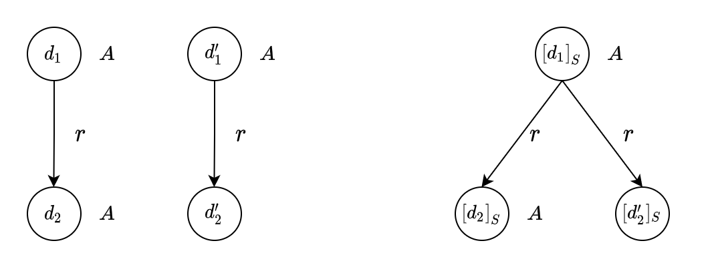
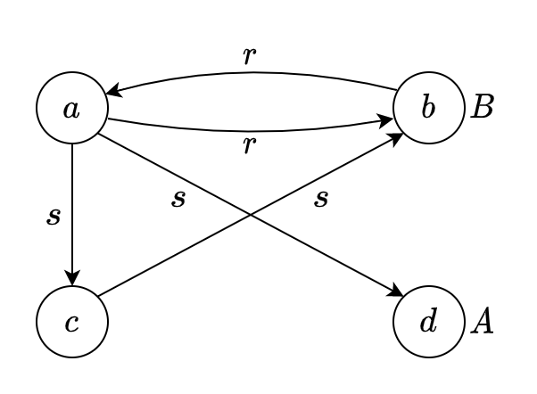

# Assignment 2

## 201300035 方盛俊

## Question 1. Some interesting properties of $\mathcal{EL}$

**(1)**

Let $\mathcal{I} = (\Delta^{\mathcal{I}}, \cdot ^{\mathcal{I}})$ be an interpretation and $\Delta^{\mathcal{I}} = \{ a \}$, $A^{\mathcal{I}} = \{ a \}$ for all concept name $A$, $r^{\mathcal{I}} = \{ (a, a) \}$ for all role $r$.

By induction on the structure of $\mathcal{EL}$-concept $C$:

- Assume that $C = \top$, then $C^{\mathcal{I}} = \Delta^{\mathcal{I}} = \{ a \}$.
- Assume that $C = A \in \mathbf{C}$, then $C^{\mathcal{I}} = A^{\mathcal{I}} = \{ a \}$ by definition.
- Assume that $C = D \sqcap E$, then $C^{\mathcal{I}} = D^{\mathcal{I}} \cap  E^{\mathcal{I}} = \{ a \} \cap \{ a \} = \{ a \}$.
- Assume that $C = \exists r.D$, then $C^{\mathcal{I}} = \{ a \}$ by the semantics of existential restriction.

So there exists an interpretation $\mathcal{I}$ such that $C^{\mathcal{I}} \neq \empty$.

**(2)**

We use the same interpretation $\mathcal{I}$ in (1).

For any $\mathcal{EL}$ concept inclusion $C \sqsubseteq D$ in $\mathcal{EL}$-TBox $\mathcal{T}$ (replace $C \equiv D$ with $C \sqsubseteq D$ and $D \sqsubseteq C$), we can know that $C^{\mathcal{I}} \subseteq D^{\mathcal{I}}$ as $C^{\mathcal{I}} = D^{\mathcal{I}} = \{ a \}$ by (1).

So there exists an intterpretation $\mathcal{I}$ such that $\mathcal{I} \models \mathcal{T}$.

## Question 2. Reasoning in $\mathcal{EL}$

**(1)**

Consider $\mathcal{T}$:

$$
\begin{aligned}
\text{Bird} &\equiv \text{Vertebrate} \sqcap \exists \text{has\_part}.\text{Wing} \\
\text{Reptile} &\sqsubseteq \text{Vertebrate} \sqcap \exists \text{lays}.\text{Egg}
\end{aligned}
$$

Step 1 gives:

$$
\begin{aligned}
\text{Bird} &\sqsubseteq \text{Vertebrate} \sqcap \exists \text{has\_part}.\text{Wing} \\
\text{Vertebrate} \sqcap \exists \text{has\_part}.\text{Wing} &\sqsubseteq \text{Bird} \\
\text{Reptile} &\sqsubseteq \text{Vertebrate} \sqcap \exists \text{lays}.\text{Egg} \\
\end{aligned}
$$

Step 2 gives:

$$
\begin{aligned}
\text{Bird} &\sqsubseteq \text{Vertebrate} \\
\text{Bird} &\sqsubseteq \exists \text{has\_part}.\text{Wing} \\
\text{Vertebrate} \sqcap \exists \text{has\_part}.\text{Wing} &\sqsubseteq \text{Bird} \\
\text{Reptile} &\sqsubseteq \text{Vertebrate} \\
\text{Reptile} &\sqsubseteq \exists \text{lays}.\text{Egg} \\
\end{aligned}
$$

Step 4 gives:

$$
\begin{aligned}
\text{Bird} &\sqsubseteq \text{Vertebrate} \\
\text{Bird} &\sqsubseteq \exists \text{has\_part}.\text{Wing} \\
X &\sqsubseteq \exists \text{has\_part}.\text{Wing} \\
\exists \text{has\_part}.\text{Wing} &\sqsubseteq X\\
\text{Vertebrate} \sqcap X &\sqsubseteq \text{Bird} \\
\text{Reptile} &\sqsubseteq \text{Vertebrate} \\
\text{Reptile} &\sqsubseteq \exists \text{lays}.\text{Egg} \\
\end{aligned}
$$

So it is the $\mathcal{T}'$.

**(2)**

Initalise:

$$
\begin{aligned}
S(\text{Bird}) &= \{ \text{Bird} \} \\
S(\text{Vertebrate}) &= \{ \text{Vertebrate} \} \\
S(\text{Wing}) &= \{ \text{Wing} \} \\
S(X) &= \{ X \} \\
S(\text{Reptile}) &= \{ \text{Reptile} \} \\
S(\text{Egg}) &= \{ \text{Egg} \} \\
R(\text{has\_part}) &= \empty \\
R(\text{lays}) &= \empty \\
\end{aligned}
$$

Application of (simpleR) and axiom 1, 6 gives:

$$
\begin{aligned}
S(\text{Bird}) &= \{ \text{Bird}, \text{Vertebrate} \} \\
S(\text{Reptile}) &= \{ \text{Reptile}, \text{Vertebrate} \} \\
\end{aligned}
$$

Application of (rightR) and axiom 2, 3, 7 gives:

$$
\begin{aligned}
R(\text{has\_part}) &= \{ (\text{Bird}, \text{Wing}), (X, \text{Wing}) \} \\
R(\text{lays}) &= \{ (\text{Reptile}, \text{Egg}) \} \\
\end{aligned}
$$

Application of (leftR) and axiom 4 gives:

$$
\begin{aligned}
S(\text{Bird}) &= \{ \text{Bird}, \text{Vertebrate}, X \} \\
\end{aligned}
$$

No more rules are applicable.

So the final result is:

$$
\begin{aligned}
S(\text{Bird}) &= \{ \text{Bird}, \text{Vertebrate}, X \} \\
S(\text{Vertebrate}) &= \{ \text{Vertebrate} \} \\
S(\text{Wing}) &= \{ \text{Wing} \} \\
S(X) &= \{ X \} \\
S(\text{Reptile}) &= \{ \text{Reptile}, \text{Vertebrate} \} \\
S(\text{Egg}) &= \{ \text{Egg} \} \\
R(\text{has\_part}) &= \{ (\text{Bird}, \text{Wing}), (X, \text{Wing}) \} \\
R(\text{lays}) &= \{ (\text{Reptile}, \text{Egg}) \} \\
\end{aligned}
$$

**(3)**

Use the result of (2) and $A \sqsubseteq_{\mathcal{T}'} B$ if and only if $B \in S(A)$, we can obtain that

- $\text{Reptile} \sqsubseteq_{\mathcal{T}'} \text{Vertebrate}$ is true
- $\text{Vertebrate} \sqsubseteq_{\mathcal{T}'} \text{Bird}$ is false

## Question 3. Bisimulation & bisimulation invariance

**(1)**

We extend the notion of bisimulation relation to $\mathcal{ALCN}$ firstly.

Let $\mathcal{I}$ and $\mathcal{J}$ be interpretations. The relation $\rho \subseteq \Delta^{\mathcal{I}} \times \Delta^{\mathcal{J}}$ is a bisimulation between $\mathcal{I}$ and $\mathcal{J}$ if

(i) $d \rho e$ implies $d \in A^{\mathcal{I}}$ if and only if $e \in A^{\mathcal{J}}$ for all $d \in \Delta^{\mathcal{I}}$, $e \in \Delta^{\mathcal{J}}$, and $I \in \mathbf{C}$.

(ii) if $d_1, \cdots, d_{n}$ are all the distinct elements of $\Delta^{\mathcal{I}}$ such that $(d, d_i) \in R^{\mathcal{I}}$ for $1 \le i \le n$, then there are exactly $n$ distinct elements $e_1, \cdots, e_{n}$ of $\Delta^{\mathcal{J}}$ such that $(e, e_i) \in R^{\mathcal{J}}$ for all $1 \le i \le n$.

(iii) if $e_1, \cdots, e_{n}$ are all the distinct elements of $\Delta^{\mathcal{J}}$ such that $(e, e_i) \in R^{\mathcal{J}}$ for $1 \le i \le n$, then there are exactly $n$ distinct elements $d_1, \cdots, d_{n}$ of $\Delta^{\mathcal{I}}$ such that $(d, d_i) \in R^{\mathcal{J}}$ for all $1 \le i \le n$.

Then we prove that $\mathcal{ALCN}$ is bisimulation invariant for the bisimulation relation.

We omit the part of original part and add new step:

Assumed that $C = (\le n R)$. Then $d \in (\le n R)^{\mathcal{I}}$

if and only if exists all $m \le n$ elements $d_1, \cdots, d_{m}$ with $(d, d_{i}) \in R^{\mathcal{I}}$ (semantics of $\le n R$)

if and only if exists exactly $m \le n$ elements $e_1, \cdots, e_{m}$ with $(e, e_{i}) \in R^{\mathcal{I}}$ (hypothesis and $d\rho e$)

if and only if $d_2 \in (\le n R)^{\mathcal{I}_2}$.

Assumed that $C = (\ge n R)$. Then $d \in (\ge n R)^{\mathcal{I}}$

if and only if exists all $m \ge n$ elements $d_1, \cdots, d_{m}$ with $(d, d_{i}) \in R^{\mathcal{I}}$ (semantics of $\ge n R$)

if and only if exists exactly $m \ge n$ elements $e_1, \cdots, e_{m}$ with $(e, e_{i}) \in R^{\mathcal{I}}$ (hypothesis and $d\rho e$)

if and only if $d_2 \in (\ge n R)^{\mathcal{I}_2}$.

**(2)**

As the image, there is a bisimulation between $\mathcal{I}$ and $\mathcal{J}$, so $\mathcal{ALC}$ cannot distinguish the interpretations $\mathcal{I}$ and $\mathcal{J}$ because of (1).

But $\mathcal{ALCQ}$ can distinguish them by $(\le 1 R.A)$.

So $\mathcal{ALCQ}$ is more expressive than $\mathcal{ALCN}$.

## Question 4. Closure under Disjoint Union

Let $\mathcal{K}=(\mathcal{T}, \mathcal{A})$ be an $ALC$-knowledge base and $(\mathcal{I}_{v})_{v \in \Omega}$ a family of models of $\mathcal{K}$. 

We extend the notion of disjoint union to individual names.

- $\Delta^{\mathcal{J}} = \{ (d,v)| v \in \Omega \text{ and } d \in \Delta^{\mathcal{I}_v} \}$
- $A^{\mathcal{J}} = \{ (d,v)| v \in \Omega \text{ and } d \in A^{\mathcal{I}_v} \}$ for all $A \in \mathbf{C}$
- $r^{\mathcal{J}} = \{ ((d,v), (e,v)) | v \in \Omega \text{ and } (d, e) \in r^{\mathcal{I}_v} \}$ for all $r \in \mathbf{R}$
- $a^{\mathcal{J}} = (a^{\mathcal{I}_{v_0}}, v_0)$ for all individual names $a$ occurring in $\mathcal{A}$ and $v_0 \in \Omega$ is a singe index picked up previously and arbitrarily.

Then we prove that its disjoint union $\mathcal{J} = \biguplus_{v \in \Omega}$ is also a model of $\mathcal{K}$.

Assume that $\mathcal{J}$ is not a model of $\mathcal{T}$. Then there is a GCI $C \sqsubseteq D$ in $\mathcal{T}$ and an element $(d,v) \in \Delta^{\mathcal{J}}$ such that $(d,v) \in C^{\mathcal{J}}$, but $(d,v) \not \in D^{\mathcal{J}}$. By the bisimulation between $\mathcal{I}_v$ and $\mathcal{J}$, this implies $d \in C^{\mathcal{I}_v}$ and $d \not \in D^{\mathcal{I}_v}$, which contradicts our assumption that $\mathcal{I}_v$ is a model of $\mathcal{K}$. 

Assume that $\mathcal{J}$ is not a model of $\mathcal{A}$. And we assume that there is assertion $a: C$ in $\mathcal{A}$ and the element $(a^{\mathcal{I}_{v_0}}, v_0) \not \in C^{\mathcal{J}}$. By the bisimulation between $\mathcal{I}_{v_0}$ and $\mathcal{J}$, this implies $a^{\mathcal{I}_{v_0}} \not \in C^{\mathcal{I}_{v_0}}$, which contradicts our assumption that $\mathcal{I}_{v_0}$ is a model of $\mathcal{K}$. Then we assume that there is assertion $(a, b): r$ in $\mathcal{A}$ and $((a^{\mathcal{I}_{v_0}}, v_0), (b^{\mathcal{I}_{v_0}}, v_0)) \not \in r^{\mathcal{J}}$. By the bisimulation between $\mathcal{I}_{v_0}$ and $\mathcal{J}$, this implies $(a^{\mathcal{I}_{v_0}}, b^{\mathcal{I}_{v_0}}) \not \in r^{\mathcal{I}_{v_0}}$, which contradicts our assumption that $\mathcal{I}_{v_0}$ is a model of $\mathcal{K}$.

## Question 5. Closure under Disjoint Union

**$\Leftarrow:$**

We have $C \sqsubseteq_{\mathcal{T}} D$, so $C^{\mathcal{I}} \subseteq D^{\mathcal{I}}$ holds for every model $\mathcal{I}$ of $\mathcal{T}$.

Because each model $J$ of $\mathcal{K}$ is must be a model of $\mathcal{T}$, so $C^{\mathcal{J}} \subseteq D^{\mathcal{J}}$ holds for every model $\mathcal{J}$ of $\mathcal{K}$.

So we know $C \sqsubseteq_{\mathcal{K}} D$.

**$\Rightarrow:$**

We have $C \sqsubseteq_{\mathcal{K}} D$, so $C^{\mathcal{I}} \subseteq D^{\mathcal{I}}$ holds for every model $\mathcal{I}$ of $\mathcal{K}$. And because $\mathcal{K}$ is a consisten $\mathcal{ALC}$-KB, so there is a model $\mathcal{I}_1$ of $\mathcal{K}$ satisfying $C^{\mathcal{I}_1} \subseteq D^{\mathcal{I}_1}$, which is also a model of $\mathcal{T}$.

Assumed $C \not \sqsubseteq_{\mathcal{T}} D$, then there is an model $\mathcal{I}_{2}$ of $\mathcal{T}$ and $C^{\mathcal{I}_2} \not \subseteq D^{\mathcal{I}_2}$.

We can get the disjoint union $\mathcal{J}$ of $\mathcal{I}_1$ and $\mathcal{I}_2$. By the previous exercise we attain that there is a bisimulation between $\mathcal{I}_1$ and $\mathcal{J}$. We need to prove $C^{\mathcal{J}} \subseteq D^{\mathcal{J}}$. Assumed $C^{\mathcal{J}} \not \subseteq D^{\mathcal{J}}$, then there is an element $(d, v) \in C^{\mathcal{J}}$ but $(d, v) \not \in D^{\mathcal{J}}$. By bisimulation between $\mathcal{I}_1$ and $\mathcal{J}$, this implies $d \in C^{\mathcal{I}_1}$ but $d \not \in D^{\mathcal{I}_1}$, which contradicts the former conclusion $C^{\mathcal{I}_1} \subseteq D^{\mathcal{I}_1}$. So we know $C^{\mathcal{J}} \subseteq D^{\mathcal{J}}$. Using the bisimulation between $\mathcal{J}$ and $\mathcal{I}_2$, and the same steps, we could attain $C^{\mathcal{I}_2} \subseteq D^{\mathcal{I}_2}$, which contradicts the former assumption $C^{\mathcal{I}_2} \not \subseteq D^{\mathcal{I}_2}$.

So we know $C \sqsubseteq_{\mathcal{T}} D$.

## Question 6. Finite model property

**(1)**

Because $C$ is a satisfiable $\mathcal{ALC}$-concept with respect to $\mathcal{T}$. So by the finite model property, there is a finite model $\mathcal{I}$ such that $|C^{\mathcal{I}}| \ge 1$.

Let $\mathcal{I}_m = \biguplus_{v \in \{ 1, \cdots, m \}}\mathcal{I}$, e.t. the $m$-fold disjoint union of $\mathcal{I}$ itself. So $|C^{I_{m}}| = m|C^{\mathcal{I}}| \ge m$.

So for all $m \ge 1$ there is a finite model $\mathcal{I}_{m}$ of $\mathcal{T}$ such that $|C^{\mathcal{I}_m}| \ge m$.

**(2)**

It doesn't hold if the condition "$|C^{\mathcal{I}_m}| \ge m$" is replaced by "$|C^{\mathcal{I}_m}| = m$".

Let $C = \top$, $\mathcal{T} = \{ A \sqsubseteq \exists r.\lnot A, \lnot A  \sqsubseteq \exists r.A \}$ and $m = 1$.

For any model $\mathcal{I}$ of $\mathcal{T}$, because $\Delta^{\mathcal{I}} \neq \empty$ and $(A \sqcup \lnot A)^{\mathcal{I}} = \top^{\mathcal{I}} = \Delta^{\mathcal{I}}$, so $A^{\mathcal{I}} \neq \empty$ or $(\lnot A)^{\mathcal{I}} \neq \empty$.

We assume $A^{\mathcal{I}} = \empty$, so $(\exists r.A)^{\mathcal{I}} = \empty$. By the CGI $\lnot A \sqsubseteq \exists r.A$, we can know $(\lnot A)^{\mathcal{I}} \subseteq (\exists r.A)^{\mathcal{I}}$ then $(\lnot A)^{\mathcal{I}} = \empty$, which contradicts the former conclusion $A^{\mathcal{I}} \neq \empty$ or $(\lnot A)^{\mathcal{I}} \neq \empty$.

We assume $(\lnot A)^{\mathcal{I}} = \empty$, so $(\exists r.\lnot A)^{\mathcal{I}} = \empty$. By the CGI $A \sqsubseteq \exists r.\lnot A$, we can know $A^{\mathcal{I}} \subseteq (\exists r.\lnot A)^{\mathcal{I}}$ then $A^{\mathcal{I}} = \empty$, which contradicts the former conclusion $A^{\mathcal{I}} \neq \empty$ or $(\lnot A)^{\mathcal{I}} \neq \empty$.

Then we can know $|C^{\mathcal{I}}| = |\top^{\mathcal{I}}| = |A^{\mathcal{I}}| + |(\lnot A)^{\mathcal{I}}| \ge 1 + 1 = 2$, which contradicts $|C^{\mathcal{I}}| = m = 1$.

So it doesn't hold if the condition "$|C^{\mathcal{I}_m}| \ge m$" is replaced by "$|C^{\mathcal{I}_m}| = m$".

## Question 7. Bisimulation over filtration

The statement "the relation $\rho = \{(d, [d]) | d ∈ \Delta^{\mathcal{I}}\}$ is a bisimulation between I and J" is false.

Let $C = A$ and $\mathcal{T} = \{ \exists r.\top \sqsubseteq \top \}$, so $S = \operatorname{sub}(C) \cup \operatorname{sub}(\mathcal{T}) = \{ \top, A, \exists r.\top \}$.

We can see that the right interpretation $\mathcal{J}$ is the $\mathcal{S}$-filtration of the left interpretation $\mathcal{I}$ with respect to $\operatorname{sub}(C) \cup \operatorname{sub}(\mathcal{T})$.

But relation $\rho = \{ (d, [d]) | d \in \Delta^{\mathcal{I}} \}$ is not a bisimmulation between $\mathcal{I}$ and $\mathcal{J}$.

## Question 8. Bisimulation within the same interpretation

**(1)**

We need to prove that $\thickapprox_{\mathcal{I}}$ is a bisimulation on $\mathcal{I}$.

(i) $d \thickapprox_{\mathcal{I}} e$ implies there is a bisimulation $\rho$ on $\mathcal{I}$ such that $d \rho e$, which imlies

$d \in A^{\mathcal{I}}$ if and only if $e \in A^{\mathcal{I}}$

for all $d \in \Delta^{\mathcal{I}}$, $e \in \Delta^{\mathcal{I}}$, and $A \in \mathbf{C}$.

(ii) $d \thickapprox_{\mathcal{I}} e$ and $(d, d') \in r^{\mathcal{I}}$ implies there is a bisimulation $\rho$ on $\mathcal{I}$ such that $d \rho e$ and $(d, d') \in r^{\mathcal{I}}$, which implies the existence of $e' \in \Delta^{\mathcal{I}}$ such that

$d' \rho e'$ and $(e, e') \in r^{\mathcal{I}}$, and then

$d' \thickapprox_{\mathcal{I}} e'$ and $(e, e') \in r^{\mathcal{I}}$ because of the definition of $d' \thickapprox_{\mathcal{I}} e'$,

for all $d, d' \in \Delta^{\mathcal{I}}$, $e \in \Delta^{\mathcal{I}}$, and $r \in \mathbf{R}$.

(iii) Same property in the opposite direction with same method.

So $\thickapprox_{\mathcal{I}}$ is a bisimulation on $\mathcal{I}$.

**(2)**

By the definition like filtration, we can know

$[d]_{\thickapprox_{\mathcal{I}}} = \{ e \in \Delta^{\mathcal{I}} | d \thickapprox_{\mathcal{I}} e \}$

And the $\mathcal{J}$ is defined as follow:

$\Delta^{\mathcal{J}} = \{ [d]_{\thickapprox_{\mathcal{I}}} | d \in \Delta^{\mathcal{I}} \}$

$A^{\mathcal{J}} = \{ [d]_{\thickapprox_{\mathcal{I}}} | \text{there is } d' \in [d]_{\thickapprox_{\mathcal{I}}} \text{ with } d' \in A^{\mathcal{I}} \}$ for all $A \in \mathbf{C}$

$r^{\mathcal{J}} = \{ ([d]_{\thickapprox_{\mathcal{I}}}, [e]_{\thickapprox_{\mathcal{I}}}) | \text{there is } d' \in [d]_{\thickapprox_{\mathcal{I}}}, e' \in [e]_{\thickapprox_{\mathcal{I}}} \text{ with } (d', e') \in r^{\mathcal{I}} \}$ for all $r \in \mathbf{R}$

Now we show that $\rho = \{ (d, [d]_{\thickapprox_{\mathcal{I}}}) | d \in \Delta^{\mathcal{I}} \}$ is a bisimulation between $\mathcal{I}$ and $\mathcal{J}$.

(i) $(d, [d]_{\thickapprox_{\mathcal{I}}}) \in \rho$ implies

**$\Rightarrow:$**

Assume $d \in A^{\mathcal{I}}$. Because there is $d \in [d]_{\thickapprox_{\mathcal{I}}}$ as $d \thickapprox_{\mathcal{I}} d$ with $d \in A^{\mathcal{I}}$, we can know $[d]_{\thickapprox_{\mathcal{I}}} \in A^{\mathcal{J}}$ by the definition of $A^{\mathcal{J}}$.

**$\Leftarrow:$**

Assume $[d]_{\thickapprox_{\mathcal{I}}} \in A^{\mathcal{J}}$. There is $d' \in [d]_{\thickapprox_{\mathcal{I}}}$ with $d' \in A^{\mathcal{I}}$. Because $d \in [d]_{\thickapprox_{\mathcal{I}}}$ as $d \thickapprox_{\mathcal{I}} d$, we can know that $d \thickapprox_{\mathcal{I}} d'$. And $\thickapprox_{\mathcal{I}}$ is a bisimulation on $\mathcal{I}$, which implies $d' \in A^{\mathcal{I}}$ if and only if $d \in A^{\mathcal{I}}$.

So $d \in A^{\mathcal{I}}$ if and only if $[d]_{\thickapprox_{\mathcal{I}}} \in A^{\mathcal{J}}$

for all $d \in \Delta^{\mathcal{I}}$, $[d]_{\thickapprox_{\mathcal{I}}} \in \Delta^{\mathcal{J}}$, and $A \in \mathbf{C}$.

(ii) $(d, [d]_{\thickapprox_{\mathcal{I}}}) \in \rho$ and $(d, e) \in r^{\mathcal{I}}$ implies there is $d \in [d]_{\thickapprox_{\mathcal{I}}}$, $e \in [e]_{\thickapprox_{\mathcal{I}}}$ with $(d, e) \in r^{\mathcal{I}}$, which implies the existence of $[e]_{\thickapprox_{\mathcal{I}}} \in \Delta^{\mathcal{J}}$ such that

$(e, [e]_{\thickapprox_{\mathcal{I}}}) \in \rho$ and $([d]_{\thickapprox_{\mathcal{I}}}, [e]_{\thickapprox_{\mathcal{I}}}) \in r^{\mathcal{J}}$

for all $d, e \in \Delta^{\mathcal{I}}$, $[d]_{\thickapprox_{\mathcal{I}}} \in \Delta^{\mathcal{J}}$, and $r \in \mathbf{R}$.

(iii) $(d, [d]_{\thickapprox_{\mathcal{I}}}) \in \rho$ and $([d]_{\thickapprox_{\mathcal{I}}}, [e]_{\thickapprox_{\mathcal{I}}}) \in r^{\mathcal{J}}$ implies there is $d' \in [d]_{\thickapprox_{\mathcal{I}}}$, $e' \in [e]_{\thickapprox_{\mathcal{I}}}$ with $(d', e') \in r^{\mathcal{I}}$. Because $d \in [d]_{\thickapprox_{\mathcal{I}}}$, we can know $d \thickapprox_{\mathcal{I}} d'$. And $\thickapprox_{\mathcal{I}}$ is a bisimulation on $\mathcal{I}$, which implies the existence of $e \in \Delta^{\mathcal{I}}$ such that

$e \thickapprox_{\mathcal{I}} e'$ and $(d, e) \in r^{\mathcal{I}}$

So we can know

$(e, [e]_{\thickapprox_{\mathcal{I}}}) \in \rho$ and $(d, e) \in r^{\mathcal{I}}$

for all $d \in \Delta^{\mathcal{I}}$, $[d]_{\thickapprox_{\mathcal{I}}}, [e]_{\thickapprox_{\mathcal{I}}} \in \Delta^{\mathcal{J}}$, and $r \in \mathbf{R}$.

So we show that $\rho = \{ (d, [d]_{\thickapprox_{\mathcal{I}}}) | d \in \Delta^{\mathcal{I}} \}$ is a bisimulation between $\mathcal{I}$ and $\mathcal{J}$.

**(3)**

Because $\mathcal{I}$ is a model of an $\mathcal{ALC}$-concept $C$ with respect to an $\mathcal{ALC}$-TBox $\mathcal{T}$, then $C^{\mathcal{I}} \neq \empty$.

Let $d \in \Delta^{\mathcal{I}}$ be such that $d \in C^{\mathcal{I}}$. Since there is a bisimulation between $\mathcal{I}$ and $\mathcal{J}$, so $[d]_{\thickapprox_{\mathcal{I}}} \in C^{\mathcal{J}}$ by bisimulation invariance of $\mathcal{ALC}$.

It is also easy to see that $\mathcal{J}$ is a model of $\mathcal{T}$. Let $D \sqsubseteq E$ be a GCI in $\mathcal{T}$, and $[e]_{\thickapprox_{\mathcal{I}}} \in D^{\mathcal{J}}$. We must show $[e]_{\thickapprox_{\mathcal{I}}} \in E^{\mathcal{J}}$. By bisimulation invariance, $e \in D^{\mathcal{I}}$ and thus $e \in E^{\mathcal{J}}$ since $\mathcal{I}$ is a model of $\mathcal{T}$. And then $e \in E^{\mathcal{J}}$ implies $[e]_{\thickapprox_{\mathcal{I}}} \in E^{\mathcal{J}}$.

So $\mathcal{J}$ is a model of an $\mathcal{ALC}$-concept $C$ with respect to an $\mathcal{ALC}$-TBox $\mathcal{T}$.

## Question 9. Unravelling

## Question 10. Tree model property

The statement "if $\mathcal{K}$ is an $\mathcal{ALC}$-KB and $C$ an $\mathcal{ALC}$-concept such that $C$ is satisfiable w.r.t. $\mathcal{K}$, then $C$ has a tree model w.r.t. $\mathcal{K}$" is false. 

Let $C = \top, \mathcal{K} = (\mathcal{T}, \mathcal{A}), \mathcal{T} = \empty, \mathcal{A} = \{ a: A, b: \lnot A, (a,b): r, (b,a): r \}$.

For any model $\mathcal{I}$ of such $\mathcal{K}$, we can know that $a^{\mathcal{I}}$ and $b^{\mathcal{I}}$ are two distinct elements, and $(a^{\mathcal{I}}, b^{\mathcal{I}}), (b^{\mathcal{I}}, a^{\mathcal{I}}) \in r^{\mathcal{I}}$ both. So there is a ring "$a \xrightarrow{r} b \xrightarrow{r} a$" for any model $\mathcal{I}$ of such $\mathcal{K}$.

So the statement is false.

## Question 11. Tableau algorithm

Init:

$$
\mathcal{A}_0 = \mathcal{A} = \{ (b,a): r, (a,b): r, (a,c): s, (c,b):s, a: \exists s.A, \\ b: \forall r.((\forall s.\lnot A)\sqcup (\exists r.B)), c: \forall s.(B \sqcap (\forall s.\bot)) \}
$$

An application of $\to_{\exists}$ and $a: \exists s.A$ gives

$$
\mathcal{A}_1 = \mathcal{A}_0 \cup \{ (a,d): s, d: A \}
$$

An application of $\to_{\forall}$ and $b: \forall r.((\forall s.\lnot A)\sqcup (\exists r.B))$ gives:

$$
\mathcal{A}_2 = \mathcal{A}_1 \cup \{ a: (\forall s.\lnot A)\sqcup (\exists r.B) \}
$$

An application of $\to_{\forall}$ and $c: \forall s.(B \sqcap (\forall s.\bot))$ gives:

$$
\mathcal{A}_3 = \mathcal{A}_2 \cup \{ b: B \sqcap (\forall s.\bot) \}
$$

An application of $\to_{\sqcap }$ and $b: B \sqcap (\forall s.\bot)$ gives:

$$
\mathcal{A}_4 = \mathcal{A}_3 \cup \{ b: B, b: \forall s.\bot \}
$$

An application of $\to_{\sqcup}$ and $a: (\forall s.\lnot A)\sqcup (\exists r.B)$ gives:

Firstly, we can try

$$
\mathcal{A}_5 = \mathcal{A}_4 \cup \{ a: \forall s.\lnot A \}
$$

An application of $\to_{\forall}$ and $a: \forall s.\lnot A$ gives

$$
\mathcal{A}_6 = \mathcal{A}_5 \cup \{ c: \lnot A, d: \lnot A \}
$$

We have abtained a clash because $d: A$ and $d: \lnot A$, thus this choice was unsuccessful.

Secondly, we can try

$$
\mathcal{A}_5^{*} = \mathcal{A}_4 \cup \{ a: \exists r.B \}
$$

No rule is applicable to $\mathcal{A}_5^{*}$ and it does not contain a clash.

Thus, $\mathcal{A}$ is consistent.

## Question 12. Extension of Tableau algorithm

We need to add a new law $\lnot (C \to D) \equiv C \sqcap \lnot D$ to push negations inwards dealing with new concept constructor $\to$ (implication).

We prove $C \to D \equiv \lnot C \sqcup D$ firstly. For any interpretation $\mathcal{I}$, there is

$
\begin{aligned}
(C \to D)^{\mathcal{I}}
&= \{ x \in \Delta^{\mathcal{I}} | x \in C^{\mathcal{I}} \text{ implies } x \in D^{\mathcal{I}} \}  \\
&= \{ x \in \Delta^{\mathcal{I}} | x \in \Delta^{\mathcal{I}} \setminus C^{\mathcal{I}} \text{ or } x \in D^{\mathcal{I}} \}  \\
&= (\lnot C \sqcup D)^{\mathcal{I}}
\end{aligned}
$

Then we prove that $\lnot (C \to D) \equiv C \sqcap \lnot D$. With lemma $\lnot D \equiv \lnot C \sqcap \lnot D$ we can know

$\lnot (C \to D) \equiv \lnot (\lnot C \sqcup D) \equiv C \sqcap \lnot D$

So we can still get the normalised ABox $\mathcal{A}$ with NNF by preprocessing.

**Terminating:**

We omit part of original proof and add the new proof for $\to$.

Let $m = |\operatorname{sub}(\mathcal{A})|$.

- After applying application, it will add a new assertion of the form $a: C$ and $C \in \operatorname{sub}(\mathcal{A})$. So for any individual name $a$, we have $\operatorname{con}_{\mathcal{A}}(a) \le m$.
- It is still only $\exists$-rule that adds a new individual name. With the same original proof, a given individual name can cause the addition of at most $m$ new individual names, and the out-degree of each tree in the forest-shaped ABox is thus bounded by $m$.
- With the same original proof, the depth of each tree in the forest-shaped ABox is bounded by $m$.

There properties ensure that there is a bound on the size of the ABox that can be constructed via rule applications, and thus a bound on the number of recursive applications of expand.

**Soundness:**

We only modify and add the necessary proof.

The construction of $\mathcal{I}$ means that it trivially satisfies all role assertions in $\mathcal{A}'$. By induction on the structure of concepts, we show the following property:

if $a: C \in \mathcal{A}'$, then $a^{\mathcal{I}} \in C^{\mathcal{I}}$

Induction Basis: C is a conceptname: by definition of $\mathcal{I}$, if $a: C \in \mathcal{A}'$, then $a^{\mathcal{I}} \in C^{\mathcal{I}}$ as required.

Induction Steps:

- $C = \lnot D$: since $\mathcal{A}'$ is clash-free, $a: \lnot D \in \mathcal{A}'$ implies that $a: D \in \mathcal{A}'$. Since all concepts in $\mathcal{A}$ are in NNF, D is a concept name. By definition of $\mathcal{I}$, $a^{\mathcal{I}} \not \in D^{\mathcal{I}}$, which implies $a^{\mathcal{I}} \in \Delta^{\mathcal{I}} \setminus D^{\mathcal{I}} = C^{\mathcal{I}}$ as required.
- $C = D \to E$: if $a: D \to E \in \mathcal{A}'$, then completeness of $\mathcal{A}'$ implies that $\{ a: E \} \subseteq \mathcal{A}'$ or $\{ a: \dot{\lnot} D \} \subseteq \mathcal{A}'$ (otherwise the one of two $\to $-rules would be applicable). Thus $a^{\mathcal{I}} \in E^{\mathcal{I}}$ or $a^{\mathcal{I}} \in \Delta^{\mathcal{I}} \setminus D^{\mathcal{I}}$ by induction, and hence $a^{\mathcal{I}} \in (\Delta^{\mathcal{I}} \setminus D^{\mathcal{I}}) \cup E^{\mathcal{I}} = (\lnot D \sqcup E)^{\mathcal{I}} = (D \to E)^{\mathcal{I}}$ by the semantics of $\to$.

As a consequence, $\mathcal{I}$ satisfies all concept assertions in $\mathcal{A}'$ and thus in $\mathcal{A}$, and it satisfies all role assertions in $\mathcal{A}'$ and thus in $\mathcal{A}$ by definition. Hence $\mathcal{A}$ has a model and thus is consistent.

**Completeness:**

We only modify and add the necessary proof.

Let $\mathcal{A}$ be consistent, and consider a model $\mathcal{I}$ of $\mathcal{A}$. Since $\mathcal{A}$ is consistent, it cannot contain a clash.

If $\mathcal{A}$ is complete, since it does not contain a clash, expand simply returns $\mathcal{A}$ and consistent returns "consistent". If $\mathcal{A}$ is not complete, then expand calls itself recursively until $\mathcal{A}$ is complete; each call selects a rule and applies it.

- The deterministic $\to$-rule: If $a: C \to D \in \mathcal{A}$ and $a: C \in \mathcal{A}$, then $a^{\mathcal{I}} \in (C \to D)^{\mathcal{I}}$. Thus $a^{\mathcal{I}} \in \Delta^{\mathcal{I}} \setminus C^{\mathcal{I}}$ or $a^{\mathcal{I}} \in D^{\mathcal{I}}$ by the semantics of $\to$, but $a^{\mathcal{I}} \in C^{\mathcal{I}}$, so $a^{\mathcal{I}} \in D^{\mathcal{I}}$. Therefore, $\mathcal{I}$ is still a model of $\mathcal{A} \cup \{ a: D \}$, so $\mathcal{A}$ is still consistent after the rule is applied.
- The nondeterministic $\to$-rule: If $a: C \to D \in \mathcal{A}$, then $a^{\mathcal{I}} \in (C \to D)^{\mathcal{I}}$. Thus $a^{\mathcal{I}} \in \Delta^{\mathcal{I}} \setminus C^{\mathcal{I}}$ or $a^{\mathcal{I}} \in D^{\mathcal{I}}$ by the semantics of $\to$. Therefore, at least one of the ABoxes $\mathcal{A}' \in \exp (\mathcal{A}, \text{nondeterministic } \to \text{-rule}, a: C \to D)$ is consistent. Thus, one of the calls of expand is applied to a consistent ABox.

## Question 13. Modification of Tableau algorithm

We modify the notion of a clash to that $\mathcal{A}$ contains a clash if, for some individual name $a$, and for some concept $C$, $\{ a: C, a: \lnot C \} \subseteq \mathcal{A}$, or for some individual names $a$ and $b$, and for some role names $r$ and $s$, $\{ (a, b): r, (a, b): s \} \in \mathcal{A}$ and $\{ \text{disjoint}(r, s) \} \subseteq \mathcal{T}$.

And we add a new expansion rule:

$\sqsubseteq$-rule: if $(a, b): r \in \mathcal{A}$, $r \sqsubseteq s \in \mathcal{T}$ and $(a, b): s \not \in \mathcal{A}$, then $\mathcal{A} \xrightarrow{} \mathcal{A} \cup \{ (a, b): s \}$

**Termination:**

We need to prove that the $\sqsubseteq$-rule is terminable. Because the number of individual names in $\mathcal{A}$ is bounded by the original proof, the number of new role assertions is no more than square of the number of individual names, and thus it is bounded.

**Soundness:**

Let $\mathcal{A}'$ be the set return by $\text{expand}(\mathcal{A})$. Since the algorithm returns "consistent", $\mathcal{A}'$ is a complete and clash-free ABox.

We use same definition of $\mathcal{I}$ from original proof.

We firstly prove that $\mathcal{I}$ satisfies each $\text{disjoint}(r, s) \in \mathcal{T}$. Assume $r^{\mathcal{I}} \cap s^{\mathcal{I}} = \empty$, thus there are such $a$ and $b$ that $(a, b) \in r^{\mathcal{I}}$ and $(a, b) \in s^{\mathcal{I}}$. So we can know $\{ (a, b): r, (a, b): s \} \subseteq \mathcal{A}'$, which contradicts $\mathcal{A}'$ is a clash-free ABox.

We secondly prove that $\mathcal{I}$ satisfies each $r \sqsubseteq s \in \mathcal{T}$. Assume there are such $a$ and $b$ that $(a, b) \in r^{\mathcal{I}}$ but $(a, b): s^{\mathcal{I}}$. Therefore, $(a, b): r \in \mathcal{A}'$ but $(a, b): s \not \in \mathcal{A}'$, which contradicts $\mathcal{A}'$ is a complete ABox.

**Completeness:**

Let $\mathcal{A}$ be consistent, and consider a model $\mathcal{I}$ of $\mathcal{A}$. Since $\mathcal{A}$ is consistent, it cannot contain a clash.

If $\mathcal{A}$ is complete, since it does not contain a clash, expand simply return $\mathcal{A}$ and consistent returns "consistent". If $\mathcal{A}$ is not complete, then expand calls itself recursively until $\mathcal{A}$ is complete; each call selects a rule and applies it.

We omit the original proof, and add a new step to it:

The $\sqsubseteq$-rule: if $(a, b): r \in \mathcal{A}$ and $r \sqsubseteq s \in \mathcal{T}$, then $(a, b) \in r^{\mathcal{I}}$. As $\mathcal{I}$ is a model of $\mathcal{T}$, $r^{\mathcal{I}} \subseteq s^{\mathcal{I}}$, thus $(a, b) \in s^{\mathcal{I}}$. Therefore, $\mathcal{I}$ is still a model of $\mathcal{A} \cup \{ (a, b): s \}$, so $\mathcal{A}$ is still consistent after the rule is applied.

