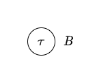
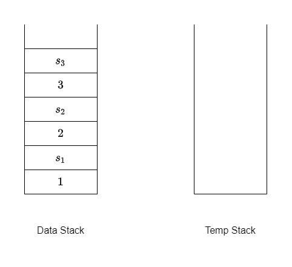
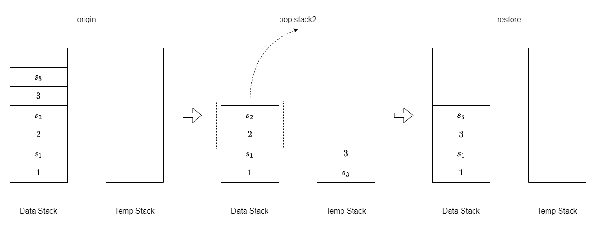

# Assignment 3

## 201300035 方盛俊

## Question 1. Termination

Let $C$ be the original $\mathcal{ALC}$-concept. If there is a rule that can be applied, so there is a subconcept $\lnot D$ of $C$, and $D$ is not a concept name. Let $C'$ be the $\mathcal{ALC}$-concept after rule application.

- Assumed $\lnot D = \lnot (E \sqcap F)$, then $M(\lnot (E \sqcap F)) = \{ \#(E \sqcap F) \} \cup M(E) \cup M(F)$ and $M(\lnot \lnot \lnot E \sqcup \lnot \lnot \lnot F) = \{ \#(\lnot \lnot E), \#(\lnot E), \#E, \#(\lnot \lnot F), \#(\lnot F), \#F \} \cup M(E) \cup M(F)$. So $M(C') = (M(C) \setminus M(\lnot D)) \cup M(\lnot \lnot \lnot E \sqcup \lnot \lnot \lnot F) = (M(C) \setminus \{ \#(E \sqcap F) \}) \cup \{ \#(\lnot \lnot E), \#(\lnot E), \#E, \#(\lnot \lnot F), \#(\lnot F), \#F \}$. So there is a big number $\#(E \sqcap F)$ was converted to some small numbers like $\#(\lnot \lnot E)$.
- Assumed $\lnot D = \lnot (E \sqcup F)$, the proof is same with $\lnot (E \sqcap F)$. So there is a big number $\#(E \sqcup F)$ was converted to some small numbers like $\#(\lnot \lnot E)$.
- Assumed $\lnot D = \lnot \lnot E$, so $M(C') = (M(C) \setminus M(\lnot \lnot E)) \cup M(E) = M(C) \setminus \{ \#\lnot E, \#E \}$. So there are two number $\#\lnot E$ and $\#E$ were erased.
- Assumed $\lnot D = \lnot (\exists r.E)$, then $M(\lnot (\exists r.E)) = \{ \#(\exists r.E) \} \cup M(E)$ and $M(\forall r.\lnot E) = \{ \#E \} \cup M(E)$. So $M(C') = (M(C) \setminus M(\lnot (\exists r.E))) \cup M(\forall r.\lnot E) = (M(C) \setminus \{ \#(\exists r.E) \}) \cup \{ \#E \}$. So there is a big number $\#(\exists r.E)$ was converted to a small number $\#E$.
- Assumed $\lnot D = \lnot (\forall r.E)$, the proof is same with $\lnot (\exists r.E)$. So there is a big number $\#(\forall  r.E)$ was converted to a small number $\#E$.

With above proof, we can know that either a big number was converted to some small numbers or some numbers were erased. So the multiset $M(C')$ is decreasing continuously, until the elements of $M(C')$ are all zero and the number of zeros is minimal. The procedure of transformations is limited because the numbers are limited.

So it is terminable.

## Question 2. Normal form

**(a)**

**$\Rightarrow:$**

We replace $A \equiv C$ with $A \sqsubseteq C$ and $C \sqsubseteq A$ and then get $\mathcal{T}'$. We can know $\mathcal{T}$ and $\mathcal{T}'$ is equivalent.

Because $\mathcal{T}^{\sqsubseteq} \subseteq \mathcal{T}'$, so every model of $\mathcal{T}'$ is also model of $\mathcal{T}^{\sqsubseteq}$.

Thus every model of $\mathcal{T}$ is also model of $\mathcal{T}^{\sqsubseteq}$.

So if every concept name is satisfiable w.r.t. $\mathcal{T}$, then it is satisfiable w.r.t. $\mathcal{T}^{\sqsubseteq}$.

**$\Leftarrow:$**

Assume the concept name $A_0$ is satisfiable w.r.t. $\mathcal{T}^{\sqsubseteq}$, so there is a model $\mathcal{I}$ of $\mathcal{T}^{\sqsubseteq}$.

We need to construct a new model $\mathcal{J}$ from $\mathcal{I}$ to satisfy $A_0$ and $\mathcal{T}$.

Because $\mathcal{T}$ is a acyclic TBox in NNF, so we can use a tree-like structure i.e. DAG to represent the $T^{\sqsubseteq}$. For example, DAG of $\mathcal{T}^{\sqsubseteq} = \{ A_0 \sqsubseteq B \sqcup C, C \sqsubseteq D \sqcap \lnot E \}$ is like

and sinks $B, D, E$ are primitive concept names.

Intuitively, we expand $C^{\mathcal{I}}$ to fit $D^{\mathcal{I}} * E^{\mathcal{I}}$ by assigning $C^{\mathcal{I}'} = D^{\mathcal{I}} * E^{\mathcal{I}}$ from sinks to sources. And finally get the new model $\mathcal{J}$ of $\mathcal{T}$.

Definitively, for any inclusion $A \sqsubseteq C$, all concept names occuring in $C$ are the child nodes of $A$ node.

Let the $\mathcal{T}^{\sqsubseteq}$ be the form of $\{ A_i \sqsubseteq C_i \}$, without loss of generality and because $\mathcal{T}$ is acyclic, we can assume that the indices $\cdot_{i}$ are such that, if $A_i$ directly uses $A_j$, then $j < i$.

We define the following series of interpretations $\mathcal{I}_i$ as modifications of $\mathcal{I}$:

for each $i$, we set

- $\Delta^{\mathcal{I}_i} = \Delta^{\mathcal{I}}$
- $r^{\mathcal{I}_i} = r^{\mathcal{I}}$ for all role names in $\mathcal{T^{\sqsubseteq}}$, and
- $A^{\mathcal{I}_i} = A^{\mathcal{I}}$ for all primitive concept names in $\mathcal{T}^{\sqsubseteq}$, and

we fix the interpretation of defined concepts as follows:

- $A_1^{\mathcal{I}_1} = C_1^{\mathcal{I}}, A_j^{\mathcal{I}_1} = A_j^{\mathcal{I}}$ for all $j > 1$,
- $A_1^{\mathcal{I}_2} = A_1^{\mathcal{I}_1}, A_2^{\mathcal{I}_2} = C_2^{\mathcal{I}_1}, A_j^{\mathcal{I}_2} = A_j^{\mathcal{I}_1}$ for all $j > 2$,
- ...
- $A_1^{\mathcal{I}_k} = A_1^{\mathcal{I}_{k-1}}, A_2^{\mathcal{I}_k} = A_2^{\mathcal{I}_{k-1}}, \cdots, A_k^{\mathcal{I}_k} = C_k^{\mathcal{I}_{k-1}}$.

Now we prove that $\mathcal{I}_i$ is a model of $\mathcal{T}_i = \{ A_n \equiv C_n, A_m \sqsubseteq C_m \}$, where $1 \le n \le i$ and $i < m \le k$.

Let $\mathcal{T}_0 = \mathcal{T}^{\sqsubseteq}, \mathcal{I}_{0} = \mathcal{I}$, then we use induction to prove $\mathcal{I}_i$ is a model of $\mathcal{T}_i$, $0 \le i \le k$.

Basis: $\mathcal{I}_0$ is a model of $\mathcal{T}_0$.

Induction hypothesis: $\mathcal{I}_{i-1}$ is a model of $\mathcal{T}_{i-1}$.

Induction steps: we will prove $\mathcal{I}_{i}$ is a model of $\mathcal{T}_{i}$.

So we need to prove that $\mathcal{I}_i$ is a model of $\mathcal{T}_i = \{ A_n \equiv C_n, A_m \sqsubseteq C_m \}$, where $1 \le n \le i$ and $i < m \le k$.

We prove $\mathcal{I}_i$ is a model of $A_j \equiv C_j$, $1 \le j \le i$ firstly.

For $1 \le j < i$, $\mathcal{I}_i$ is a model of $A_j \equiv C_j$, because $\mathcal{I}_{i-1}$ is model of $\mathcal{T}_{i-1}$ by induction hypothesis and $A_j^{\mathcal{I}_i} = A_j^{\mathcal{I}_{i-1}}$.

For $j = i$, $\mathcal{I}_{i}$ is a model of $A_i \equiv C_i$, because we define $A_i^{\mathcal{I}_i} = C_i^{\mathcal{I}_{i-1}}$ and $A_i$ didn't directly use $A_i$ itself by acylicity of $\mathcal{T}_i$.

Then we need to prove $\mathcal{I}_i$ is also model of $\{ A_j \sqsubseteq C_j \}, j > i$.

If $C_j$ doesn't directly use $A_i$, the expansion of $A_i$ doesn't affect $A_j \sqsubseteq C_j$ obviously.

If $C_j$ directly uses $A_i$, we need to prove $C_j^{\mathcal{I_{i-1}}} \subseteq C_j^{\mathcal{I}_i}$, so that $A_j^{\mathcal{I}_i} \subseteq C_j^{\mathcal{I_i}}$ because of $A_j^{\mathcal{I}_i} \subseteq C_j^{\mathcal{I}_{i-1}} \subseteq C_j^{\mathcal{I_i}}$, where there is $A_j^{\mathcal{I}_i} \subseteq C_j^{\mathcal{I}_{i-1}}$ because $A_j^{\mathcal{I}_i} = A_j^{\mathcal{I}_{i-1}}$ and induction hypothesis.

We know $A_i^{\mathcal{I}_{i-1}} \subseteq A_i^{\mathcal{I}_i}$ because of $A_i^{\mathcal{I}_{i-1}} \subseteq C_{i}^{\mathcal{I}_{i-1}} = A_i^{\mathcal{I}_i}$

Because $C_j$ directly use $A_i$, so there is a subconcept $C$ of $C_j$ and

- Assume $C = A_i \sqcap D$, so $C^{\mathcal{I}} = A_i^{\mathcal{I}} \cap D^{\mathcal{I}} \subseteq A_i^{\mathcal{I}_i} \cap D^{\mathcal{I}_i} = C^{\mathcal{I}_i}$, i. e. $C^{\mathcal{I}} \subseteq C^{\mathcal{I}_i}$. It is same with case $C = D \sqcap A_i$.
- Assume $C = A_i \sqcup D$, so $C^{\mathcal{I}} = A_i^{\mathcal{I}} \cup D^{\mathcal{I}} \subseteq A_i^{\mathcal{I}_i} \cup D^{\mathcal{I}_i} = C^{\mathcal{I}_i}$, i. e. $C^{\mathcal{I}} \subseteq C^{\mathcal{I}_i}$. It is same with case $C = D \sqcup A_i$.
- Assume $C = \exists r.A_i$, so $C^{\mathcal{I}} = \exists r.A_i^{\mathcal{I}} \subseteq \exists r.A^{\mathcal{I}_i} = C^{\mathcal{I}_i}$, i. e. $C^{\mathcal{I}} \subseteq C^{\mathcal{I}_i}$.
- Assume $C = \forall r.A_i$, so $C^{\mathcal{I}} = \forall r.A_i^{\mathcal{I}} \subseteq \forall r.A^{\mathcal{I}_i} = C^{\mathcal{I}_i}$, i. e. $C^{\mathcal{I}} \subseteq C^{\mathcal{I}_i}$.

Because of NNF, there is no form $C = \lnot A_i$, as $A_i$ is not a primitive concept name.

Using the same induction procedure by replacing $A_i$ with $C$, we can know that $C_j^{\mathcal{I}_{i-1}} \subseteq C_j^{\mathcal{I}_i}$ finally, so that $A_j^{\mathcal{I}_i} \subseteq C_j^{\mathcal{I}_i}$ because of $A_j^{\mathcal{I}_i} \subseteq C_j^{\mathcal{I}_{i-1}} \subseteq C_j^{\mathcal{I}_i}$.

By the above proof with induction, we can know that $\mathcal{I}_i$ is a model of $\mathcal{T}_i = \{ A_n \equiv C_n, A_m \sqsubseteq C_m \}$, where $0 \le n \le i$ and $i < m \le k$.

So we can know $\mathcal{J} = \mathcal{I}_k$ is a model of $\{ A_i \equiv C_i \}$ i.e. $\mathcal{T}$.

Because for any concept name $A_0$, we have $A_0^{\mathcal{I}} \subseteq A_0^{\mathcal{I}_k}$ by the induction procedure, and $A_0^{\mathcal{I}}$ is not empty set as $A_0$ is satisfiable w.r.t. $\mathcal{T}^{\sqsubseteq}$, so $A_0^{\mathcal{I}_k}$ is also a non-empty set.

So concept name $A_0$ is also satisfiable w.r.t. $\mathcal{T}$.

**(b)**

Let $\mathcal{T} = \{ A \equiv C \sqcap \lnot B, B \equiv P, C \equiv P \}$, and so $\mathcal{T}^{\sqsubseteq} = \{ A \sqsubseteq C \sqcap \lnot B, B \sqsubseteq P, C \sqsubseteq P \}$.

We can know $A^{\mathcal{I}} = (C \sqcap \lnot B)^{\mathcal{I}} = C^{\mathcal{I}} \cap (\Delta^{\mathcal{I}} \setminus B^{\mathcal{I}}) = P^{\mathcal{I}} \cap (\Delta^{\mathcal{I}} \setminus P^{\mathcal{I}}) = \empty$ for any model $\mathcal{I}$ of $\mathcal{T}$. So concept name $\mathcal{A}$ is not satisfiable w.r.t. $\mathcal{T}$.

Let $\Delta^{\mathcal{I}} = \{ a \}, A^{\mathcal{I}} = \{ a \}, C^{\mathcal{I}} = \{ a \}, B^{\mathcal{I}} = \empty, P^{\mathcal{I}} = \{ a \}$, and it satisfies $T^{\sqsubseteq}$, because $A^{\mathcal{I}} \subseteq C^{\mathcal{I}} \cap (\Delta^{\mathcal{I}} \setminus B^{\mathcal{I}})$, $B^{\mathcal{I}} \subseteq P^{\mathcal{I}}$ and $C^{\mathcal{I}} \subseteq P^{\mathcal{I}}$. So concept name $\mathcal{A}$ is satisfiable w.r.t. $\mathcal{T}^{\sqsubseteq}$.

This conclusion doesn't hold for the acyclic TBox $\{ A \equiv C \sqcap \lnot B, B \equiv P, C \equiv P \}$.

## Question 3. ALC-Worlds algorithm

**(a) Successful run**

**$\mathcal{ALC}$-$\mathrm{worlds}(B_0, \mathcal{T})$:**

$\operatorname{rd}(B_0) = 0, \operatorname{rd}(B_1) = 1, \operatorname{rd}(B_2) = 2, \operatorname{rd}(B_3) = 0, \operatorname{rd}(B_4) = 1, \operatorname{rd}(B_5) = 2, \operatorname{rd}(B_6) = 0, \operatorname{rd}(B_7) = 2, \operatorname{rd}(B_8) = 2, \operatorname{rd}(B_9) = 1, \operatorname{rd}(B_{10}) = 0$

$i = \operatorname{rd}(B_0) = \max(1, \max(1, 2)) = 2$

$\tau = \{ B_0, B_1, B_2, B_4, B_5, B_6, B_7 \}$

**recurse$(\tau, 1, \mathcal{T})$:**

$\tau$ is a type for $\mathcal{T}$.

for $B_1 \in \tau$ with $B_1 \equiv \exists r.B_3$ do:

$S = \{ B_3 \} \cup \{ B_4 \} = \{ B_3, B_4 \}$

$\tau' = \{ B_3, B_4 \}$

recurse$(\tau', 0, \mathcal{T})$ return true

for $B_4 \in \tau$ with $B_4 \equiv \exists r.B_6$ do:

$S = \{ B_6 \} \cup \{ B_4 \} = \{ B_4, B_6 \}$

$\tau'' = \{ B_4, B_6 \}$

recurse$(\tau'', 0, \mathcal{T})$ return true

**(b) Unsuccessful run**

**$\mathcal{ALC}$-$\mathrm{worlds}(B_0, \mathcal{T})$:**

$i = \operatorname{rd}(B_0) = \max(1, \max(1, 2)) = 2$

$\tau = \{ B_0, B_3, B_{10} \}$

**recurse$(\tau, 1, \mathcal{T})$:**

$\tau$ is not a type for $\mathcal{T}$ because $B_3 \in \tau, B_{10} \in \tau$ but $B_3 \equiv P$ and $B \equiv \lnot P$

then return false

**(c) result**

Because there is a successful run, the algorithm return a positive result.

## Question 4. ALC-Elim algorithm

**(a)**

$C_{\mathcal{T}}$ = (((¬B⊔∃r.B)⊓B)⊓(∃r.¬B⊔∃r.B))

$\operatorname{sub}(\mathcal{T})$ = {(¬B⊔∃r.B), ∃r.¬B, B, ∃r.B, (∃r.¬B⊔∃r.B), ¬B, ((¬B⊔∃r.B)⊓B), (((¬B⊔∃r.B)⊓B)⊓(∃r.¬B⊔∃r.B))}

$i$ = 2.

There is 2 types in $\Gamma_0$.

$\Gamma_0$ = [{(¬B⊔∃r.B), B, ∃r.B, (∃r.¬B⊔∃r.B), ((¬B⊔∃r.B)⊓B), (((¬B⊔∃r.B)⊓B)⊓(∃r.¬B⊔∃r.B))}, {(¬B⊔∃r.B), ∃r.¬B, B, ∃r.B, (∃r.¬B⊔∃r.B), ((¬B⊔∃r.B)⊓B), (((¬B⊔∃r.B)⊓B)⊓(∃r.¬B⊔∃r.B))}]

$\Gamma_1$ = [{(¬B⊔∃r.B), B, ∃r.B, (∃r.¬B⊔∃r.B), ((¬B⊔∃r.B)⊓B), (((¬B⊔∃r.B)⊓B)⊓(∃r.¬B⊔∃r.B))}]

$\Gamma_2$ = [{(¬B⊔∃r.B), B, ∃r.B, (∃r.¬B⊔∃r.B), ((¬B⊔∃r.B)⊓B), (((¬B⊔∃r.B)⊓B)⊓(∃r.¬B⊔∃r.B))}]

$\tau$ = {(∃r.¬B⊔∃r.B), B, (((¬B⊔∃r.B)⊓B)⊓(∃r.¬B⊔∃r.B)), ((¬B⊔∃r.B)⊓B), ∃r.B, (¬B⊔∃r.B)}

So $B$ is satisfiable. The satisfying model is

**(2)**

We replace $∀r.∀r.¬B$ with $C \sqsubseteq ∀r.∀r.¬B$.

$C_{\mathcal{T}}$ = ((((¬C⊔∀r.∀r.¬B)⊓(A⊔B))⊓(¬A⊔¬B))⊓∃r.¬A)

$\operatorname{sub}(\mathcal{T})$ = {(¬A⊔¬B), ¬A, (¬C⊔∀r.∀r.¬B), ∀r.∀r.¬B, C, A, ∃r.¬A, ((((¬C⊔∀r.∀r.¬B)⊓(A⊔B))⊓(¬A⊔¬B))⊓∃r.¬A), ¬B, B, (A⊔B), ¬C, ((¬C⊔∀r.∀r.¬B)⊓(A⊔B)), ∀r.¬B, (((¬C⊔∀r.∀r.¬B)⊓(A⊔B))⊓(¬A⊔¬B))}

$i$ = 3.

There is 16 types in $\Gamma_0$.

$\Gamma_0$ = [{(¬A⊔¬B), ¬A, (¬C⊔∀r.∀r.¬B), ∀r.∀r.¬B, ∃r.¬A, ((((¬C⊔∀r.∀r.¬B)⊓(A⊔B))⊓(¬A⊔¬B))⊓∃r.¬A), B, ((¬C⊔∀r.∀r.¬B)⊓(A⊔B)), (A⊔B), (((¬C⊔∀r.∀r.¬B)⊓(A⊔B))⊓(¬A⊔¬B))}, {(¬A⊔¬B), ¬A, (¬C⊔∀r.∀r.¬B), ∃r.¬A, ((((¬C⊔∀r.∀r.¬B)⊓(A⊔B))⊓(¬A⊔¬B))⊓∃r.¬A), B, ¬C, ((¬C⊔∀r.∀r.¬B)⊓(A⊔B)), (A⊔B), (((¬C⊔∀r.∀r.¬B)⊓(A⊔B))⊓(¬A⊔¬B))}, {(¬A⊔¬B), (¬C⊔∀r.∀r.¬B), A, ∃r.¬A, ∀r.∀r.¬B, ((((¬C⊔∀r.∀r.¬B)⊓(A⊔B))⊓(¬A⊔¬B))⊓∃r.¬A), ¬B, ((¬C⊔∀r.∀r.¬B)⊓(A⊔B)), (A⊔B), (((¬C⊔∀r.∀r.¬B)⊓(A⊔B))⊓(¬A⊔¬B))}, {(¬A⊔¬B), (¬C⊔∀r.∀r.¬B), A, ∃r.¬A, ((((¬C⊔∀r.∀r.¬B)⊓(A⊔B))⊓(¬A⊔¬B))⊓∃r.¬A), ¬B, ¬C, ((¬C⊔∀r.∀r.¬B)⊓(A⊔B)), (A⊔B), (((¬C⊔∀r.∀r.¬B)⊓(A⊔B))⊓(¬A⊔¬B))}, {(¬A⊔¬B), ¬A, (¬C⊔∀r.∀r.¬B), ∀r.∀r.¬B, C, ∃r.¬A, ((((¬C⊔∀r.∀r.¬B)⊓(A⊔B))⊓(¬A⊔¬B))⊓∃r.¬A), B, ((¬C⊔∀r.∀r.¬B)⊓(A⊔B)), (A⊔B), (((¬C⊔∀r.∀r.¬B)⊓(A⊔B))⊓(¬A⊔¬B))}, {(¬A⊔¬B), ¬A, (¬C⊔∀r.∀r.¬B), ∀r.∀r.¬B, ∃r.¬A, ((((¬C⊔∀r.∀r.¬B)⊓(A⊔B))⊓(¬A⊔¬B))⊓∃r.¬A), B, ¬C, ((¬C⊔∀r.∀r.¬B)⊓(A⊔B)), (A⊔B), (((¬C⊔∀r.∀r.¬B)⊓(A⊔B))⊓(¬A⊔¬B))}, {(¬A⊔¬B), ¬A, (¬C⊔∀r.∀r.¬B), ∀r.∀r.¬B, ∃r.¬A, ((((¬C⊔∀r.∀r.¬B)⊓(A⊔B))⊓(¬A⊔¬B))⊓∃r.¬A), B, ∀r.¬B, ((¬C⊔∀r.∀r.¬B)⊓(A⊔B)), (A⊔B), (((¬C⊔∀r.∀r.¬B)⊓(A⊔B))⊓(¬A⊔¬B))}, {(¬A⊔¬B), ¬A, (¬C⊔∀r.∀r.¬B), ∃r.¬A, ((((¬C⊔∀r.∀r.¬B)⊓(A⊔B))⊓(¬A⊔¬B))⊓∃r.¬A), B, ∀r.¬B, ¬C, ((¬C⊔∀r.∀r.¬B)⊓(A⊔B)), (A⊔B), (((¬C⊔∀r.∀r.¬B)⊓(A⊔B))⊓(¬A⊔¬B))}, {(¬A⊔¬B), (¬C⊔∀r.∀r.¬B), A, C, ∀r.∀r.¬B, ∃r.¬A, ((((¬C⊔∀r.∀r.¬B)⊓(A⊔B))⊓(¬A⊔¬B))⊓∃r.¬A), ¬B, ((¬C⊔∀r.∀r.¬B)⊓(A⊔B)), (A⊔B), (((¬C⊔∀r.∀r.¬B)⊓(A⊔B))⊓(¬A⊔¬B))}, {(¬A⊔¬B), (¬C⊔∀r.∀r.¬B), A, ∃r.¬A, ∀r.∀r.¬B, ((((¬C⊔∀r.∀r.¬B)⊓(A⊔B))⊓(¬A⊔¬B))⊓∃r.¬A), ¬B, ¬C, ((¬C⊔∀r.∀r.¬B)⊓(A⊔B)), (A⊔B), (((¬C⊔∀r.∀r.¬B)⊓(A⊔B))⊓(¬A⊔¬B))}, {(¬A⊔¬B), (¬C⊔∀r.∀r.¬B), A, ∃r.¬A, ∀r.∀r.¬B, ((((¬C⊔∀r.∀r.¬B)⊓(A⊔B))⊓(¬A⊔¬B))⊓∃r.¬A), ¬B, ∀r.¬B, ((¬C⊔∀r.∀r.¬B)⊓(A⊔B)), (A⊔B), (((¬C⊔∀r.∀r.¬B)⊓(A⊔B))⊓(¬A⊔¬B))}, {(¬A⊔¬B), (¬C⊔∀r.∀r.¬B), A, ∃r.¬A, ((((¬C⊔∀r.∀r.¬B)⊓(A⊔B))⊓(¬A⊔¬B))⊓∃r.¬A), ¬B, ∀r.¬B, ¬C, ((¬C⊔∀r.∀r.¬B)⊓(A⊔B)), (A⊔B), (((¬C⊔∀r.∀r.¬B)⊓(A⊔B))⊓(¬A⊔¬B))}, {(¬A⊔¬B), ¬A, (¬C⊔∀r.∀r.¬B), ∀r.∀r.¬B, C, ∃r.¬A, ((((¬C⊔∀r.∀r.¬B)⊓(A⊔B))⊓(¬A⊔¬B))⊓∃r.¬A), B, ∀r.¬B, ((¬C⊔∀r.∀r.¬B)⊓(A⊔B)), (A⊔B), (((¬C⊔∀r.∀r.¬B)⊓(A⊔B))⊓(¬A⊔¬B))}, {(¬A⊔¬B), ¬A, (¬C⊔∀r.∀r.¬B), ∀r.∀r.¬B, ∃r.¬A, ((((¬C⊔∀r.∀r.¬B)⊓(A⊔B))⊓(¬A⊔¬B))⊓∃r.¬A), B, ∀r.¬B, ¬C, ((¬C⊔∀r.∀r.¬B)⊓(A⊔B)), (A⊔B), (((¬C⊔∀r.∀r.¬B)⊓(A⊔B))⊓(¬A⊔¬B))}, {(¬A⊔¬B), (¬C⊔∀r.∀r.¬B), A, C, ∀r.∀r.¬B, ∃r.¬A, ((((¬C⊔∀r.∀r.¬B)⊓(A⊔B))⊓(¬A⊔¬B))⊓∃r.¬A), ¬B, ∀r.¬B, ((¬C⊔∀r.∀r.¬B)⊓(A⊔B)), (A⊔B), (((¬C⊔∀r.∀r.¬B)⊓(A⊔B))⊓(¬A⊔¬B))}, {(¬A⊔¬B), (¬C⊔∀r.∀r.¬B), A, ∃r.¬A, ∀r.∀r.¬B, ((((¬C⊔∀r.∀r.¬B)⊓(A⊔B))⊓(¬A⊔¬B))⊓∃r.¬A), ¬B, ∀r.¬B, ¬C, ((¬C⊔∀r.∀r.¬B)⊓(A⊔B)), (A⊔B), (((¬C⊔∀r.∀r.¬B)⊓(A⊔B))⊓(¬A⊔¬B))}]

$\Gamma_1$ = [{(¬A⊔¬B), ¬A, (¬C⊔∀r.∀r.¬B), ∀r.∀r.¬B, ∃r.¬A, ((((¬C⊔∀r.∀r.¬B)⊓(A⊔B))⊓(¬A⊔¬B))⊓∃r.¬A), B, ((¬C⊔∀r.∀r.¬B)⊓(A⊔B)), (A⊔B), (((¬C⊔∀r.∀r.¬B)⊓(A⊔B))⊓(¬A⊔¬B))}, {(¬A⊔¬B), ¬A, (¬C⊔∀r.∀r.¬B), ∃r.¬A, ((((¬C⊔∀r.∀r.¬B)⊓(A⊔B))⊓(¬A⊔¬B))⊓∃r.¬A), B, ¬C, ((¬C⊔∀r.∀r.¬B)⊓(A⊔B)), (A⊔B), (((¬C⊔∀r.∀r.¬B)⊓(A⊔B))⊓(¬A⊔¬B))}, {(¬A⊔¬B), (¬C⊔∀r.∀r.¬B), A, ∃r.¬A, ∀r.∀r.¬B, ((((¬C⊔∀r.∀r.¬B)⊓(A⊔B))⊓(¬A⊔¬B))⊓∃r.¬A), ¬B, ((¬C⊔∀r.∀r.¬B)⊓(A⊔B)), (A⊔B), (((¬C⊔∀r.∀r.¬B)⊓(A⊔B))⊓(¬A⊔¬B))}, {(¬A⊔¬B), (¬C⊔∀r.∀r.¬B), A, ∃r.¬A, ((((¬C⊔∀r.∀r.¬B)⊓(A⊔B))⊓(¬A⊔¬B))⊓∃r.¬A), ¬B, ¬C, ((¬C⊔∀r.∀r.¬B)⊓(A⊔B)), (A⊔B), (((¬C⊔∀r.∀r.¬B)⊓(A⊔B))⊓(¬A⊔¬B))}, {(¬A⊔¬B), ¬A, (¬C⊔∀r.∀r.¬B), ∀r.∀r.¬B, C, ∃r.¬A, ((((¬C⊔∀r.∀r.¬B)⊓(A⊔B))⊓(¬A⊔¬B))⊓∃r.¬A), B, ((¬C⊔∀r.∀r.¬B)⊓(A⊔B)), (A⊔B), (((¬C⊔∀r.∀r.¬B)⊓(A⊔B))⊓(¬A⊔¬B))}, {(¬A⊔¬B), ¬A, (¬C⊔∀r.∀r.¬B), ∀r.∀r.¬B, ∃r.¬A, ((((¬C⊔∀r.∀r.¬B)⊓(A⊔B))⊓(¬A⊔¬B))⊓∃r.¬A), B, ¬C, ((¬C⊔∀r.∀r.¬B)⊓(A⊔B)), (A⊔B), (((¬C⊔∀r.∀r.¬B)⊓(A⊔B))⊓(¬A⊔¬B))}, {(¬A⊔¬B), (¬C⊔∀r.∀r.¬B), A, C, ∀r.∀r.¬B, ∃r.¬A, ((((¬C⊔∀r.∀r.¬B)⊓(A⊔B))⊓(¬A⊔¬B))⊓∃r.¬A), ¬B, ((¬C⊔∀r.∀r.¬B)⊓(A⊔B)), (A⊔B), (((¬C⊔∀r.∀r.¬B)⊓(A⊔B))⊓(¬A⊔¬B))}, {(¬A⊔¬B), (¬C⊔∀r.∀r.¬B), A, ∃r.¬A, ∀r.∀r.¬B, ((((¬C⊔∀r.∀r.¬B)⊓(A⊔B))⊓(¬A⊔¬B))⊓∃r.¬A), ¬B, ¬C, ((¬C⊔∀r.∀r.¬B)⊓(A⊔B)), (A⊔B), (((¬C⊔∀r.∀r.¬B)⊓(A⊔B))⊓(¬A⊔¬B))}]

$\Gamma_2$ = [{(¬A⊔¬B), ¬A, (¬C⊔∀r.∀r.¬B), ∃r.¬A, ((((¬C⊔∀r.∀r.¬B)⊓(A⊔B))⊓(¬A⊔¬B))⊓∃r.¬A), B, ¬C, ((¬C⊔∀r.∀r.¬B)⊓(A⊔B)), (A⊔B), (((¬C⊔∀r.∀r.¬B)⊓(A⊔B))⊓(¬A⊔¬B))}, {(¬A⊔¬B), (¬C⊔∀r.∀r.¬B), A, ∃r.¬A, ((((¬C⊔∀r.∀r.¬B)⊓(A⊔B))⊓(¬A⊔¬B))⊓∃r.¬A), ¬B, ¬C, ((¬C⊔∀r.∀r.¬B)⊓(A⊔B)), (A⊔B), (((¬C⊔∀r.∀r.¬B)⊓(A⊔B))⊓(¬A⊔¬B))}]

$\Gamma_3$ = [{(¬A⊔¬B), ¬A, (¬C⊔∀r.∀r.¬B), ∃r.¬A, ((((¬C⊔∀r.∀r.¬B)⊓(A⊔B))⊓(¬A⊔¬B))⊓∃r.¬A), B, ¬C, ((¬C⊔∀r.∀r.¬B)⊓(A⊔B)), (A⊔B), (((¬C⊔∀r.∀r.¬B)⊓(A⊔B))⊓(¬A⊔¬B))}, {(¬A⊔¬B), (¬C⊔∀r.∀r.¬B), A, ∃r.¬A, ((((¬C⊔∀r.∀r.¬B)⊓(A⊔B))⊓(¬A⊔¬B))⊓∃r.¬A), ¬B, ¬C, ((¬C⊔∀r.∀r.¬B)⊓(A⊔B)), (A⊔B), (((¬C⊔∀r.∀r.¬B)⊓(A⊔B))⊓(¬A⊔¬B))}]

There is no $\tau \in \Gamma_3$ that $C \in \tau$.

So $C$ i.e. $∀r.∀r.¬B$ is unsatisfiable.

## Question 5. Finite Boolean games

**(a)**

We calculate the truth table:

| $q_1$ | $q_2$ | $q_3$ | $q_4$ | $((q_1 ∧ q_3) → ¬q_2) ∧ (¬q_1 → q_1) ∧ (¬q_2 → (q_3 ∨ q_4))$ |
|---|---|---|---|---|
| 0 | 0 | 0 | 0 | 0 |
| 0 | 0 | 0 | 1 | 0 |
| 0 | 0 | 1 | 0 | 0 |
| 0 | 0 | 1 | 1 | 0 |
| 0 | 1 | 0 | 0 | 0 |
| 0 | 1 | 0 | 1 | 0 |
| 0 | 1 | 1 | 0 | 0 |
| 0 | 1 | 1 | 1 | 0 |
| 1 | 0 | 0 | 0 | 0 |
| 1 | 0 | 0 | 1 | 1 |
| 1 | 0 | 1 | 0 | 1 |
| 1 | 0 | 1 | 1 | 1 |
| 1 | 1 | 0 | 0 | 1 |
| 1 | 1 | 0 | 1 | 1 |
| 1 | 1 | 1 | 0 | 0 |
| 1 | 1 | 1 | 1 | 0 |

So there is a winning strategy:

**(b)**

We calculate the truth table:

| $q_1$ | $q_2$ | $q_3$ | $q_4$ | $(q_1 ∨ ¬q_2) ∧ (q_2 ∨ q_3) ∧ (¬q_3 ∨ ¬q_4) ∧ (¬q_1 ∨ ¬q_2 ∨ q_3 ∨ q_4)$ |
|---|---|---|---|---|
| 0 | 0 | 0 | 0 | 0 |
| 0 | 0 | 0 | 1 | 0 |
| 0 | 0 | 1 | 0 | 1 |
| 0 | 0 | 1 | 1 | 0 |
| 0 | 1 | 0 | 0 | 0 |
| 0 | 1 | 0 | 1 | 0 |
| 0 | 1 | 1 | 0 | 0 |
| 0 | 1 | 1 | 1 | 0 |
| 1 | 0 | 0 | 0 | 0 |
| 1 | 0 | 0 | 1 | 0 |
| 1 | 0 | 1 | 0 | 1 |
| 1 | 0 | 1 | 1 | 0 |
| 1 | 1 | 0 | 0 | 0 |
| 1 | 1 | 0 | 1 | 1 |
| 1 | 1 | 1 | 0 | 1 |
| 1 | 1 | 1 | 1 | 0 |

If we assign $q_1 = 0$, there is only one word $t = 0010$ that satisfies $\varphi$.

If we assign $q_2 = 1$, there are three words $t_1 = 1010$, $t_2 = 1101$, $t_3 = 1110$ that satisfy $\varphi$. The number of words is less than 4 so the leaves of any tree of strategy are not all true for $\varphi$.

So Player 1 doesn't have a winning strategy.

## Question 6. Infinite Boolean games

## Question 11 (with 1 bonus mark). Pushdown automata

**(a)**

Let $B = \{ 0^{k}1^{k}2^{k} | k \ge 0 \}$. We will show that $B$ isn't a CFL so that it can't be recognized by 1-PDAs. And then we will show that $B$ can be recognized by 2-PDAs.

Assumed that $B$ is a CFL.

By the CFL pumping lemma, it gives a $p$ so that (i) $uv^{i}xy^{i}z \in A$ for all $i \ge 0$, (ii) $vy \neq \varepsilon$ and (iii) $|vxy| \le p$.

We let $s = 0^{p}1^{p}2^{p} \in B$.

Condition (iii) implies that $vxy$ does not overlap tree kinds of number $1, 2$ and $3$, just one or two kinds of the tree kinds of number, like $0, 1$ or $1, 2$.

Therefore, in $uv^{2}xy^{2}z$, there are $0$s, $1$s and $2$s with unequal length. So $uv^{2}xy^{2}z \not \in B$ violating Condition (i).

Thus $B$ is not a CFL, it can not be recognized by 1-PDAs.

Now we prove that $B$ can be recognized by 2-PDAs.

1. Read 0s from input, push onto stack1 until read 1.
2. Read 1s from input, push onto stack2 until read 2.
3. Read 2s from input, while poping 0s from stack1 and poping 1s from stack2.
4. Enter accept state if stack is empty.

So $B$ can be recognized by 2-PDAs.

Thus 2-PDAs are more powerful than 1-PDAs.

**(b)**

We use two stacks to simulate three stacks.

For any 3-PDA with $Q, \Sigma, \Gamma, \delta, q_0, F$, we define a new 2-PDA to simulate it.

Let stack1 be the data stack and stack2 be the temporary stack. Define $\Gamma' = \Gamma \cup \{ s_1, s_2, s_3 \}$, where $s_1$, $s_2$ and $s_3$ are label elements to identify in which stack elements of data stack are.

For example, we sequentially push $1$ to stack1, push $2$ to stack2, and push $3$ to stack3.

Then the data stack will be like:

If we need to pop a element of stack2, we pop all elements without label $s_2$ from top of data stack, and push them into temp stack. Until we read a label element $s_2$ and then pop its data element $2$, then restore all elements in temp stack into data stack.

So we use two stacks to simulate three stacks. And thus any 3-PDA can be simulate by a 2-PDA.

Besides, any 2-PDA can be simulate by a 3-PDA by assigning stack3 empty.

So that 3-PDAs are not more powerful than 2-PDAs.

## Question 12 (with 1 bonus mark). Turing machine

Define a TM that decides $L = \{ m \in \{ 0, 1 \}^{*} | |m|_{0} = |m|_{1} \}$.

We use TM simulate a stack.

1. Head write a element "s" in left end.
2. Read input and assumed the input is "0". If the current element head read is "s" or "0", move right and write "0". If the current element head read is "1", write "˽" and move left.
3. Read input and assumed the input is "1". If the current element head read is "s" or "1", move right and write "1". If the current element head read is "0", write "˽" and move left.
4. Repeat 2. and 3. until there is no more input. Accept $L$ if there is only "s" in the tape, else reject.

## Question 13 (with 1 bonus mark). Decidability

If there is a reasonably-priced yummy in canteens of NJU now, then $A$ is decidable.

But I don't think so, and I can decide or know whether there will be a readonably-priced yummy in the canteens of NJU someday.

So $A$ is not decidable.

