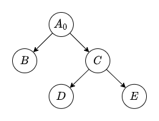
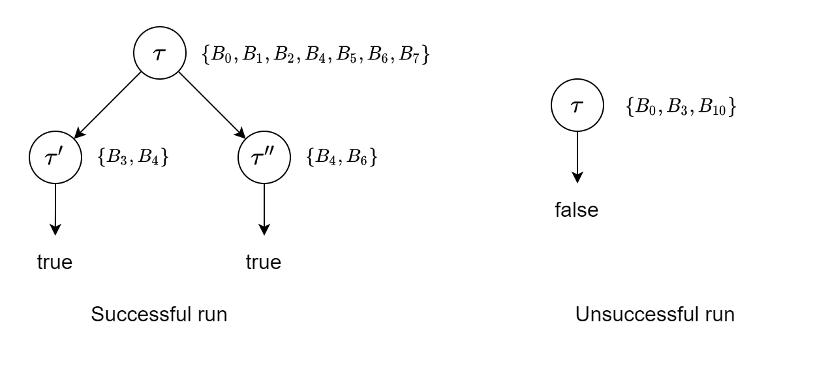
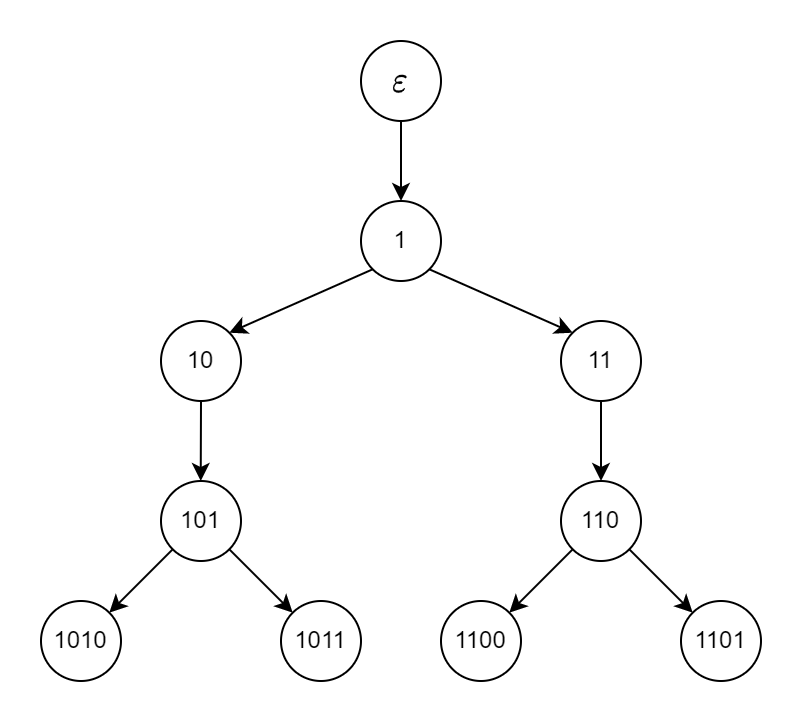

# Assignment 3

## 201300035 方盛俊

## Question 1. Termination

Let $C$ be the original $\mathcal{ALC}$-concept. If there is a rule that can be applied, so there is a subconcept $\lnot D$ of $C$, and $D$ is not a concept name. Let $C'$ be the $\mathcal{ALC}$-concept after rule application.

- Assumed $\lnot D = \lnot (E \sqcap F)$, then $M(\lnot (E \sqcap F)) = \{ \#(E \sqcap F) \} \cup M(E) \cup M(F)$ and $M(\lnot \lnot \lnot E \sqcup \lnot \lnot \lnot F) = \{ \#(\lnot \lnot E), \#(\lnot E), \#E, \#(\lnot \lnot F), \#(\lnot F), \#F \} \cup M(E) \cup M(F)$. So $M(C') = (M(C) \setminus M(\lnot D)) \cup M(\lnot \lnot \lnot E \sqcup \lnot \lnot \lnot F) = (M(C) \setminus \{ \#(E \sqcap F) \}) \cup \{ \#(\lnot \lnot E), \#(\lnot E), \#E, \#(\lnot \lnot F), \#(\lnot F), \#F \}$. So there is a big number $\#(E \sqcap F)$ was converted to some small numbers like $\#(\lnot \lnot E)$.
- Assumed $\lnot D = \lnot (E \sqcup F)$, the proof is same with $\lnot (E \sqcap F)$. So there is a big number $\#(E \sqcup F)$ was converted to some small numbers like $\#(\lnot \lnot E)$.
- Assumed $\lnot D = \lnot \lnot E$, so $M(C') = (M(C) \setminus M(\lnot \lnot E)) \cup M(E) = M(C) \setminus \{ \#\lnot E, \#E \}$. So there are two number $\#\lnot E$ and $\#E$ were erased.
- Assumed $\lnot D = \lnot (\exists r.E)$, then $M(\lnot (\exists r.E)) = \{ \#(\exists r.E) \} \cup M(E)$ and $M(\forall r.\lnot E) = \{ \#E \} \cup M(E)$. So $M(C') = (M(C) \setminus M(\lnot (\exists r.E))) \cup M(\forall r.\lnot E) = (M(C) \setminus \{ \#(\exists r.E) \}) \cup \{ \#E \}$. So there is a big number $\#(\exists r.E)$ was converted to a small number $\#E$.
- Assumed $\lnot D = \lnot (\forall r.E)$, the proof is same with $\lnot (\exists r.E)$. So there is a big number $\#(\forall  r.E)$ was converted to a small number $\#E$.

With above proof, we can know that either a big number was converted to some small numbers or some numbers were erased. So the multiset $M(C')$ is decreasing continuously, until the elements of $M(C')$ are all zero and the number of zeros is minimal. The procedure of transformations is limited because the numbers are limited.

So it is terminable.

## Question 2. Normal form

**(a)**

**$\Rightarrow:$**

We replace $A \equiv C$ with $A \sqsubseteq C$ and $C \sqsubseteq A$ and then get $\mathcal{T}'$. We can know $\mathcal{T}$ and $\mathcal{T}'$ is equivalent.

Because $\mathcal{T}^{\sqsubseteq} \subseteq \mathcal{T}'$, so every model of $\mathcal{T}'$ is also model of $\mathcal{T}^{\sqsubseteq}$.

Thus every model of $\mathcal{T}$ is also model of $\mathcal{T}^{\sqsubseteq}$.

So if every concept name is satisfiable w.r.t. $\mathcal{T}$, then it is satisfiable w.r.t. $\mathcal{T}^{\sqsubseteq}$.

**$\Leftarrow:$**

Assume the concept name $A_0$ is satisfiable w.r.t. $\mathcal{T}^{\sqsubseteq}$, so there is a model $\mathcal{I}$ of $\mathcal{T}^{\sqsubseteq}$.

We need to construct a new model $\mathcal{J}$ from $\mathcal{I}$ to satisfy $A_0$ and $\mathcal{T}$.

Because $\mathcal{T}$ is a acyclic TBox in NNF, so we can use a tree-like structure i.e. DAG to represent the $T^{\sqsubseteq}$. For example, DAG of $\mathcal{T}^{\sqsubseteq} = \{ A_0 \sqsubseteq B \sqcup C, C \sqsubseteq D \sqcap \lnot E \}$ is like

and sinks $B, D, E$ are primitive concept names.

Intuitively, we expand $C^{\mathcal{I}}$ to fit $D^{\mathcal{I}} * E^{\mathcal{I}}$ by assigning $C^{\mathcal{I}'} = D^{\mathcal{I}} * E^{\mathcal{I}}$ from sinks to sources. And finally get the new model $\mathcal{J}$ of $\mathcal{T}$.

Definitively, for any inclusion $A \sqsubseteq C$, all concept names occuring in $C$ are the child nodes of $A$ node.

Let the $\mathcal{T}^{\sqsubseteq}$ be the form of $\{ A_i \sqsubseteq C_i \}$, without loss of generality and because $\mathcal{T}$ is acyclic, we can assume that the indices $\cdot_{i}$ are such that, if $A_i$ directly uses $A_j$, then $j < i$.

We define the following series of interpretations $\mathcal{I}_i$ as modifications of $\mathcal{I}$:

for each $i$, we set

- $\Delta^{\mathcal{I}_i} = \Delta^{\mathcal{I}}$
- $r^{\mathcal{I}} = r^{\mathcal{I}}$ for all role names in $\mathcal{T^{\sqsubseteq}}$, and
- $A^{\mathcal{I}} = A^{\mathcal{I}}$ for all primitive concept names in $\mathcal{T}^{\sqsubseteq}$, and

we fix the interpretation of defined concepts as follows:

- $A_1^{\mathcal{I}_1} = C_1^{\mathcal{I}}, A_j^{\mathcal{I}_1} = A_j^{\mathcal{I}}$ for all $j > 1$,
- $A_1^{\mathcal{I}_2} = A_1^{\mathcal{I}_1}, A_2^{\mathcal{I}_2} = C_2^{\mathcal{I}_1}, A_j^{\mathcal{I}_2} = A_j^{\mathcal{I}_1}$ for all $j > 2$,
- ...
- $A_1^{\mathcal{I}_k} = A_1^{\mathcal{I}_{k-1}}, A_2^{\mathcal{I}_k} = A_2^{\mathcal{I}_{k-1}}, \cdots, A_k^{\mathcal{I}_k} = C_k^{\mathcal{I}_{k-1}}$.

Now we prove that $\mathcal{I}_i$ is a model of $\mathcal{T}_i = \{ A_n \equiv C_n, A_m \sqsubseteq C_m \}$, where $1 \le n \le i$ and $i < m \le k$.

For example, let $i = 1$, so we need to prove $\mathcal{I}_1$ is a model of $\{ A_1 \equiv C_1, A_j \sqsubseteq C_j \}$.

Because we let $A_1^{\mathcal{I}_1} = C_1^{\mathcal{I}}$, so $\mathcal{I}_1$ is model of $A_1 \equiv C_1$ obviously.

Then we need to prove $\mathcal{I}_1$ is also model of $\{ A_j \sqsubseteq C_j \}$. If $A_j$ doesn't directly use $A_1$, the expansion of $A_1$ doesn't affect $A_j \sqsubseteq C_j$ obviously; then we prove that $A_1$ doesn't affect $A_j \sqsubseteq C_j$ even if $C_j$ directly use $A_1$. So we need to prove $C_j^{\mathcal{I}} \subseteq C_j^{\mathcal{I}_1}$, so that $A_j^{\mathcal{I}_1} \subseteq C_j^{\mathcal{I_1}}$ because of $A_j^{\mathcal{I}_1} \subseteq C_j^{\mathcal{I}} \subseteq C_j^{\mathcal{I_1}}$.

We know $A_1^{\mathcal{I}} \subseteq A_1^{\mathcal{I}_1}$ because of $A_1^{\mathcal{I}} \subseteq C^{\mathcal{I}_1} = A_1^{\mathcal{I}_1}$

Because $C_j$ directly use $A_1$, so there is a subconcept $C$ of $C_j$ and

- Assume $C = A_1 \sqcap D$, so $C^{\mathcal{I}} = A^{\mathcal{I}} \cap D^{\mathcal{I}} \subseteq A^{\mathcal{I}_1} \cap D^{\mathcal{I}_1} = C^{\mathcal{I}_1}$, i. e. $C^{\mathcal{I}} \subseteq C^{\mathcal{I}_1}$. It is same with case $C = D \sqcap A_1$.
- Assume $C = A_1 \sqcup D$, so $C^{\mathcal{I}} = A^{\mathcal{I}} \cup D^{\mathcal{I}} \subseteq A^{\mathcal{I}_1} \cup D^{\mathcal{I}_1} = C^{\mathcal{I}_1}$, i. e. $C^{\mathcal{I}} \subseteq C^{\mathcal{I}_1}$. It is same with case $C = D \sqcup A_1$.
- Assume $C = \exists r.A_1$, so $C^{\mathcal{I}} = \exists r.A_1^{\mathcal{I}} \subseteq \exists r.A^{\mathcal{I}_1} = C^{\mathcal{I}_1}$, i. e. $C^{\mathcal{I}} \subseteq C^{\mathcal{I}_1}$.
- Assume $C = \forall r.A_1$, so $C^{\mathcal{I}} = \forall r.A_1^{\mathcal{I}} \subseteq \forall r.A^{\mathcal{I}_1} = C^{\mathcal{I}_1}$, i. e. $C^{\mathcal{I}} \subseteq C^{\mathcal{I}_1}$.

Because of NNF, there is no form $C = \lnot A_1$ because $A_1$ is not a primitive concept name.

By induction replacing $A_1$ with $C$, we can know that $C_j^{\mathcal{I}} \subseteq C_j^{\mathcal{I}_1}$, so that $A_j^{\mathcal{I}_1} \subseteq C_j^{\mathcal{I}_1}$ because of $A_1^{\mathcal{I}} \subseteq C^{\mathcal{I}_1} = A_1^{\mathcal{I}_1}$.

And then we can use $i = 1$ and $\mathcal{I}_1$ is a model of $\{ A_1 \equiv C_1, A_j \sqsubseteq C_j \}$ as a induction basis, then prove that $\mathcal{I}_i$ is a model of $\mathcal{T}_i = \{ A_n \equiv C_n, A_m \sqsubseteq C_m \}$, where $1 \le n \le i$ and $i < m \le k$.

It is similar with the above proof with induction, so we can know that $\mathcal{I}_i$ is a model of $\mathcal{T}_i = \{ A_n \equiv C_n, A_m \sqsubseteq C_m \}$, where $1 \le n \le i$ and $i < m \le k$.

So we can know $\mathcal{J} = \mathcal{I}_k$ is a model of $\{ A_i \equiv C_i \}$ i.e. $\mathcal{T}$.

Because for any concept name $A_0$, we have $A_0^{\mathcal{I}} \subseteq A_0^{\mathcal{I}_k}$ by the induction, and $A_0^{\mathcal{I}}$ is not empty set as $A_0$ is satisfiable w.r.t. $\mathcal{T}^{\sqsubseteq}$, so $A_0^{\mathcal{I}_k}$ is also a non-empty set.

So concept name $A_0$ is also satisfiable w.r.t. $\mathcal{T}$.

**(b)**

Let $\mathcal{T} = \{ A \equiv C \sqcap \lnot B, B \equiv P, C \equiv P \}$, and so $\mathcal{T}^{\sqsubseteq} = \{ A \sqsubseteq C \sqcap \lnot B, B \sqsubseteq P, C \sqsubseteq P \}$.

We can know $A^{\mathcal{I}} = (C \sqcap \lnot B)^{\mathcal{I}} = C^{\mathcal{I}} \cap (\Delta^{\mathcal{I}} \setminus B^{\mathcal{I}}) = P^{\mathcal{I}} \cap (\Delta^{\mathcal{I}} \setminus P^{\mathcal{I}}) = \empty$ for any model $\mathcal{I}$ of $\mathcal{T}$. So concept name $\mathcal{A}$ is not satisfiable w.r.t. $\mathcal{T}$.

Let $\Delta^{\mathcal{I}} = \{ a \}, A^{\mathcal{I}} = \{ a \}, C^{\mathcal{I}} = \{ a \}, B^{\mathcal{I}} = \empty, P^{\mathcal{I}} = \{ a \}$, and it satisfies $T^{\sqsubseteq}$, because $A^{\mathcal{I}} \subseteq C^{\mathcal{I}} \cap (\Delta^{\mathcal{I}} \setminus B^{\mathcal{I}})$, $B^{\mathcal{I}} \subseteq P^{\mathcal{I}}$ and $C^{\mathcal{I}} \subseteq P^{\mathcal{I}}$. So concept name $\mathcal{A}$ is satisfiable w.r.t. $\mathcal{T}^{\sqsubseteq}$.

This conclusion doesn't hold for the acyclic TBox $\{ A \equiv C \sqcap \lnot B, B \equiv P, C \equiv P \}$.

## Question 3. ALC-Worlds algorithm

**(a) Successful run**

**$\mathcal{ALC}$-$\mathrm{worlds}(B_0, \mathcal{T})$:**

$\operatorname{rd}(B_0) = 0, \operatorname{rd}(B_1) = 1, \operatorname{rd}(B_2) = 2, \operatorname{rd}(B_3) = 0, \operatorname{rd}(B_4) = 1, \operatorname{rd}(B_5) = 2, \operatorname{rd}(B_6) = 0, \operatorname{rd}(B_7) = 2, \operatorname{rd}(B_8) = 2, \operatorname{rd}(B_9) = 1, \operatorname{rd}(B_{10}) = 0$

$i = \operatorname{rd}(B_0) = \max(1, \max(1, 2)) = 2$

$\tau = \{ B_0, B_1, B_2, B_4, B_5, B_6, B_7 \}$

**recurse$(\tau, 1, \mathcal{T})$:**

$\tau$ is a type for $\mathcal{T}$.

for $B_1 \in \tau$ with $B_1 \equiv \exists r.B_3$ do:

$S = \{ B_3 \} \cup \{ B_4 \} = \{ B_3, B_4 \}$

$\tau' = \{ B_3, B_4 \}$

recurse$(\tau', 0, \mathcal{T})$ return true

for $B_4 \in \tau$ with $B_4 \equiv \exists r.B_6$ do:

$S = \{ B_6 \} \cup \{ B_4 \} = \{ B_4, B_6 \}$

$\tau'' = \{ B_4, B_6 \}$

recurse$(\tau'', 0, \mathcal{T})$ return true

**(b) Unsuccessful run**

**$\mathcal{ALC}$-$\mathrm{worlds}(B_0, \mathcal{T})$:**

$i = \operatorname{rd}(B_0) = \max(1, \max(1, 2)) = 2$

$\tau = \{ B_0, B_3, B_{10} \}$

**recurse$(\tau, 1, \mathcal{T})$:**

$\tau$ is not a type for $\mathcal{T}$ because $B_3 \in \tau, B_{10} \in \tau$ but $B_3 \equiv P$ and $B \equiv \lnot P$

then return false

**(c) result**

Because there is a successful run, the algorithm return a positive result.

## Question 4. ALC-Elim algorithm

## Question 5. Finite Boolean games

**(a)**

We calculate the truth table:

| $q_1$ | $q_2$ | $q_3$ | $q_4$ | $((q_1 ∧ q_3) → ¬q_2) ∧ (¬q_1 → q_1) ∧ (¬q_2 → (q_3 ∨ q_4))$ |
|---|---|---|---|---|
| 0 | 0 | 0 | 0 | 0 |
| 0 | 0 | 0 | 1 | 0 |
| 0 | 0 | 1 | 0 | 0 |
| 0 | 0 | 1 | 1 | 0 |
| 0 | 1 | 0 | 0 | 0 |
| 0 | 1 | 0 | 1 | 0 |
| 0 | 1 | 1 | 0 | 0 |
| 0 | 1 | 1 | 1 | 0 |
| 1 | 0 | 0 | 0 | 0 |
| 1 | 0 | 0 | 1 | 1 |
| 1 | 0 | 1 | 0 | 1 |
| 1 | 0 | 1 | 1 | 1 |
| 1 | 1 | 0 | 0 | 1 |
| 1 | 1 | 0 | 1 | 1 |
| 1 | 1 | 1 | 0 | 0 |
| 1 | 1 | 1 | 1 | 0 |

So there is a winning strategy:

**(b)**

We calculate the truth table:

| $q_1$ | $q_2$ | $q_3$ | $q_4$ | $(q_1 ∨ ¬q_2) ∧ (q_2 ∨ q_3) ∧ (¬q_3 ∨ ¬q_4) ∧ (¬q_1 ∨ ¬q_2 ∨ q_3 ∨ q_4)$ |
|---|---|---|---|---|
| 0 | 0 | 0 | 0 | 0 |
| 0 | 0 | 0 | 1 | 0 |
| 0 | 0 | 1 | 0 | 1 |
| 0 | 0 | 1 | 1 | 0 |
| 0 | 1 | 0 | 0 | 0 |
| 0 | 1 | 0 | 1 | 0 |
| 0 | 1 | 1 | 0 | 0 |
| 0 | 1 | 1 | 1 | 0 |
| 1 | 0 | 0 | 0 | 0 |
| 1 | 0 | 0 | 1 | 0 |
| 1 | 0 | 1 | 0 | 1 |
| 1 | 0 | 1 | 1 | 0 |
| 1 | 1 | 0 | 0 | 0 |
| 1 | 1 | 0 | 1 | 1 |
| 1 | 1 | 1 | 0 | 1 |
| 1 | 1 | 1 | 1 | 0 |

If we assign $q_1 = 0$, there is only one word $t = 0010$ that satisfies $\varphi$.

If we assign $q_2 = 1$, there are three words $t_1 = 1010$, $t_2 = 1101$, $t_3 = 1110$ that satisfy $\varphi$. The number of words is less than 4 so the leaves of any tree of strategy are not all true for $\varphi$.

So Player 1 doesn't have a winning strategy.

