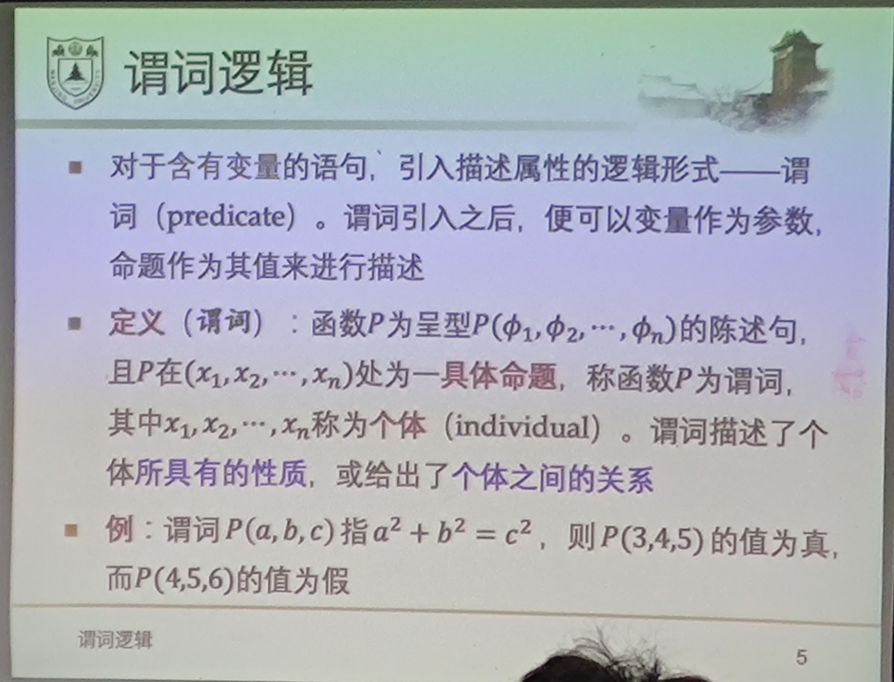

# 为什么引入谓词逻辑?

命题逻辑中命题是以整个语句为最小单位的. 有些语句不能用命题精确表达.

如:

* 含有变量的语句
  *  "$3 + x = 5$"
  *  "$a^2 + b^2 = c^2$"
*  含有数量限定性定语的语句
   *  "所有学生都来上课了"
   *  "有的西瓜是黄瓢的"

# 谓词逻辑

对于**含有变量**的语句, 引入描述属性的逻辑形式--谓词(predicate).

谓词引入后, 便可以以变量变量作为参数, 命题作为其值来进行描述.

即谓词是一个命题函数(命题工厂).

# 含量词公式的否定式

* $\lnot \forall xP(x) \equiv \exist x \lnot P(x)$
* $\lnot \exist xP(x) \equiv \forall x \lnot P(x)$

# 