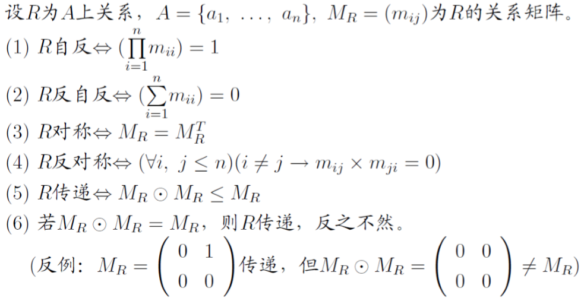

# 关系的性质

# 自反性

$I_A \subseteq R$

$\forall x\in A(xRx)$

$\empty 不是自反的$

## 自反关系的关系图和关系矩阵

$$
M_R=
\begin{bmatrix}
1 &0 &0 \\
1 &1 &0 \\
1 &0 &1 \\
\end{bmatrix}
$$

主对角线全为1.

##  反自反性

$\forall x\in A(\lnot xRx)$

## 自反关系的关系图和关系矩阵

$$
M_R=
\begin{bmatrix}
0 &0 &0 \\
1 &0 &0 \\
1 &0 &0 \\
\end{bmatrix}
$$

主对角线全为0.

# 对称性

$(\forall x,y\in A)(xRy \to yRx)$

## 反对称

$(\forall x,y\in A)(xRyRx \to x = y)$

## 强反对称

$(\forall x,y\in A)(xRy \to \lnot yRx)$

## 对称的充要条件

$对称当且仅当R=R^{-1}$

$反对称当且仅当R\cap R^{-1} \subseteq I_A$

## 矩阵表示

关注主对角线, 略.

# 传递性

$(\forall x, y ,z\in A)(xRyRz \to xRz)$

## 充要条件

$R\circ R \subseteq R, M_R\odot M_R\leq M_R$

$$
\begin{aligned}
&
\begin{bmatrix}
1 &0 &1 \\
1 &1 &1 \\
0 &0 &1 \\
\end{bmatrix}
\\
\begin{bmatrix}
1 &0 &1 \\
1 &1 &1 \\
0 &0 &1 \\
\end{bmatrix}
&
\begin{bmatrix}
1 &0 &1 \\
1 &1 &1 \\
0 &0 &1 \\
\end{bmatrix}
\end{aligned}
$$

---

$$
\begin{aligned}
&
\begin{bmatrix}
0 &1 &0 &0 \\
1 &0 &1 &0 \\
0 &0 &0 &1 \\
0 &0 &0 &0 \\
\end{bmatrix}
\\
\begin{bmatrix}
0 &1 &0 &0 \\
1 &0 &1 &0 \\
0 &0 &0 &1 \\
0 &0 &0 &0 \\
\end{bmatrix}
&
\begin{bmatrix}
1 &0 &1 &0 \\
0 &1 &0 &1 \\
0 &0 &0 &0 \\
0 &0 &0 &0 \\
\end{bmatrix}
\end{aligned}
$$

# 常用关系性质

# 模型表现

# 矩阵特征

# 等价关系

$A为集合, R为A上的关系, 若R自反, 对称且传递, 称R为A上的等价关系.$

$这时候记为 x \sim _Ry或简记为x\sim y$

$同余是定价关系.$

# 等价类

$R为A上的等价关系, 定义元素a的等价类为[a]_R, 即$

$[a]_R \quad \stackrel\mathrm{def}= \quad \{b\in A| aRb\}$

## 例

$R为\mathbb Z上的相等关系, 则[2]=\{2\}$

## 性质

* $(\forall x\in A)(x\in [x])$
* $(\forall x,y\in A)(x\sim y \leftrightarrow [x]=[y])$
* $(\forall x,y\in A)(\lnot(x\sim y) \leftrightarrow [x]\cap[y]=\empty)$
* $(\forall x,y\in A)([x]\neq[y]\land [x]\cap[y]=\empty \lor [x]=[y]\land [x]\cap[y]\neq \empty)$
* $\bigcup \{[x]|x\in A\}=A$

# 商集

$A上所有等价类所组成的集合, 记为A/R$

# 划分

$设A为非空集合, 若A的子集族\Pi (\Pi \subseteq p(A), p(x)为所有子集组成的集合), 满足$

* $\empty \not\in \Pi$
* $(\forall X,Y\in \Pi)(X\neq X \cap Y=\empty)$
* $\bigcup \Pi = A$

$则称\Pi 是A的一个划分, 称\Pi中的元素为A的划分块$

## 重要性质

$非空集合A的每一商集均对应A的唯一划分$