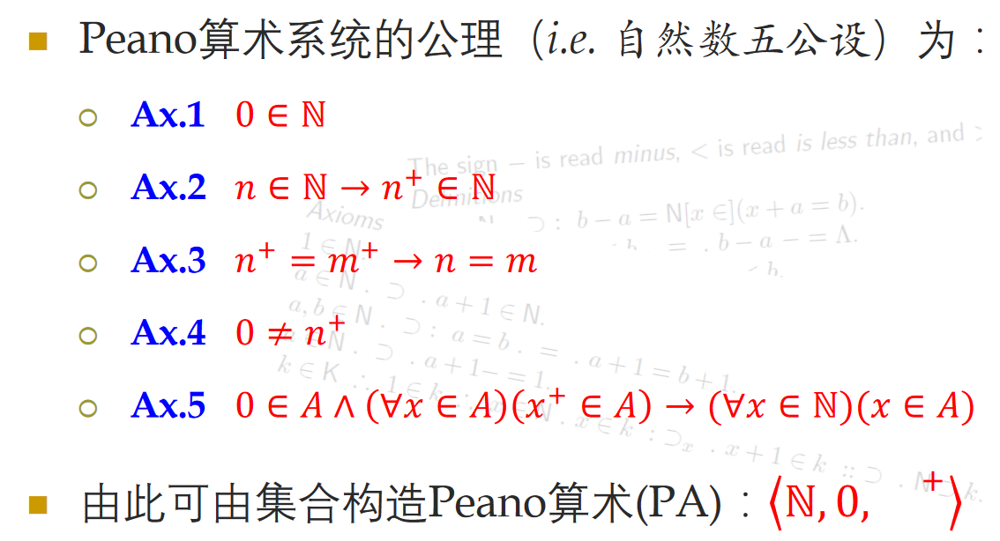
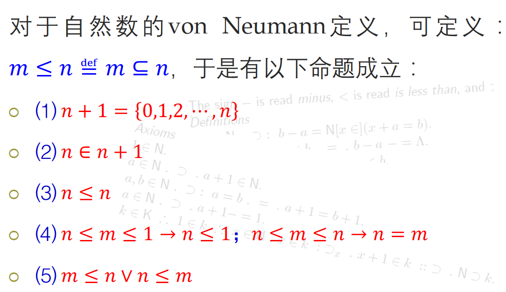

# 集合的基数

# 回顾: 自然数的定义

$0 = \empty$

$1 = \empty \cup \{\empty\}= \{\empty\}$

$2 = \{\empty\} \cup \{\{\empty\}\} = \{\empty, \{\empty\}\}$

$3 = \{\empty, \{\empty\},\{\empty, \{\empty\}\}\}$

$4 = \{\empty, \{\empty\},\{\empty, \{\empty\}\}\{\empty, \{\empty\},\{\empty, \{\empty\}\}\}\}$

$公理系统倾向于潜无穷$

## 无穷公理

$即存在归纳集.$

$定义自然数集:$

# 自然数五公设

* $Ax.1: 0 \in \mathbb{N}$
* $Ax.1: n \in \mathbb{N} \to n^+ \in \mathbb{N}$

## 加法构造

## 若干命题

# 自然数的定义方式

* $归纳定义: \empty为自然数, 若n为自然数, 则n^+也是自然数$
* $集合定义: n为自然数 \Leftrightarrow n\in \mathbb N$

# 集合的基数

集合𝐴中所包含元素的个数称为集合𝐴的基数(cardinalnumbers, 简写为cardinals), 或称𝐴的势(cardinality),
记为$card 𝐴$, 也可记为$|𝐴|$(von Neumann基数记号)

# 等势

$设𝐴，𝐵为集合，𝐴等势于B指有f:A\xrightarrow{1-1,onto} B, 记为A\sim B$

# 有限集与无穷集的基数定义

$\aleph$