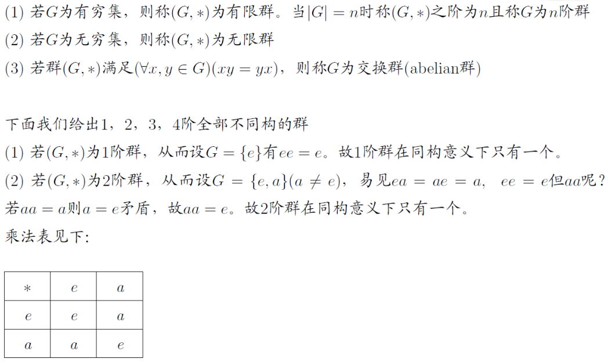

# 群论

# 对称性

$若一个几何图形在某个变换下保持不变，则称此图形在此变换下对称$

## 几何的对称

$几何图形的旋转, 翻转等等变换下可能保持不变, 即对称$

## 方程的根的对称

$一次二次三次四次都有求根公式, 因为它们的根是对称的$

$如一元二次方程ax^2+bx+c=0的根有对称性$

$x_1+x_2=\displaystyle-\frac{b}{a}, x_1x_2=\frac{c}{a}$

$其中x_1和x_2交换之后不变$

# 半群

$设(S,*)为代数系统, (S,*)为半群(Semigroup)指$

* $(\forall x,y\in S)(x*y\in S)$
* $(\forall x,y,z\in S)((x*y)*z=x*(y*z))$

$若(\forall x,y\in S)(x*y=y*x)则称为交换半群(abelian半群)$

$即代数系统+结合性=半群$

# 幺半群 (Monoid)

$半群+单位元=Monoid$

# 群论公理

$设\langle S,*\rangle为代数系统$

* $G\neq \empty$
* $(\forall x,y\in S)(x*y\in S)$
  * $原群(Magma)$
* $(\forall x,y,z\in S)((x*y)*z=x*(y*z))$
  * $半群(Semigroup)$
* $(\forall x\in S)(x*e=e*x=x)$
  * $幺半群(Monoid)$
* $(\forall x\in S)(x*x^{-1}=x^{-1}*x=e)$
  * $群(Group)$

$注意此时不一定需要有交换性. 可结合的代数系统逆元存在则唯一.$

$但是群要保证任意元素都有逆元.$

# 相关术语

$一阶, 二阶, 三阶群在同构意义下均只有一个.$

$四阶群在同构意义下有两个.$
$分别是\langle\mathbb{Z}_4,\oplus_4\rangle和Klein四元群\langle V,*\rangle.$

$四元群均为Abel群, 即满足可交换性.$

# 群的性质

* $(a^{-1})^{-1}=a$
* $(ab)^{-1}=b^{-1}a^{-1}$
* $ab=ac \to b=c$
* $ba=ca \to b=c$
* $方程ax=b和ya=b在G中对x,y有唯一解$

# 群的其他定义

