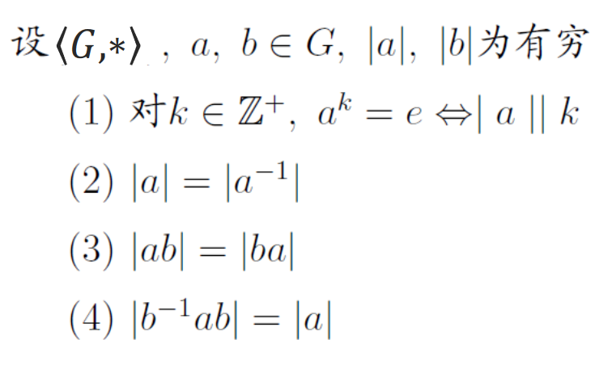
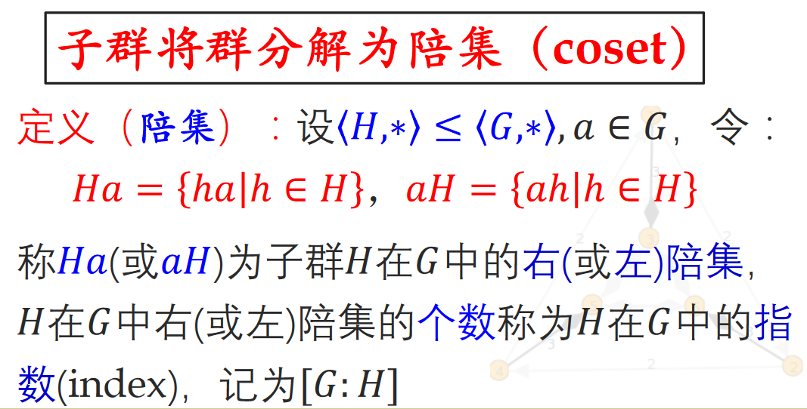
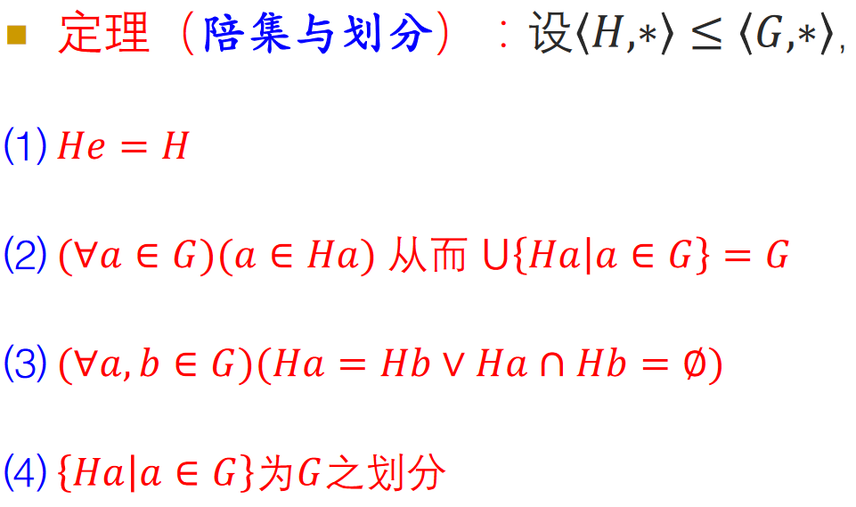
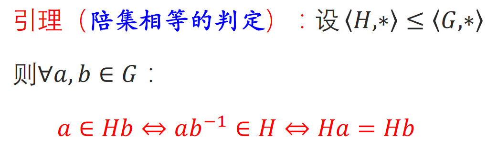
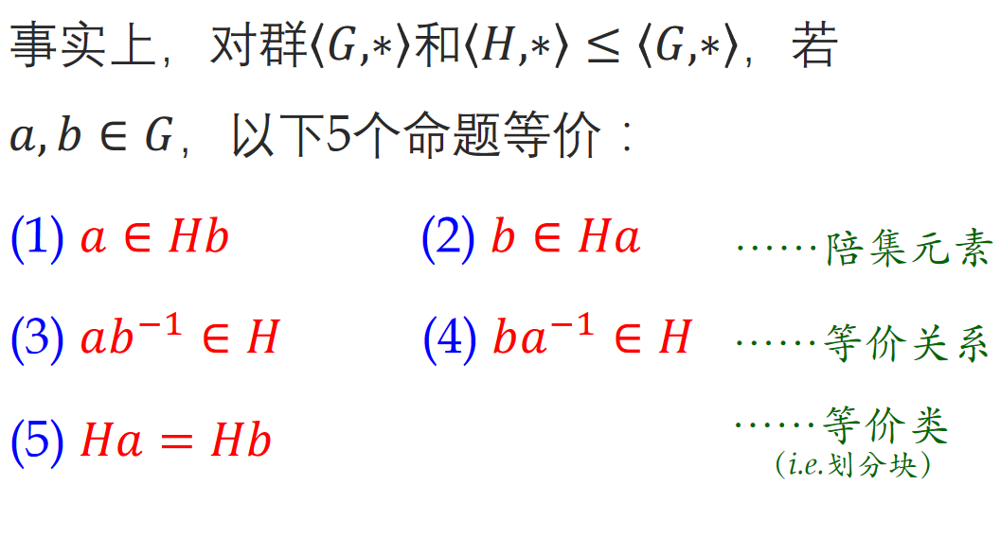
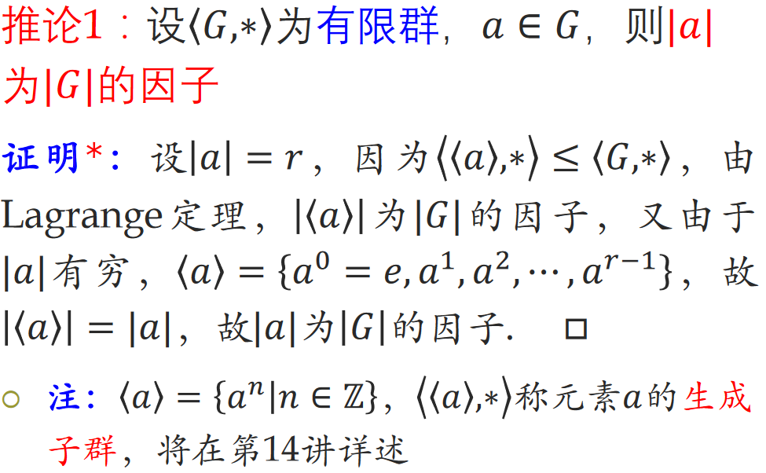
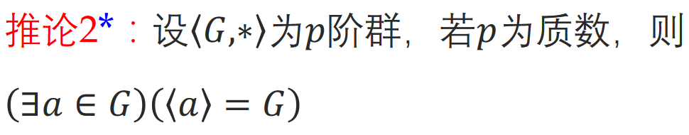
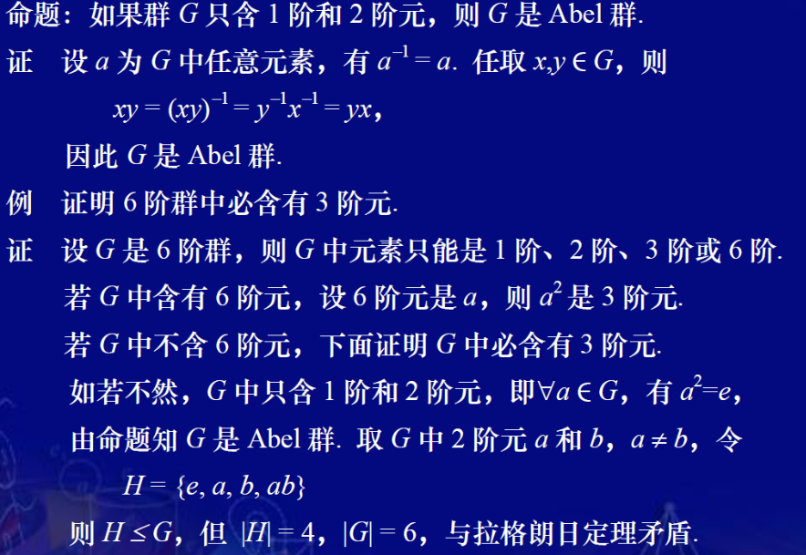

# 子群与群的分解

# 子群

$子群是群的子代数(subalgebra)$

$子群也是一个群, 且所属集合是大集合的子集.$

## 平方子群

$只包含单位元的群和群本身.$

## 子群判定定理

## 有穷子群判定定理

使用鸽笼原理, 可知一定存在逆元.

# 群中元素的阶

## 性质

# 陪集

## 陪集与划分

## 右陪集关系

## 陪集相等判定

## 等价命题

# Lagrange定理

## 推论二

$|a|有穷, 否则\langle a\rangle \subseteq G是无穷的, 与G有穷矛盾$

## 推论二

