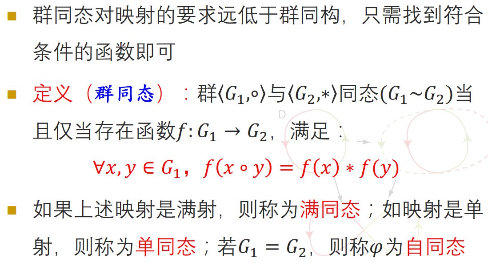

# 循环群与群同构

# 循环群与生成元

## 循环群

并不是所有群都是循环群, 比如Klein四元群

## 性质

* $若𝑎是无限循环群的生成元，则𝑎^{-1}, 也是该无限循环群的生成元$
* $无限循环群有且只有2个生成元$
* $设有限群𝐺=\langle 𝑎 \rangle, 且|𝑎|=𝑛，则对任意不大于𝑛的正整数𝑟,𝐺=\langle 𝑎^r\rangle⇔gcd\langle 𝑛,r \rangle=1$

## 循环群的子群

# 群同构与同构映射

## 同构关系是等价关系

**循环群皆为阿贝尔群**

# 同态和同态映射

