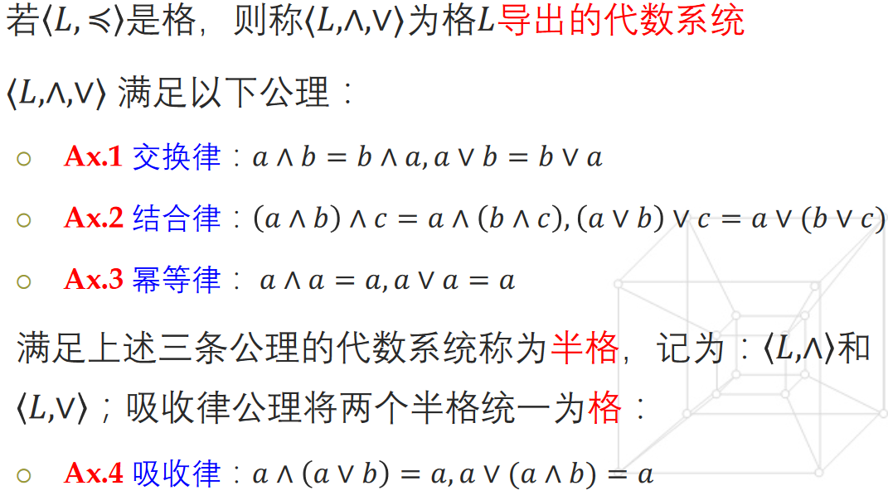
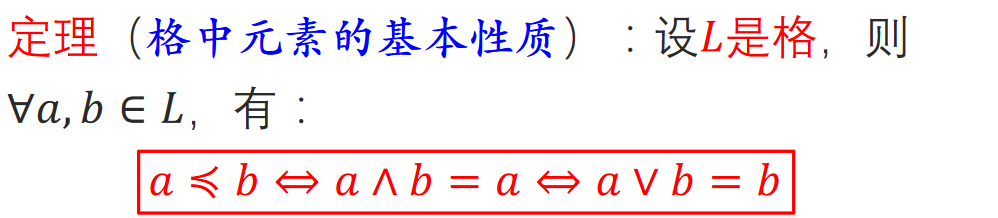
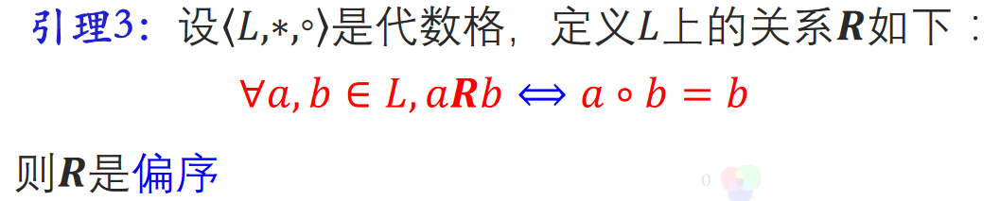
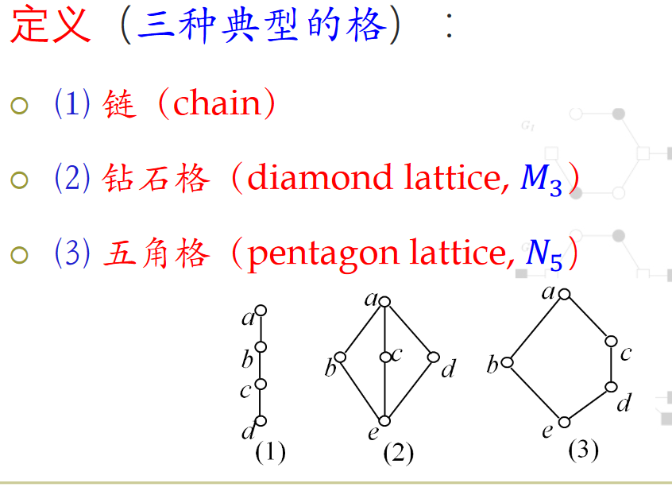
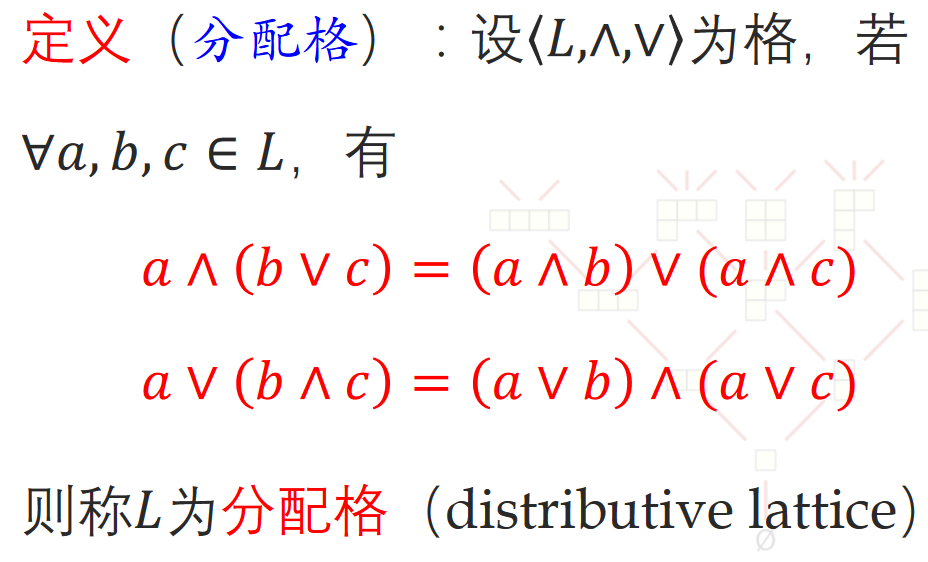
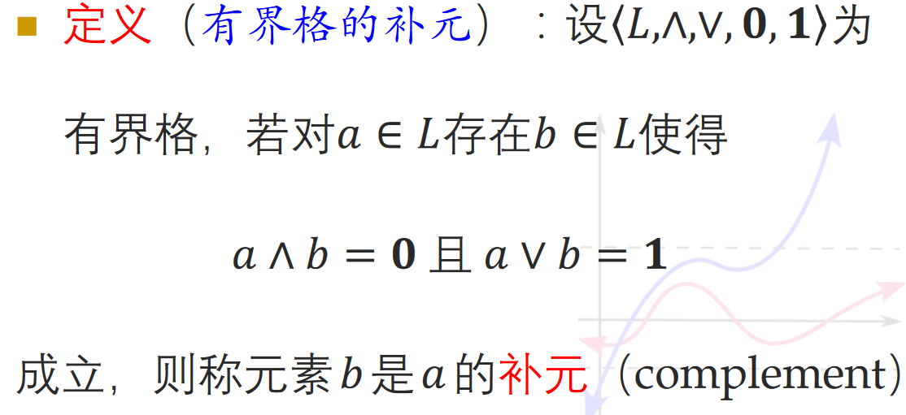
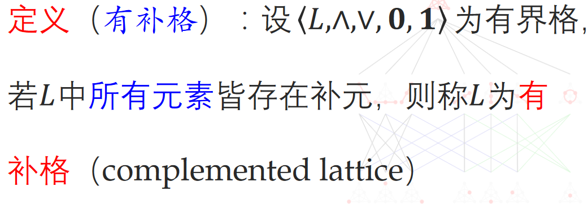

# 偏序格与代数格

# 偏序集和格

格(lattice)作为一个代数系统可以通过两种方式进行定义:

* 通过偏序集与偏序关系定义
* 通过普通集合与特殊运算定义

## 作为偏序集的定义

$设\langle S, \preceq\rangle 为偏序集, 若\forall x,y\in S,\{x,y\}皆有上确界和下确界,$
$则称集合S关于偏序\preceq 构成偏序格$

## 格导出的代数系统

## 格中元素基本定律

# 代数格

$设\langle 𝐿,∗,◦\rangle 是代数系统, 其中∗和◦是二元运算, 且满足交换律, 结合律, 吸收律,$
$则称\langle 𝐿,∗,◦\rangle 是代数格.$

$论证代数格与偏序格的等价性$

## 代数格构造偏序

# 子格

$子格(sub lattice)是格的子代数. 设\langle 𝐿,∧,∨\rangle 是格, 非空集合𝑆⊆𝐿, 若𝑆关于𝐿中的运算∧, ∨仍构成格, 称\langle 𝑆,∧,∨\rangle 是𝐿的子格$

# 格同态

## 保序性

# 典型的格

# 分配格

## 分配格判定定理

$设𝐿为格, 则𝐿是分配格当且仅当𝐿不含有与𝑀_3(钻石格)$
$或𝑁_5(五角格)同构的子格$

### 推论

* 小于五元的格皆为分配格
* 任何链皆为分配格

# 有界格

# 有补格

# 布尔代数

