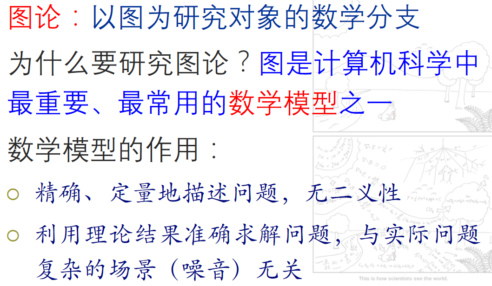
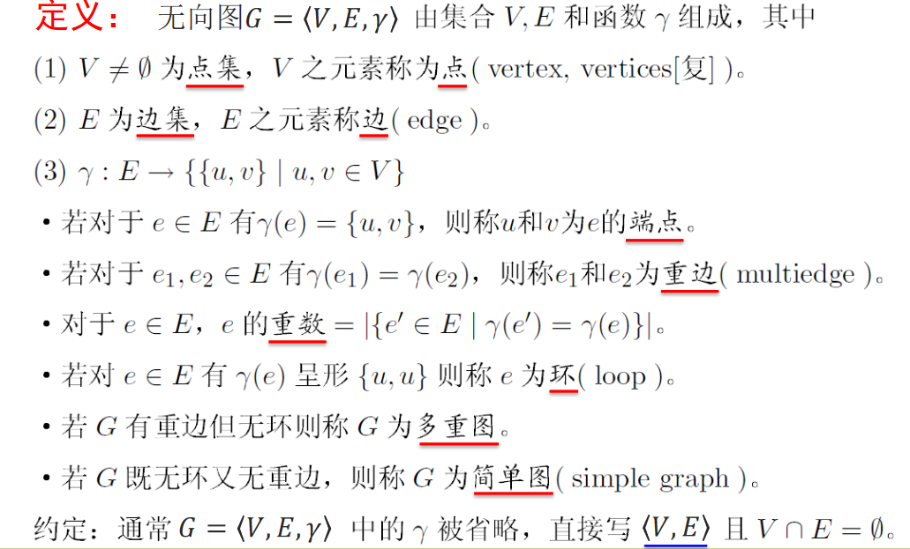
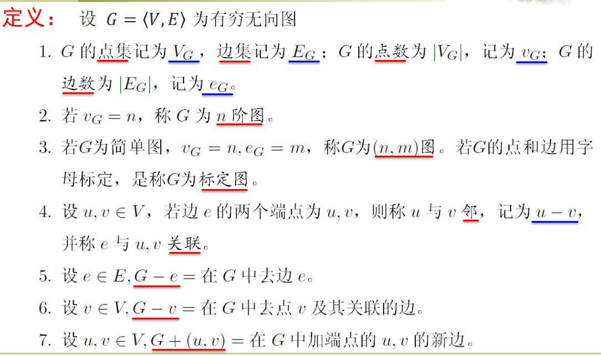
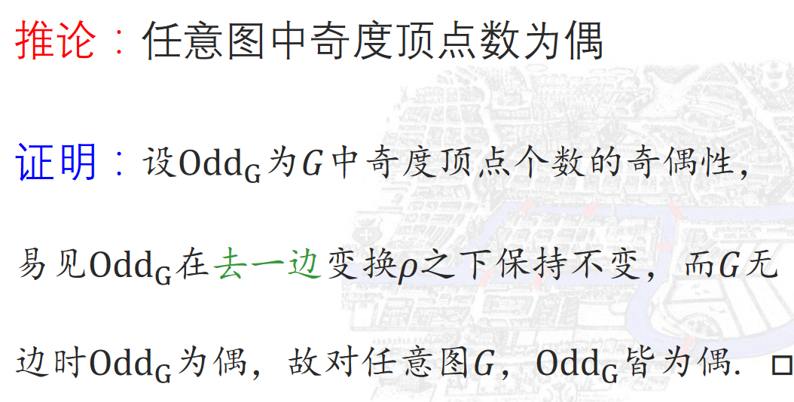
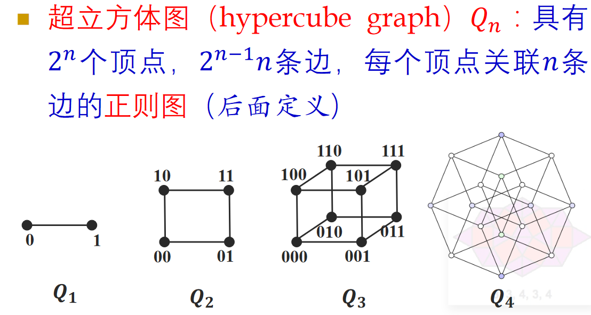
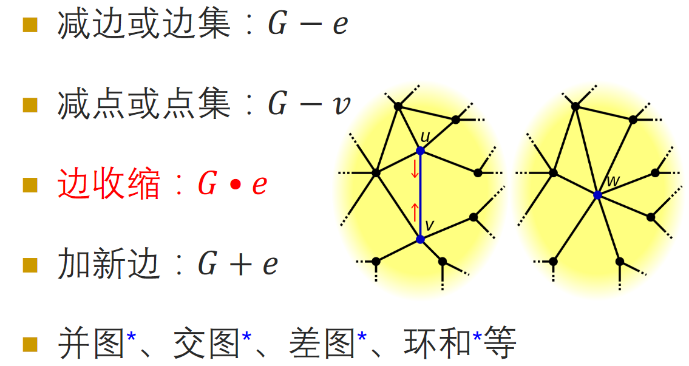
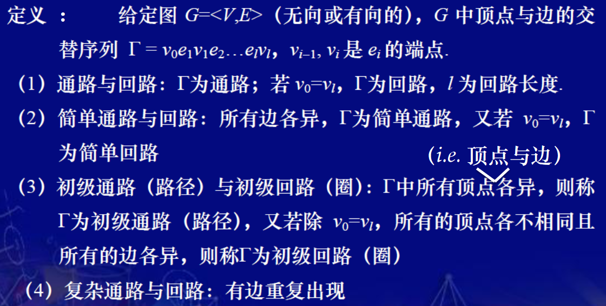

# 什么是图论

任何一个二元关系集都可以表示为图

# 图的定义和表示

# 图中的关系

* 图中边与顶点之间的关系：关联关系
* 图中顶点之间(边之间)的关系：相邻关系

# 图的术语

# 顶点的度

# 握手定理

# 子图

生成子图不能去点

# 图的同构

## Peterson 图同构

# 特殊简单图

# 完全图

# 正则图

# 二部图

# 补图

# 图的基本运算

# 通路与回路

# 通路存在性定理

# 路径存在性定理

$可用数学归纳法去点$