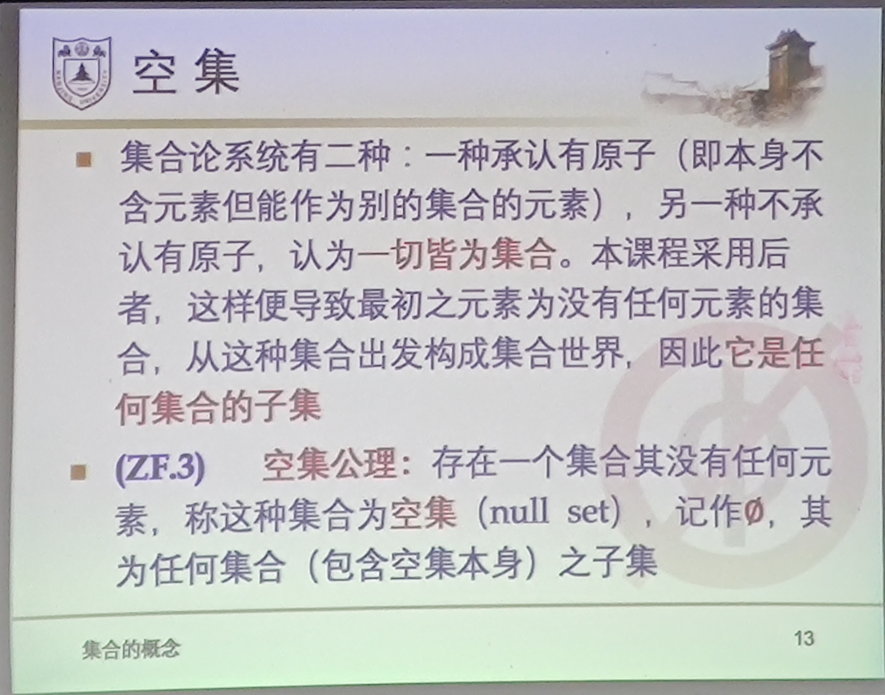

# 集合论

# 引子: 数学基础的危机

* 19世纪早期, 发现数学存在缺陷
  * 非欧几里得
  * 分析(微积分及其扩展)的基础
* 19世纪后期的公理化运动: 去除基于直觉或经验的朴素概念所带来的模糊, 使数学严密化
  * 算术与几何的公理化
* 1900年国际数学大会
  * 借助集合论可以建造整个数学大厦...今天我们可以宣称绝对的严密已经实现了!
* 随后有人发现Cantor集合论中的一些严重问题, 如1901年发现的**罗素悖论**
* G.Frege评论: *当大厦竣工时基础却动摇了*
* 危机的解决: **公理化集合论**

# 集合的概念

集合没有明确的定义, G.Cantor给出了一种刻画:

## 集合的外延公理与概括原则

### 外延公理

集合由其元素完全确定

$$
A=B \leftrightarrow \forall x(x\in A \leftrightarrow x \in B)
$$

### 概括原则

对于人们直观或思维对象$x$的任一性质$P(x)$, 存在集合$S$的元素恰为具有性质$P$的那些对象, 记为

$$
S = \{x|P(x)\}
$$

从而 

$$
\forall a, a\in S \leftrightarrow P(a)
$$

## 罗素悖论与公理集合论

理发师悖论:

理发师有个从业原则, 理发师只给那些不自己刮胡子的人刮胡子.

那么这个理发师给不给自己刮胡子呢?

概括: 自己是自己, 自己又是自己的元素.

$$
A \in A 
$$

## ZFC 公理化集合系统

元素本身也是一个集合.

# 子集, 空集和幂集

## 子集

$A为B的子集 (记为A \subseteq B) 指\forall x(x\in A \to x \in B)$

$A=B \Leftrightarrow A \subseteq B \land B \subseteq A$

$A为B的真子集 (记为A \subset B), 即A \subseteq B \land A\neq B$

## 空集

## n元集

$若A含有n个集合, 则称A为n元集, 记作|A|=n$

$|\empty|=0$

## 层次(Hierachy)

$a \neq \{a\}$

## 由集合定义自然数

$0 = \empty$

$1 = \{\empty\}$

$2 = \{\empty, \{\empty\}\}$

$3 = \{\empty, \{\empty\},\{\empty, \{\empty\}\}\}$

## 归纳集是否存在?

若存在归纳集, 则归纳集存在于$A$, 则$A$是无穷集.

为了保证归纳集存在, 引入**无穷公理**.

定义: $N = \cap\{A|A为归纳集\}$